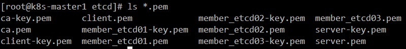
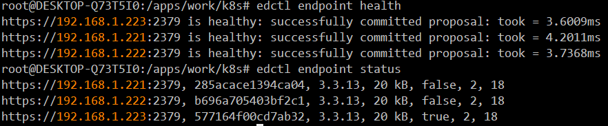

[toc]

## 3. 安装etcd

### 3.1 准备工作

服务器配置：与master同服务器

| IP            | 配置 | 备注   |
| ------------- | ---- | ------ |
| 192.168.1.221 | 2C4G | etcd01 |
| 192.168.1.222 | 2C4G | etcd02 |
| 192.168.1.223 | 2C4G | etcd03 |

etcd二进制文件准备

```bash
cd /apps/work/k8s
mkdir etcd
cd etcd
mkdir bin conf data ssl
wget https://github.com/etcd-io/etcd/releases/download/v3.3.13/etcd-v3.3.13-linux-amd64.tar.gz
tar -xvf etcd-v3.3.13-linux-amd64.tar.gz
cd etcd-v3.3.13-linux-amd64
mv etcd* ../bin/
rm -f etcd-v3.3.13-linux-amd64.tar.gz
```

修改 `/etc/profile` 添加
`vim /etc/profile`

```bash
export ETCDCTL_API=3
export ENDPOINTS="https://192.168.1.221:2379,https://192.168.1.222:2379,https://192.168.1.223:2379"
```

刷新环境配置文件：`source /etc/profile`
修改 `~/.bashrc` 添加

```bash
alias edctl='/opt/kubernetes/bin/etcdctl --endpoints=${ENDPOINTS} --cacert=/opt/kubernetes/ssl/etcd/ca.pem --cert=/opt/kubernetes/ssl/etcd/client.pem --key=/opt/kubernetes/ssl/etcd/client-key.pem'
```

`source ~/.bashrc`

### 3.2 etcd证书制作 

证书制作需要提前下载cfssl

#### 3.2.1 准备etcd的ca-config.json配置文件

```bash
[ -d '/apps/work/k8s/cfssl/' ] || mkdir -p '/apps/work/k8s/cfssl/'
cat <<EOF | tee /apps/work/k8s/cfssl/ca-config.json
{
  "signing": {
    "default": {
      "expiry": "87600h"
    },
    "profiles": {
      "kubernetes": {
         "expiry": "87600h",
         "usages": [
            "signing",
            "key encipherment",
            "server auth",
            "client auth"
        ]
      }
    }
  }
}
EOF
```

注意，这个etcd的`ca-config.json`和其他的`ca-config.json`一样，这里不区分了

#### 3.2.2 创建`etcd的ca证书`请求配置文件`etcd-ca-csr.json`

```bash
mkdir -p /apps/work/k8s/cfssl/etcd && \
cat << EOF | tee /apps/work/k8s/cfssl/etcd/etcd-ca-csr.json
{
    "CN": "etcd",
    "key": {
        "algo": "rsa",
        "size": 2048
    },
    "names": [
        {
            "C": "CN",
            "ST": "GuangDong",
            "L": "GuangZhou",
            "O": "dukang",
            "OU": "dukang"
        }
    ]
}
EOF
```

#### 3.2.3 生成etcd的ca证书和私钥

```bash
mkdir -p /apps/work/k8s/cfssl/pki/etcd && \
cfssl gencert -initca \
/apps/work/k8s/cfssl/etcd/etcd-ca-csr.json | \
cfssljson -bare /apps/work/k8s/cfssl/pki/etcd/etcd-ca
# 运行上面的命令后，会多出三个文件，ca.csr  ca-key.pem  ca.pem
```

#### 3.2.4 创建中心集群的ETCD Server证书

大集群中，建议设置两个以上的etcd集群，中心集群及event集群

##### 3.2.4.1 创建 ETCD Server 配置文件

```bash
export ETCD_SERVER_IPS=" \
    \"192.168.1.221\", \
    \"192.168.1.222\", \
    \"192.168.1.223\" \
" && \
export ETCD_SERVER_HOSTNAMES=" \
    \"etcd01\", \
    \"etcd02\", \
    \"etcd03\" \
" && \
cat << EOF | tee /apps/work/k8s/cfssl/etcd/etcd_server.json
{
  "CN": "etcd",
  "hosts": [
    "127.0.0.1",
    ${ETCD_SERVER_IPS},
    ${ETCD_SERVER_HOSTNAMES}
  ],
  "key": {
    "algo": "rsa",
    "size": 2048
  },
  "names": [
    {
      "C": "CN",
      "ST": "GuangDong",
      "L": "GuangZhou",
      "O": "dukang",
      "OU": "dukang"
    }
  ]
}
EOF
```

##### 3.2.4.2 生成 ETCD Server 证书和私钥

```bash
cfssl gencert \
-ca=/apps/work/k8s/cfssl/pki/etcd/etcd-ca.pem \
-ca-key=/apps/work/k8s/cfssl/pki/etcd/etcd-ca-key.pem \
-config=/apps/work/k8s/cfssl/ca-config.json \
-profile=kubernetes \
/apps/work/k8s/cfssl/etcd/etcd_server.json | \
cfssljson -bare /apps/work/k8s/cfssl/pki/etcd/etcd_server
```

#### 3.2.5 创建 ETCD Member 证书 中心集群

member证书用于etcd成员间通信

##### 3.2.5.1 创建 `ETCD Member 1` 证书

`ETCD Member 1`配置文件

```bash
export ETCD_MEMBER_1_IP=" \
    \"192.168.1.221\" \
" && \
export ETCD_MEMBER_1_HOSTNAMES="etcd01\
" && \
cat << EOF | tee /apps/work/k8s/cfssl/etcd/${ETCD_MEMBER_1_HOSTNAMES}.json
{
  "CN": "etcd",
  "hosts": [
    "127.0.0.1",
    ${ETCD_MEMBER_1_IP},
    "${ETCD_MEMBER_1_HOSTNAMES}"
  ],
  "key": {
    "algo": "rsa",
    "size": 2048
  },
  "names": [
    {
      "C": "CN",
      "ST": "GuangDong",
      "L": "GuangZhou",
      "O": "dukang",
      "OU": "dukang"
    }
  ]
}
EOF
```

生成 `ETCD Member 1 `证书和私钥

```bash
cfssl gencert \
    -ca=/apps/work/k8s/cfssl/pki/etcd/etcd-ca.pem \
    -ca-key=/apps/work/k8s/cfssl/pki/etcd/etcd-ca-key.pem \
    -config=/apps/work/k8s/cfssl/ca-config.json \
    -profile=kubernetes \
    /apps/work/k8s/cfssl/etcd/${ETCD_MEMBER_1_HOSTNAMES}.json | \
    cfssljson -bare /apps/work/k8s/cfssl/pki/etcd/etcd_member_${ETCD_MEMBER_1_HOSTNAMES}
```

##### 3.2.5.2 创建 `ETCD Member 2`证书

配置文件

```bash
export ETCD_MEMBER_2_IP=" \
    \"192.168.1.222\" \
" && \
export ETCD_MEMBER_2_HOSTNAMES="etcd02\
" && \
cat << EOF | tee /apps/work/k8s/cfssl/etcd/${ETCD_MEMBER_2_HOSTNAMES}.json
{
  "CN": "etcd",
  "hosts": [
    "127.0.0.1",
    ${ETCD_MEMBER_2_IP},
    "${ETCD_MEMBER_2_HOSTNAMES}"
  ],
  "key": {
    "algo": "rsa",
    "size": 2048
  },
  "names": [
    {
      "C": "CN",
      "ST": "GuangDong",
      "L": "GuangZhou",
      "O": "dukang",
      "OU": "dukang"
    }
  ]
}
EOF
```

`生成 ETCD Member 2` 证书和私钥

```bash
cfssl gencert \
    -ca=/apps/work/k8s/cfssl/pki/etcd/etcd-ca.pem \
    -ca-key=/apps/work/k8s/cfssl/pki/etcd/etcd-ca-key.pem \
    -config=/apps/work/k8s/cfssl/ca-config.json \
    -profile=kubernetes \
    /apps/work/k8s/cfssl/etcd/${ETCD_MEMBER_2_HOSTNAMES}.json | \
    cfssljson -bare /apps/work/k8s/cfssl/pki/etcd/etcd_member_${ETCD_MEMBER_2_HOSTNAMES}
```

##### 3.2.5.3 创建 `ETCD Member 3 `证书

配置文件

```bash
export ETCD_MEMBER_3_IP=" \
    \"192.168.1.223\" \
" && \
export ETCD_MEMBER_3_HOSTNAMES="etcd03\
" && \
cat << EOF | tee /apps/work/k8s/cfssl/etcd/${ETCD_MEMBER_3_HOSTNAMES}.json
{
  "CN": "etcd",
  "hosts": [
    "127.0.0.1",
    ${ETCD_MEMBER_3_IP},
    "${ETCD_MEMBER_3_HOSTNAMES}"
  ],
  "key": {
    "algo": "rsa",
    "size": 2048
  },
  "names": [
    {
      "C": "CN",
      "ST": "GuangDong",
      "L": "GuangZhou",
      "O": "dukang",
      "OU": "dukang"
    }
  ]
}
EOF
```

`生成 ETCD Member 3 `证书和私钥

```bash
cfssl gencert \
    -ca=/apps/work/k8s/cfssl/pki/etcd/etcd-ca.pem \
    -ca-key=/apps/work/k8s/cfssl/pki/etcd/etcd-ca-key.pem \
    -config=/apps/work/k8s/cfssl/ca-config.json \
    -profile=kubernetes \
    /apps/work/k8s/cfssl/etcd/${ETCD_MEMBER_3_HOSTNAMES}.json | \
    cfssljson -bare /apps/work/k8s/cfssl/pki/etcd/etcd_member_${ETCD_MEMBER_3_HOSTNAMES}
```

#### 3.2.6 创建 `ETCD Client` 证书

`etcd client`证书是用于客户端与etcd通信时使用，比如，`etcdctl`命令就要使用此证书，还有apiserver也是使用此证书跟etcd通信
配置文件

```bash
cat << EOF | tee /apps/work/k8s/cfssl/etcd/etcd_client.json
{
  "CN": "client",
  "hosts": [""], 
  "key": {
    "algo": "rsa",
    "size": 2048
  },
  "names": [
    {
      "C": "CN",
      "ST": "GuangDong",
      "L": "GuangZhou",
      "O": "dukang",
      "OU": "dukang"
    }
  ]
}
EOF
```

生成 ETCD Client 证书和私钥

```bash
cfssl gencert \
-ca=/apps/work/k8s/cfssl/pki/etcd/etcd-ca.pem \
-ca-key=/apps/work/k8s/cfssl/pki/etcd/etcd-ca-key.pem \
-config=/apps/work/k8s/cfssl/ca-config.json \
-profile=kubernetes \
/apps/work/k8s/cfssl/etcd/etcd_client.json | \
cfssljson -bare /apps/work/k8s/cfssl/pki/etcd/etcd_client
```



#### 3.2.7 cp证书到分发目录`/apps/work/k8s/etcd/ssl`

```bash
cp -pdr /apps/work/k8s/cfssl/pki/etcd/* /apps/work/k8s/etcd/ssl
```

### 3.3 创建etcd启动配置文件

```bash
cd /apps/work/k8s/etcd/conf
vim etcd
# 以下配置是etcd01的配置，其他etcd的配置参照一下配置即可
ETCD_OPTS="--name=etcd01 \
       --data-dir=/apps/etcd/data/default.etcd \
       --listen-peer-urls='https://192.168.1.221:2380' \
       --listen-client-urls='https://192.168.1.221:2379,https://127.0.0.1:2379' \
       --advertise-client-urls='https://192.168.1.221:2379' \
       --initial-advertise-peer-urls='https://192.168.1.221:2380' \
       --initial-cluster='etcd01=https://192.168.1.221:2380,etcd02=https://192.168.1.222:2380,etcd03=https://192.168.1.223:2380' \
       --initial-cluster-token='etcd01=https://192.168.1.221:2380,etcd02=https://192.168.1.222:2380,etcd03=https://192.168.1.223:2380' \
       --initial-cluster-state=new \
       --heartbeat-interval=6000 \
       --election-timeout=30000 \
       --snapshot-count=5000 \
       --auto-compaction-retention=1 \
       --max-request-bytes=33554432 \
       --quota-backend-bytes=17179869184 \
       --trusted-ca-file==/apps/etcd/ssl/etcd-ca.pem \
       --cert-file==/apps/etcd/ssl/etcd_server.pem \
       --key-file=/apps/etcd/ssl/etcd_server-key.pem \
       --peer-cert-file=/apps/etcd/ssl/etcd_member_etcd01.pem \
       --peer-key-file=/apps/etcd/ssl/etcd_member_etcd01-key.pem \
       --peer-client-cert-auth \
       --peer-trusted-ca-file=/apps/etcd/ssl/etcd-ca.pem"
```

etcd启动参数说明

| 参数                        | 说明                                                         | 默认值     | 备注                                                         |
| --------------------------- | ------------------------------------------------------------ | ---------- | ------------------------------------------------------------ |
| --auto-compaction-retention | 自动压缩ETCD空间，也可以减少etcd程序的内存占用量，提高etcd性能 | 0，单位是h | 这里设置为1，表示只保留1h的历史数据                          |
| --max-request-bytes         | 最大请求字节                                                 | 1.5MB      | 这里设置的是32M                                              |
| --quota-backend-bytes       | 空间配额，用来保障集群可靠地进行操作。如果没有限制配额，当键空间变大之后，直到用光了磁盘空间，它就会影响etcd集群的表现 | 2GB        | 当任意节点超出空间配额， 那么它将进入维护状态，只接受读/删操作。只有释放了足够空间、去碎片化了后端数据库并且清理了空间配额之后，集群才能继续正常操作。这里设置的是16G，建议设置为8G |

`--max-request-bytes=33554432`和`--quota-backend-bytes=17179869184`可能导致报错，去除即可。

### 3.4 创建`etcd.service`

这个`etcd.service`可以所有etcd通用
`vim etcd.service`

```bash
[Unit]
Description=Etcd Server
After=network.target
After=network-online.target
Wants=network-online.target

[Service]
Type=notify
LimitNOFILE=1024000
LimitNPROC=1024000
LimitCORE=infinity
LimitMEMLOCK=infinity
User=etcd
Group=etcd

EnvironmentFile=/apps/etcd/conf/etcd
ExecStart=/apps/etcd/bin/etcd $ETCD_OPTS
Restart=on-failure

[Install]
WantedBy=multi-user.target
```

这里使用`etcd`用户启动，所以需要创建此用户，同时要给其定义的数据目录权限

```bash
useradd -s /sbin/nologin -M etcd
chown -R etcd.etcd /apps/etcd
systemctl daemon-reload
systemctl start etcd
```

### 3.5 使用ansible分发etcd到etcd集群

`ansible --version --> 2.8.4`

#### 3.5.1 ansible添加etcd集群host

```bash
cd /apps/work/k8s
cat >>EOF |tee host
[etcd]
192.168.1.221
192.168.1.222
192.168.1.223
EOF
```

#### 3.5.2 配置秘钥信任

#### 3.5.3 给其他etcd节点创建etcd用户

```bash
# 在host所在目录执行以下命令，这里是在/apps/work/k8s
ansible -i host etcd -m shell -a "useradd etcd -s /sbin/nologin -M"
```

#### 3.5.4 分发etcd证书，配置，启动脚本到其他etcd节点

```bash
# 分发etcd所有文件
ansible -i host etcd -m copy -a "src=etcd/ dest=/apps/etcd"

# etcd02配置文件修改成如下
ETCD_OPTS="--name=etcd02 \
       --data-dir=/apps/etcd/data/default.etcd \
       --listen-peer-urls='https://192.168.1.222:2380' \
       --listen-client-urls='https://192.168.1.222:2379,https://127.0.0.1:2379' \
       --advertise-client-urls='https://192.168.1.222:2379' \
       --initial-advertise-peer-urls='https://192.168.1.222:2380' \
       --initial-cluster='etcd01=https://192.168.1.221:2380,etcd02=https://192.168.1.222:2380,etcd03=https://192.168.1.223:2380' \
       --initial-cluster-token='etcd01=https://192.168.1.221:2380,etcd02=https://192.168.1.222:2380,etcd03=https:/192.168.1.223:2380' \
       --initial-cluster-state=new \
       --heartbeat-interval=6000 \
       --election-timeout=30000 \
       --snapshot-count=5000 \
       --auto-compaction-retention=1 \
       --max-request-bytes=33554432 \
       --quota-backend-bytes=17179869184 \
       --trusted-ca-file=/apps/etcd/ssl/etcd-ca.pem \
       --cert-file=/apps/etcd/ssl/etcd_server.pem \
       --key-file=/apps/etcd/ssl/etcd_server-key.pem \
       --peer-cert-file=/apps/etcd/ssl/etcd_member_etcd02.pem \
       --peer-key-file=/apps/etcd/ssl/etcd_member_etcd02-key.pem \
       --peer-client-cert-auth \
       --peer-trusted-ca-file=/apps/etcd/ssl/etcd-ca.pem"

# etcd03的配置文件内容修改成如下
ETCD_OPTS="--name=etcd03 \
       --data-dir=/apps/etcd/data/default.etcd \
       --listen-peer-urls='https://192.168.1.223:2380' \
       --listen-client-urls='https://192.168.1.223:2379,https://127.0.0.1:2379' \
       --advertise-client-urls='https://192.168.1.223:2379' \
       --initial-advertise-peer-urls='https://192.168.1.223:2380' \
       --initial-cluster='etcd01=https://192.168.1.221:2380,etcd02=https://192.168.1.222:2380,etcd03=https://192.168.1.223:2380' \
       --initial-cluster-token=etcd01='https://192.168.1.221:2380,etcd02=https://192.168.1.222:2380,etcd03=https:/192.168.1.223:2380' \
       --initial-cluster-state=new \
       --heartbeat-interval=6000 \
       --election-timeout=30000 \
       --snapshot-count=5000 \
       --auto-compaction-retention=1 \
       --max-request-bytes=33554432 \
       --quota-backend-bytes=17179869184 \
       --trusted-ca-file=/apps/etcd/ssl/etcd-ca.pem \
       --cert-file=/apps/etcd/ssl/etcd_server.pem \
       --key-file=/apps/etcd/ssl/etcd_server-key.pem \
       --peer-cert-file=/apps/etcd/ssl/etcd_member_etcd03.pem \
       --peer-key-file=/apps/etcd/ssl/etcd_member_etcd03-key.pem \
       --peer-client-cert-auth \
       --peer-trusted-ca-file=/apps/etcd/ssl/etcd-ca.pem"
```

注意，分发 `/apps/work/k8s/conf/etcd` 每台服务器配置不一样 可以配置成`etcd-hostname` 然后分发

#### 3.5.5 修改远程服务器etcd 目录权限

```bash
ansible -i host etcd -m shell -a "chown -R etcd:etcd /apps/etcd"
```

#### 3.5.6 设置etcd 可执行权限

```bash
ansible -i host etcd -m shell -a "chmod +x /apps/etcd/bin/*"
```

#### 3.5.7 启动etcd 集群

```bash
ansible -i host etcd -m shell -a "systemctl daemon-reload"
ansible -i host etcd -m shell -a "systemctl start etcd"
ansible -i host etcd -m shell -a "systemctl enable etcd"
```

注意，如果报错，认真检查下配置文件是否少打了什么，

### 3.6 检查etcd集群状态

```bash
ansible -i host etcd -m shell -a "systemctl status etcd"
```

设置环境变量使etcd 集群支持v3版本

```bash
vim /etc/profile
export ETCDCTL_API=3
export ENDPOINTS=https://192.168.1.221:2379,https://192.168.1.222:2379,https://192.168.1.223:2379
source /etc/profile
vim ~/.bashrc
# 定义命令别名，省得每次都要手动输那么多证书
alias edctl='/apps/etcd/bin/etcdctl --endpoints=${ENDPOINTS} --cacert=/apps/etcd/ssl/etcd-ca.pem' --cert=/apps/etcd/ssl/etcd_client.pem --key=/apps/etcd/ssl/etcd_client-key.pem'
source ~/.bashrc
# 查看etcd节点状态
edctl endpoint health
edctl endpoint status
```



### 3.7 个人etcd 集群playbook

以下操作在k8s-operator上操作，

```bash
cd /apps/work/k8s
mkdir -p roles/etcd/{defaults,files,handlers,meta,tasks,templates,vars}
```

在`/apps/work/k8s`目录下创建`host`文件，内容如下
`vim /apps/work/k8s/host`

```bash
[etcd]
192.168.1.221
192.168.1.222
192.168.1.223
[etcd:vars]
initial_cluster="etcd01=https://192.168.1.221:2380,etcd02=https://192.168.1.222:2380,etcd03=https:/192.168.1.223:2380"
cert_file=etcd_server
ca=etcd-ca
ETCD_PATH=/apps
ETCD_MEMBER=etcd_member
```

在`/apps/work/k8s`目录下创建`etcd.yml`文件，内容如下

```yaml
- hosts: etcd
  user: root
  roles:
    - etcd
```

角色目录结构

```bash
cd /apps/work/k8s/roles/etcd
tree
```

```
.
├── defaults
├── files
│   ├── bin
│   │   ├── etcd
│   │   └── etcdctl
│   └── ssl
│       ├── etcd-ca.csr
│       ├── etcd-ca-key.pem
│       ├── etcd-ca.pem
│       ├── etcd_client.csr
│       ├── etcd_client-key.pem
│       ├── etcd_client.pem
│       ├── etcd_member_etcd01.csr
│       ├── etcd_member_etcd01-key.pem
│       ├── etcd_member_etcd01.pem
│       ├── etcd_member_etcd02.csr
│       ├── etcd_member_etcd02-key.pem
│       ├── etcd_member_etcd02.pem
│       ├── etcd_member_etcd03.csr
│       ├── etcd_member_etcd03-key.pem
│       ├── etcd_member_etcd03.pem
│       ├── etcd_server.csr
│       ├── etcd_server-key.pem
│       └── etcd_server.pem
├── handlers
├── meta
├── tasks
│   └── main.yml
├── templates
│   ├── etcd
│   └── etcd.service
└── vars

9 directories, 23 files
```

`tasks/main.yml`内容如下

```yaml
- name: create groupadd etcd
  group: name=etcd
- name: create name etcd
  user: name=etcd shell="/sbin/nologin etcd" group=etcd
- name: mkdir {{ ETCD_PATH }}
  raw: mkdir -p {{ ETCD_PATH }}/etcd/{conf,ssl,bin} && mkdir -p {{ ETCD_PATH }}/etcd/data/default.etcd
- name: copy etcd
  copy: src=bin dest={{ ETCD_PATH }}/etcd/ owner=root group=root mode=755
- name: copy etcd ssl
  copy: src=ssl dest={{ ETCD_PATH }}/etcd/
- name: src=etcd dest={{ ETCD_PATH }}/etcd/conf
  template: src=etcd dest={{ ETCD_PATH }}/etcd/conf
- name: copy etcd.service
  template: src=etcd.service  dest=/usr/lib/systemd/system/
- name: chown -R etcd:etcd {{ ETCD_PATH }}/etcd/
  shell: chown -R etcd:etcd {{ ETCD_PATH }}/etcd/
- name: systemctl daemon-reload
  shell: systemctl daemon-reload
- name: systemctl enable etcd && systemctl start etcd
  shell: systemctl enable etcd && systemctl start etcd
```

`templates/etcd`模板内容如下:
说明 `ansible_default_ipv4.address` 根据情况进行修改成服务器所在的网卡ip地址 可以使用`ansible setup` 模块获取

```
ETCD_OPTS="--name={{ ansible_hostname }} \
           --data-dir={{ ETCD_PATH }}/etcd/data/default.etcd \
           --listen-peer-urls=https://{{ ansible_default_ipv4.address }}:2380 \
           --listen-client-urls=https://{{ ansible_default_ipv4.address }}:2379,https://127.0.0.1:2379 \
           --advertise-client-urls=https://{{ ansible_default_ipv4.address }}:2379 \
           --initial-advertise-peer-urls=https://{{ ansible_default_ipv4.address }}:2380 \
           --initial-cluster={{ initial_cluster }} \
           --initial-cluster-token={{ initial_cluster }} \
           --initial-cluster-state=new \
           --heartbeat-interval=6000 \
           --election-timeout=30000 \
           --snapshot-count=5000 \
           --auto-compaction-retention=1 \
           --trusted-ca-file={{ ETCD_PATH }}/etcd/ssl/{{ ca }}.pem \
           --cert-file={{ ETCD_PATH }}/etcd/ssl/{{ cert_file }}.pem \
           --key-file={{ ETCD_PATH }}/etcd/ssl/{{ cert_file }}-key.pem \
           --peer-cert-file={{ ETCD_PATH }}/etcd/ssl/{{ ETCD_MEMBER }}_{{ ansible_hostname }}.pem \
           --peer-key-file={{ ETCD_PATH }}/etcd/ssl/{{ ETCD_MEMBER }}_{{ ansible_hostname }}-key.pem \
           --peer-client-cert-auth \
           --peer-trusted-ca-file={{ ETCD_PATH }}/etcd/ssl/{{ ca }}.pem"
```

注意：`ansible_hostname`在这里获取的是`k8s-master1`这样的名，因为我们etcd是安装在master节点上的，所以获取的是master的`hostname`，这里可以在host文件里再定义其他的变量。如：

```
[192.168.1.221:vars]
alia_hostname = etcd01
[192.168.1.222:vars]
alia_hostname = etcd02
[192.168.1.223:vars]
alia_hostname = etcd03
```

然后将上面的`ansible_hostname`替换成`alia_hostname`，这里请自行测试。
`templates/etcd.service`内容如下

```service
[Unit]
Description=Etcd Server
After=network.target
After=network-online.target
Wants=network-online.target

[Service]
Type=notify
LimitNOFILE=1024000
LimitNPROC=1024000
LimitCORE=infinity
LimitMEMLOCK=infinity
User=etcd
Group=etcd

EnvironmentFile={{ ETCD_PATH }}/etcd/conf/etcd
ExecStart={{ ETCD_PATH }}/etcd/bin/etcd $ETCD_OPTS
Restart=on-failure

[Install]
WantedBy=multi-user.target
```

## 