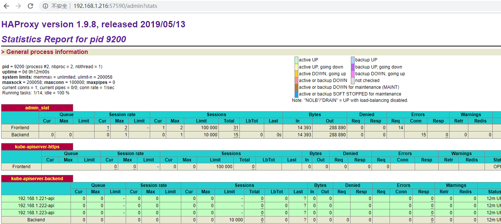
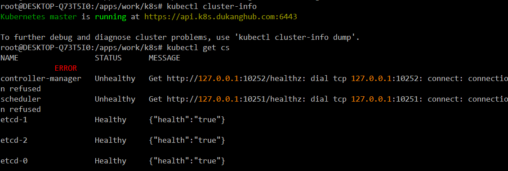

[toc]

## 4. kube-apiserver部署

kube-apiserver 二进制准备

```bash
cd /apps/work/k8s 
mkdir -p kubernetes/{server,node}
cd kubernetes/server
mkdir -p conf config log ssl
wget https://dl.k8s.io/v1.15.0/kubernetes-server-linux-amd64.tar.gz
tar -xf kubernetes-server-linux-amd64.tar.gz
cd kubernetes/server/bin
rm -rf *.docker_tag
rm -rf *.tar
# 留下所有的二进制文件
cd ..
mv bin /apps/work/k8s/kubernetes/server/
cd /apps/work/k8s/kubernetes/server/
rm -rf kubernetes kubernetes-server-linux-amd64.tar.gz
```

### 4.1 kube-apiserver证书制作

#### 4.1.1 创建kube-apiserver ca证书

```bash
# ca-config.json直接和etcd共用一个，复制过来即可
# 创建ca-csr.json
mkdir -p /apps/work/k8s/cfssl/k8s
cat <<EOF |tee /apps/work/k8s/cfssl/k8s/k8s-ca-csr.json
{
    "CN": "kubernetes",
    "key": {
        "algo": "rsa",
        "size": 2048
    },
    "names": [
        {
            "C": "CN",
            "ST": "GuangDong",
            "L": "GuangZhou",
            "O": "dukang",
            "OU": "dukang"
        }
    ]
}
EOF
```

根据上面定义的申请ca证书

```bash
mkdir -p /apps/work/k8s/cfssl/pki/k8s
cfssl gencert -initca /apps/work/k8s/cfssl/k8s/k8s-ca-csr.json | \
cfssljson -bare /apps/work/k8s/cfssl/pki/k8s/k8s-ca
```

#### 4.1.2 创建kube-apiserver server证书

```bash
# 192.168.1.217和192.168.1.219的LB的VIP
export K8S_APISERVER_VIP=" \
\"192.168.1.221\", \
\"192.168.1.222\", \
\"192.168.1.223\", \
\"192.168.1.216\", \
\"192.168.1.217\", \
\"192.168.1.218\", \
\"192.168.1.219\" \
" && \
export K8S_APISERVER_SERVICE_CLUSTER_IP="10.64.0.1" && \
export K8S_APISERVER_HOSTNAME="api.k8s.dukanghub.com" && \
export K8S_CLUSTER_DOMAIN_SHORTNAME="dukang" && \
export K8S_CLUSTER_DOMAIN_FULLNAME="dukang.local" && \
cat << EOF | tee /apps/work/k8s/cfssl/k8s/k8s_apiserver.json
{
  "CN": "kubernetes",
  "hosts": [
    "127.0.0.1",
    ${K8S_APISERVER_VIP},
    "${K8S_APISERVER_SERVICE_CLUSTER_IP}", 
    "${K8S_APISERVER_HOSTNAME}",
    "kubernetes",
    "kubernetes.default",
    "kubernetes.default.svc",
    "kubernetes.default.svc.${K8S_CLUSTER_DOMAIN_SHORTNAME}",
    "kubernetes.default.svc.${K8S_CLUSTER_DOMAIN_FULLNAME}" 
  ],
  "key": {
    "algo": "rsa",
    "size": 2048
  },
  "names": [
    {
      "C": "CN",
      "ST": "GuangDong",
      "L": "GuangZhou",
      "O": "dukang",
      "OU": "dukang"
    }
  ]
}
EOF
```

生成 Kubernetes API Server 证书和私钥

```bash
cfssl gencert \
-ca=/apps/work/k8s/cfssl/pki/k8s/k8s-ca.pem \
-ca-key=/apps/work/k8s/cfssl/pki/k8s/k8s-ca-key.pem \
-config=/apps/work/k8s/cfssl/ca-config.json \
-profile=kubernetes \
/apps/work/k8s/cfssl/k8s/k8s_apiserver.json | \
cfssljson -bare /apps/work/k8s/cfssl/pki/k8s/k8s_server
```

#### 4.1.3 创建Kubernetes webhook 证书配置文件

```bash
cat << EOF | tee /apps/work/k8s/cfssl/k8s/aggregator.json
{
  "CN": "aggregator",
  "hosts": [""], 
  "key": {
    "algo": "rsa",
    "size": 2048
  },
  "names": [
    {
      "C": "CN",
      "ST": "GuangDong",
      "L": "GuangZhou",
      "O": "dukang",
      "OU": "dukang"
    }
  ]
}
EOF
```

生成 Kubernetes webhook 证书和私钥

```bash
cfssl gencert \
    -ca=/apps/work/k8s/cfssl/pki/k8s/k8s-ca.pem \
    -ca-key=/apps/work/k8s/cfssl/pki/k8s/k8s-ca-key.pem \
    -config=/apps/work/k8s/cfssl/ca-config.json \
    -profile=kubernetes \
    /apps/work/k8s/cfssl/k8s/aggregator.json | \
    cfssljson -bare /apps/work/k8s/cfssl/pki/k8s/aggregator
```

#### 4.1.4 cp 证书到分发目录

```bash
cd /apps/work/k8s/kubernetes/server
cp -pdr /apps/work/k8s/cfssl/pki/k8s ssl/k8s
mkdir -p ssl/etcd
cp -pdr /apps/work/k8s/cfssl/pki/etcd/{etcd-ca.pem,etcd_client-key.pem,etcd_client.pem} ssl/etcd/
```

### 4.2 创建kube-apiserver启动配置文件,只写一个例子 其它节点参考

#### 4.2.1 创建encryption-config.yaml

```bash
cd /apps/work/k8s/kubernetes/server/config
export ENCRYPTION_KEY=$(head -c 32 /dev/urandom | base64)
cat > encryption-config.yaml <<EOF
kind: EncryptionConfig
apiVersion: v1
resources:
  - resources:
      - secrets
    providers:
      - aescbc:
          keys:
            - name: key1
              secret: ${ENCRYPTION_KEY}
      - identity: {}
EOF
```

#### 4.2.2 创建TLS Bootstrapping Token (也可以后期创建这个是不过期Token)

```bash
cd /apps/work/k8s/kubernetes/server/config
export TOK=$(head -c 16 /dev/urandom | od -An -t x | tr -d ' ')
cat > token.csv <<EOF
$TOK,kubelet-bootstrap,10001,"system:bootstrappers"
EOF
```

#### 4.2.3 创建Apiserver配置文件

```bash
cd /apps/work/k8s/kubernetes/server/conf
vim kube-apiserver
# 内容如下
KUBE_APISERVER_OPTS="--logtostderr=false \
--bind-address=192.168.1.221 \
--advertise-address=192.168.1.221 \
--secure-port=5443 \
--insecure-port=0 \
--service-cluster-ip-range=10.64.0.0/16 \
--service-node-port-range=30000-65000 \
--allow-privileged=true \
--etcd-cafile=/apps/kubernetes/ssl/etcd/etcd-ca.pem \
--etcd-certfile=/apps/kubernetes/ssl/etcd/etcd_client.pem \
--etcd-keyfile=/apps/kubernetes/ssl/etcd/etcd_client-key.pem \
--etcd-prefix=/registry \
--etcd-servers='https://192.168.1.221:2379,https://192.168.1.222:2379,https://192.168.1.223:2379' \
--client-ca-file=/apps/kubernetes/ssl/k8s/k8s-ca.pem \
--tls-cert-file=/apps/kubernetes/ssl/k8s/k8s_server.pem \
--tls-private-key-file=/apps/kubernetes/ssl/k8s/k8s_server-key.pem \
--kubelet-certificate-authority=/apps/kubernetes/ssl/k8s/k8s-ca.pem \
--kubelet-client-certificate=/apps/kubernetes/ssl/k8s/k8s_server.pem \
--kubelet-client-key=/apps/kubernetes/ssl/k8s/k8s_server-key.pem \
--service-account-key-file=/apps/kubernetes/ssl/k8s/k8s-ca.pem \
--requestheader-client-ca-file=/apps/kubernetes/ssl/k8s/k8s-ca.pem \
--proxy-client-cert-file=/apps/kubernetes/ssl/k8s/aggregator.pem \
--proxy-client-key-file=/apps/kubernetes/ssl/k8s/aggregator-key.pem \
--requestheader-allowed-names=aggregator \
--requestheader-group-headers=X-Remote-Group \
--requestheader-extra-headers-prefix=X-Remote-Extra- \
--requestheader-username-headers=X-Remote-User \
--enable-aggregator-routing=true \
--anonymous-auth=false \
--experimental-encryption-provider-config=/apps/kubernetes/config/encryption-config.yaml \
--enable-admission-plugins=AlwaysPullImages,DefaultStorageClass,DefaultTolerationSeconds,LimitRanger,NamespaceExists,NamespaceLifecycle,NodeRestriction,OwnerReferencesPermissionEnforcement,PodNodeSelector,PersistentVolumeClaimResize,PodPreset,PodTolerationRestriction,ResourceQuota,ServiceAccount,StorageObjectInUseProtection MutatingAdmissionWebhook ValidatingAdmissionWebhook \
--disable-admission-plugins=DenyEscalatingExec,ExtendedResourceToleration,ImagePolicyWebhook,LimitPodHardAntiAffinityTopology,NamespaceAutoProvision,Priority,EventRateLimit,PodSecurityPolicy \
--cors-allowed-origins=.* \
--enable-swagger-ui \
--runtime-config=api/all=true \
--kubelet-preferred-address-types=InternalIP,ExternalIP,Hostname \
--authorization-mode=Node,RBAC \
--apiserver-count=3 \
--audit-log-maxage=30 \
--audit-log-maxbackup=3 \
--audit-log-maxsize=100 \
--kubelet-https \
--event-ttl=1h \
--feature-gates=RotateKubeletServerCertificate=true,RotateKubeletClientCertificate=true \
--enable-bootstrap-token-auth=true \
--token-auth-file=/apps/kubernetes/config/token.csv \
--audit-log-path=/apps/kubernetes/log/api-server-audit.log \
--alsologtostderr=true \
--log-dir=/apps/kubernetes/log \
--v=2 \
--endpoint-reconciler-type=master-count \
--max-mutating-requests-inflight=600 \
--max-requests-inflight=1600 \
--target-ram-mb=240"
```

注意：每个`\`后面一定不能有空格，否则可能造成启动失败。
参数特殊说明：

- `kubelet-certificate-authority`参数 生产环境建议配置 如果配置这个参数kubelet 就会生成server 证书必须手动签发证书服务器是不能自动签发的当然也可以自己写个定时任务或者小工具去签发证书

```bash
不手动签发证书  kubectl exec 不能进入容器访问就会出现下面的问题
如果嫌麻烦可以删除 kubelet-certificate-authority参数
 跟删除kubelet的 rotate-server-certificates=true参数
$ kubectl exec -it kubia-9dc698f76-xtwfm -- /bin/bash
Error from server: error dialing backend: x509: cannot validate certificate for 192.168.11.196 because it doesn't contain any IP SANs
```

- `target-ram-mb` 参数 参考节点数,每节点60mb, 这里设置4*60=‭240内存大小Mb
- `max-requests-inflight` 参数 2000节点，配置在1500左右，`max-requests-inflight=1500` 。大于3000节点，`max-requests-inflight=3000`，默认值是400
- `max-mutating-requests-inflight` 参数 2000节点配置 500-1000之间 大于3000 配置在1000以上，默认值是200
- `service-account-key-file` 参数必须与 `kube-controller-manager` `service-account-private-key-file`参数配对不然自动签发证书会失败没权限

[点我查看官方kube-apiserver参数说明](https://kubernetes.io/zh/docs/reference/command-line-tools-reference/kube-apiserver/)
对于不同的版本，也可使用`kube-apiserver --help`查看其参数说明
注意：参数选择时，尽量保证所设置的参数值不为其默认值，若为默认值，去除此选项

### 4.3 创建kube-apiserver的systemd启动脚本

```bash
cd /apps/work/k8s/kubernetes
vim kube-apiserver.service
# 内容如下
[Unit]
Description=Kubernetes API Server
Documentation=https://github.com/kubernetes/kubernetes

[Service]
Type=notify
LimitNOFILE=1024000
LimitNPROC=1024000
LimitCORE=infinity
LimitMEMLOCK=infinity

EnvironmentFile=/apps/kubernetes/conf/kube-apiserver
ExecStart=/apps/kubernetes/bin/kube-apiserver $KUBE_APISERVER_OPTS
Restart=on-failure
RestartSec=5
User=k8s 
[Install]
WantedBy=multi-user.target
```

### 4.4 把上面的一些文件分发到apiserver节点并启动

创建分发`ansibe host`

```bash
cd /apps/work/k8s/kubernetes/
vim host
# 添加如下内容
[master]
192.168.1.221
192.168.1.222
192.168.1.223
```

创建远程服务运行账号k8s

```bash
ansible -i host master -m shell -a "useradd k8s -s /sbin/nologin -M"
```

创建远程目录

```bash
ansible -i host master -m shell -a "mkdir -p /apps/kubernetes/kubelet-plugins/volume"
# 上面的命令可换成如下命令
ansible -i host master -m file -a "path=/apps/kubernetes/kubelet-plugins/volume state=directory"
```

分发文件

```bash
ansible -i host master -m copy -a "src=server/ dest=/apps/kubernetes/"
```

设置运行目录的所有者和所属组

```bash
ansible -i host master -m shell -a "chown -R k8s:root /apps/kubernetes"
```

设置二进制可以执行权限

```bash
ansible -i host master -m shell -a "chmod u+x /apps/kubernetes/bin/*"
```

分发`kube-apiserver.service`

```bash
ansible -i host master -m copy -a "src=kube-apiserver.service dest=/usr/lib/systemd/system/kube-apiserver.service"
```

进入远程服务器,修改`/apps/kubernetes/conf/kube-apiserver`以下两项，修改成对应服务器ip 

```conf
--bind-address=192.168.1.221 \
--advertise-address=192.168.1.221 \
```

启动kube-apiserver

```bash
ansible -i host master -m shell -a "systemctl daemon-reload"
ansible -i host master -m shell -a "systemctl enable kube-apiserver"
ansible -i host master -m shell -a "systemctl start kube-apiserver"
ansible -i host master -m shell -a "systemctl status kube-apiserver"
```

### 4.5 安装master vip 操作服务器k8s-vip-01/k8s-vip-02

说明： 双master vip 使用域名进行接入方面就合理的利用资源不能 如果有成熟的dns+故障检测就可以不用加vip 这样网络就不会很大压力，使用vip的话压力都在vip服务器后端端口数量有限节点数多了会产生端口耗净的情况
注意：LB机器也先按前面的准备工作进行初始化

#### 4.5.1 haproxy 安装部署 vip 服务器配置建议8核16g haproxy 非常耗cpu资源

##### 4.5.1.1 下载haproxy

```bash
mkdir -p /apps/work/k8s/haproxy
cd  /apps/work/k8s/haproxy
wget https://www.haproxy.org/download/1.9/src/haproxy-1.9.8.tar.gz
# 2.x下载地址
# http://www.haproxy.org/download/2.0/src/haproxy-2.0.8.tar.gz
```

##### 4.5.1.2 安装haproxy 编译依赖

```bash
yum -y install epel-release && \
yum install -y git patch gcc gcc-c++ \
 readline-devel zlib-devel libffi-devel \
 openssl openssl-devel make autoconf \
 libtool bison libxml2 libxml2-devel libxslt-devel \
 libyaml-devel python python-docutils cmake imake \
 expat-devel libaio libaio-devel bzr ncurses-devel wget \
 libjpeg libjpeg-devel libpng libpng-devel freetype \
 freetype-devel pcre-devel curl-devel libmcrypt \
 libmcrypt-devel libunwind libunwind-devel rsyslog
```

##### 4.5.1.3 安装 jemalloc

```bash
git clone https://github.com/jemalloc/jemalloc.git
cd jemalloc
./autogen.sh 
./configure 
make -j$(nproc) 
make -j$(nproc) install_bin install_include install_lib
echo '/usr/local/lib' > /etc/ld.so.conf.d/local.conf
ldconfig
ln -sf /usr/local/lib/libjemalloc.so /usr/lib/ 
ln -sf /usr/local/lib/libjemalloc.so /usr/lib64/ 
yum -y install systemd-devel
```

##### 4.5.1.4 安装haproxy

```bash
useradd  haproxy -s /sbin/nologin -M
cd  ../
tar -xvf haproxy-1.9.8.tar.gz
cd haproxy-1.9.8
make CPU="generic" TARGET="linux2628" USE_SYSTEMD=1 USE_PCRE=1 USE_PCRE_JIT=1  USE_OPENSSL=1 USE_ZLIB=1 USE_REGPARM=1  USE_LINUX_TPROXY=1 ADDLIB="-ljemalloc"  DEFINE=-DTCP_USER_TIMEOUT=18 PREFIX=/apps/haproxy
make install PREFIX=/apps/haproxy
mkdir -pv /apps/haproxy/{conf,run,log} 
```

##### 4.5.1.5 配置haproxy

```bash
cd /apps/haproxy/conf
vim haproxy.conf
global  
                maxconn 100000  
                chroot /apps/haproxy
                user haproxy

                group haproxy 

                daemon  
                pidfile /apps/haproxy/run/haproxy.pid  
                #debug  
                #quiet 
                stats socket /apps/haproxy/run/haproxy.sock mode 600 level admin
                log             127.0.0.1 local2 

                nbproc 8
                cpu-map 1 0
                cpu-map 2 1
                cpu-map 3 2
                cpu-map 4 3
                cpu-map 5 4
                cpu-map 6 5
                cpu-map 7 6
                cpu-map 8 7
                stats bind-process 8

defaults  
                log     global
                mode    tcp
                option  tcplog
                option  dontlognull
                option  redispatch  
                retries 3 
                maxconn 100000
                timeout connect     30000 
                timeout client      50000  
                timeout server 50000  
resolvers  dns1
        nameserver dns1  114.114.114.114:53
        nameserver dns2  8.8.8.8:53
        resolve_retries 3
        timeout resolve 10s
        timeout retry 10s
        hold other 30s
        hold refused 30s
        hold nx 30s
        hold timeout 30s
        hold valid 10s
        hold obsolete 30s

listen admin_stat  
        # 监听端口  
        bind 0.0.0.0:57590 
        # http的7层模式  
        mode http  
        #log global  
        # 统计页面自动刷新时间  
        stats refresh 30s  
        # 统计页面URL  
        stats uri /admin?stats  
        # 统计页面密码框上提示文本  
        stats realm Haproxy\ Statistics  
        # 统计页面用户名和密码设置  
        stats auth admin:123456admin
        # 隐藏统计页面上HAProxy的版本信息  
        #stats hide-version  
        stats enable
        # cpu 绑定 nbproc 8 值确定
        bind-process 8
frontend kube-apiserver-https
  mode tcp
  bind :6443
  default_backend kube-apiserver-backend
backend kube-apiserver-backend
  mode tcp
  server 192.168.1.221-api 192.168.1.221:5443 check
  server 192.168.1.222-api 192.168.1.222:5443 check
  server 192.168.1.223-api 192.168.1.223:5443 check
```

注意：`nbproc`和`bind-process`为实际服务器核数

##### 4.5.1.6 创建日志分割logrotate

```bash
vim /etc/logrotate.d/haproxy
/apps/haproxy/log/*.log {
    rotate 14
    daily
    missingok
    compress
    dateext
    size 50M
    notifempty
    copytruncate
}
```

##### 4.5.1.7 创建haproxy 日志收集

```bash
vim /etc/rsyslog.d/49-haproxy.conf
$ModLoad imudp
$UDPServerAddress 127.0.0.1
$UDPServerRun 514

$template HAProxy,"%syslogtag%%msg:::drop-last-lf%\n"
$template TraditionalFormatWithPRI,"%pri-text%: %timegenerated% %syslogtag%%msg:::drop-last-lf%\n"

local2.=info     /apps/haproxy/log/access.log;HAProxy
local2.=notice;local2.=warning   /apps/haproxy/log/status.log;TraditionalFormatWithPRI
local2.error   /apps/haproxy/log/error.log;TraditionalFormatWithPRI
local2.* stop
```

##### 4.5.1.8 创建 haproxy启动文件

```bash
vim  /usr/lib/systemd/system/haproxy.service
[Unit]
Description=HAProxy Load Balancer
Documentation=man:haproxy(1)
After=syslog.target network.target

[Service]
LimitCORE=infinity
LimitNOFILE=1024000
LimitNPROC=1024000
EnvironmentFile=/etc/sysconfig/haproxy
Environment="CONFIG=/apps/haproxy/conf/haproxy.conf" "PIDFILE=/apps/haproxy/run/haproxy.pid"
ExecStartPre=/apps/haproxy/sbin/haproxy -f $CONFIG -c -q
ExecStart=/apps/haproxy/sbin/haproxy -Ws -f $CONFIG -p $PIDFILE
ExecReload=/apps/haproxy/sbin/haproxy -f $CONFIG -c -q
ExecReload=/bin/kill -USR2 $MAINPID
KillMode=mixed
Restart=always
Type=notify

[Install]
WantedBy=multi-user.target
```

##### 4.5.1.9 启动haproxy

```bash
systemctl start haproxy
systemctl enable haproxy
systemctl status haproxy
```

##### 4.5.1.10 登陆网页查看haproxy状态

```bash
http://192.168.1.216:57590/admin?stats
账号：admin
密码:123456admin
```



##### 4.5.1.11 lb2安装haproxy

参照lb1安装
haproxy 支持后端域名负载
这两台也是对外的一个路由

#### 4.5.2 Keepalived 安装

##### 4.5.2.1 Keepalived 下载

```bash
mkdir -p /apps/work/k8s/keepalived
cd /apps/work/k8s/keepalived
wget https://www.keepalived.org/software/keepalived-2.0.16.tar.gz
wget https://ftp.gnu.org/gnu/automake/automake-1.15.1.tar.gz
```

##### 4.5.2.2 Keepalived 依赖安装

```bash
yum install -y libnl-devel \
openssl-devel libnfnetlink-devel \
ipvsadm popt-devel libnfnetlink kernel-devel 
```

##### 4.5.2.3 Keepalived安装

```bash
tar -xf automake-1.15.1.tar.gz
cd  automake-1.15.1
./configure 
make 
make install
cd ../
tar -xf keepalived-2.0.18.tar.gz
cd  keepalived-2.0.18
automake --add-missing 
automake
./configure --prefix=/apps/keepalived
make
# make时会出现一些警告，不影响使用
make install
```

##### 4.5.2.4 Keepalived启动服务

```bash
vim keepalived/keepalived.service
[Unit]
Description=LVS and VRRP High Availability Monitor
After=network-online.target syslog.target 
Wants=network-online.target 

[Service]
Type=forking
LimitNOFILE=1024000
LimitNPROC=1024000
LimitCORE=infinity
LimitMEMLOCK=infinity
PIDFile=/var/run/keepalived.pid
KillMode=process
EnvironmentFile=/apps/keepalived/etc/sysconfig/keepalived
ExecStart=/apps/keepalived/sbin/keepalived $KEEPALIVED_OPTIONS
ExecReload=/bin/kill -HUP $MAINPID

[Install]
WantedBy=multi-user.target

cp -pdr keepalived/keepalived.service /usr/lib/systemd/system/
```

##### 4.5.2.5 Keepalived配置修改

```bash
cd /apps/keepalived/etc/sysconfig
vim keepalived
KEEPALIVED_OPTIONS="-D \
                   --use-file=/apps/keepalived/etc/keepalived/keepalived.conf"
```

##### 4.5.2.6 Keepalived master 配置

```bash
# 生成 auth_pass
head -c 16 /dev/urandom | od -An -t x | tr -d ' '
99ce6e3381dc326633737ddaf5d904d2
cd /apps/keepalived/etc/keepalived
mv keepalived.conf keepalived.conf.default
# killall安装
yum -y install psmisc
vim keepalived.conf
! Configuration File for keepalived

global_defs {
 router_id LVS_DEVEL
}

vrrp_script check_haproxy {
  script "/usr/bin/killall -0 haproxy"
  interval 3
  weight -2
  fall 10
  rise 2
}

vrrp_instance VI_1 {
  state MASTER
  interface ens32
  virtual_router_id 51
  priority 250
  advert_int 1
  authentication {
    auth_type PASS
    auth_pass  99ce6e3381dc326633737ddaf5d904d2
  }
  virtual_ipaddress {
    192.168.1.211/24
  }
  track_script {
    check_haproxy
  }
}
```

##### 4.5.2.7 启动keepalived master

```bash
systemctl start keepalived
systemctl enable keepalived
systemctl status keepalived
```

##### 4.5.2.8 安装`keepalived backup`

参照master安装方式

##### 4.5.2.9 `Keepalived backup` 配置

```bash
! Configuration File for keepalived

global_defs {
 router_id LVS_DEVEL
}

vrrp_script check_haproxy {
  script "/usr/bin/killall -0 haproxy"
  interval 3
  weight -2
  fall 10
  rise 2
}

vrrp_instance VI_1 {
  state BACKUP
  interface ens32
  virtual_router_id 51
  priority 249
  advert_int 1
  authentication {
    auth_type PASS
    auth_pass 99ce6e3381dc326633737ddaf5d904d2
  }
  virtual_ipaddress {
    192.168.1.217/24
  }
  track_script {
    check_haproxy
  }
}
```

##### 4.5.2.10 启动keepalived backup

```bash
systemctl start keepalived
systemctl enable keepalived
systemctl status keepalived
```

如果启动失败，可使用手动执行`/opt/keepalived/sbin/keepalived -D --use-file=/opt/keepalived/etc/keepalived/keepalived.conf`

### 4.6 创建admin管理员证书(k8s-operator节点操作)

```bash
cat << EOF | tee /apps/work/k8s/cfssl/k8s/k8s_apiserver_admin.json
{
  "CN": "admin",
  "hosts": [""], 
  "key": {
    "algo": "rsa",
    "size": 2048
  },
  "names": [
    {
      "C": "CN",
      "ST": "GuangDong",
      "L": "GuangZhou",
      "O": "system:masters",
      "OU": "Kubernetes-manual"
    }
  ]
}
EOF
cfssl gencert -ca=/apps/work/k8s/cfssl/pki/k8s/k8s-ca.pem \
    -ca-key=/apps/work/k8s/cfssl/pki/k8s/k8s-ca-key.pem \
    -config=/apps/work/k8s/cfssl/ca-config.json \
    -profile=kubernetes \
    /apps/work/k8s/cfssl/k8s/k8s_apiserver_admin.json | \
    cfssljson -bare /apps/work/k8s/cfssl/pki/k8s/k8s_apiserver_admin
```

### 4.7 创建admin管理员登录 admin.kubeconfig

```bash
cd /apps/work/k8s/
# vim /etc/hosts
192.168.1.217 api.k8s.dukanghub.com
export KUBE_APISERVER="https://api.k8s.dukanghub.com:6443"
kubectl config set-cluster kubernetes \
--certificate-authority=/apps/work/k8s/cfssl/pki/k8s/k8s-ca.pem \
--embed-certs=true  \
--server=${KUBE_APISERVER} \
--kubeconfig=admin.kubeconfig

kubectl config set-credentials admin \
--client-certificate=/apps/work/k8s/cfssl/pki/k8s/k8s_apiserver_admin.pem \
--client-key=/apps/work/k8s/cfssl/pki/k8s/k8s_apiserver_admin-key.pem \
--embed-certs=true \
--kubeconfig=admin.kubeconfig

kubectl config set-context kubernetes \
--cluster=kubernetes \
--user=admin \
--namespace=kube-system \
--kubeconfig=admin.kubeconfig
kubectl config use-context kubernetes --kubeconfig=admin.kubeconfig
cp admin.kubeconfig ~/.kube/config
```

使用刚刚创建的`admin.kubeconfig`验证`kube-apiserver`集群是否正常

```bash
kubectl cluster-info
kubectl get cs
```


能看到这样的界面表示证书是能使用的
windows 证书访问

```bash
openssl pkcs12 -export -inkey k8s_apiserver_admin-key.pem -in k8s_apiserver_admin.pem -out client.p12
# 生成的.p12证书，在windows双击导入即可。
```

说明：keepalived 双主可以自行配置，现这里只配置了主从访问，域名大家可以根据自己需要进行修改添加。请在生成`Kubernetes API Server`证书时一定要指定域名这里使用域名`api.k8s.dukanghub.com`