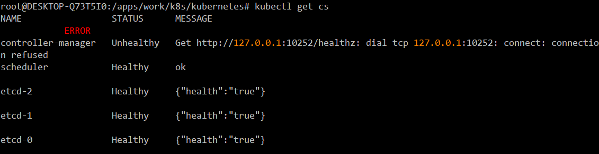

[toc]

## 5. kube-scheduler部署

部署在kube-apiserver所在服务器

### 5.1 生成kube_scheduler访问kube-apiserver 证书

```bash
cat << EOF | tee /apps/work/k8s/cfssl/k8s/k8s_scheduler.json
{
  "CN": "system:kube-scheduler",
  "hosts": [""], 
  "key": {
    "algo": "rsa",
    "size": 2048
  },
  "names": [
    {
      "C": "CN",
      "ST": "GuangDong",
      "L": "GuangZhou",
      "O": "system:kube-scheduler",
      "OU": "Kubernetes-manual"
    }
  ]
}
EOF
##  生成 Kubernetes Scheduler 证书和私钥
cfssl gencert \
    -ca=/apps/work/k8s/cfssl/pki/k8s/k8s-ca.pem \
    -ca-key=/apps/work/k8s/cfssl/pki/k8s/k8s-ca-key.pem \
    -config=/apps/work/k8s/cfssl/ca-config.json \
    -profile=kubernetes \
    /apps/work/k8s/cfssl/k8s/k8s_scheduler.json | \
    cfssljson -bare /apps/work/k8s/cfssl/pki/k8s/k8s_scheduler
  
# 此证书可多台共用
```

### 5.2 创建kube_scheduler.kubeconfig

```bash
cd /apps/work/k8s/kubernetes/server/config
kubectl config set-cluster kubernetes \
    --certificate-authority=/apps/work/k8s/cfssl/pki/k8s/k8s-ca.pem \
    --embed-certs=true \
    --server=https://192.168.1.221:5443 \
    --kubeconfig=kube_scheduler.kubeconfig

kubectl config set-credentials system:kube-scheduler \
    --client-certificate=/apps/work/k8s/cfssl/pki/k8s/k8s_scheduler.pem \
    --embed-certs=true \
    --client-key=/apps/work/k8s/cfssl/pki/k8s/k8s_scheduler-key.pem \
    --kubeconfig=kube_scheduler.kubeconfig

kubectl config set-context kubernetes \
    --cluster=kubernetes \
    --user=system:kube-scheduler \
    --kubeconfig=kube_scheduler.kubeconfig

kubectl config use-context kubernetes --kubeconfig=kube_scheduler.kubeconfig

# 说明：--server=https://192.168.1.221:5443  为每台kube-apiserver IP加端口不使用vip ip 连接
```

### 5.3 kube_scheduler 一些特殊参数的说明

```bash
use-legacy-policy-config=true 创建自己的调度方法
--policy-config-file=/apps/kubernetes/config/scheduler-policy-config.json 自己的调度算法

vim scheduler-policy-config.json 

{
  "kind" : "Policy",
  "apiVersion" : "v1",
  "predicates" : [
    {"name" : "PodFitsHostPorts"},
    {"name" : "PodFitsResources"},
    {"name" : "NoDiskConflict"},
    {"name" : "NoVolumeZoneConflict"},
    {"name" : "MatchNodeSelector"},
    {"name" : "HostName"}
  ],
  "priorities" : [
    {"name" : "LeastRequestedPriority", "weight" : 1},
    {"name" : "BalancedResourceAllocation", "weight" : 1},
    {"name" : "ServiceSpreadingPriority", "weight" : 1},
    {"name" : "EqualPriority", "weight" : 1}
  ],
  "hardPodAffinitySymmetricWeight" : 10
}

说明： 这里使用默认调度算法不做修改

```

### 5.4 创建 kube_scheduler 启动配置 所有服务器配置一样

```bash
# 说明： --address不能是服务器ip如果写服务器的ip kubectl get cs 就会报错
cd /apps/work/k8s/kubernetes/server/conf
vim kube-scheduler
KUBE_SCHEDULER_OPTS=" \
--logtostderr=false \
--address=0.0.0.0 \
--leader-elect=true \
--kubeconfig=/apps/kubernetes/config/kube_scheduler.kubeconfig \
--authentication-kubeconfig=/apps/kubernetes/config/kube_scheduler.kubeconfig \
--authorization-kubeconfig=/apps/kubernetes/config/kube_scheduler.kubeconfig \
--alsologtostderr=true \
--kube-api-qps=100 \
--kube-api-burst=100 \
--log-dir=/apps/kubernetes/log \
--v=2"
```

### 5.5 创建kube-scheduler.service 启动文件

```bash
cd /apps/work/k8s/kubernetes/
vim kube-scheduler.service
[Unit]
Description=Kubernetes Scheduler
Documentation=https://github.com/kubernetes/kubernetes

[Service]
LimitNOFILE=1024000
LimitNPROC=1024000
LimitCORE=infinity
LimitMEMLOCK=infinity

EnvironmentFile=/apps/kubernetes/conf/kube-scheduler
ExecStart=/apps/kubernetes/bin/kube-scheduler $KUBE_SCHEDULER_OPTS
Restart=on-failure
RestartSec=5
User=k8s

[Install]
WantedBy=multi-user.target
```

### 5.6 分发kube-scheduler 配置文件启动文件

```bash
cd /apps/work/k8s/kubernetes/
# 说明：  使用ansible 分发时kube_scheduler.kubeconfig  server=https://192.168.1.211:5443 可以使用参数进行分发
# server=https://{{ ansible_ssh_host }}:5443 这样就不用每次修改修改 ansible_ssh_host 参数就是连接远程服务器ip

# 分发 kube_scheduler.kubeconfig 
ansible -i host master -m  template -a "src=server/config/kube_scheduler.kubeconfig dest=/apps/kubernetes/config owner=k8s group=root mode=644" 
# 分发：kube-scheduler 
ansible -i host master -m copy -a "src=server/conf/kube-scheduler dest=/apps/kubernetes/conf owner=k8s group=root mode=644"
# 分发：kube-scheduler.service
ansible -i host master -m copy -a "src=kube-scheduler.service dest=/usr/lib/systemd/system/kube-scheduler.service"
```

### 5.7 启动kube-scheduler

```bash
ansible -i host master -m shell -a "systemctl daemon-reload"
ansible -i host master -m shell -a "systemctl enable kube-scheduler"
ansible -i host master -m shell -a "systemctl start kube-scheduler"
ansible -i host master -m shell -a "systemctl status kube-scheduler"
```

### 5.8 查看kube-scheduler 是否配置成功

```bash
kubectl get cs
```



看到这个界面，表示没问题