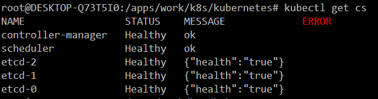

[toc]

## 6. kube-controller-manager部署

默认kube-controller-manager 部署在kube-apiserver部署的服务器上
二进制文件已经在部署`kube-apiserver`时下发了。

### 6.1 生成kube-controller-manager访问kube-apiserver 证书

```bash
cat << EOF | tee /apps/work/k8s/cfssl/k8s/k8s_controller_manager.json
{
  "CN": "system:kube-controller-manager",
  "hosts": [""], 
  "key": {
    "algo": "rsa",
    "size": 2048
  },
  "names": [
    {
      "C": "CN",
      "ST": "GuangDong",
      "L": "GuangZhou",
      "O": "system:kube-controller-manager",
      "OU": "Kubernetes-manual"
    }
  ]
}
EOF

## 生成 Kubernetes Controller Manager 证书和私钥
cfssl gencert \
    -ca=/apps/work/k8s/cfssl/pki/k8s/k8s-ca.pem \
    -ca-key=/apps/work/k8s/cfssl/pki/k8s/k8s-ca-key.pem \
    -config=/apps/work/k8s/cfssl/ca-config.json \
    -profile=kubernetes \
    /apps/work/k8s/cfssl/k8s/k8s_controller_manager.json | \
    cfssljson -bare /apps/work/k8s/cfssl/pki/k8s/k8s_controller_manager
```

此证书可多master共用

### 6.2 创建kube_controller_manager.kubeconfig

此配置每台master都要改一下IP

```bash
cd /apps/work/k8s/kubernetes/server/config
kubectl config set-cluster kubernetes \
   --certificate-authority=/apps/work/k8s/cfssl/pki/k8s/k8s-ca.pem \
   --embed-certs=true \
   --server=https://192.168.1.221:5443 \
   --kubeconfig=kube_controller_manager.kubeconfig

kubectl config set-credentials system:kube-controller-manager \
   --client-certificate=/apps/work/k8s/cfssl/pki/k8s/k8s_controller_manager.pem \
   --embed-certs=true \
   --client-key=/apps/work/k8s/cfssl/pki/k8s/k8s_controller_manager-key.pem \
   --kubeconfig=kube_controller_manager.kubeconfig

kubectl config set-context kubernetes \
   --cluster=kubernetes \
   --user=system:kube-controller-manager \
   --kubeconfig=kube_controller_manager.kubeconfig

kubectl config use-context kubernetes --kubeconfig=kube_controller_manager.kubeconfig
# 说明：--server=https://192.168.1.221:5443  为每台kube-apiserver IP加端口不使用vip ip 连接
```

### 6.3 kube-controller-manager 一些特殊参数的说明

```
service-account-private-key-file 参数必须与 kube-apiserver 参数service-account-key-file 配对不然自动签发证书会失败没权限
cluster-cidr 参数docker 集群网段 
service-cluster-ip-range 参数k8s 集群网段
node-cidr-mask-size k8s node 节点子网
```

### 6.4 创建kube-controller-manager 启动配置 所有服务器配置一样

```bash
cd /apps/work/k8s/kubernetes/server/conf
vim kube-controller-manager
KUBE_CONTROLLER_MANAGER_OPTS="--logtostderr=false \
--leader-elect=true \
--address=0.0.0.0 \
--service-cluster-ip-range=10.64.0.0/16 \
--cluster-cidr=10.48.0.0/12 \
--node-cidr-mask-size=24 \
--cluster-name=kubernetes \
--allocate-node-cidrs=true \
--kubeconfig=/apps/kubernetes/config/kube_controller_manager.kubeconfig \
--authentication-kubeconfig=/apps/kubernetes/config/kube_controller_manager.kubeconfig \
--authorization-kubeconfig=/apps/kubernetes/config/kube_controller_manager.kubeconfig \
--use-service-account-credentials=true \
--client-ca-file=/apps/kubernetes/ssl/k8s/k8s-ca.pem \
--requestheader-client-ca-file=/apps/kubernetes/ssl/k8s/k8s-ca.pem \
--node-monitor-grace-period=40s \
--node-monitor-period=5s \
--pod-eviction-timeout=5m0s \
--terminated-pod-gc-threshold=50 \
--alsologtostderr=true \
--cluster-signing-cert-file=/apps/kubernetes/ssl/k8s/k8s-ca.pem \
--cluster-signing-key-file=/apps/kubernetes/ssl/k8s/k8s-ca-key.pem \
--deployment-controller-sync-period=10s \
--experimental-cluster-signing-duration=86700h0m0s \
--enable-garbage-collector=true \
--root-ca-file=/apps/kubernetes/ssl/k8s/k8s-ca.pem \
--service-account-private-key-file=/apps/kubernetes/ssl/k8s/k8s-ca-key.pem \
--feature-gates=RotateKubeletServerCertificate=true,RotateKubeletClientCertificate=true \
--controllers=*,bootstrapsigner,tokencleaner \
--horizontal-pod-autoscaler-use-rest-clients=true \
--horizontal-pod-autoscaler-sync-period=10s \
--flex-volume-plugin-dir=/apps/kubernetes/kubelet-plugins/volume \
--tls-cert-file=/apps/kubernetes/ssl/k8s/k8s_controller_manager.pem \
--tls-private-key-file=/apps/kubernetes/ssl/k8s/k8s_controller_manager-key.pem \
--kube-api-qps=100 \
--kube-api-burst=100 \
--log-dir=/apps/kubernetes/log \
--v=2"
```

### 6.5 创建kube-controller-manager.service 启动文件

```bash
cd /apps/work/k8s/kubernetes/
vim kube-controller-manager.service 
[Unit]
Description=Kubernetes Controller Manager
Documentation=https://github.com/kubernetes/kubernetes

[Service]
LimitNOFILE=1024000
LimitNPROC=1024000
LimitCORE=infinity
LimitMEMLOCK=infinity
EnvironmentFile=/apps/kubernetes/conf/kube-controller-manager
ExecStart=/apps/kubernetes/bin/kube-controller-manager $KUBE_CONTROLLER_MANAGER_OPTS
Restart=on-failure
RestartSec=5
User=k8s

[Install]
WantedBy=multi-user.target
```

### 6.6 分发kube-controller-manager 配置文件启动文件

```bash
# 说明：  使用ansible 分发时kube_controller_manager.kubeconfig  server=https://192.168.1.221:5443 可以使用参数进行分发
# server=https://{{ ansible_ssh_host }}:5443 这样就不用每次修改修改 ansible_ssh_host 参数就是连接远程服务器ip
# 分发证书
ansible -i host master -m copy -a 'src=/apps/work/k8s/cfssl/pki/k8s/k8s_controller_manager.pem dest=/apps/kubernetes/ssl/k8s/ owner=k8s group=root mode=644'
ansible -i host master -m copy -a 'src=/apps/work/k8s/cfssl/pki/k8s/k8s_controller_manager-key.pem dest=/apps/kubernetes/ssl/k8s/ owner=k8s group=root mode=644'
# 分发 kube_controller_manager.kubeconfig 
ansible -i host master -m  template -a "src=server/config/kube_controller_manager.kubeconfig dest=/apps/kubernetes/config owner=k8s group=root mode=644" 
# 分发：kube-controller-manager
ansible -i host master -m copy -a "src=server/conf/kube-controller-manager dest=/apps/kubernetes/conf owner=k8s group=root mode=644"
# 分发：kube-controller-manager.service
ansible -i host master -m copy -a "src=kube-controller-manager.service dest=/usr/lib/systemd/system/kube-controller-manager.service"
```

### 6.7 启动kube-controller-manager

```bash
ansible -i host master -m shell -a "systemctl daemon-reload"
ansible -i host master -m shell -a "systemctl enable kube-controller-manager"
ansible -i host master -m shell -a "systemctl start kube-controller-manager"

```

### 6.8 查看kube-controller-manager 是否配置成功


这个界面表示成功了

### 6.9 配置 kube-controller-manager，kubelet 、kube-scheduler 访问kube-api 用户授权

```bash
# 授予 kubernetes API 的权限
kubectl create clusterrolebinding controller-node-clusterrolebing \
--clusterrole=system:kube-controller-manager \
--user=system:kube-controller-manager

kubectl create clusterrolebinding scheduler-node-clusterrolebing \
--clusterrole=system:kube-scheduler \
--user=system:kube-scheduler

kubectl create clusterrolebinding controller-manager:system:auth-delegator \
--user system:kube-controller-manager \
--clusterrole system:auth-delegator
# 授予 kubernetes 证书访问 kubelet API 的权限
kubectl create clusterrolebinding kube-system-cluster-admin \
--user system:serviceaccount:kube-system:default \
--clusterrole cluster-admin

kubectl create clusterrolebinding kubelet-node-clusterbinding \
--clusterrole=system:node \
--group=system:nodes

kubectl create clusterrolebinding kube-apiserver:kubelet-apis \
--clusterrole=system:kubelet-api-admin \
--user kubernetes
```

## 