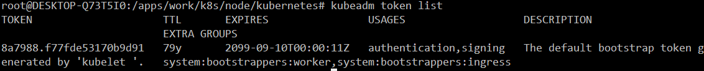
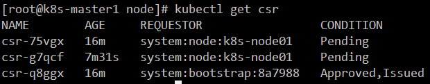

[toc]

## 7. kubelet部署

### 7.1 服务器配置及规划

物理内存一定要4G以上，否则无法正常跑起来

### 7.2 二进制文件准备

```bash
cd /apps/work/k8s/node
wget https://storage.googleapis.com/kubernetes-release/release/v1.15.0/kubernetes-node-linux-amd64.tar.gz
tar -xvf kubernetes-node-linux-amd64.tar.gz 
cd kubernetes/node
mkdir conf kubelet-plugins log ssl
```

### 7.3 生成bootstrap Token

这个在k8s-operator服务器上操作

```bash
cd /apps/work/k8s/node/kubernetes
# Bootstrap Token 生成
echo "$(head -c 6 /dev/urandom | md5sum | head -c 6)"."$(head -c 16 /dev/urandom | md5sum | head -c 16)"
8a7988.f77fde53170b9d91
```

创建 `Bootstrap Token Secret`的`yaml`文件`bootstrap.secret.yaml`
`vim bootstrap.secret.yaml`

```yaml
apiVersion: v1
kind: Secret
metadata:
  # Name MUST be of form "bootstrap-token-<token id>"
  name: bootstrap-token-8a7988
  namespace: kube-system

# Type MUST be 'bootstrap.kubernetes.io/token'
type: bootstrap.kubernetes.io/token
stringData:
  # Human readable description. Optional.
  description: "The default bootstrap token generated by 'kubelet '."

  # Token ID and secret. Required.
  token-id: 8a7988
  token-secret: f77fde53170b9d91

  # Expiration. Optional. #过期时间可以设置不过期999年
  expiration: 2099-09-10T00:00:11Z

  # Allowed usages.
  usage-bootstrap-authentication: "true"
  usage-bootstrap-signing: "true"

  # Extra groups to authenticate the token as. Must start with "system:bootstrappers:"
  auth-extra-groups: system:bootstrappers:worker,system:bootstrappers:ingress
```

使用上面的`bootstrap.secret.yaml`创建k8s资源

```bash
kubectl create -f bootstrap.secret.yaml
```

创建`bootstrap.clusterrole.yaml`
`vim bootstrap.clusterrole.yaml`

```yaml
# A ClusterRole which instructs the CSR approver to approve a node requesting a
# serving cert matching its client cert.
kind: ClusterRole
apiVersion: rbac.authorization.k8s.io/v1
metadata:
  name: system:certificates.k8s.io:certificatesigningrequests:selfnodeserver
rules:
- apiGroups: ["certificates.k8s.io"]
  resources: ["certificatesigningrequests/selfnodeserver"]
  verbs: ["create"]
```

使用上面的`bootstrap.clusterrole.yaml`创建k8s资源

```bash
kubectl create -f bootstrap.clusterrole.yaml
```

创建 `apiserver-to-kubelet.yaml`
`vim apiserver-to-kubelet.yaml`

```yaml
apiVersion: rbac.authorization.k8s.io/v1
kind: ClusterRole
metadata:
  annotations:
    rbac.authorization.kubernetes.io/autoupdate: "true"
  labels:
    kubernetes.io/bootstrapping: rbac-defaults
  name: system:kubernetes-to-kubelet
rules:
  - apiGroups:
      - ""
    resources:
      - nodes/proxy
      - nodes/stats
      - nodes/log
      - nodes/spec
      - nodes/metrics
    verbs:
      - "*"
---
apiVersion: rbac.authorization.k8s.io/v1
kind: ClusterRoleBinding
metadata:
  name: system:kubernetes
  namespace: ""
roleRef:
  apiGroup: rbac.authorization.k8s.io
  kind: ClusterRole
  name: system:kubernetes-to-kubelet
subjects:
  - apiGroup: rbac.authorization.k8s.io
    kind: User
    name: kubernetes
```

使用上面的`apiserver-to-kubelet.yaml`创建k8s资源

```bash
kubectl create -f apiserver-to-kubelet.yaml
```

使用`kubeadm`查看创建的token

```bash
# 注意是kubeadm，而不是kubectl
kubeadm token list
```


允许 `system:bootstrappers` 组用户创建 `CSR` 请求

```bash
kubectl create clusterrolebinding kubelet-bootstrap \
--clusterrole=system:node-bootstrapper \
--group=system:bootstrappers
```

自动批准 `system:bootstrappers` 组用户 `TLS bootstrapping` 首次申请证书的 `CSR` 请求

```bash
kubectl create clusterrolebinding node-client-auto-approve-csr \
--clusterrole=system:certificates.k8s.io:certificatesigningrequests:nodeclient \
--group=system:bootstrappers
```

自动批准 `system:nodes` 组用户更新 `kubelet` 自身与 `apiserver` 通讯证书的 `CSR` 请求

```bash
kubectl create clusterrolebinding node-client-auto-renew-crt \
--clusterrole=system:certificates.k8s.io:certificatesigningrequests:selfnodeclient \
--group=system:nodes
```

自动批准 `system:nodes` 组用户更新 `kubelet 10250 api` 端口证书的 `CSR` 请求

```bash
kubectl create clusterrolebinding node-server-auto-renew-crt \
--clusterrole=system:certificates.k8s.io:certificatesigningrequests:selfnodeserver \
--group=system:nodes
```

### 7.4 创建`bootstrap.kubeconfig`

```bash
cd /apps/work/k8s/node/kubernetes/node/conf
```

设置集群参数

```bash
kubectl config set-cluster kubernetes \
  --certificate-authority=/apps/work/k8s/cfssl/pki/k8s/k8s-ca.pem \
  --embed-certs=true \
  --server=https://api.k8s.dukanghub.com:6443 \
  --kubeconfig=bootstrap.kubeconfig
```

设置客户端认证参数

```bash
kubectl config set-credentials system:bootstrap:8a7988 \
  --token=8a7988.f77fde53170b9d91 \
  --kubeconfig=bootstrap.kubeconfig
```

设置上下文参数

```bash
kubectl config set-context default \
  --cluster=kubernetes \
  --user=system:bootstrap:8a7988 \
  --kubeconfig=bootstrap.kubeconfig
```

设置默认上下文

```
kubectl config use-context default --kubeconfig=bootstrap.kubeconfig
```

### 7.5 `kubelet`特殊参数说明

```
--rotate-server-certificates=true  需要手动批准签发证书
```

手动签发命令如下

```bash
kubectl get csr |grep system:node | grep Pending| \
while read name number; \
do     \
  kubectl  certificate approve  $name ; \
done 
```

```
--node-labels=node-role.kubernetes.io/k8s-node=true  根据集群不同用处修改
```

| 参数                       | 说明                                                         |
| -------------------------- | ------------------------------------------------------------ |
| --enforce-node-allocatable | 默认为pods，要为kube组件和System进程预留资源，则需要设置为pods,kube-reserved,system-reserve。 |
| --kube-reserved            | 用于配置为kube组件（kubelet,kube-proxy,dockerd等）预留的资源量 |
| --kube-reserved-cgroup     | 如果你设置了--kube-reserved，那么请一定要设置对应的cgroup，并且该cgroup目录要事先创建好，否则kubelet将不会自动创建导致kubelet启动失败 |
| --system-reserved          | 用于配置为System进程预留的资源量                             |
| --eviction-hard            | 用来配置kubelet的hard eviction条件，只支持memory和ephemeral-storage两种不可压缩资源。当出现MemoryPressure时，Scheduler不会调度新的Best-Effort QoS Pods到此节点。当出现DiskPressure时，Scheduler不会调度任何新Pods到此节点。 |

### 7.6 创建kubelet配置 例：其它节点参考此配置

```bash
cd /apps/work/k8s/node/kubernetes/node/conf
```

创建`kubelet`启动参数文件
`vim kubelet`

```conf
KUBELET_OPTS="--bootstrap-kubeconfig=/apps/kubernetes/conf/bootstrap.kubeconfig \
  --fail-swap-on=false \
  --network-plugin=cni --cni-conf-dir=/etc/cni/net.d --cni-bin-dir=/apps/cni/bin \
  --kubeconfig=/apps/kubernetes/conf/kubelet.kubeconfig \
  --address=192.168.1.224 \
  --node-ip=192.168.1.224 \
  --hostname-override=k8s-node01 \
  --cluster-dns=10.64.0.2 \
  --cluster-domain=dukang.local \
  --authorization-mode=Webhook \
  --authentication-token-webhook=true \
  --client-ca-file=/apps/kubernetes/ssl/k8s/k8s-ca.pem \
  --rotate-certificates=true \
  --rotate-server-certificates=true \
  --cgroup-driver=cgroupfs \
  --healthz-port=10248 \
  --healthz-bind-address=192.168.1.224 \
  --cert-dir=/apps/kubernetes/ssl \
  --feature-gates=RotateKubeletClientCertificate=true,RotateKubeletServerCertificate=true \
  --node-labels=node-role.kubernetes.io/k8s-node=true \
  --serialize-image-pulls=false \
  --enforce-node-allocatable=pods,kube-reserved,system-reserved \
  --pod-manifest-path=/apps/work/kubernetes/manifests \
  --runtime-cgroups=/systemd/system.slice/kubelet.service \
  --kube-reserved-cgroup=/systemd/system.slice/kubelet.service \
  --system-reserved-cgroup=/systemd/system.slice \
  --root-dir=/apps/work/kubernetes/kubelet \
  --log-dir=/apps/kubernetes/log \
  --alsologtostderr=true \
  --logtostderr=false \
  --anonymous-auth=true \
  --image-gc-high-threshold=70 \
  --image-gc-low-threshold=50 \
  --kube-reserved=cpu=500m,memory=512Mi,ephemeral-storage=1Gi \
  --system-reserved=cpu=1000m,memory=1024Mi,ephemeral-storage=1Gi \
  --eviction-hard=memory.available<500Mi,nodefs.available<10% \
  --sync-frequency=30s \
  --resolv-conf=/etc/resolv.conf \
  --pod-infra-container-image=registry.cn-hangzhou.aliyuncs.com/google-containers/pause-amd64:3.0 \
  --v=2 \
  --image-pull-progress-deadline=30s \
  --event-burst=30 \
  --event-qps=15 \
  --kube-api-burst=30 \
  --kube-api-qps=15 \
  --max-pods=200 \
  --pods-per-core=10 \
  --read-only-port=0 \
  --volume-plugin-dir=/apps/kubernetes/kubelet-plugins/volume"
```

### 7.7 创建kubelet.service

```bash
cd /apps/work/k8s/node/kubernetes/
vim kubelet.service
```

```service
[Unit]
Description=Kubernetes Kubelet
After=docker.service
Requires=docker.service

[Service]
WorkingDirectory=/opt/work/kubernetes
LimitNOFILE=1024000
LimitNPROC=1024000
LimitCORE=infinity
LimitMEMLOCK=infinity

EnvironmentFile=/apps/kubernetes/conf/kubelet
ExecStartPre=/bin/mkdir -p /sys/fs/cgroup/hugetlb/systemd/system.slice/kubelet.service
ExecStartPre=/bin/mkdir -p /sys/fs/cgroup/blkio/systemd/system.slice/kubelet.service
ExecStartPre=/bin/mkdir -p /sys/fs/cgroup/cpuset/systemd/system.slice/kubelet.service
ExecStartPre=/bin/mkdir -p /sys/fs/cgroup/devices/systemd/system.slice/kubelet.service
ExecStartPre=/bin/mkdir -p /sys/fs/cgroup/net_cls,net_prio/systemd/system.slice/kubelet.service
ExecStartPre=/bin/mkdir -p /sys/fs/cgroup/perf_event/systemd/system.slice/kubelet.service
ExecStartPre=/bin/mkdir -p /sys/fs/cgroup/cpu,cpuacct/systemd/system.slice/kubelet.service
ExecStartPre=/bin/mkdir -p /sys/fs/cgroup/freezer/systemd/system.slice/kubelet.service
ExecStartPre=/bin/mkdir -p /sys/fs/cgroup/memory/systemd/system.slice/kubelet.service
ExecStartPre=/bin/mkdir -p /sys/fs/cgroup/pids/systemd/system.slice/kubelet.service
ExecStartPre=/bin/mkdir -p /sys/fs/cgroup/systemd/systemd/system.slice/kubelet.service

ExecStart=/apps/kubernetes/bin/kubelet $KUBELET_OPTS
Restart=on-failure
RestartSec=5
KillMode=process

[Install]
WantedBy=multi-user.target
```

### 7.8 cni 插件准备

```bash
mkdir /apps/work/k8s/cni
cd /apps/work/k8s/cni
wget https://github.com/containernetworking/plugins/releases/download/v0.7.1/cni-plugins-amd64-v0.7.1.tgz
tar -xvf cni-plugins-amd64-v0.7.1.tgz
rm -rf cni-plugins-amd64-v0.7.1.tgz
mkdir bin
mv * bin/
```

创建`10-kuberouter.conf` 模板

```bash
mkdir -p cni/net.d
cd cni/net.d
vim 10-kuberouter.conf
```

```conf
{
  "name":"kubernetes",
  "type":"bridge",
  "bridge":"kube-bridge",
  "isDefaultGateway":true,
    "hairpinMode":true,
  "ipam": {
    "type":"host-local"
  }
}
```

开启`hostport`配置模板
`vim 10-kuberouter.conflist`

```conf
{
  "cniVersion":"0.3.0",
  "name":"mynet",
  "plugins":[
    {
        "name":"kubernetes",
        "type":"bridge",
        "bridge":"kube-bridge",
        "isDefaultGateway":true,
        "hairpinMode":true,
        "ipam":{
          "type":"host-local"
        }
    },
    {
        "type":"portmap",
        "capabilities":{
          "snat":true,
          "portMappings":true
        }
    }
  ]
}
```

### 7.9 lxcfs 在前面已经编译生成了

```
这里只做文件分发，分发到所在node节点
```

### 7.10 安装node节点依赖(node节点执行)

```bash
yum install -y  epel-release
yum install -y yum-utils ipvsadm \
telnet wget  net-tools  conntrack  \
ipset  jq  iptables  curl  sysstat  \
libseccomp  socat  nfs-utils  \
fuse  fuse-devel  ceph-common
```

`ceph-common`可选择性安装，看自己的网络存储方案
其他`node`节点可使用`ansible`安装这些依赖包

```bash
ansible -i host node ingress vip  -m shell -a "yum install -y  epel-release"
ansible -i host node ingress vip  -m shell -a "yum install -y   yum-utils  ipvsadm  telnet  wget  net-tools  conntrack  ipset  jq  iptables  curl  sysstat  libseccomp  socat  nfs-utils  fuse  fuse-devel  ceph-common"
```

### 7.11 复制`k8s-ca.pem`到`node`节点上

在operator节点上操作

```bash
cd /apps/work/k8s/node/kubernetes/node/ssl
mkdir k8s
cp -pdr /apps/work/k8s/cfssl/pki/k8s/k8s-ca.pem ./k8s/
```

### 7.12 分发`lxcfs`并启动

```bash
cd /apps/work/k8s/binlxfs
ansible -i /apps/work/k8s/host node ingress vip -m copy -a "src=lxcfs  dest=/usr/local/bin/lxcfs owner=root group=root mode=755"
ansible -i /apps/work/k8s/host node ingress vip -m copy -a "src=lxcfs.service dest=/usr/lib/systemd/system/lxcfs.service" 
ansible -i /apps/work/k8s/host node ingress vip -m copy -a "src=lib dest=/usr/local/" 
ansible -i /apps/work/k8s/host node ingress vip -m shell -a "mkdir -p /var/lib/lxcfs/"
ansible -i /apps/work/k8s/host node ingress vip -m shell -a "systemctl daemon-reload && systemctl start lxcfs && systemctl enable lxcfs"

```

### 7.13 `node`节点安装`docker`

使用阿里源

```bash
cat > /etc/yum.repos.d/docker-ce.repo << EOF
[docker-ce-stable]
name=Docker CE Stable - \$basearch
baseurl=https://mirrors.aliyun.com/docker-ce/linux/centos/7/\$basearch/stable
enabled=1
gpgcheck=1
gpgkey=https://mirrors.aliyun.com/docker-ce/linux/centos/gpg

[docker-ce-stable-debuginfo]
name=Docker CE Stable - Debuginfo \$basearch
baseurl=https://mirrors.aliyun.com/docker-ce/linux/centos/7/debug-\$basearch/stable
enabled=0
gpgcheck=1
gpgkey=https://mirrors.aliyun.com/docker-ce/linux/centos/gpg

[docker-ce-stable-source]
name=Docker CE Stable - Sources
baseurl=https://mirrors.aliyun.com/docker-ce/linux/centos/7/source/stable
enabled=0
gpgcheck=1
gpgkey=https://mirrors.aliyun.com/docker-ce/linux/centos/gpg

[docker-ce-edge]
name=Docker CE Edge - \$basearch
baseurl=https://mirrors.aliyun.com/docker-ce/linux/centos/7/\$basearch/edge
enabled=0
gpgcheck=1
gpgkey=https://mirrors.aliyun.com/docker-ce/linux/centos/gpg

[docker-ce-edge-debuginfo]
name=Docker CE Edge - Debuginfo \$basearch
baseurl=https://mirrors.aliyun.com/docker-ce/linux/centos/7/debug-\$basearch/edge
enabled=0
gpgcheck=1
gpgkey=https://mirrors.aliyun.com/docker-ce/linux/centos/gpg

[docker-ce-edge-source]
name=Docker CE Edge - Sources
baseurl=https://mirrors.aliyun.com/docker-ce/linux/centos/7/source/edge
enabled=0
gpgcheck=1
gpgkey=https://mirrors.aliyun.com/docker-ce/linux/centos/gpg

[docker-ce-test]
name=Docker CE Test - \$basearch
baseurl=https://mirrors.aliyun.com/docker-ce/linux/centos/7/\$basearch/test
enabled=0
gpgcheck=1
gpgkey=https://mirrors.aliyun.com/docker-ce/linux/centos/gpg

[docker-ce-test-debuginfo]
name=Docker CE Test - Debuginfo \$basearch
baseurl=https://mirrors.aliyun.com/docker-ce/linux/centos/7/debug-\$basearch/test
enabled=0
gpgcheck=1
gpgkey=https://mirrors.aliyun.com/docker-ce/linux/centos/gpg

[docker-ce-test-source]
name=Docker CE Test - Sources
baseurl=https://mirrors.aliyun.com/docker-ce/linux/centos/7/source/test
enabled=0
gpgcheck=1
gpgkey=https://mirrors.aliyun.com/docker-ce/linux/centos/gpg

[docker-ce-nightly]
name=Docker CE Nightly - \$basearch
baseurl=https://mirrors.aliyun.com/docker-ce/linux/centos/7/\$basearch/nightly
enabled=0
gpgcheck=1
gpgkey=https://mirrors.aliyun.com/docker-ce/linux/centos/gpg

[docker-ce-nightly-debuginfo]
name=Docker CE Nightly - Debuginfo \$basearch
baseurl=https://mirrors.aliyun.com/docker-ce/linux/centos/7/debug-\$basearch/nightly
enabled=0
gpgcheck=1
gpgkey=https://mirrors.aliyun.com/docker-ce/linux/centos/gpg

[docker-ce-nightly-source]
name=Docker CE Nightly - Sources
baseurl=https://mirrors.aliyun.com/docker-ce/linux/centos/7/source/nightly
enabled=0
gpgcheck=1
gpgkey=https://mirrors.aliyun.com/docker-ce/linux/centos/gpg
EOF
```

安装`docker`依赖

```bash
yum install -y python-pip python-devel \
yum-utils device-mapper-persistent-data lvm2
```

安装`docker`

```bash
yum install -y docker-ce
```

修改`/lib/systemd/system/docker.service`

```bash
ExecStart=/usr/bin/dockerd -H fd:// --graph /opt/docker  -H unix:///var/run/docker.sock  --max-concurrent-downloads=20 --log-opt max-size=20M --log-opt max-file=10 --default-ulimit nofile=1024000 --default-ulimit nproc=1024000
systemctl daemon-reload
systemctl restart docker
systemctl enable docker
```

### 7.14 分发 `cni` 到`node` 节点

注意路径

```bash
cd /apps/work/k8s/cni
创建远程cni 目录
ansible -i /apps/work/k8s/host node ingress vip -m shell -a "mkdir -p /apps/cni"
分发cni bin文件
ansible -i /apps/work/k8s/host node ingress vip -m copy -a "src=bin dest=/apps/cni/ owner=root group=root mode=755"
分发启动模板文件
ansible-i /apps/work/k8s/host node ingress vip -m copy -a "src=cni dest=/etc/"
```

### 7.15 分发kubelet 到node节点

```bash
cd /apps/work/k8s/node/kubernetes
ansible -i /apps/work/k8s/host node ingress vip -m shell -a "mkdir -p /apps/kubernetes/kubelet-plugins/volume"
ansible -i /apps/work/k8s/host node ingress vip -m copy -a "src=node/ dest=/apps/kubernetes/"
ansible -i /apps/work/k8s/host node ingress vip -m shell -a "mkdir -p /apps/work/kubernetes/{kubelet,manifests}"
ansible -i /apps/work/k8s/host node ingress vip -m shell -a "chmod u+x /apps/kubernetes/bin/*"
ansible -i /apps/work/k8s/host node ingress vip -m copy -a "src=kubelet.service dest=/usr/lib/systemd/system/"
说明：node /apps/kubernetes/conf/kubelet  每个节点ip不一样请修改或者使用参数分发
```

### 7.16 启动 kubelet

```bash
ansible -i /apps/work/k8s/host node ingress vip -m shell -a "systemctl daemon-reload"
ansible -i /apps/work/k8s/host node ingress vip -m shell -a " systemctl enable kubelet"
ansible -i /apps/work/k8s/host node ingress vip -m shell -a " systemctl start kubelet"
ansible -i /apps/work/k8s/host node ingress vip -m shell -a " systemctl status kubelet"
```

### 7.17 查看节点是否正常 手动签发kubelet 服务器证书

```bash
kubectl get csr
[root@k8s-master1 cni]# kubectl get csr
NAME        AGE    REQUESTOR                 CONDITION
csr-2jbs6   101s   system:bootstrap:8a7988   Approved,Issued #已经自动签发客户端证书
csr-75vgx   115m   system:node:k8s-node01    Approved,Issued
csr-dngwj   91m    system:node:k8s-node01    Approved,Issued
csr-g7qcf   106m   system:node:k8s-node01    Approved,Issued 
csr-kl6cr   87s    system:node:k8s-node02    Pending   # 未签发服务器证书
```

注意，服务端证书需要手动签发，若8分钟内未签发，则会再一次发起请求，上例就是由于未及时签发，多发起了2个请求。

签发命令如下：

```bash
kubectl get csr |grep system:node | grep Pending| \
while read name number; \
do \
    kubectl  certificate approve  $name ; \
done 
```

### 7.18 node节点playbook

```bash
cd /apps/work/k8s/roles
```

node所有角色目录结构

```
.
├── cni
│   ├── defaults
│   ├── files
│   │   ├── 10-kuberouter.conflist
│   │   └── bin
│   │       ├── bridge
│   │       ├── dhcp
│   │       ├── flannel
│   │       ├── host-device
│   │       ├── host-local
│   │       ├── ipvlan
│   │       ├── loopback
│   │       ├── macvlan
│   │       ├── portmap
│   │       ├── ptp
│   │       ├── sample
│   │       ├── tuning
│   │       └── vlan
│   ├── handlers
│   ├── meta
│   ├── tasks
│   │   └── main.yml
│   ├── templates
│   └── vars
├── docker_client
│   ├── defaults
│   ├── files
│   │   ├── docker-compose
│   │   └── docker-enter
│   ├── handlers
│   ├── meta
│   ├── tasks
│   │   └── main.yml
│   ├── templates
│   │   ├── daemon.json
│   │   └── docker.repo
│   └── vars
├── kubelet
│   ├── defaults
│   ├── files
│   │   ├── bin
│   │   │   ├── kubeadm
│   │   │   ├── kubectl
│   │   │   ├── kubelet
│   │   │   └── kube-proxy
│   │   └── ssl
│   │       └── k8s
│   │           └── k8s-ca.pem
│   ├── handlers
│   ├── meta
│   ├── tasks
│   │   └── main.yml
│   ├── templates
│   │   ├── conf
│   │   │   ├── bootstrap.kubeconfig
│   │   │   └── kubelet
│   │   └── kubelet.service
│   └── vars
├── lxcfs
│   ├── defaults
│   ├── files
│   │   ├── lib
│   │   │   └── lxcfs
│   │   │       ├── liblxcfs.la
│   │   │       └── liblxcfs.so
│   │   ├── lxcfs
│   │   └── lxcfs.service
│   ├── handlers
│   ├── meta
│   ├── tasks
│   │   └── main.yml
│   ├── templates
│   └── vars
└── rpm
    ├── defaults
    ├── files
    ├── handlers
    ├── meta
    ├── tasks
    │   └── main.yml
    ├── templates
    └── vars
```

`rpm/tasks/main.yml`内容如下

```yaml
- name: Yum Install
  yum: name="{{ item }}" state=latest
  with_items:
      - yum-plugin-fastestmirror
      - epel-release
  become: yes
  become_method: su
- name: rpm --import https://www.elrepo.org/RPM-GPG-KEY-elrepo.org
  raw: rpm --import https://www.elrepo.org/RPM-GPG-KEY-elrepo.org
- name: rpm -Uvh http://www.elrepo.org/elrepo-release-7.0-2.el7.elrepo.noarch.rpm
  raw: rpm -Uvh http://www.elrepo.org/elrepo-release-7.0-2.el7.elrepo.noarch.rpm
- name: yum -y --enablerepo=elrepo-kernel install kernel-ml
  shell: yum -y --enablerepo=elrepo-kernel install kernel-ml
- name: grub2-set-default 0
  shell: grub2-set-default 0
- name: grub2-mkconfig -o /boot/grub2/grub.cfg
  shell: grub2-mkconfig -o /boot/grub2/grub.cfg
- name: Yum Install
  yum: name="{{ item }}" state=latest
  with_items:
      - yum-utils
      - ipvsadm
      - telnet
      - wget
      - net-tools
      - conntrack
      - ipset
      - jq
      - iptables
      - curl
      - sysstat
      - libseccomp
      - socat
      - nfs-utils
      - fuse
      - fuse-devel
      - ceph-common
  become: yes
  become_method: su
```

`lxcfs/tasks/main.yml`内容如下：

```yaml
- name: copy /usr/local/lib/lxcfs
  copy: src=lib dest=/usr/local/
- name: up lxcfs
  copy: src=lxcfs dest=/usr/local/bin/lxcfs owner=root group=root mode=755
- name: up lxcfs.service
  copy: src=lxcfs.service dest=/usr/lib/systemd/system/lxcfs.service
- name: create /var/lib/lxcfs
  shell: mkdir -p /var/lib/lxcfs
- name: systemctl daemon-reload
  shell: systemctl daemon-reload
- name: systemctl enable lxcfs
  shell: systemctl enable lxcfs
- name: systemctl start lxcfs 
  shell: systemctl start lxcfs
```

`cni/tasks/main.yml`内容如下：

```yaml
- name: create cni
  shell: mkdir -p {{ k8s_path }}/cni
- name: copy to cni
  copy: src=bin dest={{ k8s_path }}/cni/ owner=root group=root mode=755
- name: create /etc/cni/net.d
  shell: mkdir -p /etc/cni/net.d
- name: copy 10-kuberouter.conflist
  copy: src=10-kuberouter.conflist dest=/etc/cni/net.d 
```

`docker_client/tasks/main.yml`内容如下：

```yaml
- name: yum epel-release
  yum: name=epel-release state=present
- name: yum python-pip
  yum: name={{ item }} state=present
  with_items: 
    - python-pip
    - python-devel
    - yum-utils
    - device-mapper-persistent-data
    - lvm2     
- pip: name={{ item }}
  with_items:
    - docker-py
- stat: path=/usr/bin/docker
  register: docker_path_register
- name: yum old docker
  yum: name=docker* state=removed
  when: docker_path_register.stat.exists == True
- name: cp  docker.repo client
  template: src=docker.repo dest=/etc/yum.repos.d/docker.repo
- name: mkdir -p /etc/docker
  shell: mkdir -p /etc/docker
- name: yum install docker
  yum: name=docker-ce state=present
- name: cp  daemon.json
  template: src=daemon.json dest=/etc/docker/daemon.json
- lineinfile: 
    dest: /usr/lib/systemd/system/docker.service
    regexp: '^LimitNPROC='
    line: 'LimitNPROC=1024000'
- lineinfile: 
    dest: /usr/lib/systemd/system/docker.service
    regexp: '^LimitNOFILE='
    line: 'LimitNOFILE=1024000'
- name: systemctl daemon-reload
  shell: systemctl daemon-reload
- name: enabled service docker.service
  service: name=docker.service enabled=yes
- name: start  service docker.service
  service: name=docker  state=started
- name: cp docker-enter
  copy: src=docker-enter  dest=/usr/bin/docker-enter owner=root group=root mode=755
- name: cp docker-compose
  copy: src=docker-compose  dest=/usr/bin/docker-compose owner=root group=root mode=755
- name: start  service docker.service
  service: name=docker  state=restarted
```

`docker_client/templates/daemon.json`内容如下：

```json
{
    "max-concurrent-downloads": 20,
    "data-root": "{{ graph }}",
    "exec-root": "{{ graph }}",
    "log-driver": "json-file",
	"bridge": "none",
    "oom-score-adjust": -1000,
    "debug": false,
    "log-opts": {
        "max-size": "100M",
        "max-file": "10"
    },
    "default-ulimits": {
        "nofile": {
            "Name": "nofile",
            "Hard": 1024000,
            "Soft": 1024000
        },
        "nproc": {
            "Name": "nproc",
            "Hard": 1024000,
            "Soft": 1024000
        },
	  "core": {
            "Name": "core",
            "Hard": -1,
            "Soft": -1	  
	  }
	   
    }
}
```

`kubelet/tasks/main.yml`内容如下：

```yaml
- name: create {{ k8s_path }}/kubernetes/{log,kubelet-plugins,conf}
  shell: mkdir -p {{ k8s_path }}/kubernetes/{log,kubelet-plugins,conf} && mkdir -p {{ k8s_path }}/work/kubernetes/manifests 
- name: copy kubelet to {{ k8s_path }}/kubernetes
  copy: src=bin dest={{ k8s_path }}/kubernetes/ owner=root group=root mode=755
- name: copy kubelet ssl
  copy: src=ssl dest={{ k8s_path }}/kubernetes/
- name: copy to kubelet config
  template: src=conf/{{ item }} dest={{ k8s_path }}/kubernetes/conf
  with_items:
      - kubelet
      - bootstrap.kubeconfig
- name:  copy to kubelet service
  template: src={{ item }} dest=/usr/lib/systemd/system/
  with_items:
      - kubelet.service
- name: systemctl daemon-reload 
  shell: systemctl daemon-reload
- name: systemctl enable kubelet
  shell: systemctl enable kubelet &&  systemctl start kubelet
```

`kubelet/templates/kubelet.service`内容如下：

```service
[Unit]
Description=Kubernetes Kubelet
After=docker.service
Requires=docker.service

[Service]
LimitNOFILE=1024000
LimitNPROC=1024000
LimitCORE=infinity
LimitMEMLOCK=infinity
EnvironmentFile={{ k8s_path }}/kubernetes/conf/kubelet
ExecStartPre=/bin/mkdir -p /sys/fs/cgroup/hugetlb/systemd/system.slice/kubelet.service
ExecStartPre=/bin/mkdir -p /sys/fs/cgroup/blkio/systemd/system.slice/kubelet.service
ExecStartPre=/bin/mkdir -p /sys/fs/cgroup/cpuset/systemd/system.slice/kubelet.service
ExecStartPre=/bin/mkdir -p /sys/fs/cgroup/devices/systemd/system.slice/kubelet.service
ExecStartPre=/bin/mkdir -p /sys/fs/cgroup/net_cls,net_prio/systemd/system.slice/kubelet.service
ExecStartPre=/bin/mkdir -p /sys/fs/cgroup/perf_event/systemd/system.slice/kubelet.service
ExecStartPre=/bin/mkdir -p /sys/fs/cgroup/cpu,cpuacct/systemd/system.slice/kubelet.service
ExecStartPre=/bin/mkdir -p /sys/fs/cgroup/freezer/systemd/system.slice/kubelet.service
ExecStartPre=/bin/mkdir -p /sys/fs/cgroup/memory/systemd/system.slice/kubelet.service
ExecStartPre=/bin/mkdir -p /sys/fs/cgroup/pids/systemd/system.slice/kubelet.service
ExecStartPre=/bin/mkdir -p /sys/fs/cgroup/systemd/systemd/system.slice/kubelet.service
ExecStart={{ k8s_path }}/kubernetes/bin/kubelet $KUBELET_OPTS
Restart=on-failure
KillMode=process
[Install]
WantedBy=multi-user.target
```

`kubelet/templates/conf/kubelet`内容如下：

```conf
KUBELET_OPTS="--bootstrap-kubeconfig={{ k8s_path }}/kubernetes/conf/bootstrap.kubeconfig \
              --fail-swap-on=false \
              --network-plugin=cni --cni-conf-dir=/etc/cni/net.d --cni-bin-dir={{ k8s_path }}/cni/bin \
              --kubeconfig={{ k8s_path }}/kubernetes/conf/kubelet.kubeconfig \
              --address={{ ansible_ssh_host }} \
              --node-ip={{ ansible_ssh_host }} \
              --hostname-override={{ ansible_hostname }} \
              --cluster-dns={{ k8s_dns }} \
              --cluster-domain={{ k8s_domain }} \
              --authorization-mode=Webhook \
              --authentication-token-webhook=true \
              --client-ca-file={{ k8s_path }}/kubernetes/ssl/k8s/k8s-ca.pem \
              --rotate-certificates=true \
              --rotate-server-certificates=true \
              --cgroup-driver=cgroupfs \
              --healthz-port=10248 \
              --healthz-bind-address={{ ansible_ssh_host }} \
              --cert-dir={{ k8s_path }}/kubernetes/ssl \
              --feature-gates=RotateKubeletClientCertificate=true,RotateKubeletServerCertificate=true \
              --node-labels=node-role.kubernetes.io/{{ k8s_node }}=true \
              --serialize-image-pulls=false \
              --enforce-node-allocatable=pods,kube-reserved,system-reserved \
              --pod-manifest-path={{ k8s_path }}/work/kubernetes/manifests \
              --runtime-cgroups=/systemd/system.slice/kubelet.service \
              --kube-reserved-cgroup=/systemd/system.slice/kubelet.service \
              --system-reserved-cgroup=/systemd/system.slice \
              --root-dir={{ k8s_path }}/work/kubernetes/kubelet \
              --log-dir={{ k8s_path }}/kubernetes/log \
              --alsologtostderr=true \
              --logtostderr=false \
              --anonymous-auth=true \
              --image-gc-high-threshold=70 \
              --image-gc-low-threshold=50 \
              --kube-reserved=cpu=500m,memory=512Mi,ephemeral-storage=1Gi \
              --system-reserved=cpu=1000m,memory=1024Mi,ephemeral-storage=1Gi \
              --eviction-hard=memory.available<500Mi,nodefs.available<10% \
              --serialize-image-pulls=false \
              --sync-frequency=30s \
              --resolv-conf=/etc/resolv.conf \
              --pod-infra-container-image=registry.cn-hangzhou.aliyuncs.com/google-containers/pause-amd64:3.0 \
              --image-pull-progress-deadline=30s \
              --v={{ level_log }} \
              --event-burst=30 \
              --event-qps=15 \
              --kube-api-burst=30 \
              --kube-api-qps=15 \
              --max-pods=200 \
              --pods-per-core=10 \
              --read-only-port=0 \
              --volume-plugin-dir={{ k8s_path }}/kubernetes/kubelet-plugins/volume"
```

`ansible_eth1.ipv4.address`可用`ansible_ssh_host`替换
playbook主文件`site.yml`

```bash
cd /apps/work/k8s
cat > node-site.yml <<EOF
- hosts: all
  user: root
  vars:
    k8s_path: /apps
    k8s_dns: 10.64.0.2
    k8s_domain: dukang.local
    cluster_cidr: 10.48.0.0/12
    level_log: 2
    graph: "/apps/docker"
    k8s_node: k8s-node
  roles:
    - rpm
    - cni
    - lxcfs
    - docker_client
    - kubelet
EOF
```

注意：`rpm`这个任务是升级系统内核为5.X的，不是所有硬件都支持，有可能出现升级后无法启动系统的情况，所以这里尽量提前测试一下。若不支持，在这里去除rpm
host内容如下

```
[vip]
192.168.1.216
192.168.1.218
[node]
192.168.1.224
192.168.1.225
192.168.1.226
[ingress]
192.168.1.216
192.168.1.218
[vip:vars]
k8s_node=k8s-vip
[node:vars]
k8s_node=k8s-node
[ingress:vars]
k8s_node=k8s-ingress
```

执行playbook

```bash
ansible-playbook node-site.yml
```

### 7.19 创建podpreset 修改时区跟挂载lxcfs

```bash
cd /apps/work/k8s
vim allow-lxcfs-tz-env.yaml
```

```yaml
apiVersion: settings.k8s.io/v1alpha1
kind: PodPreset
metadata:
  name: allow-lxcfs-tz-env
spec:
  selector:
    matchLabels:
  volumeMounts:
    - mountPath: /proc/cpuinfo
      name: proc-cpuinfo
    - mountPath: /proc/diskstats
      name: proc-diskstats
    - mountPath: /proc/meminfo
      name: proc-meminfo
    - mountPath: /proc/stat
      name: proc-stat
    - mountPath: /proc/swaps
      name: proc-swaps
    - mountPath: /proc/uptime
      name: proc-uptime
    - mountPath: /etc/localtime
      name: allow-tz-env

  volumes:
    - name: proc-cpuinfo
      hostPath:
        path: /var/lib/lxcfs/proc/cpuinfo
    - name: proc-diskstats
      hostPath:
        path: /var/lib/lxcfs/proc/diskstats
    - name: proc-meminfo
      hostPath:
        path: /var/lib/lxcfs/proc/meminfo
    - name: proc-stat
      hostPath:
        path: /var/lib/lxcfs/proc/stat
    - name: proc-swaps
      hostPath:
        path: /var/lib/lxcfs/proc/swaps
    - name: proc-uptime
      hostPath:
        path: /var/lib/lxcfs/proc/uptime
    - name: allow-tz-env
      hostPath:
        path: /usr/share/zoneinfo/Asia/Shanghai
```

执行`allow-lxcfs-tz-env.yaml`

```bash
kubectl apply -f allow-lxcfs-tz-env.yaml
```

说明：每个`namespaces`都要执行

```bash
kubectl apply -f allow-lxcfs-tz-env.yaml -n kube-system
kubectl apply -f allow-lxcfs-tz-env.yaml -n default
# 后面这些空间按需创建
kubectl apply -f allow-lxcfs-tz-env.yaml -n ingress-nginx
kubectl apply -f allow-lxcfs-tz-env.yaml -n monitoring
kubectl apply -f allow-lxcfs-tz-env.yaml -n clusterstorage
```

## 