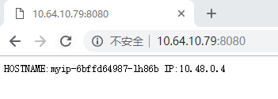

[toc]

## 8. kube-router部署

为什么不用`flanneld`，据说`flanneld`在超过2G流量时就顶不住了，只适合百节点以内的k8s集群，千节点以上就跑不动了。装了`kube-router`后无需安装`kube-proxy`及`flanneld`，但`kube-router`目前只有linux版本。一个集群中，`kube-router`和`flanneld`可以共存，装在不同的node即可。

### 8.1 kube-router 部署在所以node节点包括vip节点ingress节点

kube-router 二进制准备

```bash
# 在k8s-operator节点操作，然后统一拷到其他节点
mkdir -p /apps/work/k8s/kube-router
cd /apps/work/k8s/kube-router
wget "https://github.com/cloudnativelabs/kube-router/releases/download/v0.3.1/kube-router_0.3.1_linux_amd64.tar.gz"
tar -xf kube-router_0.3.1_linux_amd64.tar.gz
mkdir bin  conf 
mv kube-router bin/
rm -rf kube-router_0.3.1_linux_amd64.tar.gz  LICENSE  README.md
```

### 8.2 创建kube-router 访问kube-apiserver 证书

生成kube-apiserver 证书配置

```bash
cat << EOF | tee /apps/work/k8s/cfssl/k8s/kube-router.json
{
  "CN": "kube-router",
  "hosts": [""], 
  "key": {
    "algo": "rsa",
    "size": 2048
  },
  "names": [
    {
      "C": "CN",
      "ST": "GuangDong",
      "L": "GuangZhou",
      "O": "system:masters",
      "OU": "Kubernetes-manual"
    }
  ]
}
EOF
```

生成 kube-router 证书和私钥

```bash
cfssl gencert \
        -ca=/apps/work/k8s/cfssl/pki/k8s/k8s-ca.pem \
        -ca-key=/apps/work/k8s/cfssl/pki/k8s/k8s-ca-key.pem \
        -config=/apps/work/k8s/cfssl/ca-config.json \
        -profile=kubernetes \
         /apps/work/k8s/cfssl/k8s/kube-router.json | \
         cfssljson -bare /apps/work/k8s/cfssl/pki/k8s/kube-router
```

### 8.3 生成kube-router.kubeconfig文件

```bash
cd /apps/work/k8s/kube-router/conf
KUBE_APISERVER="https://api.k8s.dukanghub.com:6443"
```

设置集群

```bash
kubectl config set-cluster kubernetes \
  --certificate-authority=/apps/work/k8s/cfssl/pki/k8s/k8s-ca.pem \
  --embed-certs=true \
  --server=${KUBE_APISERVER} \
  --kubeconfig=kube-router.kubeconfig
```

设置kube-router使用的证书

```bash
kubectl config set-credentials kube-router \
  --client-certificate=/apps/work/k8s/cfssl/pki/k8s/kube-router.pem \
  --client-key=/apps/work/k8s/cfssl/pki/k8s/kube-router-key.pem \
  --embed-certs=true \
  --kubeconfig=kube-router.kubeconfig
```

设置kube-router使用的上下文

```bash
kubectl config set-context default \
  --cluster=kubernetes \
  --user=kube-router \
  --kubeconfig=kube-router.kubeconfig
```

设置kube-router使用上面的上下文

```bash
kubectl config use-context default --kubeconfig=kube-router.kubeconfig
```

### 8.4 kube-router 一些参数说明

| 参数              | 说明                                                    |
| ----------------- | ------------------------------------------------------- |
| peer-router-ips   | bgp 路由vip ip 可以是quagga 也可以是硬件路由器支持bgp的 |
| cluster-cidr      | 容器的ip段 10.48.0.0/12                                 |
| hostname-override | 读取k8s集群kubelet hostname 如果没有就不能启动          |
| peer-router-asns  | bgp 配置bgp会用到                                       |
| metrics-path      | 监控用到                                                |
| metrics-port      | 监控端口                                                |

### 8.5 创建kube-router配置 其它节点参考此配置

```bash
cd /apps/work/k8s/kube-router/conf
vim kube-router
```

```
KUBE_ROUTER_OPTS="--run-router=true \
--run-firewall=true \
--run-service-proxy=true \
--advertise-cluster-ip=true \
--advertise-external-ip=true \
--advertise-loadbalancer-ip=true \
--advertise-pod-cidr=true \
--cluster-asn=64512 \
--metrics-path=/metrics \
--metrics-port=20241 \
--enable-cni=true \
--enable-ibgp=true \
--enable-overlay=true \
--hairpin-mode=true \
--nodeport-bindon-all-ip=true \
--enable-pod-egress=true \
--cluster-cidr=10.48.0.0/12 \
--hostname-override=k8s-node01 \
--kubeconfig=/apps/kube-router/conf/kube-router.kubeconfig \
--v=2"
KUBE_ROUTER_CNI_CONF_FILE="/etc/cni/net.d/10-kuberouter.conflist"
```

注意：上面这个文件`kube-router`放到`node`节点的`/apps/kube-router/conf/`下，要跟`kube-router.service`文件的`EnvironmentFile`一致
如果有`bgp`路由，可加上以下选项

```bash
--advertise-cluster-ip=true \
--advertise-external-ip=true \
--advertise-loadbalancer-ip=true \
--nodes-full-mesh==true \
--peer-router-ips=192.168.3.12 \
--peer-router-asns=64513 \
```

### 8.6 创建kube-router.service

```bash
cd /apps/work/k8s/
vim kube-router.service 
```

```service
[Unit]
Description=Kubernetes kube-router
After=docker.service
Requires=docker.service

[Service]
LimitNOFILE=1024000
LimitNPROC=1024000
LimitCORE=infinity
LimitMEMLOCK=infinity
EnvironmentFile=/apps/kube-router/conf/kube-router
ExecStart=/apps/kube-router/bin/kube-router $KUBE_ROUTER_OPTS
Restart=on-failure
KillMode=process

[Install]
WantedBy=multi-user.target
```

### 8.7 授权kube-router用户访问kube-apiserver

```bash
cd  /apps/work/k8s/
vim kube-router.yaml
```

```yaml
apiVersion: v1
kind: ServiceAccount
metadata:
  name: kube-router
  namespace: kube-system
---
kind: ClusterRole
apiVersion: rbac.authorization.k8s.io/v1beta1
metadata:
  name: kube-router
  namespace: kube-system
rules:
  - apiGroups:
    - ""
    resources:
      - namespaces
      - pods
      - services
      - nodes
      - nodes/proxy
      - endpoints
    verbs:
      - list
      - get
      - watch
  - apiGroups:
    - "networking.k8s.io"
    resources:
      - networkpolicies
    verbs:
      - list
      - get
      - watch
  - apiGroups:
    - extensions
    resources:
      - networkpolicies
    verbs:
      - get
      - list
      - watch
---
kind: ClusterRoleBinding
apiVersion: rbac.authorization.k8s.io/v1beta1
metadata:
  name: kube-router
roleRef:
  apiGroup: rbac.authorization.k8s.io
  kind: ClusterRole
  name: kube-router
subjects:
- kind: ServiceAccount
  name: kube-router
  namespace: kube-system

```

根据上面的yaml文件创建k8s资源

```bash
kubectl create -f kube-router.yaml
```

### 8.8 分发kube-router 到node 节点

```bash
cd /apps/work/k8s
ansible -i /apps/work/k8s/host node ingress vip -m shell -a "mkdir -p /apps/kube-router"
ansible -i /apps/work/k8s/host node ingress vip -m copy -a "src=kube-router/ dest=/apps/kube-router/"
ansible -i /apps/work/k8s/host node ingress vip -m shell -a "chmod u+x /apps/kube-router/bin/*"
ansible -i /apps/work/k8s/host node ingress vip -m copy -a "src=kube-router.service dest=/usr/lib/systemd/system/"
# 修改每台装了kube-router的kube-router hostname-override 参数 
```

### 8.9 启动kube-router

```bash
ansible -i /apps/work/k8s/host node ingress vip -m shell -a "systemctl daemon-reload"
ansible -i /apps/work/k8s/host node ingress vip -m shell -a " systemctl enable kube-router"
ansible -i /apps/work/k8s/host node ingress vip -m shell -a " systemctl start kube-router"
ansible -i /apps/work/k8s/host node ingress vip -m shell -a " systemctl status kube-router"
```

### 8.10 检查kube-router 是否 自动分配ip

```bash
kubectl get nodes -o json | jq '.items[] | .spec'
[root@k8s-master1 k8s]# kubectl get nodes -o json | jq '.items[] | .spec'
{
  "podCIDR": "10.48.0.0/24"
}
{
  "podCIDR": "10.48.1.0/24"
}
```

node节点查看

```bash
# ip route 查看路由表
[root@k8s-node1 bin]# ip route
...
10.48.1.0/24 via 192.168.1.224 dev ens33 proto 17 

# ip a 查看IP列表
[root@k8s-node1 bin]# ip a
...
3: dummy0: <BROADCAST,NOARP> mtu 1500 qdisc noop state DOWN group default qlen 1000
    link/ether 62:40:14:e7:79:1c brd ff:ff:ff:ff:ff:ff
4: kube-dummy-if: <BROADCAST,NOARP,UP,LOWER_UP> mtu 1500 qdisc noqueue state UNKNOWN group default 
    link/ether c6:03:bc:c2:9b:a5 brd ff:ff:ff:ff:ff:ff
    inet 10.64.0.1/32 brd 10.64.0.1 scope link kube-dummy-if
       valid_lft forever preferred_lft forever
5: kube-bridge: <BROADCAST,MULTICAST,UP,LOWER_UP> mtu 1500 qdisc noqueue state UNKNOWN group default qlen 1000
    link/ether 12:1a:ee:f9:9f:c2 brd ff:ff:ff:ff:ff:ff

# cat /etc/cni/net.d/10-kuberouter.conf
[root@k8s-node2 conf]# cat /etc/cni/net.d/10-kuberouter.conf
{"bridge":"kube-bridge","hairpinMode":true,"ipam":{"subnet":"10.48.1.0/24","type":"host-local"},"isDefaultGateway":true,"name":"kubernetes","type":"bridge"}
```

### 8.11 创建测试用例测试集群网络是否互联

```bash
# 运行一个应用
kubectl run myip --image=cloudnativelabs/whats-my-ip --replicas=3 --port=8080
# 暴露端口
kubectl expose deployment myip --port=8080 --target-port=8080 --type=NodePort
# 不推荐上面的方式创建应用，最好使用yaml文件定义，并使用kubectl apply -f 
```

查看pod和service状态

```bash
[root@k8s-master1 k8s]# kubectl get pods -o wide
NAME                    READY   STATUS    RESTARTS   AGE   IP          NODE         NOMINATED NODE   READINESS GATES
myip-6bffd64987-cmxf5   1/1     Running   0          16s   10.48.0.3   k8s-node1   <none>           <none>
myip-6bffd64987-kdt4s   1/1     Running   0          16s   10.48.1.3   k8s-node2   <none>           <none>
myip-6bffd64987-lh86b   1/1     Running   0          16s   10.48.0.4   k8s-node1   <none>           <none>
[root@k8s-master1 k8s]# kubectl get svc         
NAME   TYPE       CLUSTER-IP       EXTERNAL-IP   PORT(S)          AGE
myip   NodePort   10.64.10.79      <none>        8080:33904/TCP   78s
```

网页访问`nodeIP:33904`

也可以使用`serviceIP:8080`或`podIP:8080`访问

注意：master节点及其他客户端由到未装`kube-router`及`cni`，所以无法直接使用serviceip及podip访问，若有直接访问的需要，可在上级路由或`master`上添加如下静态路由。
上级路由添加如下：

master静态路由命令如下

```bash
ip route add 10.48.0.0/12 via 192.168.1.217
ip route add 10.64.0.0/16 via 192.168.1.217
# 192.168.1.223是其中一台node的IP，不建议写这个，正常应该写vip，且vip机器上应该装kube-router
```

`192.168.1.223`是其中一台node的IP，不建议写这个，正常应该写vip，且vip机器上应该装`kube-router`和`cni`

### 8.12 kube-router 网络隔离与调度算法

#### 8.12.1 网络隔离

允许所有入口和出口

```yaml
apiVersion: networking.k8s.io/v1
kind: NetworkPolicy
metadata:
  name: allow-all
spec:
  podSelector: {}
  ingress:
  - {}
  egress:
  - {}
```

禁止所有入口和出口

```yaml
apiVersion: networking.k8s.io/v1
kind: NetworkPolicy
metadata:
  name: default-deny
spec:
  podSelector: {}
  policyTypes:
   - Ingress
   - Egress
```

开放特定入口和出口

```yaml
apiVersion: networking.k8s.io/v1
kind: NetworkPolicy
metadata:
  name: default-deny
spec:
  podSelector: {}
  policyTypes:
  - Egress

---
apiVersion: networking.k8s.io/v1
kind: NetworkPolicy
metadata:
  name: test-network-policy
  namespace: default
spec:
  podSelector:
    matchLabels:
      role: db
  policyTypes:
  - Ingress
  - Egress
  ingress:
  - from:
    - ipBlock:
        cidr: 172.17.0.0/16
        except:
        - 172.17.1.0/24
    - namespaceSelector:
        matchLabels:
          project: myproject
    - podSelector:
        matchLabels:
          role: frontend
    ports:
    - protocol: TCP
      port: 6379
  egress:
  - to:
    - ipBlock:
        cidr: 10.0.0.0/24
    ports:
    - protocol: TCP
      port: 5978
```

#### 8.12.2 Network Routes Controller

①启用hairpin traffic

```bash
kubectl annotate service $SERVICE_NAME "kube-router.io/service.hairpin="
```

②启用DSR(DSR将仅适用于外部IP)

```bash
kubectl annotate service my-service "kube-router.io/service.dsr=tunnel"
# kubectl annotate service myip "kube-router.io/service.dsr=tunnel"
```

③负载均衡调度算法（默认轮询）

```bash
# 最少连接
kubectl annotate service my-service "kube-router.io/service.scheduler=lc"
# 轮序
kubectl annotate service my-service "kube-router.io/service.scheduler=rr"
# hash
kubectl annotate service my-service "kube-router.io/service.scheduler=sh"
# 目标hash
kubectl annotate service myip "kube-router.io/service.scheduler=dh"  --namespace default
# 修改
kubectl annotate service myip "kube-router.io/service.scheduler=rr" --namespace default  --overwrite
```

### 8.13 kube-router playbook

```bash
cd roles
tree kube-router/
kube-router/
├── defaults
├── files
│   └── bin
│       └── kube-router
├── handlers
├── meta
├── tasks
│   └── main.yml
├── templates
│   ├── conf
│   │   ├── kube-router
│   │   └── kube-router.kubeconfig
│   └── kube-router.service
└── vars

9 directories, 5 files
```

`vim kube-router/tasks/main.yml`

```yaml
- name: create {{ k8s_path }}/kube-router
  shell: mkdir -p {{ k8s_path }}/kube-router/conf
- name: copy kube-router
  copy: src=bin dest={{ k8s_path }}/kube-router/ owner=root group=root mode=755
- name: copy kube-router config
  template: src=conf/{{ item }} dest=/{{ k8s_path }}/kube-router/conf
  with_items:
      - kube-router.kubeconfig
      - kube-router
- name: copy kube-router.service
  template: src=kube-router.service  dest=/usr/lib/systemd/system/
- name: systemctl daemon-reload
  shell: systemctl daemon-reload
- name: systemctl enable kube-router && systemctl start kube-router
  shell: systemctl enable kube-router && systemctl start kube-router
```

`vim kube-router/templates/conf/kube-router`

```conf
KUBE_ROUTER_OPTS="--run-router=true \
                  --run-firewall=true \
                  --run-service-proxy=true \
                  --advertise-cluster-ip=true \
                  --advertise-external-ip=true \
                  --cluster-asn=64512 \
                  --metrics-path=/metrics \
                  --metrics-port=20241 \
                  --enable-cni=true \
                  --enable-ibgp=true \
                  --enable-overlay=true \
                  --enable-pod-egress=true \
                  --hairpin-mode=true \
                  --cluster-cidr={{ cluster_cidr }} \
                  --hostname-override={{ ansible_hostname }} \
                  --kubeconfig={{ k8s_path }}/kube-router/conf/kube-router.kubeconfig \
                  --v={{ level_log }}"
```

`vim kube-router/templates/kube-router.service`

```service
[Unit]
Description=Kubernetes kube-router 
[Service]
LimitNOFILE=1024000
LimitNPROC=1024000
LimitCORE=infinity
LimitMEMLOCK=infinity
EnvironmentFile={{ k8s_path }}/kube-router/conf/kube-router
ExecStart={{ k8s_path }}/kube-router/bin/kube-router $KUBE_ROUTER_OPTS
Restart=on-failure
KillMode=process

[Install]
WantedBy=multi-user.target
```

`/apps/work/k8s/kube-router-site.yml`

```yaml
- hosts: all
  user: root
  vars:
    k8s_path: /apps
    k8s_dns: 10.64.0.2
    cluster_cidr: 10.48.0.0/12
    level_log: 2
  roles:
    - kube-router
```

`playbook`安装 `kube-router`

```bash
cd /apps/work/k8s/
# 单机安装
ansible-playbook -i 192.168.1.224, kube-router-site.yml
# 批量安装
ansible-playbook -i /apps/work/k8s/host kube-router-site.yml
```

### 8.14 开启hostport 同时使POD 能够访问自己的ClusterIP

修改 cni 配置

```bash
rm -rf /etc/cni/net.d/*
```

创建`10-kuberouter.conflist` 文件
`cniVersion":"0.3.0` `cni` 版本号根据`kubelet` 支持版本修改
vim /etc/cni/net.d/10-kuberouter.conflist

```conf
{
    "cniVersion":"0.3.0",
    "name":"mynet",
    "plugins":[
      {
          "name":"kubernetes",
          "type":"bridge",
          "bridge":"kube-bridge",
          "isDefaultGateway":true,
          "hairpinMode":true,
          "ipam":{
            "type":"host-local"
          }
      },
      {
          "type":"portmap",
          "capabilities":{
            "snat":true,
            "portMappings":true
          }
      }
    ]
}
```

修改 `kube-router` 启动配置文件,添加环境变量`KUBE_ROUTER_CNI_CONF_FILE`
`vim kube-router`

```conf
KUBE_ROUTER_OPTS="--run-router=true \
--run-firewall=true \
--run-service-proxy=true \
--advertise-cluster-ip=true \
--advertise-external-ip=true \
--advertise-loadbalancer-ip=true \
--advertise-pod-cidr=true \
--cluster-asn=64512 \
--peer-router-ips=192.168.3.12 \
--peer-router-asns=64513 \
--metrics-path=/metrics \
--metrics-port=20241 \
--enable-cni=true \
--enable-ibgp=true \
--enable-overlay=true \
--nodeport-bindon-all-ip=true \
--nodes-full-mesh==true \
--enable-pod-egress=true \
--hairpin-mode=true \
--cluster-cidr=10.48.0.0/12 \
--hostname-override=k8s-node-01 \
--kubeconfig=/apps/kube-router/conf/kube-router.kubeconfig \
--v=2"
KUBE_ROUTER_CNI_CONF_FILE="/etc/cni/net.d/10-kuberouter.conflist"
```

重启 `kube-router`

```bash
systemctl restart kube-router
```

查看cni 配置文件是否正常修改  kube-router 不会dump 

```bash
[root@node02 bin]# cat /etc/cni/net.d/10-kuberouter.conflist | jq '.'
{
  "cniVersion": "0.3.0",
  "name": "mynet",
  "plugins": [
    {
      "bridge": "kube-bridge",
      "hairpinMode": true,
      "ipam": {
        "subnet": "10.48.0.0/24",
        "type": "host-local"
      },
      "isDefaultGateway": true,
      "name": "kubernetes",
      "type": "bridge"
    },
    {
      "capabilities": {
        "portMappings": true,
        "snat": true
      },
      "type": "portmap"
    }
  ]
}
```

一切正常hostport 开启成功