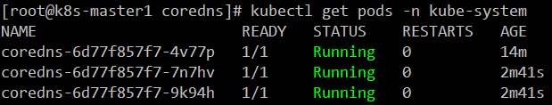
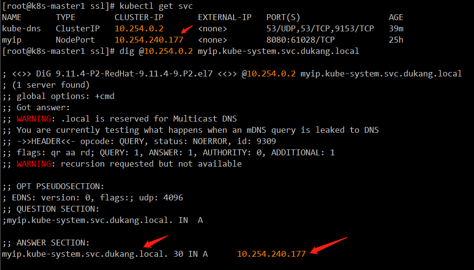

[toc]

## 10. CoreDNS部署

如果没有特殊指明，本文档的所有操作均在 k8s-operator 节点上执行；

### 10.1 CoreDNS 准备

```bash
# github上下载对应的coredns addon，下载源码时，源码里也有
tar -xf kubernetes-src.tar.gz
cd cluster/addons/dns/coredns
# 保留coredns.yaml.base，并改名为coredns.yaml即可
cp coredns.yaml.base coredns.yaml
```

### 10.2 修改CoreDNS 配置

```bash
export CLUSTER_DNS_DOMAIN="dukang.local"
export CLUSTER_DNS_SVC_IP="10.64.0.2"
sed -i -e "s/__PILLAR__DNS__DOMAIN__/${CLUSTER_DNS_DOMAIN}/" -e "s/__PILLAR__DNS__SERVER__/${CLUSTER_DNS_SVC_IP}/" coredns.yaml
vim coredns.yaml
替换成
 image: coredns/coredns    # 如果这个镜像原来带版本号，这里也加上，因为每个版本cluster/addons里的配置可能不通用
 删除 loop 
limits memory改成合适的内存容量，比如170Mi
```

### 10.3 完整的`coredns.yaml`

```yaml
# __MACHINE_GENERATED_WARNING__

apiVersion: v1
kind: ServiceAccount
metadata:
  name: coredns
  namespace: kube-system
  labels:
      kubernetes.io/cluster-service: "true"
      addonmanager.kubernetes.io/mode: Reconcile
---
apiVersion: rbac.authorization.k8s.io/v1
kind: ClusterRole
metadata:
  labels:
    kubernetes.io/bootstrapping: rbac-defaults
    addonmanager.kubernetes.io/mode: Reconcile
  name: system:coredns
rules:
- apiGroups:
  - ""
  resources:
  - endpoints
  - services
  - pods
  - namespaces
  verbs:
  - list
  - watch
- apiGroups:
  - ""
  resources:
  - nodes
  verbs:
  - get
---
apiVersion: rbac.authorization.k8s.io/v1
kind: ClusterRoleBinding
metadata:
  annotations:
    rbac.authorization.kubernetes.io/autoupdate: "true"
  labels:
    kubernetes.io/bootstrapping: rbac-defaults
    addonmanager.kubernetes.io/mode: EnsureExists
  name: system:coredns
roleRef:
  apiGroup: rbac.authorization.k8s.io
  kind: ClusterRole
  name: system:coredns
subjects:
- kind: ServiceAccount
  name: coredns
  namespace: kube-system
---
apiVersion: v1
kind: ConfigMap
metadata:
  name: coredns
  namespace: kube-system
  labels:
      addonmanager.kubernetes.io/mode: EnsureExists
data:
  Corefile: |
    .:53 {
        errors
        health
        kubernetes dukang.local in-addr.arpa ip6.arpa {
            pods insecure
            upstream
            fallthrough in-addr.arpa ip6.arpa
        }
        prometheus :9153
        forward . /etc/resolv.conf
        cache 30
        reload
        loadbalance
    }
---
apiVersion: apps/v1
kind: Deployment
metadata:
  name: coredns
  namespace: kube-system
  labels:
    k8s-app: kube-dns
    kubernetes.io/cluster-service: "true"
    addonmanager.kubernetes.io/mode: Reconcile
    kubernetes.io/name: "CoreDNS"
spec:
  # replicas: not specified here:
  # 1. In order to make Addon Manager do not reconcile this replicas parameter.
  # 2. Default is 1.
  # 3. Will be tuned in real time if DNS horizontal auto-scaling is turned on.
  replicas: 3
  strategy:
    type: RollingUpdate
    rollingUpdate:
      maxUnavailable: 1
  selector:
    matchLabels:
      k8s-app: kube-dns
  template:
    metadata:
      labels:
        k8s-app: kube-dns
      annotations:
        seccomp.security.alpha.kubernetes.io/pod: 'docker/default'
    spec:
      priorityClassName: system-cluster-critical
      serviceAccountName: coredns
      tolerations:
        - key: "CriticalAddonsOnly"
          operator: "Exists"
      nodeSelector:
        beta.kubernetes.io/os: linux
      containers:
      - name: coredns
        image: coredns/coredns:1.3.1
        imagePullPolicy: IfNotPresent
        resources:
          limits:
            memory: 170Mi
          requests:
            cpu: 100m
            memory: 70Mi
        args: [ "-conf", "/etc/coredns/Corefile" ]
        volumeMounts:
        - name: config-volume
          mountPath: /etc/coredns
          readOnly: true
        ports:
        - containerPort: 53
          name: dns
          protocol: UDP
        - containerPort: 53
          name: dns-tcp
          protocol: TCP
        - containerPort: 9153
          name: metrics
          protocol: TCP
        livenessProbe:
          httpGet:
            path: /health
            port: 8080
            scheme: HTTP
          initialDelaySeconds: 60
          timeoutSeconds: 5
          successThreshold: 1
          failureThreshold: 5
        readinessProbe:
          httpGet:
            path: /health
            port: 8080
            scheme: HTTP
        securityContext:
          allowPrivilegeEscalation: false
          capabilities:
            add:
            - NET_BIND_SERVICE
            drop:
            - all
          readOnlyRootFilesystem: true
      dnsPolicy: Default
      volumes:
        - name: config-volume
          configMap:
            name: coredns
            items:
            - key: Corefile
              path: Corefile
---
apiVersion: v1
kind: Service
metadata:
  name: kube-dns
  namespace: kube-system
  annotations:
    prometheus.io/port: "9153"
    prometheus.io/scrape: "true"
  labels:
    k8s-app: kube-dns
    kubernetes.io/cluster-service: "true"
    addonmanager.kubernetes.io/mode: Reconcile
    kubernetes.io/name: "CoreDNS"
spec:
  selector:
    k8s-app: kube-dns
  clusterIP: 10.64.0.2
  ports:
  - name: dns
    port: 53
    protocol: UDP
  - name: dns-tcp
    port: 53
    protocol: TCP
  - name: metrics
    port: 9153
    protocol: TCP
```

### 10.3 创建CoreDNS 自动横向扩容基于请求数 后期执行

`vim hpa-coredns.yaml`

```yaml
apiVersion: autoscaling/v2beta1
kind: HorizontalPodAutoscaler
metadata:
  name: coredns
  namespace: kube-system
spec:
  scaleTargetRef:
    apiVersion: apps/v1
    kind: Deployment
    name: coredns
  minReplicas: 3
  maxReplicas: 10
  metrics:
  - type: Pods
    pods:
      metricName: coredns_dns_request_count
      targetAverageValue: 10000
```

### 10.4 创建CoreDNS 服务

```bash
kubectl apply -f coredns.yaml
# 由于coredns_dns_request_count是自定义指标，需要先安装prometheus和prometheus adapter才能获取数据，所以下面这行以后再执行。基于cpu的水平伸缩波动较大，暂时没有意义
kubectl apply -f hpa-coredns.yaml
```

### 10.5 检查CoreDNS 功能



### 10.6 修改k8s-vip `/etc/resolv.conf`

```
nameserver 10.64.0.2
search kube-system.svc.dukang.local svc.dukang.local dukang.local
```

再安装`dig`命令，检查能否解析

```bash
yum install -y bind-utils
```

