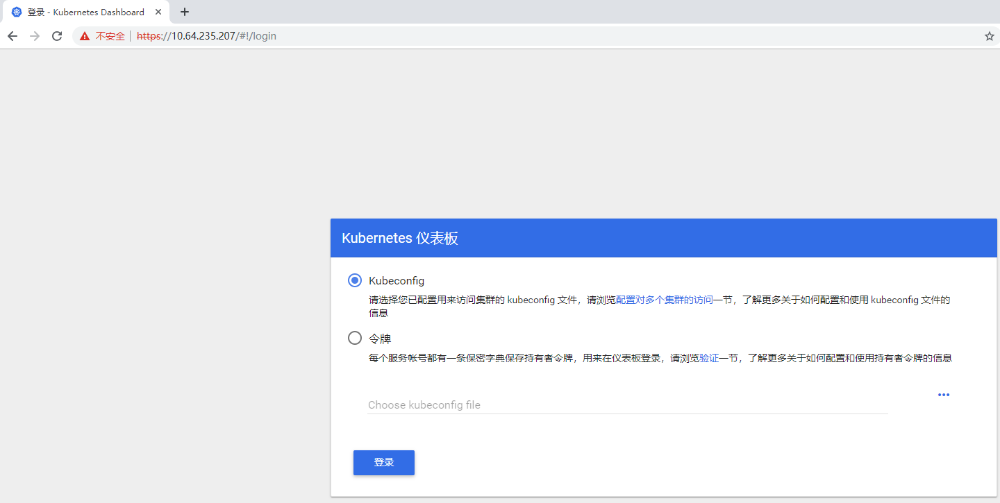
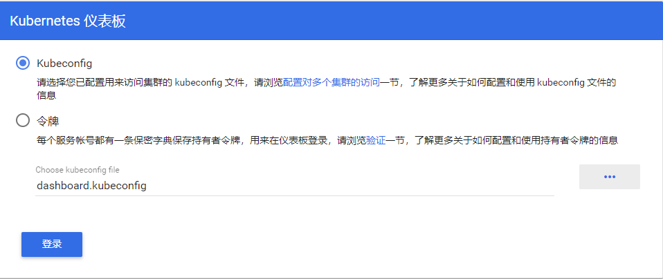
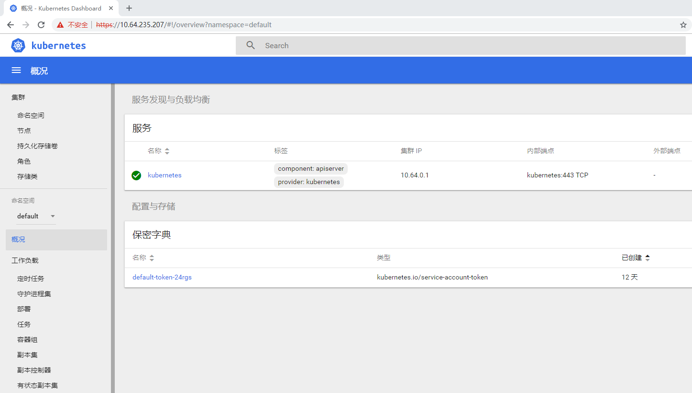

[toc]

## 11. kubernetes-dashboard部署

### 11.1 部署前说明

dashboard容器运行在kube-system空间，运行节点是node1,node2
给node1,node2加个标签

```bash
kubectl label node k8s-node1 dashboard=kubernetes-dashboard
kubectl label node k8s-node2 dashboard=kubernetes-dashboard
kubectl get node --show-labels
```

**注意：**dashboard参数列表说明( https://github.com/kubernetes/dashboard/blob/master/docs/common/dashboard-arguments.md )

### 11.2 下载`kubernetes-dashboard`

在官方github里的源码包里有，

```bash
# 解压kubernetes-src.tar.gz后进入cluster/addons目录，这里放的都是跟当前k8s版本比较匹配的组件版本
cd /apps/work/k8s/kubernetes
tar -xvf  kubernetes-src.tar.gz 
cd cluster/addons/dashboard
```

### 11.3 修改`kubernetes-dashboard`配置

- 修改`dashboard-secret.yaml`
  删除以下部分内容

  ```yaml
  apiVersion: v1
  kind: Secret
  metadata:
    labels:
      k8s-app: kubernetes-dashboard
      # Allows editing resource and makes sure it is created first.
      addonmanager.kubernetes.io/mode: EnsureExists
    name: kubernetes-dashboard-certs
    namespace: kube-system
  type: Opaque
  ---
  ```

  最终`dashboard-secret.yaml`内容如下：

  ```yaml
  apiVersion: v1
  kind: Secret
  metadata:
    labels:
      k8s-app: kubernetes-dashboard
      # Allows editing resource and makes sure it is created first.
      addonmanager.kubernetes.io/mode: EnsureExists
    name: kubernetes-dashboard-key-holder
    namespace: kube-system
  type: Opaque
  ```

- 修改`dashboard-controller.yaml`
  添加`- --token-ttl=43200`

  ```yaml
  ...
  args:
    # PLATFORM-SPECIFIC ARGS HERE
    - --auto-generate-certificates
    - --token-ttl=43200
  ```

  修改image地址为`harbor.dukanghub.com/k8s/kubernetes-dashboard-amd64:v1.10.1`或`juestnow/kubernetes-dashboard-amd64:v1.10.1`
  最终`dashboard-controller.yaml`内容如下：

  ```yaml
  apiVersion: v1
  kind: ServiceAccount
  metadata:
    labels:
      k8s-app: kubernetes-dashboard
      addonmanager.kubernetes.io/mode: Reconcile
    name: kubernetes-dashboard
    namespace: kube-system
  ---
  apiVersion: apps/v1
  kind: Deployment
  metadata:
    name: kubernetes-dashboard
    namespace: kube-system
    labels:
      k8s-app: kubernetes-dashboard
      kubernetes.io/cluster-service: "true"
      addonmanager.kubernetes.io/mode: Reconcile
  spec:
    selector:
      matchLabels:
        k8s-app: kubernetes-dashboard
    template:
      metadata:
        labels:
          k8s-app: kubernetes-dashboard
        annotations:
          scheduler.alpha.kubernetes.io/critical-pod: ''
          seccomp.security.alpha.kubernetes.io/pod: 'docker/default'
      spec:
        priorityClassName: system-cluster-critical
        containers:
        - name: kubernetes-dashboard
          image: juestnow/kubernetes-dashboard-amd64:v1.10.1
          resources:
            limits:
              cpu: 100m
              memory: 300Mi
            requests:
              cpu: 50m
              memory: 100Mi
          ports:
          - containerPort: 8443
            protocol: TCP
          args:
            # PLATFORM-SPECIFIC ARGS HERE
            - --auto-generate-certificates
            - --token-ttl=43200
          volumeMounts:
          - name: kubernetes-dashboard-certs
            mountPath: /certs
          - name: tmp-volume
            mountPath: /tmp
          livenessProbe:
            httpGet:
              scheme: HTTPS
              path: /
              port: 8443
            initialDelaySeconds: 30
            timeoutSeconds: 30
        volumes:
        - name: kubernetes-dashboard-certs
          secret:
            secretName: kubernetes-dashboard-certs
        - name: tmp-volume
          emptyDir: {}
        serviceAccountName: kubernetes-dashboard
        tolerations:
        - key: "CriticalAddonsOnly"
          operator: "Exists"
  ```

- 修改`dashboard-service.yaml`

  ```yaml
  apiVersion: v1
  kind: Service
  metadata:
    name: kubernetes-dashboard
    namespace: kube-system
    labels:
      k8s-app: kubernetes-dashboard
      kubernetes.io/cluster-service: "true"
      addonmanager.kubernetes.io/mode: Reconcile
  spec:
    type: NodePort # 增加这一行
    selector:
      k8s-app: kubernetes-dashboard
    ports:
    - port: 443
      targetPort: 8443
  ```

  指定端口类型为 NodePort，这样外界可以通过地址 `nodeIP:nodePort` 访问 `dashboard`

注意：其它文件保持不变一定要给节点打标签不然容器不会部署运行

### 11.4 创建kubernetes-dashboard 证书

```bash
cd /apps/work/k8s/kubernetes/cluster/addons/dashboard
mkdir certs
cd certs
```

生成证书配置

```bash
cat << EOF | tee /apps/work/k8s/cfssl/k8s/dashboard.json
{
  "CN": "dashboard",
  "hosts": [""], 
  "key": {
    "algo": "rsa",
    "size": 2048
  },
  "names": [
    {
      "C": "CN",
      "ST": "GuangDong",
      "L": "GuangZhou",
      "O": "dukang",
      "OU": "dukang"
    }
  ]
}
EOF
```

生成kubernetes-dashboard 证书，当然如果有外部签发的证书也可以使用

```bash
cfssl gencert \
        -ca=/apps/work/k8s/cfssl/pki/k8s/k8s-ca.pem \
        -ca-key=/apps/work/k8s/cfssl/pki/k8s/k8s-ca-key.pem \
        -config=/apps/work/k8s/cfssl/ca-config.json \
        -profile=kubernetes \
        /apps/work/k8s/cfssl/k8s/dashboard.json | \
        cfssljson -bare ./dashboard
```

重命名生成的证书

```bash
mv dashboard.pem dashboard.crt
mv dashboard-key.pem dashboard.key
```

创建证书secret

```bash
kubectl create secret generic kubernetes-dashboard-certs --from-file=dashboard.key --from-file=dashboard.crt  -n kube-system
```

查看证书secret

```bash
kubectl get secret -n kube-system | grep dashboard
kubectl get secret kubernetes-dashboard-certs -n kube-system -o yaml
```

### 11.5 创建kubernetes-dashboard 服务

```bash
cd /apps/work/k8s/kubernetes/cluster/addons/dashboard
kubectl apply -f .
```

### 11.6 检查kubernetes-dashboard 服务 是否 创建成功

建议使用火狐浏览器访问，火狐浏览器ca导入是独立的，请自行导入k8s ca证书不然访问不了的

```bash
[root@k8s-master1 dashboard]# kubectl get pods -l k8s-app=kubernetes-dashboard -n kube-system
NAME                                    READY   STATUS    RESTARTS   AGE
kubernetes-dashboard-57899c9998-kn4ql   1/1     Running   0          2m17s
[root@k8s-master1 dashboard]# kubectl get deployment kubernetes-dashboard  -n kube-system
NAME                   READY   UP-TO-DATE   AVAILABLE   AGE
kubernetes-dashboard   1/1     1            1           2m26s
[root@k8s-master1 dashboard]# kubectl get svc kubernetes-dashboard -n kube-system
NAME                   TYPE       CLUSTER-IP      EXTERNAL-IP   PORT(S)         AGE
kubernetes-dashboard   NodePort   10.64.235.207   <none>        443:45083/TCP   2m45s
```

浏览器使用`https://10.64.235.207`访问或`https://nodeip:45083`访问


### 11.7 创建kubernetes-dashboard token 登录

#### 11.7.1 生成token

创建 token

```bash
kubectl create sa dashboard-admin -n kube-system
```

授权token 访问权限

```bash
kubectl create clusterrolebinding dashboard-admin \
--clusterrole=cluster-admin \
--serviceaccount=kube-system:dashboard-admin
```

获取token 

```bash
ADMIN_SECRET=$(kubectl get secrets -n kube-system | grep dashboard-admin | awk '{print $1}')
```

获取dashboard.kubeconfig 使用token值

```
DASHBOARD_LOGIN_TOKEN=$(kubectl describe secret -n kube-system ${ADMIN_SECRET} | grep -E '^token' | awk '{print $2}')
echo ${DASHBOARD_LOGIN_TOKEN}
```

#### 11.7.2 创建使用 token 的 Kubeconfig 文件

```bash
KUBE_APISERVER="https://api.k8s.dukanghub.com:6443"
```

设置集群参数

```bash
kubectl config set-cluster kubernetes \
  --certificate-authority=/apps/work/k8s/cfssl/pki/k8s/k8s-ca.pem \
  --embed-certs=true \
  --server=${KUBE_APISERVER} \
  --kubeconfig=dashboard.kubeconfig
```

设置客户端认证参数，使用上面创建的 Token

```bash
kubectl config set-credentials dashboard_user \
  --token=${DASHBOARD_LOGIN_TOKEN} \
  --kubeconfig=dashboard.kubeconfig
```

设置上下文参数

```bash
kubectl config set-context default \
  --cluster=kubernetes \
  --user=dashboard_user \
  --kubeconfig=dashboard.kubeconfig
```

设置默认上下文

```bash
kubectl config use-context default --kubeconfig=dashboard.kubeconfig
```

导出`dashboard.kubeconfig`，用于登录dashboard

```bash
sz dashboard.kubeconfig
```

打开`https://10.64.235.207`，选择`Kubeconfig`，然后选择刚才导出的`dashboard.kubeconfig`，点击登录。

登陆成功后的页面
