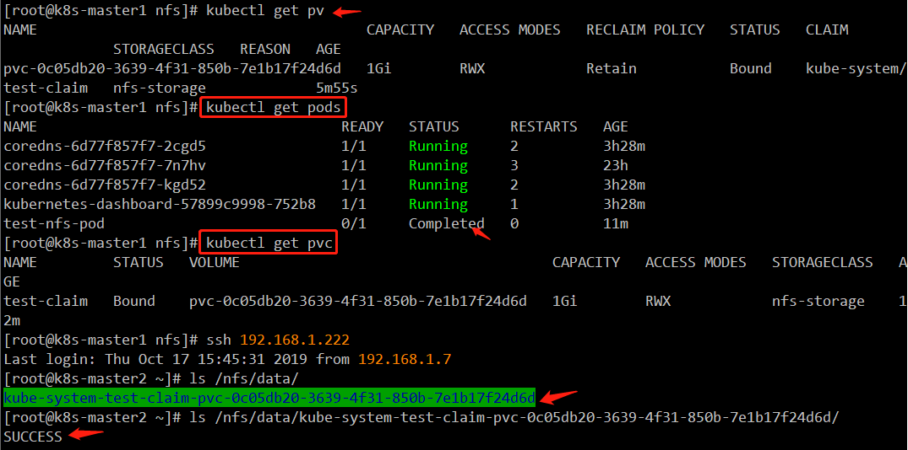

[toc]

##  nfs动态pv部署

**注意：**nfs创建的pvc暂不支持扩容(就是申请后，不能改变大小了)

### 1 部署准备

说明：所有的动态pv所需要运行的容器组都运行在clusterstorage 命名空间
所有node节点安装动态pv所需要的依赖

```bash
yum -y install nfs-utils
```

### 2 创建命名空间

`vim clusterstorage-namespace.yaml`

```yaml
apiVersion: v1
kind: Namespace
metadata:
  name: clusterstorage
```

根据上面的文件创建名称空间

```bash
kubectl apply -f clusterstorage-namespace.yaml
```

也可以直接使用命令创建命令空间

```bash
kubectl create ns clusterstorage
```

查看刚刚创建的namespace

```bash
kubectl get ns
```

### 3 nfs服务器部署

在`master2`执行以下命令，建立`nfs`服务端

```bash
# 只有服务端才需要启动这个nfs服务，
systemctl start nfs
systemctl enable nfs
mkdir -pv /nfs/data
cat > /etc/exports <<EOF
/nfs/data 192.168.1.0/24(rw,no_root_squash)
EOF
# 执行上面那步后，需要system restart nfs一下
systemctl restart nfs
# 查看共享
showmount -e
```

去`node`节点手动测试一下能不能挂载

```bash
# 必须确保此存储域名能被正确解析
mount -t nfs nfs-server2.dukanghub.com:/nfs/data /mnt
# 如果不能挂载，需要找出不能挂载的原因并解决
# 测试完了，手动卸载
umount /mnt
```

### 4 创建rbac 授权

```bash
mkdir -p /apps/work/k8s/clusterstorage/nfs
cd !$
vim rbac.yaml
```

```yaml
apiVersion: v1
kind: ServiceAccount
metadata:
  name: nfs-provisioner
  namespace: clusterstorage
---
kind: ClusterRole
apiVersion: rbac.authorization.k8s.io/v1
metadata:
   name: nfs-provisioner-runner
   namespace: clusterstorage
rules:
   -  apiGroups: [""]
      resources: ["persistentvolumes"]
      verbs: ["get", "list", "watch", "create", "delete"]
   -  apiGroups: [""]
      resources: ["persistentvolumeclaims"]
      verbs: ["get", "list", "watch", "update"]
   -  apiGroups: ["storage.k8s.io"]
      resources: ["storageclasses"]
      verbs: ["get", "list", "watch"]
   -  apiGroups: [""]
      resources: ["events"]
      verbs: ["watch", "create", "update", "patch"]
   -  apiGroups: [""]
      resources: ["services", "endpoints"]
      verbs: ["get","create","list", "watch","update"]
   -  apiGroups: ["extensions"]
      resources: ["podsecuritypolicies"]
      resourceNames: ["nfs-provisioner"]
      verbs: ["use"]
---
kind: ClusterRoleBinding
apiVersion: rbac.authorization.k8s.io/v1
metadata:
  name: run-nfs-provisioner
subjects:
  - kind: ServiceAccount
    name: nfs-provisioner
    namespace: clusterstorage
roleRef:
  kind: ClusterRole
  name: nfs-provisioner-runner
  apiGroup: rbac.authorization.k8s.io
```

执行上面的yaml文件

```bash
kubectl apply -f rbac.yaml
```

### 5 创建storageClass

`vim storageClass.yaml`

```yaml
apiVersion: storage.k8s.io/v1
kind: StorageClass
metadata:
  # 以后动态挂载用到
  name: nfs-storage 
  namespace: clusterstorage
  # 以下为可选设置
  annotations:
    # 设置该storageclass为PVC创建时默认使用的存储机制，可在创建pvc时无需指定storageClassName
    storageclass.kubernetes.io/is-default-class: "true"
#---动态卷分配应用设置的名称，必须和集群中的"nfs-provisioner"应用设置的变量名称保持一致
provisioner: fuseim.pri/ifs
# 回收策略，如果不设置，默认是delete
reclaimPolicy: Retain
parameters:
  archiveOnDelete: "true"  #---设置为"false"时删除PVC不会保留数据,"true"则删除PVC时，会将数据目录归档
```

执行上面的yaml文件

```bash
kubectl apply -f storageClass.yaml
```

### 6 创建 nfs-deployment

`vim nfs-deployment.yaml`

```yaml
kind: Deployment
apiVersion: extensions/v1beta1
metadata:
   name: nfs-client-provisioner
   namespace: clusterstorage
spec:
   replicas: 1
   strategy:
     type: Recreate
   template:
      metadata:
         labels:
            app: nfs-client-provisioner
      spec:
         serviceAccount: nfs-provisioner
         containers:
            -  name: nfs-client-provisioner
               image: quay.io/external_storage/nfs-client-provisioner:latest
               volumeMounts:
                 -  name: nfs-client-root
                    mountPath:  /persistentvolumes
               env:
                 -  name: PROVISIONER_NAME
                    value: fuseim.pri/ifs
                 -  name: NFS_SERVER
                    value: nfs-server2.dukanghub.com #nfs 服务器地址
                 -  name: NFS_PATH
                    value: /nfs/data #nfs 服务器挂载路径
         volumes:
           - name: nfs-client-root
             nfs:
               server: nfs-server2.dukanghub.com #nfs 服务器地址
               path: /nfs/data #nfs 服务器挂载路径
```

nfs服务器地址最好用域名
执行上面的yaml文件

```bash
kubectl apply -f nfs-deployment.yaml
```

### 7 创建测试动态pv

`vim test-claim.yaml`

```yaml
kind: PersistentVolumeClaim
apiVersion: v1
metadata:
  name: test-claim
spec:
  accessModes:
    - ReadWriteMany
  storageClassName: nfs-storage
  resources:
    requests:
      storage: 1Gi
```

执行上面的yaml文件

```bash
kubectl apply -f test-claim.yaml
```

### 8 创建test-pod

`vim test-pod.yaml`

```yaml
kind: Pod
apiVersion: v1
metadata:
  name: test-nfs-pod
spec:
  containers:
  - name: test-nfs-pod
    image: juestnow/busybox:1.24
    command:
      - "/bin/sh"
    args:
      - "-c"
      - "touch /mnt/SUCCESS && exit 0 || exit 1"
    volumeMounts:
      - name: nfs-pvc
        mountPath: "/mnt"
  restartPolicy: "Never"
  volumes:
    - name: nfs-pvc
      persistentVolumeClaim:
        claimName: test-claim
```

执行上面的yaml文件

```bash
kubectl apply -f test-pod.yaml
```

### 9 查看状态

```bash
kubectl get pv
kubectl get pvc
kubectl get pods
```


从上面可以看到文件已经创建成功

### 10 删除测试示例

这里设置回收策略是删除pod 不会删除创建的挂载目录及文件所以需要手动到nfs服务器删除

```bash
kubectl delete -f test-pod.yaml 
kubectl delete -f test-claim.yaml
ssh 192.168.1.222
cd /nfs/data
rm -rf kube-system-test-claim-pvc-0c05db20-3639-4f31-850b-7e1b17f24d6d
```

如果storageclass中设置了`archiveOnDelete: "true"`，在删除PVC时，会将数据目录归档

```bash
# kubectl delete pvc test-claim
# ssh 192.168.1.222
# ls /nfs/data
archived-kube-system-test-claim-pvc-0c05db20-3639-4f31-850b-7e1b17f24d6d
```

### 11 设置为默认存储

```bash
kubectl patch storageclass nfs-storage -p '{"metadata": {"annotations":{"storageclass.kubernetes.io/is-default-class":"true"}}}'
```

