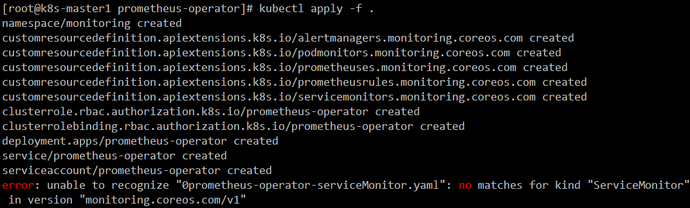
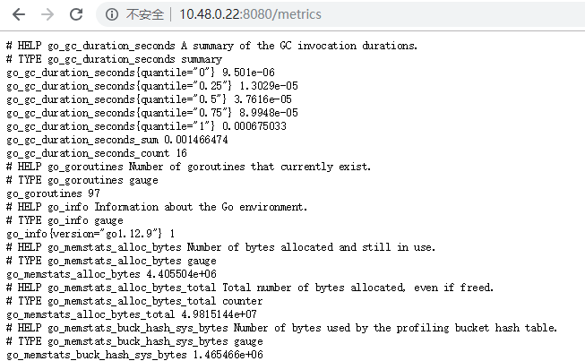

[toc]

## prometheus-operator部署

`prometheus-operator`是用来简易部署`prometheus`和`alert-manager`

### 1. 部署准备

- 说明：所有的容器组都运行在monitoring 命名空间
- 本文参考https://github.com/coreos/kube-prometheus
- 由于官方维护的版本在现有的部署环境出现问题所以下面做了一些修改及变更不影响整体效果
- prometheus-operator 项目使用官方yaml 不做任何修改

### 2. prometheus-operator相关服务的yaml 准备

下载官方yaml

```bash
cd /apps/work/k8s/
mkdir kube-prometheus
cd kube-prometheus
git clone https://github.com/coreos/kube-prometheus
cd kube-prometheus/manifests
mkdir prometheus-operator
mv 0*  prometheus-operator/
```

注意：新版的prometheus-operator全在setup文件夹，不再以0开头命名了。将所有yaml文件整理一下，目录如下：

```bash
# tree
.
├── 01-setup
│   ├── 0namespace-namespace.yaml
│   ├── prometheus-operator-0alertmanagerCustomResourceDefinition.yaml
│   ├── prometheus-operator-0podmonitorCustomResourceDefinition.yaml
│   ├── prometheus-operator-0prometheusCustomResourceDefinition.yaml
│   ├── prometheus-operator-0prometheusruleCustomResourceDefinition.yaml
│   ├── prometheus-operator-0servicemonitorCustomResourceDefinition.yaml
│   ├── prometheus-operator-clusterRoleBinding.yaml
│   ├── prometheus-operator-clusterRole.yaml
│   ├── prometheus-operator-deployment.yaml
│   ├── prometheus-operator-serviceAccount.yaml
│   └── prometheus-operator-service.yaml
├── 02-prometheus-server
│   ├── prometheus-clusterRoleBinding.yaml
│   ├── prometheus-clusterRole.yaml
│   ├── prometheus-prometheus.yaml
│   ├── prometheus-roleBindingConfig.yaml
│   ├── prometheus-roleBindingSpecificNamespaces.yaml
│   ├── prometheus-roleConfig.yaml
│   ├── prometheus-roleSpecificNamespaces.yaml
│   ├── prometheus-rules.yaml
│   ├── prometheus-serviceAccount.yaml
│   └── prometheus-service.yaml
├── 03-prometheus-monitor
│   ├── prometheus-operator-serviceMonitor.yaml
│   ├── prometheus-serviceMonitorApiserver.yaml
│   ├── prometheus-serviceMonitorCoreDNS.yaml
│   ├── prometheus-serviceMonitorKubeControllerManager.yaml
│   ├── prometheus-serviceMonitorKubelet.yaml
│   ├── prometheus-serviceMonitorKubeScheduler.yaml
│   └── prometheus-serviceMonitor.yaml
├── 04-grafana
│   ├── grafana-dashboardDatasources.yaml
│   ├── grafana-dashboardDefinitions.yaml
│   ├── grafana-dashboardSources.yaml
│   ├── grafana-deployment.yaml
│   ├── grafana-serviceAccount.yaml
│   ├── grafana-serviceMonitor.yaml
│   └── grafana-service.yaml
├── 05-alertmanager
│   ├── alertmanager-alertmanager.yaml
│   ├── alertmanager-secret.yaml
│   ├── alertmanager-serviceAccount.yaml
│   ├── alertmanager-serviceMonitor.yaml
│   └── alertmanager-service.yaml
├── 06-kube-state-metrics
│   ├── kube-state-metrics-clusterRoleBinding.yaml
│   ├── kube-state-metrics-clusterRole.yaml
│   ├── kube-state-metrics-deployment.yaml
│   ├── kube-state-metrics-roleBinding.yaml
│   ├── kube-state-metrics-role.yaml
│   ├── kube-state-metrics-serviceAccount.yaml
│   ├── kube-state-metrics-serviceMonitor.yaml
│   └── kube-state-metrics-service.yaml
├── 07-node-exporter
│   ├── node-exporter-clusterRoleBinding.yaml
│   ├── node-exporter-clusterRole.yaml
│   ├── node-exporter-daemonset.yaml
│   ├── node-exporter-serviceAccount.yaml
│   ├── node-exporter-serviceMonitor.yaml
│   └── node-exporter-service.yaml
└── 08-prometheus-adapter
    ├── prometheus-adapter-apiService.yaml
    ├── prometheus-adapter-clusterRoleAggregatedMetricsReader.yaml
    ├── prometheus-adapter-clusterRoleBindingDelegator.yaml
    ├── prometheus-adapter-clusterRoleBinding.yaml
    ├── prometheus-adapter-clusterRoleServerResources.yaml
    ├── prometheus-adapter-clusterRole.yaml
    ├── prometheus-adapter-configMap.yaml
    ├── prometheus-adapter-deployment.yaml
    ├── prometheus-adapter-roleBindingAuthReader.yaml
    ├── prometheus-adapter-serviceAccount.yaml
    └── prometheus-adapter-service.yaml

8 directories, 65 files
```

需要注意的是，我们所有的核心组件几乎都是二进制部署的，似乎并未提供prometheus接口，

创建 prometheus-operator 服务及Namespace

```bash
cd prometheus-operator
kubectl apply -f . 
```

注意，这步可能会报错，如下图(因为一开始crd 没创建所以报错)
[CRD资料](https://www.jianshu.com/p/cc7eea6dd1fb)

直接继续`kubectl apply -f .`直接没有报错即可
查看prometheus-operator 状态

```bash
[root@k8s-master1 prometheus-operator]# kubectl get pod -n monitoring -o wide | grep prometheus-operator
prometheus-operator-55b978b89-m6ht2   1/1     Running   0          4m4s   10.48.0.22   k8s-node01   <none>           <none>
[root@k8s-master1 prometheus-operator]# kubectl get service -n monitoring | grep prometheus-operator 
prometheus-operator   ClusterIP   None         <none>        8080/TCP   6m8s
```

打开`http://10.48.0.22:8080/metrics`，如果正常打开，证明prometheus-operator服务 正常

验证`prometheus-operator api `接口是否创建 `ServiceMonitor` 接口是否正常

```bash
[root@k8s-master1 prometheus-operator]# kubectl get ServiceMonitor -n monitoring | grep prometheus-operator 
prometheus-operator   9m8s
[root@k8s-master1 prometheus-operator]# kubectl api-versions| grep monitoring
monitoring.coreos.com/v1
```

```bash
kubectl get --raw "/apis/monitoring.coreos.com/v1"|jq .
```

输出大致如下(内容不重要，可以不看，长这样就行)

```json
{
  "kind": "APIResourceList",
  "apiVersion": "v1",
  "groupVersion": "monitoring.coreos.com/v1",
  "resources": [
    {
      "name": "alertmanagers",
      "singularName": "alertmanager",
      "namespaced": true,
      "kind": "Alertmanager",
      "verbs": [
        "delete",
        "deletecollection",
        "get",
        "list",
        "patch",
        "create",
        "update",
        "watch"
      ],
      "storageVersionHash": "NshW3zg1K7o="
    },
    {
      "name": "podmonitors",
      "singularName": "podmonitor",
      "namespaced": true,
      "kind": "PodMonitor",
      "verbs": [
        "delete",
        "deletecollection",
        "get",
        "list",
        "patch",
        "create",
        "update",
        "watch"
      ],
      "storageVersionHash": "t6BHpUAzPig="
    },
    {
      "name": "prometheuses",
      "singularName": "prometheus",
      "namespaced": true,
      "kind": "Prometheus",
      "verbs": [
        "delete",
        "deletecollection",
        "get",
        "list",
        "patch",
        "create",
        "update",
        "watch"
      ],
      "storageVersionHash": "C8naPY4eojU="
    },
    {
      "name": "prometheusrules",
      "singularName": "prometheusrule",
      "namespaced": true,
      "kind": "PrometheusRule",
      "verbs": [
        "delete",
        "deletecollection",
        "get",
        "list",
        "patch",
        "create",
        "update",
        "watch"
      ],
      "storageVersionHash": "RSJ8iG+KDOo="
    },
    {
      "name": "servicemonitors",
      "singularName": "servicemonitor",
      "namespaced": true,
      "kind": "ServiceMonitor",
      "verbs": [
        "delete",
        "deletecollection",
        "get",
        "list",
        "patch",
        "create",
        "update",
        "watch"
      ],
      "storageVersionHash": "JLhPcfa+5xE="
    }
  ]
}
```

查看添加的ServiceMonitor

```bash
kubectl get --raw "/apis/monitoring.coreos.com/v1/servicemonitors"|jq .
```

输出内容大致如下：

```json
{
  "apiVersion": "monitoring.coreos.com/v1",
  "items": [
    {
      "apiVersion": "monitoring.coreos.com/v1",
      "kind": "ServiceMonitor",
      "metadata": {
        "annotations": {
          "kubectl.kubernetes.io/last-applied-configuration": "{\"apiVersion\":\"monitoring.coreos.com/v1\",\"kind\":\"ServiceMonitor\",\"metadata\":{\"annotations\":{},\"labels\":{\"app.kubernetes.io/component\":\"controller\",\"app.kubernetes.io/name\":\"prometheus-operator\",\"app.kubernetes.io/version\":\"v0.33.0\"},\"name\":\"prometheus-operator\",\"namespace\":\"monitoring\"},\"spec\":{\"endpoints\":[{\"honorLabels\":true,\"port\":\"http\"}],\"selector\":{\"matchLabels\":{\"app.kubernetes.io/component\":\"controller\",\"app.kubernetes.io/name\":\"prometheus-operator\",\"app.kubernetes.io/version\":\"v0.33.0\"}}}}\n"
        },
        "creationTimestamp": "2019-10-17T12:00:07Z",
        "generation": 1,
        "labels": {
          "app.kubernetes.io/component": "controller",
          "app.kubernetes.io/name": "prometheus-operator",
          "app.kubernetes.io/version": "v0.33.0"
        },
        "name": "prometheus-operator",
        "namespace": "monitoring",
        "resourceVersion": "600145",
        "selfLink": "/apis/monitoring.coreos.com/v1/namespaces/monitoring/servicemonitors/prometheus-operator",
        "uid": "3c42cf90-8d58-4a4c-b4b7-c752f37caeff"
      },
      "spec": {
        "endpoints": [
          {
            "honorLabels": true,
            "port": "http"
          }
        ],
        "selector": {
          "matchLabels": {
            "app.kubernetes.io/component": "controller",
            "app.kubernetes.io/name": "prometheus-operator",
            "app.kubernetes.io/version": "v0.33.0"
          }
        }
      }
    }
  ],
  "kind": "ServiceMonitorList",
  "metadata": {
    "continue": "",
    "resourceVersion": "601210",
    "selfLink": "/apis/monitoring.coreos.com/v1/servicemonitors"
  }
}
```

如果一切正常证明`prometheus-operator`  部署正常