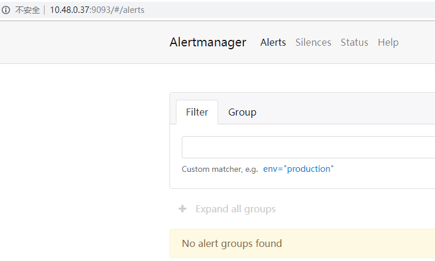

[toc]

## Alertmanager部署

### 1. 部署准备

- 说明：所有的容器组都运行在monitoring 命名空间
- 本文参考`https://github.com/coreos/kube-prometheus`
- 由于官方维护的版本在现有的部署环境出现问题所以下面做了一些修改及变更不影响整体效果
- Alertmanager 项目使用官方yaml 不做任何修改
- alertmanager是以statefulset方式部署的

### 2. Alertmanager 相关服务的yaml 准备(未操作)

下载官方yaml(上一步已经下载了)

```bash
cd /apps/work/k8s/kube-prometheus/kube-prometheus/manifests
mkdir prometheus-alertmanager
mv alertmanager*  prometheus-alertmanager/
```

创建 Alertmanager 服务

```bash
# cd prometheus-alertmanager
# tree 
.
├── alertmanager-alertmanager.yaml
├── alertmanager-secret.yaml
├── alertmanager-serviceAccount.yaml
├── alertmanager-serviceMonitor.yaml
└── alertmanager-service.yaml

0 directories, 5 files
# kubectl apply -f .  
```

查看alertmanager 状态

```bash
[root@k8s-master1 prometheus-alertmanager]# kubectl get pod -n monitoring -o wide | grep alertmanager
alertmanager-main-0                   2/2     Running   2          151m   10.48.0.37   k8s-node01   <none>           <none>
alertmanager-main-1                   2/2     Running   2          151m   10.48.0.42   k8s-node01   <none>           <none>
alertmanager-main-2                   2/2     Running   2          151m   10.48.0.43   k8s-node01   <none>           <none>
[root@k8s-master1 prometheus-alertmanager]# kubectl get service -n monitoring -o wide | grep alertmanager 
alertmanager-main       ClusterIP   10.254.213.57   <none>        9093/TCP                     18h    alertmanager=main,app=alertmanager
alertmanager-operated   ClusterIP   None            <none>        9093/TCP,9094/TCP,9094/UDP   161m   app=alertmanager
```

可使用这三个`nodeIP:9093/#/alerts`访问图形界面


### 3. 配置 alertmanager webhook 地址 例子(未操作)

prometheus alertmanager 支持配置自动发现和更新
因此，我们只需要重新生成配置即可
首先，删除原有的配置项

```bash
kubectl delete secret alertmanager-main -n monitoring
```

编写一个 webhook 配置文件，命名为 `alertmanager.yaml`
报警项目参考`https://github.com/qist/msg-sender`

```yaml
global:
  resolve_timeout: 5m
route:
  group_by: ['alertname']
  group_wait: 30s
  group_interval: 5m
  repeat_interval: 12h
  receiver: 'webhook'
receivers:
- name: 'webhook'
  webhook_configs:
  - url: 'http://msg-sender.monitoring:4000/sender/wechat'
```

注意，这里的 url 要跟 msg-sender 提供的服务地址对应上

```bash
kubectl create secret generic alertmanager-main --from-file=alertmanager.yaml -n monitoring
```

确认下 alertmanager 的配置项是否正确更新了

```conf
global:
  resolve_timeout: 5m
  http_config: {}
  smtp_hello: localhost
  smtp_require_tls: true
  pagerduty_url: https://events.pagerduty.com/v2/enqueue
  hipchat_api_url: https://api.hipchat.com/
  opsgenie_api_url: https://api.opsgenie.com/
  wechat_api_url: https://qyapi.weixin.qq.com/cgi-bin/
  victorops_api_url: https://alert.victorops.com/integrations/generic/20131114/alert/
route:
  receiver: webhook
  group_by:
  - alertname
  group_wait: 30s
  group_interval: 5m
  repeat_interval: 12h
receivers:
- name: webhook
  webhook_configs:
  - send_resolved: true
    http_config:{}
    url: http://msg-sender.monitoring:4000/sender/wechat
templates: []
```

然后，查看 msg-sender 的容器日志，可以看到已经收到了来自 alertmanager 的 webhook 告警
而且已经模拟了wechat 的发送动作！

```bash
tail -n 10 msg-sender2019-06-19.log
INFO: 2019/06/19 09:29:02 http.go:238: {"errcode":0,"errmsg":"ok","invaliduser":""}
INFO: 2019/06/19 09:29:02 http.go:231: #sendWechat# client:1.8.17.209:41088, to:huangdaquan, requestType:application/x-www-form-urlencoded, content:2019-06-19 09:29:01 platform bulletin is not available!
```

### 4.微信报警模板

`cat alertmanager-templates.yaml`

```yaml
apiVersion: v1
kind: ConfigMap
metadata:
  name: alertmanager-templates
  namespace: kube-system
data:
  wechat.tmpl: |
    {{ define "wechat.default.message" }}
    {{ range .Alerts }}
    ========start==========
    告警程序：prometheus_alert
    告警级别：{{ .Labels.severity }}
    告警类型：{{ .Labels.alertname }}
    故障主机: {{ .Labels.instance }}
    告警阈值: {{ .Annotations.value }}
    告警主题: {{ .Annotations.summary }}
    告警详情: {{ .Annotations.description }}
    触发时间: {{ .StartsAt.Format "2006-01-02 15:04:05" }}
    ========end==========
    {{ end }}
    {{ end }}
```

**注意：**如果收到的消息时间少8小时，为了易读，将触发时间改成如下

```yaml
# 时间默认UTC 所以后边加入28800e9 也就是多了啦8个小时 
触发时间: {{ (.StartsAt.Add 28800e9).Format "2006-01-02 15:04:05" }}
```


