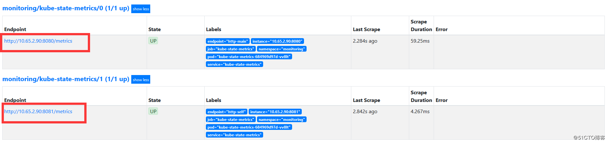

[toc]

## kube-state-metrics部署

### 1. 部署说明

```
说明：所有的容器组都运行在monitoring 命名空间
本文参考https://github.com/coreos/kube-prometheus
由于官方维护的版本在现有的部署环境出现问题所以下面做了一些修改及变更不影响整体效果
 kube-state-metrics 不使用官方yaml 
 kube-state-metrics是使用deployment方式部署的
```

### 2. `kube-state-metrics` 服务相关yaml准备

#### 2.1 创建kube-state-metrics-rbac

说明：新增storage，ingresses 数据收集
`vim kube-state-metrics-rbac.yaml`

```yaml
apiVersion: v1
kind: ServiceAccount
metadata:
  name: kube-state-metrics
  namespace: monitoring
---
apiVersion: rbac.authorization.k8s.io/v1
kind: ClusterRole
metadata:
  name: kube-state-metrics
rules:
- apiGroups:
  - ""
  resources:
  - configmaps
  - secrets
  - nodes
  - pods
  - services
  - resourcequotas
  - replicationcontrollers
  - limitranges
  - persistentvolumeclaims
  - persistentvolumes
  - namespaces
  - endpoints
  verbs:
  - list
  - watch
- apiGroups:
  - extensions
  resources:
  - daemonsets
  - deployments
  - replicasets
  - ingresses
  verbs:
  - list
  - watch
- apiGroups:
  - apps
  resources:
  - statefulsets
  - daemonsets
  - deployments
  - replicasets
  verbs:
  - list
  - watch
- apiGroups:
  - batch
  resources:
  - cronjobs
  - jobs
  verbs:
  - list
  - watch
- apiGroups:
  - autoscaling
  resources:
  - horizontalpodautoscalers
  verbs:
  - list
  - watch
- apiGroups:
  - authentication.k8s.io
  resources:
  - tokenreviews
  verbs:
  - create
- apiGroups:
  - authorization.k8s.io
  resources:
  - subjectaccessreviews
  verbs:
  - create
- apiGroups:
  - policy
  resources:
  - poddisruptionbudgets
  verbs:
  - list
  - watch
- apiGroups: 
  - certificates.k8s.io
  resources:
  - certificatesigningrequests
  verbs: 
  - list
  - watch
- apiGroups: 
  - storage.k8s.io
  resources:
  - storageclasses
  verbs: 
  - list
  - watch
---
apiVersion: rbac.authorization.k8s.io/v1
kind: ClusterRoleBinding
metadata:
  name: kube-state-metrics
roleRef:
  apiGroup: rbac.authorization.k8s.io
  kind: ClusterRole
  name: kube-state-metrics
subjects:
- kind: ServiceAccount
  name: kube-state-metrics
  namespace: monitoring
---
apiVersion: rbac.authorization.k8s.io/v1
kind: Role
metadata:
  name: kube-state-metrics
  namespace: monitoring
rules:
- apiGroups:
  - ""
  resources:
  - pods
  verbs:
  - get
- apiGroups:
  - extensions
  resourceNames:
  - kube-state-metrics
  resources:
  - deployments
  verbs:
  - get
  - update
- apiGroups:
  - apps
  resourceNames:
  - kube-state-metrics
  resources:
  - deployments
  verbs:
  - get
  - update
---
apiVersion: rbac.authorization.k8s.io/v1
kind: RoleBinding
metadata:
  name: kube-state-metrics
  namespace: monitoring
roleRef:
  apiGroup: rbac.authorization.k8s.io
  kind: Role
  name: kube-state-metrics
subjects:
- kind: ServiceAccount
  name: kube-state-metrics
```

#### 2.2 创建 kube-state-metrics-service

`vim kube-state-metrics-service.yaml`

```yaml
apiVersion: v1
kind: Service
metadata:
  annotations:
    prometheus.io/scrape: 'true'
  name: kube-state-metrics
  namespace: monitoring
  labels:
    k8s-app: kube-state-metrics
spec:
  ports:
  - name: http-main
    port: 8080
    protocol: TCP
  - name: http-self
    port: 8081
    protocol: TCP
  selector:
    app: kube-state-metrics
```

#### 2.3 创建kube-state-metrics-serviceMonitor

`vim kube-state-metrics-serviceMonitor.yaml`

```yaml
apiVersion: monitoring.coreos.com/v1
kind: ServiceMonitor
metadata:
  labels:
    k8s-app: kube-state-metrics
  name: kube-state-metrics
  namespace: monitoring
spec:
  endpoints:
  - honorLabels: true
    interval: 30s
    port: http-main
    scheme: http
    scrapeTimeout: 30s
  - interval: 30s
    port: http-self
    scheme: http
  jobLabel: k8s-app
  selector:
    matchLabels:
      k8s-app: kube-state-metrics
```

#### 2.4 创建kube-state-metrics-deployment

`vi kube-state-metrics-deployment.yaml`

```yaml
apiVersion: v1
kind: ConfigMap
metadata:
  name: nanny-config
  namespace: default
data:
  NannyConfiguration: |-
    apiVersion: nannyconfig/v1alpha1
    kind: NannyConfiguration
---
apiVersion: apps/v1beta2
kind: Deployment
metadata:
  labels:
    app: kube-state-metrics
  name: kube-state-metrics
  namespace: monitoring
spec:
  replicas: 1
  selector:
    matchLabels:
      app: kube-state-metrics
  template:
    metadata:
      labels:
        app: kube-state-metrics
    spec:
      serviceAccountName: kube-state-metrics
      containers:
      - name: kube-state-metrics
        image: googlecontainer/kube-state-metrics:v1.6.0
        ports:
        - name: http-metrics
          containerPort: 8080
        - name: telemetry
          containerPort: 8081
        readinessProbe:
          httpGet:
            path: /healthz
            port: 8080
          initialDelaySeconds: 10
          timeoutSeconds: 10
      - name: addon-resizer
        image: juestnow/addon-resizer:1.8.5
        resources:
          limits:
            cpu: 100m
            memory: 30Mi
          requests:
            cpu: 100m
            memory: 30Mi
        env:
          - name: MY_POD_NAME
            valueFrom:
              fieldRef:
                fieldPath: metadata.name
          - name: MY_POD_NAMESPACE
            valueFrom:
              fieldRef:
                fieldPath: metadata.namespace
        command:
          - /pod_nanny
          - --container=kube-state-metrics
          - --cpu=100m
          - --extra-cpu=1m
          - --memory=200Mi
          - --extra-memory=2Mi
          - --threshold=5
          - --deployment=kube-state-metrics
      nodeSelector:
        beta.kubernetes.io/os: linux
      serviceAccountName: kube-state-metrics
```

### 3. 执行yaml 创建kube-state-metrics 服务

```bash
kubectl apply -f .
```

### 4. 查看kube-state-metrics 状态

```bash
[root@jenkins state-metrics]# kubectl get pod -n monitoring -o wide | grep kube-state-metrics
kube-state-metrics-684969d97d-vv8lt       2/2     Running   0          3d20h   10.65.2.90      nginx-1   <none>           <none>
[root@jenkins state-metrics]# kubectl get service -n monitoring  | grep kube-state-metrics            
kube-state-metrics        ClusterIP   10.64.219.124   <none>        8080/TCP,8081/TCP   56d
```

访问`kube-state-metrics`
`http://10.64.219.124:8080/metrics`
查看prometheus监控是否有对应的kube-state-metrics  标签

打开grafana 查看 kubernetes开头dashboards 如果有数据证明正常