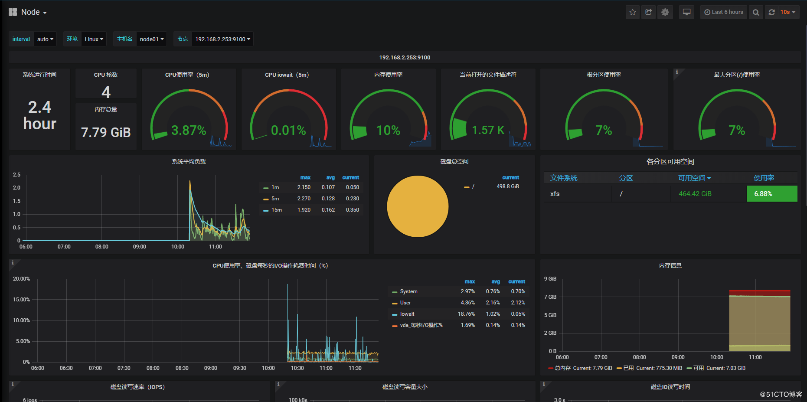
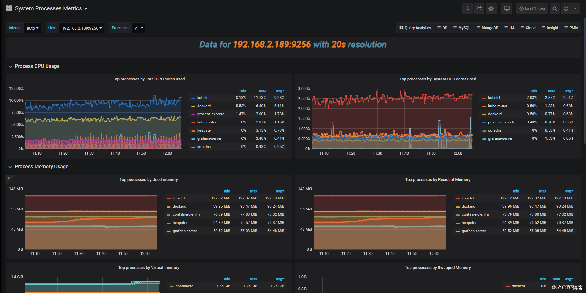
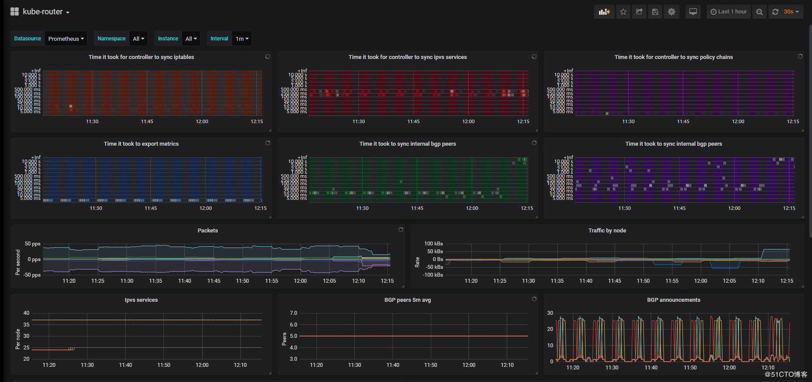

[toc]

## 基于node-exporter系列监控部署

其实这些`prometheus-operator,alert-manager,prometheus-prometheus,prometheus-monitor,prometheus-adapter,kube-state-metrics,node-exporter,grafana`都是`coreos`的产品，都可以通过`git clone https://github.com/coreos/kube-prometheus`下载下来后，直接`apply`即可成功。同时需要注意的是，装了这个后，对`metrics-server`会有影响，如果安装后，再删除，那`metrics-server`会用不了。

**注意：**node-exporter是以daemonset方式部署的

## 1、部署准备

```
说明：所有的容器组都运行在monitoring 命名空间
本文参考https://github.com/coreos/kube-prometheus
由于官方维护的版本在现有的部署环境出现问题所以下面做了一些修改及变更不影响整体效果
```

## 2、node-exporter服务相关yaml 准备

### 2.1、prometheus-node-exporter-rbac

```
vi prometheus-node-exporter-rbac.yaml
apiVersion: v1
kind: ServiceAccount
metadata:
  name: node-exporter
  namespace: monitoring
---
apiVersion: rbac.authorization.k8s.io/v1
kind: ClusterRole
metadata:
  name: node-exporter
rules:
- apiGroups:
  - authentication.k8s.io
  resources:
  - tokenreviews
  verbs:
  - create
- apiGroups:
  - authorization.k8s.io
  resources:
  - subjectacce***eviews
  verbs:
  - create
---
apiVersion: rbac.authorization.k8s.io/v1
kind: ClusterRoleBinding
metadata:
  name: node-exporter
roleRef:
  apiGroup: rbac.authorization.k8s.io
  kind: ClusterRole
  name: node-exporter
subjects:
- kind: ServiceAccount
  name: node-exporter
  namespace: monitoring
```

### 2.2、prometheus-node-exporter-service

```
vi prometheus-node-exporter-service.yaml
apiVersion: v1
kind: Service
metadata:
  annotations:
    prometheus.io/scrape: 'true'
  labels:
    k8s-app: node-exporter
  name: node-exporter
  namespace: monitoring
spec:
  clusterIP: None
  ports:
  - name: http
    port: 9100
    targetPort: http
  selector:
    app: node-exporter
```

### 2.3、node-exporter-serviceMonitor

```
vi node-exporter-serviceMonitor.yaml
apiVersion: monitoring.coreos.com/v1
kind: ServiceMonitor
metadata:
  labels:
    k8s-app: node-exporter
  name: node-exporter
  namespace: monitoring
spec:
  endpoints:
  - interval: 30s
    port: http
    scheme: http
  jobLabel: k8s-app
  selector:
    matchLabels:
      k8s-app: node-exporter
```

### 2.4、prometheus-node-exporter-daemonset

```
vi prometheus-node-exporter-daemonset.yaml
apiVersion: apps/v1beta2
kind: DaemonSet
metadata:
  labels:
    app: node-exporter
  name: node-exporter
  namespace: monitoring
spec:
  selector:
    matchLabels:
      app: node-exporter
  template:
    metadata:
      labels:
        app: node-exporter   
    spec:
      hostNetwork: true
      hostPID: true
      containers:
      - image: prom/node-exporter:v0.18.1
        args:
        - "--path.procfs=/host/proc"
        - "--path.sysfs=/host/sys"
        - "--path.rootfs=/host/root"
        - "--collector.filesystem.ignored-mount-points=^/(dev|proc|sys|/apps/docker/.+)($|/)"
        - "--collector.filesystem.ignored-fs-types=^(autofs|binfmt_misc|cgroup|configfs|debugfs|devpts|devtmpfs|fusectl|hugetlbfs|mqueue|overlay|proc|procfs|pstore|rpc_pipefs|securityfs|sysfs|tracefs)$"
        name: node-exporter
        ports:
        - name: http
          #^ must be an IANA_SVC_NAME (at most 15 characters, ..)
          containerPort: 9100
          hostPort: 9100
        resources:
          requests:
            memory: 30Mi
            cpu: 102m
          limits:
            memory: 50Mi
            cpu: 250m
        volumeMounts:
        - name: proc
          readOnly:  false
          mountPath: /host/proc
        - name: sys
          readOnly: false
          mountPath: /host/sys
        - name: root
          readOnly: true
          mountPath: /host/root
          mountPropagation: HostToContainer
      securityContext:
        runAsNonRoot: true
        runAsUser: 65534
      serviceAccountName: node-exporter
      tolerations:
      - effect: NoSchedule
        operator: Exists
      volumes:
        - name: proc
          hostPath:
            path: /proc
        - name: sys
          hostPath:
            path: /sys
        - name: root
          hostPath:
            path: /
```

### 2.5、执行yaml 创建node-exporter 服务

```
kubectl apply -f .
```

### 2.6 验证node-exporter

```
[root@jenkins heapster]# kubectl get pod -n monitoring -o wide | grep node-exporter
node-exporter-2hclb                       1/1     Running   2          5d20h   192.168.2.186   nginx-1   <none>           <none>
node-exporter-77vcf                       1/1     Running   1          5d20h   192.168.2.253   node01    <none>           <none>
node-exporter-8lx4v                       1/1     Running   1          5d20h   192.168.2.165   node03    <none>           <none>
node-exporter-r6kmn                       1/1     Running   1          5d20h   192.168.2.189   nginx-2   <none>           <none>
node-exporter-xskdr                       1/1     Running   1          5d20h   192.168.3.4     node02    <none>           <none>
[root@jenkins heapster]# kubectl get service -n monitoring  | grep node-exporter       
node-exporter             ClusterIP   None            <none>        9100/TCP            41d
http://nodeIp:9100
打开grafana 选择node dashboards 或者kubernetes-nodes 如果正常显示数据就安装正常
```



## 3、process-exporter 服务相关yaml 准备

### 3.1、prometheus-process-exporter-rbac

```
vi prometheus-process-exporter-rbac.yaml
apiVersion: v1
kind: ServiceAccount
metadata:
  name: process-exporter
  namespace: monitoring
---
apiVersion: rbac.authorization.k8s.io/v1
kind: ClusterRole
metadata:
  name: process-exporter
rules:
- apiGroups:
  - authentication.k8s.io
  resources:
  - tokenreviews
  verbs:
  - create
- apiGroups:
  - authorization.k8s.io
  resources:
  - subjectacce***eviews
  verbs:
  - create
---
apiVersion: rbac.authorization.k8s.io/v1
kind: ClusterRoleBinding
metadata:
  name: process-exporter
roleRef:
  apiGroup: rbac.authorization.k8s.io
  kind: ClusterRole
  name: process-exporter
subjects:
- kind: ServiceAccount
  name: process-exporter
  namespace: monitoring
```

### 3.2、prometheus-process-exporter-service

```
vi prometheus-process-exporter-service.yaml
apiVersion: v1
kind: Service
metadata:
  annotations:
    prometheus.io/scrape: 'true'
  labels:
    k8s-app: process-exporter
  name: process-exporter
  namespace: monitoring
spec:
  clusterIP: None
  ports:
  - name: http
    port: 9256
    targetPort: http
  selector:
    app: process-exporter
```

### 3.3、prometheus-process-configmap

```
说明：详细配置请阅读https://github.com/ncabatoff/process-exporter
这里配置是全局配置收集所有进程的数据配置
vi prometheus-process-configmap.yaml
apiVersion: v1
data:
  process-exporter.yaml: |
    process_names:
      - name: "{{.Comm}}"
        cmdline:
        - '.+'
kind: ConfigMap
metadata:
  creationTimestamp: null
  name: process-config
  namespace: monitoring
```

### 3.4、process-exporter-serviceMonitor

```
vi process-exporter-serviceMonitor.yaml
apiVersion: monitoring.coreos.com/v1
kind: ServiceMonitor
metadata:
  labels:
    k8s-app: process-exporter
  name: process-exporter
  namespace: monitoring
spec:
  endpoints:
  - interval: 30s
    port: http
    scheme: http
  jobLabel: k8s-app
  selector:
    matchLabels:
      k8s-app: process-exporter
```

### 3.5、prometheus-process-exporter-daemonset

```
vi prometheus-process-exporter-daemonset.yaml
apiVersion: apps/v1beta2
kind: DaemonSet
metadata:
  labels:
    app: process-exporter
  name: process-exporter
  namespace: monitoring
spec:
  selector:
    matchLabels:
      app: process-exporter
  template:
    metadata:
      labels:
        app: process-exporter  
    spec:
      hostNetwork: true
      hostPID: true
      containers:
      - image: juestnow/process-exporter:v0.5.0
        args:
        - "-procfs=/host/proc"
        - "-config.path=/etc/process-exporter/process-exporter.yaml"
        name: process-exporter
        ports:
        - name: http
          #^ must be an IANA_SVC_NAME (at most 15 characters, ..)
          containerPort: 9256
          hostPort: 9256
        resources:
          requests:
            memory: 30Mi
            cpu: 102m
          limits:
            memory: 50Mi
            cpu: 250m
        volumeMounts:
        - name: config-volume
          mountPath: /etc/process-exporter
        - name: proc
          readOnly:  true
          mountPath: /host/proc
      securityContext:
        runAsNonRoot: true
        runAsUser: 65534
      serviceAccountName: process-exporter
      tolerations:
      - effect: NoSchedule
        operator: Exists
      volumes:
        - name: proc
          hostPath:
            path: /proc
        - name: config-volume
          configMap:
            name: process-config
```

### 3.6、执行yaml 创建process-exporter 服务

```
kubectl apply -f .
```

### 3.7 查看process-exporter 状态

```
[root@jenkins heapster]# kubectl get pod -n monitoring -o wide | grep process-exporter
process-exporter-5mpbr                    1/1     Running   1          43d     192.168.2.253   node01    <none>           <none>
process-exporter-8t8gn                    1/1     Running   1          43d     192.168.3.4     node02    <none>           <none>
process-exporter-bdnz7                    1/1     Running   1          43d     192.168.2.189   nginx-2   <none>           <none>
process-exporter-kp6fw                    1/1     Running   1          43d     192.168.2.165   node03    <none>           <none>
process-exporter-wz9j6                    1/1     Running   1          43d     192.168.2.186   nginx-1   <none>           <none>
[root@jenkins heapster]# kubectl get service -n monitoring  | grep process-exporter
process-exporter          ClusterIP   None            <none>        9256/TCP            43d
访问nodeip:9256

打开grafana 选择 system-processes-metrics 查看显示是否有数据有一切正常
```



## 4、创建kube-router 监控

```
kube-router 使用二进制安装所有k8s 集群没有存储对应kube-router 节点ip 这里变通使用node-exporter作为自动发现因为只有安装kubelet 一定会安装node-exporter监控服务是基于DaemonSet 部署
创建kube-router 监控yaml 文件
vi prometheus-serviceMonitorkube-router.yaml
apiVersion: v1
kind: Service
metadata:
  annotations:
    prometheus.io/scrape: 'true'
  labels:
    k8s-app: kube-router
  name: kube-router
  namespace: monitoring
spec:
  clusterIP: None
  ports:
  - name: http-self
    port: 20244
    protocol: TCP
  selector:
    app: node-exporter # node-exporter  服务名
---
apiVersion: monitoring.coreos.com/v1
kind: ServiceMonitor
metadata:
  labels:
    k8s-app: kube-router
  name: kube-router
  namespace: monitoring
spec:
  endpoints:
  - honorLabels: true
    interval: 15s
    port: http-self
  jobLabel: k8s-app
  selector:
    matchLabels:
      k8s-app: kube-router

执行yaml 创建 kube-router 服务集群自动监控
kubectl apply -f prometheus-serviceMonitorkube-router.yaml
打开grafana 选择 kube-router 查看显示是否有数据有一切正常
```



## 5、node-exporter  二进制方式部署

```
mkdir node-exporter 
cd node-exporter 
## 1、下载二进制文件
wget https://github.com/prometheus/node_exporter/releases/download/v0.18.0/node_exporter-0.18.0.linux-amd64.tar.gz
tar -xvf node_exporter-0.18.0.linux-amd64.tar.gz
mkdir bin conf
mv node_exporter-0.18.0.linux-amd64/node_exporter ./bin/
rm -rf  node_exporter*
cd conf/
vi node-exporter
NODE_EXPORTER="--path.procfs=/proc \
                --path.sysfs=/sys \
                --collector.filesystem.ignored-mount-points=^/(dev|proc|sys|/apps/docker/.+)($|/) \
                --collector.filesystem.ignored-fs-types=^(autofs|binfmt_misc|cgroup|configfs|debugfs|devpts|devtmpfs|fusectl|hugetlbfs|mqueue|overlay|proc|procfs|pstore|rpc_pipefs|securityfs|sysfs|tracefs)$ \
                --path.rootfs=\"/\""
创建node_exporter.service
vi /usr/lib/systemd/system/node_exporter.service 
[Unit]
Description=Prometheus's node metrics exporter
[Service]
LimitNOFILE=1024000
LimitNPROC=1024000
LimitCORE=infinity
LimitMEMLOCK=infinity
EnvironmentFile=-/apps/node_exporter/conf/node-exporter
ExecStart=/apps/node_exporter/bin/node_exporter $NODE_EXPORTER
Restart=on-failure
[Install]
WantedBy=multi-user.target
Alias=node_exporter.service
systemctl daemon-reload
 systemctl enable node_exporter 
 systemctl start node_exporter
 systemctl status node_exporter
 创建自动发现yaml 文件 定义服务名node
 vi node_exporter.yaml
 apiVersion: v1
kind: Service
metadata:
  labels:
    k8s-app: node
  name: node
  namespace: monitoring
spec:
  clusterIP: None
  ports:
  - name: http
    port: 9100
    protocol: TCP
    targetPort: 9100
  sessionAffinity: None
  type: ClusterIP
---
apiVersion: v1
kind: Endpoints
metadata:
  labels:
    k8s-app: node
  name: node
  namespace: monitoring
subsets:
- addresses:
  - ip: 192.168.2.220
  - ip: 192.168.2.52
  ports:
  - name: http
    port: 9100
    protocol: TCP
---
apiVersion: monitoring.coreos.com/v1
kind: ServiceMonitor
metadata:
  labels:
    app: node
  name: node
  namespace: monitoring
spec:
  endpoints:
  - interval: 10s
    port: http
  namespaceSelector:
    matchNames:
    - monitoring
  selector:
    matchLabels:
      k8s-app: node
kubectl apply -f    node_exporter.yaml      
打开prometheus 查看相关服务是否有节点ip或者打开grafana 对应的节点 是否有数据           
```

## 6、process-exporter 二进制部署

```
cd /apps/node_exporter
wget https://github.com/ncabatoff/process-exporter/releases/download/v0.5.0/process-exporter-0.5.0.linux-amd64.tar.gz
tar -xvf process-exporter-0.5.0.linux-amd64.tar.gz
mv process-exporter-0.5.0.linux-amd64/process-exporter ./bin/
cd conf
vi  process-exporter
PROXESS_EXPORTER="-config.path=/apps/node_exporter/conf/process-exporter.yaml \
                  -procfs=/proc"
### 创建收集进程配置
例子收集所有进程
vi process-exporter.yaml
process_names:
  - name: "{{.Comm}}"
    cmdline:
    - '.+'
###创建 process-exporter.service
vi /usr/lib/systemd/system/ process-exporter.service
[Unit]
Description=Prometheus's process metrics exporter
[Service]
LimitNOFILE=1024000
LimitNPROC=1024000
LimitCORE=infinity
LimitMEMLOCK=infinity
EnvironmentFile=-/apps/node_exporter/conf/process-exporter
ExecStart=/apps/node_exporter/bin/process-exporter $PROXESS_EXPORTER
Restart=on-failure
[Install]
WantedBy=multi-user.target
Alias=process-exporter.service
systemctl daemon-reload
 systemctl enable  process-exporter
 systemctl start  process-exporter
 systemctl status  process-exporter
 创建自动发现yaml 文件 定义服务名node-process
 vi process-exporter.yaml
 apiVersion: v1
kind: Service
metadata:
  labels:
    k8s-app: node-process
  name: node-process
  namespace: monitoring
spec:
  clusterIP: None
  ports:
  - name: http
    port: 9256
    protocol: TCP
    targetPort: 9256
  sessionAffinity: None
  type: ClusterIP
---
apiVersion: v1
kind: Endpoints
metadata:
  labels:
    k8s-app: node-process
  name: node-process
  namespace: monitoring
subsets:
- addresses:
  - ip: 192.168.2.220
  - ip: 192.168.2.52
  ports:
  - name: http
    port: 9256
    protocol: TCP
---
apiVersion: monitoring.coreos.com/v1
kind: ServiceMonitor
metadata:
  labels:
    app: node-process
  name: node-process
  namespace: monitoring
spec:
  endpoints:
  - interval: 10s
    port: http
  namespaceSelector:
    matchNames:
    - monitoring
  selector:
    matchLabels:
      k8s-app: node-process

kubectl apply -f    process-exporter.yaml       
打开prometheus 查看相关服务是否有节点ip或者打开grafana 对应的节点 是否有数据          
```