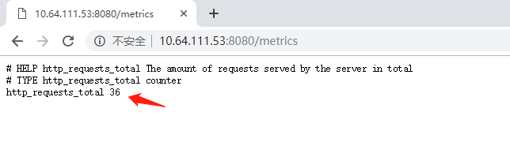

[toc]

# prometheus-adapter 部署

## 1. 部署说明

- 所有资源都在monitoring空间里

- 部署前阅读并修改yaml文件
- 容器部署方式是Deployment

## 2. 准备相关yaml

```bash
git clone https://github.com/coreos/kube-prometheus
```

## 3. custom-metrics-api 部署

```bash
cd kube-prometheus/experimental/custom-metrics-api
sh ./deploy.sh
```

## 4、prometheus-adapter 准备

### 4.1、整理prometheus-adapter yaml

```
cd kube-prometheus/manifests/
mkdir prometheus-adapter
mv prometheus-adapter*.yaml prometheus-adapter
cd prometheus-adapter
  说明：custom-metrics-api 里面已经有configmap 不能覆盖
 rm -rf  prometheus-adapter-configMap.yaml
```

### 4.2、创建prometheus-adapter ca  证书

```
cd kube-prometheus/manifests/prometheus-adapter
cat << EOF | tee /apps/work/k8s/cfssl/k8s/apiserver.json
{
  "CN": "apiserver",
  "hosts": [""], 
  "key": {
    "algo": "rsa",
    "size": 2048
  },
  "names": [
    {
      "C": "CN",
      "ST": "GuangDong",
      "L": "GuangZhou",
      "O": "dukang",
      "OU": "dukang"
    }
  ]
}
EOF

### 生成证书
cfssl gencert -ca=/apps/work/k8s/cfssl/pki/k8s/k8s-ca.pem \
  -ca-key=/apps/work/k8s/cfssl/pki/k8s/k8s-ca-key.pem \
  -config=/apps/work/k8s/cfssl/ca-config.json \
  -profile=kubernetes /apps/work/k8s/cfssl/k8s/apiserver.json | \
  cfssljson -bare ./apiserver
###重命名证书名字
mv apiserver-key.pem apiserver.key
mv apiserver.pem apiserver.crt
### 创建secret
kubectl create secret generic volume-serving-cert --from-file=apiserver.crt --from-file=apiserver.key  -n monitoring
kubectl get secret -n monitoring | grep volume-serving-cert
kubectl get secret volume-serving-cert -n monitoring volume-serving-cert -o yaml
```

## 4.3 修改`prometheus-adapter-deployment.yaml`

找到以下内容：

```yaml
- emptyDir: {}  
  name: volume-serving-cert
```

替换成以下内容：

```yaml
- name: volume-serving-cert
  secret:
  	secretName: volume-serving-cert
```

这样才有权限访问api，否则使用`kubectl get --raw "/api/custom.metrics.k8s.io" |jq .`会提示错误

```bash
# kubectl get --raw "/api/custom.metrics.k8s.io" |jq .           
Error from server (NotFound): the server could not find the requested resource
```

### 4.4、执行prometheus-adapter yaml

```
kubectl apply -f .
```

## 5、验证prometheus-adapter 部署是否正常

查看`api-versions`里有无新增这个资源

```bash
# kubectl api-versions| grep custom
custom.metrics.k8s.io/v1beta1
```

再看pod起来没

```bash
# kubectl get pods -n monitoring -o wide | grep prometheus-adapter
```

再看service起来没

```bash
# kubectl get service -n monitoring  | grep prometheus-adapter           
prometheus-adapter        ClusterIP   10.64.104.22    <none>        443/TCP                      40m
```

使用浏览器打开`https://10.64.97.41/`可以看到接口，我这里第一次可以打开，换了证书后反而打不开了，那就使用kubectl查看

```bash
# kubectl get --raw "/apis/custom.metrics.k8s.io" | jq .
{
  "kind": "APIGroup",
  "apiVersion": "v1",
  "name": "custom.metrics.k8s.io",
  "versions": [
    {
      "groupVersion": "custom.metrics.k8s.io/v1beta1",
      "version": "v1beta1"
    }
  ],
  "preferredVersion": {
    "groupVersion": "custom.metrics.k8s.io/v1beta1",
    "version": "v1beta1"
  }
}

# kubectl get --raw "/apis/custom.metrics.k8s.io/v1beta1" | jq . | more
{
  "kind": "APIResourceList",
  "apiVersion": "v1",
  "groupVersion": "custom.metrics.k8s.io/v1beta1",
  "resources": [
    {
      "name": "persistentvolumes/kube_persistentvolume_info",
      "singularName": "",
      "namespaced": false,
      "kind": "MetricValueList",
      "verbs": [
        "get"
      ]
    },
    {
      "name": "pods/node_filesystem_readonly",
      "singularName": "",
      "namespaced": true,
      "kind": "MetricValueList",
      "verbs": [
        "get"
      ]
    },
    {
      "name": "jobs.batch/grafana_api_user_signup_completed",
      "singularName": "",
      "namespaced": true,
      "kind": "MetricValueList",
      "verbs": [
        "get"
      ]
    },
    {
      "name": "services/prometheus_sd_dns_lookups",
      "singularName": "",
      "namespaced": true,
      "kind": "MetricValueList",
      "verbs": [
        "get"
      ]
    },
    {
      "name": "services/etcd_request_cache_add_latencies_summary_sum",
      "singularName": "",
      "namespaced": true,
      "kind": "MetricValueList",
      "verbs": [
        "get"
      ]
```

如果有这些数据证明prometheus-adapter  部署正常

## 6、使用官方测试hpa 项目测试自定义接口扩容

进入`custom-metrics-api`目录，创建测试项目相关资源

```bash
cd kube-prometheus/experimental/custom-metrics-api/
kubectl apply -f  sample-app.yaml -n kube-system
```

查看Pod和服务状态

```bash
# kubectl get pod | grep sample-app
sample-app-74684b97f-pmz92        1/1     Running   0          54s
# kubectl get svc |grep sample-app
sample-app       ClusterIP   10.64.111.53    <none>        8080/TCP                 79s
```

浏览器访问`http://10.64.111.53:8080/metrics`



得到监控值http_requests_total ,以后所有的监控值后面_total 在这个接口都是去除的

```bash
kubectl get --raw "/apis/custom.metrics.k8s.io/v1beta1/namespaces/kube-system/pods/*/http_requests" | jq .
```

**注意：**上面的名称空间改成自己的，输出内容如下：

```json
{
  "kind": "MetricValueList",
  "apiVersion": "custom.metrics.k8s.io/v1beta1",
  "metadata": {
    "selfLink": "/apis/custom.metrics.k8s.io/v1beta1/namespaces/kube-system/pods/%2A/http_requests"
  },
  "items": [
    {
      "describedObject": {
        "kind": "Pod",
        "namespace": "kube-system",
        "name": "sample-app-74684b97f-pmz92",
        "apiVersion": "/v1"
      },
      "metricName": "http_requests",
      "timestamp": "2019-11-26T10:18:35Z",
      "value": "400m"
    }
  ]
}
```

测试自动伸缩

安装hey

```bash
go get -u github.com/rakyll/hey
```

压力测试

```bash
hey -n 10000 -q 5 -c 5 http://10.64.111.53:8080
```

等等几分钟，观察pod有无增加

```bash
kubectl get hpa -w |grep sample-app
# -w是一直watch这个hpa的变化
NAME         REFERENCE               TARGETS      MINPODS   MAXPODS   REPLICAS   AGE
sample-app   Deployment/sample-app   1854m/500m   1         10        1          3h18m
sample-app   Deployment/sample-app   6400m/500m   1         10        4          3h18m
sample-app   Deployment/sample-app   10945m/500m   1         10        8          3h18m
sample-app   Deployment/sample-app   15490m/500m   1         10        10         3h18m
sample-app   Deployment/sample-app   6725m/500m    1         10        10         3h19m
sample-app   Deployment/sample-app   8285m/500m    1         10        10         3h19m
sample-app   Deployment/sample-app   6484m/500m    1         10        10         3h19m
sample-app   Deployment/sample-app   5247m/500m    1         10        10         3h19m
sample-app   Deployment/sample-app   5300m/500m    1         10        10         3h19m
sample-app   Deployment/sample-app   5348m/500m    1         10        10         3h19m
sample-app   Deployment/sample-app   5378m/500m    1         10        10         3h20m
sample-app   Deployment/sample-app   5392m/500m    1         10        10         3h20m
sample-app   Deployment/sample-app   5399m/500m    1         10        10         3h20m
sample-app   Deployment/sample-app   5400m/500m    1         10        10         3h20m
```

看看是否增加节点，如果增加，证明成功。从上面可以看出`REPLICAS`随着`TARGETS`左边的值增加从`1-->4-->8-->10`增加，然后当值降到500m以下后，`REPLICAS`的数量也逐渐减少。

```bash
# kubectl get hpa
NAME         REFERENCE               TARGETS     MINPODS   MAXPODS   REPLICAS   AGE
sample-app   Deployment/sample-app   399m/500m   1         10        7          3h41m
```

但是，从上面可以看到，过去了21分钟，副本数虽然减少了，但也只是减少了3个，并不是马上立即减少。

## 7、创建coredns hpa

如果以前创建了coredns的hpa，需要删除旧 hpa

```bash
# kubectl get hpa -n kube-system | grep coredns
# kubectl delete hpa coredns -n kube-system
```

查看coredns的自定义metrics

```bash
kubectl get --raw "/apis/custom.metrics.k8s.io/v1beta1/namespaces/kube-system/pods/*/coredns_dns_request_count" | jq .
```

输出如下

```json
{
  "kind": "MetricValueList",
  "apiVersion": "custom.metrics.k8s.io/v1beta1",
  "metadata": {
    "selfLink": "/apis/custom.metrics.k8s.io/v1beta1/namespaces/kube-system/pods/%2A/coredns_dns_request_count"
  },
  "items": [
    {
      "describedObject": {
        "kind": "Pod",
        "namespace": "kube-system",
        "name": "coredns-6d77f857f7-5j5wv",
        "apiVersion": "/v1"
      },
      "metricName": "coredns_dns_request_count",
      "timestamp": "2019-11-26T14:03:48Z",
      "value": "1222m"
    },
    {
      "describedObject": {
        "kind": "Pod",
        "namespace": "kube-system",
        "name": "coredns-6d77f857f7-7wtt4",
        "apiVersion": "/v1"
      },
      "metricName": "coredns_dns_request_count",
      "timestamp": "2019-11-26T14:03:48Z",
      "value": "1244m"
    },
    {
      "describedObject": {
        "kind": "Pod",
        "namespace": "kube-system",
        "name": "coredns-6d77f857f7-wbkm5",
        "apiVersion": "/v1"
      },
      "metricName": "coredns_dns_request_count",
      "timestamp": "2019-11-26T14:03:48Z",
      "value": "1200m"
    }
  ]
}
```

创建 coredns水平自动伸缩yaml文件

`vim  hpa-coredns.yaml`

```yaml
apiVersion: autoscaling/v2beta1
kind: HorizontalPodAutoscaler
metadata:
  name: coredns
  namespace: kube-system
spec:
  scaleTargetRef:
    apiVersion: apps/v1
    kind: Deployment
    name: coredns
  minReplicas: 3
  maxReplicas: 10
  metrics:
  - type: Pods
    pods:
      metricName: coredns_dns_request_count
      targetAverageValue: 10000
```

执行yaml

```bash
kubectl apply -f hpa-coredns.yaml
```

等等几分钟，查看刚创建的`hpa`

```bash
# kubectl get hpa -n kube-system | grep coredns
coredns      Deployment/coredns      1229m/10k   3         10        3          32s

# kubectl describe   hpa coredns -n kube-system   
Name:                                   coredns
Namespace:                              kube-system
Labels:                                 <none>
Annotations:                            kubectl.kubernetes.io/last-applied-configuration:
                                          {"apiVersion":"autoscaling/v2beta1","kind":"HorizontalPodAutoscaler","metadata":{"annotations":{},"name":"coredns","namespace":"kube-syste...
CreationTimestamp:                      Tue, 26 Nov 2019 22:05:09 +0800
Reference:                              Deployment/coredns
Metrics:                                ( current / target )
  "coredns_dns_request_count" on pods:  1251m / 10k
Min replicas:                           3
Max replicas:                           10
Deployment pods:                        3 current / 3 desired
Conditions:
  Type            Status  Reason               Message
  ----            ------  ------               -------
  AbleToScale     True    ScaleDownStabilized  recent recommendations were higher than current one, applying the highest recent recommendation
  ScalingActive   True    ValidMetricFound     the HPA was able to successfully calculate a replica count from pods metric coredns_dns_request_count
  ScalingLimited  False   DesiredWithinRange   the desired count is within the acceptable range
Events:           <none>
```

查看pod 是否增加

```bash
# kubectl get pod  -n kube-system                     
NAME                                        READY   STATUS              RESTARTS   AGE
coredns-6cbf85dbc6-sjnjt                    1/1     Running             1          4d3h
coredns-6cbf85dbc6-sqzhh                    0/1     ContainerCreating   0          3m21s
coredns-6cbf85dbc6-wcqmd                    1/1     Running             1          47d
```

