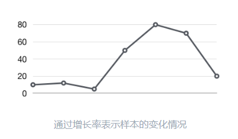
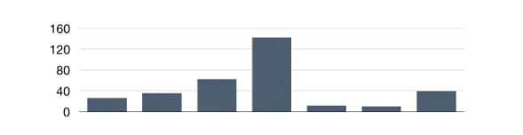
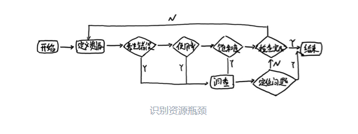

[toc]

## 理解时间序列

之前有了解prometheus是时间序列存储数据的。那什么是时间序列。通过访问exporter暴露的http接口，我们可以看到exporter提供的数据格式大致如下：

```
# HELP node_cpu Seconds the cpus spent in each mode.
# TYPE node_cpu counter
node_cpu{cpu="cpu0",mode="idle"} 362812.7890625
# HELP node_load1 1m load average.
# TYPE node_load1 gauge
node_load1 3.0703125
```

其中非#开头的每一行表示当前Node Exporter采集到的一个监控样本：node_cpu和node_load1表明了当前指标的名称、大括号中的标签则反映了当前样本的一些特征和维度、浮点数则是该监控样本的具体值。

而以`# HELP`开头的则是对监控样本的说明，`# TYPE`开头的是指明metric名称，metric名称后面的是metric的类型，`counter`表示这是计数器类型数据，`gauge`是仪表盘类型，用来表示那些无规率的波动数据。metric有四种类型，具体后面介绍。

Prometheus会将所有采集到的样本数据以时间序列（time-series）的方式保存在内存数据库中，并且定时保存到硬盘上。time-series是按照时间戳和值的序列顺序存放的，我们称之为向量(vector). 每条time-series通过指标名称(metrics name)和一组标签集(labelset)命名。如下所示，可以将time-series理解为一个以时间为Y轴的数字矩阵：

```
  ^
  │   . . . . . . . . . . . . . . . . .   . .   node_cpu{cpu="cpu0",mode="idle"}
  │     . . . . . . . . . . . . . . . . . . .   node_cpu{cpu="cpu0",mode="system"}
  │     . . . . . . . . . .   . . . . . . . .   node_load1{}
  │     . . . . . . . . . . . . . . . .   . .  
  v
    <------------------ 时间 ---------------->
```

在time-series中的每一个点称为一个样本（sample），样本由以下三部分组成：

- 指标(metric)：metric name和描述当前样本特征的labelsets;
- 时间戳(timestamp)：一个精确到毫秒的时间戳;
- 样本值(value)： 一个float64的浮点型数据表示当前样本的值。

```
<--------------- metric ---------------------><-timestamp -><-value->
http_request_total{status="200", method="GET"}@1434417560938 => 94355
http_request_total{status="200", method="GET"}@1434417561287 => 94334

http_request_total{status="404", method="GET"}@1434417560938 => 38473
http_request_total{status="404", method="GET"}@1434417561287 => 38544

http_request_total{status="200", method="POST"}@1434417560938 => 4748
http_request_total{status="200", method="POST"}@1434417561287 => 4785
```

## Metric类型

### Counter：只增不减的计数器

Counter类型的指标其工作方式和计数器一样，只增不减（除非系统发生重置）。常见的监控指标，如http_requests_total，node_cpu都是Counter类型的监控指标。 一般在定义Counter类型指标的名称时推荐使用_total作为后缀。

Counter是一个简单但有强大的工具，例如我们可以在应用程序中记录某些事件发生的次数，通过以时序的形式存储这些数据，我们可以轻松的了解该事件产生速率的变化。 PromQL内置的聚合操作和函数可以让用户对这些数据进行进一步的分析：

例如，通过rate()函数获取HTTP请求量的增长率：

```
rate(http_requests_total[5m])
```

查询当前系统中，访问量前10的HTTP地址：

```
topk(10, http_requests_total)
```

还有个常用函数，increase()，用来计算增长量，rate是计算增长率

```
# 单核心空闲CPU 1分钟内的增量，
increase(node_cpu{mode="idle"}[1m])
```

### Gauge：可增可减的仪表盘

与Counter不同，Gauge类型的指标侧重于反应系统的当前状态。因此这类指标的样本数据可增可减。常见指标如：node_memory_MemFree（主机当前空闲的内容大小）、node_memory_MemAvailable（可用内存大小）都是Gauge类型的监控指标。

通过Gauge指标，用户可以直接查看系统的当前状态：

```
node_memory_MemFree
```

对于Gauge类型的监控指标，通过PromQL内置函数delta()可以获取样本在一段时间返回内的变化情况。例如，计算CPU温度在两个小时内的差异：

```
delta(cpu_temp_celsius{host="zeus"}[2h])
```

还可以使用deriv()计算样本的线性回归模型，甚至是直接使用predict_linear()对数据的变化趋势进行预测。例如，预测系统磁盘空间在4个小时之后的剩余情况：

```
predict_linear(node_filesystem_free{job="node"}[1h], 4 * 3600)
```

### 使用Histogram和Summary分析数据分布情况

除了Counter和Gauge类型的监控指标以外，Prometheus还定义了Histogram和Summary的指标类型。Histogram和Summary主用用于统计和分析样本的分布情况。

在大多数情况下人们都倾向于使用某些量化指标的平均值，例如CPU的平均使用率、页面的平均响应时间。这种方式的问题很明显，以系统API调用的平均响应时间为例：如果大多数API请求都维持在100ms的响应时间范围内，而个别请求的响应时间需要5s，那么就会导致某些WEB页面的响应时间落到中位数的情况，而这种现象被称为长尾问题。

为了区分是平均的慢还是长尾的慢，最简单的方式就是按照请求延迟的范围进行分组。例如，统计延迟在0~10ms之间的请求数有多少而10~20ms之间的请求数又有多少。通过这种方式可以快速分析系统慢的原因。Histogram和Summary都是为了能够解决这样问题的存在，通过Histogram和Summary类型的监控指标，我们可以快速了解监控样本的分布情况。

例如，指标prometheus_tsdb_wal_fsync_duration_seconds的指标类型为Summary。 它记录了Prometheus Server中wal_fsync处理的处理时间，通过访问Prometheus Server的/metrics地址，可以获取到以下监控样本数据：


```
# HELP prometheus_tsdb_wal_fsync_duration_seconds Duration of WAL fsync.
# TYPE prometheus_tsdb_wal_fsync_duration_seconds summary
prometheus_tsdb_wal_fsync_duration_seconds{quantile="0.5"} 0.012352463
prometheus_tsdb_wal_fsync_duration_seconds{quantile="0.9"} 0.014458005
prometheus_tsdb_wal_fsync_duration_seconds{quantile="0.99"} 0.017316173
prometheus_tsdb_wal_fsync_duration_seconds_sum 2.888716127000002
prometheus_tsdb_wal_fsync_duration_seconds_count 216
```

从上面的样本中可以得知当前Prometheus Server进行wal_fsync操作的总次数为216次，耗时2.888716127000002s。其中中位数（quantile=0.5）的耗时为0.012352463，9分位数（quantile=0.9）的耗时为0.014458005s。

**注意：上面提出一个中位数，9分位数，对应后面的(quantile=number)，那我们得先了解下这些数是什么意思，才能更好的理解上面那些指标数据，我们搜索`quantile`，得到一个概念`分位数统计`，继续搜索`分位数统计`，有如下一段比喻：**

>假设有一千名学生参加了某次考试， 
>学生A得了75分，排名603，603/1000＝60.3% 
>学生B得了94分，排名28，28/1000=2.8% 
>此时，A大约在60.3%的位置上，而B大约在2.8%的位置上。即在60.3%的位置上约75分, 2.8%的位置上约94分。
>
>对应四分位数的就很好解释了，分别在25%, 50%, 75%位置上的数。假设考生甲乙丙丁考试成绩分别为80,71,61，对应的名次分别为250,500,750名，那么对应的四分位数分别就为80,71,61。

看到这，感觉有那么点意思了，但好像又不是四分位。再看如下一段说明：

>分位数（quantile）：把一组按照升序排列的数据分割成n个等份区间并产生n-1个等分点后**每个等分点所对应的数据**。按照升序排列称作第一至第n-1的n分位数。（注：如果等分点在其左右两个数据的中间，那么该等分点所对应的数就是**其左右两数的平均数**）
>
>确定等分位点位置的其中一种常用公式：
>（n+1）*p/q 
>其中n表示一共有多少数据，p表示第几分位，q表示是几分位数。
>
>例如四分位数（quartile；4-quantile）
>1，1，3，6，7，12，14，17，25，28，29
>上述数据集中共有11个数据。将这组已排列好的数据等分成4等份后产生3个等分点。
>其中第一四分位数
>Q1=（11+1）*（1/4）=3，对应的数据为3
>第二四分位数（即中位数）
>Q2=（11+1）*（2/4）=6，对应的数据为12
>第三四分位数
>Q3=（11+1）*（3/4）=9，对应的数据为25
>
>以此类推百分位数（percentile）就是把数据等分成100等份后所获得的数。根据分数性质，Q1就是25%百分位数（左右数据数量1:3），Q2中位数就是50%（1:1），Q3就是75%（3:1）

看到这，是不是更看不懂了。好吧，我也看不懂。那我们就按我们似懂非懂的去理解上面的数据吧。

>prometheus_tsdb_wal_fsync_duration_seconds_count 216
>
>表示有216个数据
>
>prometheus_tsdb_wal_fsync_duration_seconds_sum 2.888716127000002
>
>表示这216个数据用的总时间是这么多
>
>如果我们用常规法是统计，基本就是平均法，得出每个数据用时‭0.0133736857731482‬
>
>继续看上面的数据，重头戏来了
>
>prometheus_tsdb_wal_fsync_duration_seconds{quantile="0.5"} 0.012352463
>
>quantile后面的不是百分比，也不是整数，看这浮点数，我们就当是百分比了，脑海里构造一幅xy图，x轴最大值为1，代表总的百分比，y代表耗时，耗时大的，x坐标越大，就是往后面放。在0.5这个位置的数据是0.012352463，意味着，50%的请求用时是0.012352463以下
>
>prometheus_tsdb_wal_fsync_duration_seconds{quantile="0.9"} 0.014458005
>
>那这段数据就可以解释为，0.9这个位置的数是0.014458005，表示0.5到0.9这40%的耗时是0.012352463到0.014458005。
>
>prometheus_tsdb_wal_fsync_duration_seconds{quantile="0.99"} 0.017316173
>
>这段数据就可以解释为，0.99这个位置的数是0.017316173，也就是说有0.01即1%的请求耗时是大于0.017316173。
>
>从这段说明来看，这种统计方法似乎与平均法并无明显区别，那是因为后面那1%的数据与前面的数据差不够大，如果够大，那就明显了。

在Prometheus Server自身返回的样本数据中，我们还能找到类型为Histogram的监控指标prometheus_tsdb_compaction_chunk_range_bucket。

```
# HELP prometheus_tsdb_compaction_chunk_range Final time range of chunks on their first compaction
# TYPE prometheus_tsdb_compaction_chunk_range histogram
prometheus_tsdb_compaction_chunk_range_bucket{le="100"} 0
prometheus_tsdb_compaction_chunk_range_bucket{le="400"} 0
prometheus_tsdb_compaction_chunk_range_bucket{le="1600"} 0
prometheus_tsdb_compaction_chunk_range_bucket{le="6400"} 0
prometheus_tsdb_compaction_chunk_range_bucket{le="25600"} 0
prometheus_tsdb_compaction_chunk_range_bucket{le="102400"} 0
prometheus_tsdb_compaction_chunk_range_bucket{le="409600"} 0
prometheus_tsdb_compaction_chunk_range_bucket{le="1.6384e+06"} 260
prometheus_tsdb_compaction_chunk_range_bucket{le="6.5536e+06"} 780
prometheus_tsdb_compaction_chunk_range_bucket{le="2.62144e+07"} 780
prometheus_tsdb_compaction_chunk_range_bucket{le="+Inf"} 780
prometheus_tsdb_compaction_chunk_range_sum 1.1540798e+09
prometheus_tsdb_compaction_chunk_range_count 780
```

与Summary类型的指标相似之处在于Histogram类型的样本同样会反应当前指标的记录的总数(以_count作为后缀)以及其值的总量（以_sum作为后缀）。不同在于Histogram指标直接反应了在不同区间内样本的个数，区间通过标签len进行定义。

同时对于Histogram的指标，我们还可以通过histogram_quantile()函数计算出其值的分位数。不同在于Histogram通过histogram_quantile函数是在服务器端计算的分位数。 而Sumamry的分位数则是直接在客户端计算完成。因此对于分位数的计算而言，Summary在通过PromQL进行查询时有更好的性能表现，而Histogram则会消耗更多的资源。反之对于客户端而言Histogram消耗的资源更少。在选择这两种方式时用户应该按照自己的实际场景进行选择。

## 初识PromQL

### 查询时间序列

当Prometheus通过Exporter采集到相应的监控指标样本数据后，我们就可以通过PromQL对监控样本数据进行查询。

当我们直接使用监控指标名称查询时，可以查询该指标下的所有时间序列。如：

```
http_requests_total
```

等同于：

```
http_requests_total{}
```

该表达式会返回指标名称为http_requests_total的所有时间序列：

```
http_requests_total{code="200",handler="alerts",instance="localhost:9090",job="prometheus",method="get"}=(20889@1518096812.326)
http_requests_total{code="200",handler="graph",instance="localhost:9090",job="prometheus",method="get"}=(21287@1518096812.326)
```

PromQL还支持用户根据时间序列的标签匹配模式来对时间序列进行过滤，目前主要支持两种匹配模式：完全匹配和正则匹配。

PromQL支持使用`=`和`!=`两种完全匹配模式：

- 通过使用`label=value`可以选择那些标签满足表达式定义的时间序列；
- 反之使用`label!=value`则可以根据标签匹配排除时间序列；

例如，如果我们只需要查询所有http_requests_total时间序列中满足标签instance为localhost:9090的时间序列，则可以使用如下表达式：

```
http_requests_total{instance="localhost:9090"}
```

反之使用`instance!="localhost:9090"`则可以排除这些时间序列：

```
http_requests_total{instance!="localhost:9090"}
```

除了使用完全匹配的方式对时间序列进行过滤以外，PromQL还可以支持使用正则表达式作为匹配条件，多个表达式之间使用`|`进行分离：

- 使用`label=~regx`表示选择那些标签符合正则表达式定义的时间序列；
- 反之使用`label!~regx`进行排除；

例如，如果想查询多个环节下的时间序列序列可以使用如下表达式：

```
http_requests_total{environment=~"staging|testing|development",method!="GET"}
```

### 范围查询

直接通过类似于PromQL表达式http_requests_total查询时间序列时，返回值中只会包含该时间序列中的最新的一个样本值，这样的返回结果我们称之为**瞬时向量**。而相应的这样的表达式称之为__瞬时向量表达式。

而如果我们想过去一段时间范围内的样本数据时，我们则需要使用**区间向量表达式**。区间向量表达式和瞬时向量表达式之间的差异在于在区间向量表达式中我们需要定义时间选择的范围，时间范围通过时间范围选择器`[]`进行定义。例如，通过以下表达式可以选择最近5分钟内的所有样本数据：

```
http_request_total{}[5m]
```

该表达式将会返回查询到的时间序列中最近5分钟的所有样本数据：

```
http_requests_total{code="200",handler="alerts",instance="localhost:9090",job="prometheus",method="get"}=[
    1@1518096812.326
    1@1518096817.326
    1@1518096822.326
    1@1518096827.326
    1@1518096832.326
    1@1518096837.325
]
http_requests_total{code="200",handler="graph",instance="localhost:9090",job="prometheus",method="get"}=[
    4 @1518096812.326
    4@1518096817.326
    4@1518096822.326
    4@1518096827.326
    4@1518096832.326
    4@1518096837.325
]
```

通过区间向量表达式查询到的结果我们称为**区间向量**。

除了使用m表示分钟以外，PromQL的时间范围选择器支持其它时间单位：

- s - 秒
- m - 分钟
- h - 小时
- d - 天
- w - 周
- y - 年

### 时间位移操作

在瞬时向量表达式或者区间向量表达式中，都是以当前时间为基准：

```
http_request_total{} # 瞬时向量表达式，选择当前最新的数据
http_request_total{}[5m] # 区间向量表达式，选择以当前时间为基准，5分钟内的数据
```

而如果我们想查询，5分钟前的瞬时样本数据，或昨天一天的区间内的样本数据呢? 这个时候我们就可以使用位移操作，位移操作的关键字为**offset**。

可以使用offset时间位移操作：

```
http_request_total{} offset 5m
http_request_total{}[1d] offset 1d
```

### 使用聚合操作

一般来说，如果描述样本特征的标签(label)在并非唯一的情况下，通过PromQL查询数据，会返回多条满足这些特征维度的时间序列。而PromQL提供的聚合操作可以用来对这些时间序列进行处理，形成一条新的时间序列：

```
# 查询系统所有http请求的总量
sum(http_request_total)
# 按照mode计算主机CPU的平均使用时间
avg(node_cpu) by (mode)
# 按照主机查询各个主机的CPU使用率
sum(sum(irate(node_cpu{mode!='idle'}[5m]))  / sum(irate(node_cpu[5m]))) by (instance)
```

### 标量和字符串

除了使用瞬时向量表达式和区间向量表达式以外，PromQL还直接支持用户使用标量(Scalar)和字符串(String)。

### 标量（Scalar）：一个浮点型的数字值

标量只有一个数字，没有时序。

例如：

```
10
```

> 需要注意的是，当使用表达式count(http_requests_total)，返回的数据类型，依然是瞬时向量。用户可以通过内置函数scalar()将单个瞬时向量转换为标量。

### 字符串（String）：一个简单的字符串值

直接使用字符串，作为PromQL表达式，则会直接返回字符串。

```
"this is a string"
'these are unescaped: \n \\ \t'
`these are not unescaped: \n ' " \t`
```

### 合法的PromQL表达式

所有的PromQL表达式都必须至少包含一个指标名称(例如http_request_total)，或者一个不会匹配到空字符串的标签过滤器(例如{code="200"})。

因此以下两种方式，均为合法的表达式：

```
http_request_total # 合法
http_request_total{} # 合法
{method="get"} # 合法
```

而如下表达式，则不合法：

```
{job=~".*"} # 不合法
```

同时，除了使用`{label=value}`的形式以外，我们还可以使用内置的`__name__`标签来指定监控指标名称：

```
{__name__=~"http_request_total"} # 合法
{__name__=~"node_disk_bytes_read|node_disk_bytes_written"} # 合法
```

## PromQL操作符

使用PromQL除了能够方便的按照查询和过滤时间序列以外，PromQL还支持丰富的操作符，用户可以使用这些操作符对进一步的对事件序列进行二次加工。这些操作符包括：数学运算符，逻辑运算符，布尔运算符等等。

### 数学运算

例如，我们可以通过指标`node_memory_free_bytes_total`获取当前主机可用的内存空间大小，其样本单位为Bytes。这是如果客户端要求使用MB作为单位响应数据，那只需要将查询到的时间序列的样本值进行单位换算即可：

```
node_memory_free_bytes_total / (1024 * 1024)
```

node_memory_free_bytes_total表达式会查询出所有满足表达式条件的时间序列，在上一小节中我们称该表达式为瞬时向量表达式，而返回的结果成为瞬时向量。

**当瞬时向量与标量之间进行数学运算时，数学运算符会依次作用域瞬时向量中的每一个样本值，从而得到一组新的时间序列。**

而如果是瞬时向量与瞬时向量之间进行数学运算时，过程会相对复杂一点。 例如，如果我们想根据node_disk_bytes_written和node_disk_bytes_read获取主机磁盘IO的总量，可以使用如下表达式：

```
node_disk_bytes_written + node_disk_bytes_read
```

那这个表达式是如何工作的呢？依次找到与左边向量元素匹配（标签完全一致）的右边向量元素进行运算，如果没找到匹配元素，则直接丢弃。同时新的时间序列将不会包含指标名称。 该表达式返回结果的示例如下所示：

```
{device="sda",instance="localhost:9100",job="node_exporter"}=>1634967552@1518146427.807 + 864551424@1518146427.807
{device="sdb",instance="localhost:9100",job="node_exporter"}=>0@1518146427.807 + 1744384@1518146427.807
```

PromQL支持的所有数学运算符如下所示：

- `+` (加法)
- `-` (减法)
- `*` (乘法)
- `/` (除法)
- `%` (求余)
- `^` (幂运算)

### 使用布尔运算过滤时间序列

在PromQL通过标签匹配模式，用户可以根据时间序列的特征维度对其进行查询。而布尔运算则支持用户根据时间序列中样本的值，对时间序列进行过滤。

例如，通过数学运算符我们可以很方便的计算出，当前所有主机节点的内存使用率：

```
(node_memory_bytes_total - node_memory_free_bytes_total) / node_memory_bytes_total
```

而系统管理员在排查问题的时候可能只想知道当前内存使用率超过95%的主机呢？通过使用布尔运算符可以方便的获取到该结果：

```
(node_memory_bytes_total - node_memory_free_bytes_total) / node_memory_bytes_total > 0.95
```

**瞬时向量与标量进行布尔运算时，PromQL依次比较向量中的所有时间序列样本的值，如果比较结果为true则保留，反之丢弃。**

瞬时向量与瞬时向量直接进行布尔运算时，同样遵循默认的匹配模式：依次找到与左边向量元素匹配（标签完全一致）的右边向量元素进行相应的操作，如果没找到匹配元素，则直接丢弃。

目前，Prometheus支持以下布尔运算符如下：

- `==` (相等)
- `!=` (不相等)
- `>` (大于)
- `<` (小于)
- `>=` (大于等于)
- `<=` (小于等于)

### 使用bool修饰符改变布尔运算符的行为(有点意思)

布尔运算符的默认行为是对时序数据进行过滤。而在其它的情况下我们可能需要的是真正的布尔结果。例如，只需要知道当前模块的HTTP请求量是否>=1000，如果大于等于1000则返回1（true）否则返回0（false）。这时可以使用bool修饰符改变布尔运算的默认行为。 例如：

```
http_requests_total > bool 1000
```

使用bool修改符后，布尔运算不会对时间序列进行过滤，而是直接依次瞬时向量中的各个样本数据与标量的比较结果0或者1。从而形成一条新的时间序列。

```
http_requests_total{code="200",handler="query",instance="localhost:9090",job="prometheus",method="get"}  1
http_requests_total{code="200",handler="query_range",instance="localhost:9090",job="prometheus",method="get"}  0
```

同时需要注意的是，如果是在两个标量之间使用布尔运算，则必须使用bool修饰符

```
2 == bool 2 # 结果为1
```

### 使用集合运算符

使用瞬时向量表达式能够获取到一个包含多个时间序列的集合，我们称为瞬时向量。 通过集合运算，可以在两个瞬时向量与瞬时向量之间进行相应的集合操作。目前，Prometheus支持以下集合运算符：

- `and` (并且)
- `or` (或者)
- `unless` (排除)

***vector1 and vector2*** 会产生一个由vector1的元素组成的新的向量。该向量包含vector1中完全匹配vector2中的元素组成。即vector1和vector2都有的元素组成新集合。

***vector1 or vector2*** 会产生一个新的向量，该向量包含vector1中所有的样本数据，以及vector2中没有与vector1匹配到的样本数据。即由vector1所有元素+vector2中去掉vector1有的元素组成新集合

***vector1 unless vector2*** 会产生一个新的向量，新向量中的元素由vector1中没有与vector2匹配的元素组成。即由vector1中剔除在vector2中有的元素组成新集合。

### 操作符优先级

对于复杂类型的表达式，需要了解运算操作的运行优先级

例如，查询主机的CPU使用率，可以使用表达式：

```
100 * (1 - avg (irate(node_cpu{mode='idle'}[5m])) by(job) )
```

其中irate是PromQL中的内置函数，用于计算区间向量中时间序列每秒的即时增长率。关于内置函数的部分，会在下一节详细介绍。

在PromQL操作符中优先级由高到低依次为：

```
^
*, /, %
+, -
==, !=, <=, <, >=, >
and, unless
or
```

### 匹配模式详解

向量与向量之间进行运算操作时会基于默认的匹配规则：依次找到与左边向量元素匹配（标签完全一致）的右边向量元素进行运算，如果没找到匹配元素，则直接丢弃。

接下来将介绍在PromQL中有两种典型的匹配模式：一对一（one-to-one）,多对一（many-to-one）或一对多（one-to-many）。

#### 一对一匹配

一对一匹配模式会从操作符两边表达式获取的瞬时向量依次比较并找到唯一匹配(标签完全一致)的样本值。默认情况下，使用表达式：

```
vector1 <operator> vector2
```

在操作符两边表达式标签不一致的情况下，可以使用on(label list)或者ignoring(label list）来修改便签的匹配行为。使用ignoreing可以在匹配时忽略某些便签。而on则用于将匹配行为限定在某些便签之内。

```
<vector expr> <bin-op> ignoring(<label list>) <vector expr>
<vector expr> <bin-op> on(<label list>) <vector expr>
```

例如当存在样本：

```
method_code:http_errors:rate5m{method="get", code="500"}  24
method_code:http_errors:rate5m{method="get", code="404"}  30
method_code:http_errors:rate5m{method="put", code="501"}  3
method_code:http_errors:rate5m{method="post", code="500"} 6
method_code:http_errors:rate5m{method="post", code="404"} 21

method:http_requests:rate5m{method="get"}  600
method:http_requests:rate5m{method="del"}  34
method:http_requests:rate5m{method="post"} 120
```

使用PromQL表达式：

```
method_code:http_errors:rate5m{code="500"} / ignoring(code) method:http_requests:rate5m
```

该表达式会返回在过去5分钟内，HTTP请求状态码为500的在所有请求中的比例。如果没有使用ignoring(code)，操作符两边表达式返回的瞬时向量中将找不到任何一个标签完全相同的匹配项。

因此结果如下:

```
{method="get"}  0.04            //  24 / 600
{method="post"} 0.05            //   6 / 120
```

同时由于method为put和del的样本找不到匹配项，因此不会出现在结果当中。

**分析过程：**

`method_code:http_errors:rate5m{code="500"}`可以得到以下两条记录

```
method_code:http_errors:rate5m{method="get", code="500"}  24
method_code:http_errors:rate5m{method="post", code="500"} 6
```

`method:http_requests:rate5m`有三条记录，保留下的数据要与左边的标签完全一致。这三条记录压根没有code标签，怎么会一致，于是需要加入`ignoring(code)`，即忽略这个标签不匹配的事，匹配`method`标签，值一样的留下。于是最终右边标签留下了两条数据

```
method:http_requests:rate5m{method="get"}  600
method:http_requests:rate5m{method="post"} 120
```

将左边两边metric的值进行运算，

```
24 / 600 = 0.04
6 / 120 = 0.05
```

#### 多对一和一对多

多对一和一对多两种匹配模式指的是“一”侧的每一个向量元素可以与"多"侧的多个元素匹配的情况。在这种情况下，必须使用group修饰符：group_left或者group_right来确定哪一个向量具有更高的基数（充当“多”的角色）。

```
<vector expr> <bin-op> ignoring(<label list>) group_left(<label list>) <vector expr>
<vector expr> <bin-op> ignoring(<label list>) group_right(<label list>) <vector expr>
<vector expr> <bin-op> on(<label list>) group_left(<label list>) <vector expr>
<vector expr> <bin-op> on(<label list>) group_right(<label list>) <vector expr>
```

多对一和一对多两种模式一定是出现在操作符两侧表达式返回的向量标签不一致的情况。因此需要使用ignoring和on修饰符来排除或者限定匹配的标签列表。

例如,使用表达式：

```
method_code:http_errors:rate5m / ignoring(code) group_left method:http_requests:rate5m
```

该表达式中，左向量`method_code:http_errors:rate5m`包含两个标签method和code。而右向量`method:http_requests:rate5m`中只包含一个标签method，因此匹配时需要使用ignoring限定匹配的标签为code。 在限定匹配标签后，右向量中的元素可能匹配到多个左向量中的元素 因此该表达式的匹配模式为多对一，需要使用group修饰符group_left指定左向量具有更好的基数。

最终的运算结果如下：

```
{method="get", code="500"}  0.04            //  24 / 600
{method="get", code="404"}  0.05            //  30 / 600
{method="post", code="500"} 0.05            //   6 / 120
{method="post", code="404"} 0.175           //  21 / 120
```

> 提醒：group修饰符只能在比较和数学运算符中使用。在逻辑运算and,unless和or才注意操作中默认与右向量中的所有元素进行匹配。

## PromQL聚合操作

Prometheus还提供了下列内置的聚合操作符，这些操作符作用域瞬时向量。可以将瞬时表达式返回的样本数据进行聚合，形成一个新的时间序列。

- `sum` (求和)
- `min` (最小值)
- `max` (最大值)
- `avg` (平均值)
- `stddev` (标准差)
- `stdvar` (标准差异)
- `count` (计数)
- `count_values` (对value进行计数)
- `bottomk` (后n条时序)
- `topk` (前n条时序)
- `quantile` (分布统计)

使用聚合操作的语法如下：

```
<aggr-op>([parameter,] <vector expression>) [without|by (<label list>)]
```

其中只有`count_values`, `quantile`, `topk`, `bottomk`支持参数(parameter)。

without用于从计算结果中移除列举的标签，而保留其它标签。by则正好相反，结果向量中只保留列出的标签，其余标签则移除。通过without和by可以按照样本的问题对数据进行聚合。

例如：

```
sum(http_requests_total) without (instance)
```

等价于

```
sum(http_requests_total) by (code,handler,job,method)
```

如果只需要计算整个应用的HTTP请求总量，可以直接使用表达式：

```
sum(http_requests_total)
```

count_values用于时间序列中每一个样本值出现的次数。count_values会为每一个唯一的样本值输出一个时间序列，并且每一个时间序列包含一个额外的标签。

例如：

```
count_values("count", http_requests_total)
```

topk和bottomk则用于对样本值进行排序，返回当前样本值前n位，或者后n位的时间序列。

获取HTTP请求数前5位的时序样本数据，可以使用表达式：

```
topk(5, http_requests_total)
```

quantile用于计算当前样本数据值的分布情况quantile(φ, express)其中0 ≤ φ ≤ 1。

例如，当φ为0.5时，即表示找到当前样本数据中的中位数：

```
quantile(0.5, http_requests_total)
```

## PromQL内置函数

在上一小节中，我们已经看到了类似于irate()这样的函数，可以帮助我们计算监控指标的增长率。除了irate以外，Prometheus还提供了其它大量的内置函数，可以对时序数据进行丰富的处理。本小节将带来读者了解一些常用的内置函数以及相关的使用场景和用法。

### 计算Counter指标增长率

我们知道Counter类型的监控指标其特点是只增不减，在没有发生重置（如服务器重启，应用重启）的情况下其样本值应该是不断增大的。为了能够更直观的表示样本数据的变化剧烈情况，需要计算样本的增长速率。

如下图所示，样本增长率反映出了样本变化的剧烈程度：



increase(v range-vector)函数是PromQL中提供的众多内置函数之一。其中参数v是一个区间向量，increase函数获取区间向量中的第一个后最后一个样本并返回其增长量。因此，可以通过以下表达式Counter类型指标的增长率：

```
increase(node_cpu[2m]) / 120
increase(node_cpu_seconds_total[2m]) / 120
```

**node_cpu这个metric有node_exporter提供，不同的node_exporter版本可能名字会有区别，0.18.1版本是叫`node_cpu_seconds_total`，名字变长了，语意更好了**

这里通过node_cpu[2m]获取时间序列最近两分钟的所有样本，increase计算出最近两分钟的增长量，最后除以时间120秒得到node_cpu样本在最近两分钟的平均增长率。并且这个值也近似于主机节点最近两分钟内的平均CPU使用率。

除了使用increase函数以外，PromQL中还直接内置了rate(v range-vector)函数，rate函数可以直接计算区间向量v在时间窗口内平均增长速率。因此，通过以下表达式可以得到与increase函数相同的结果：

```
rate(node_cpu[2m])
rate(node_cpu_seconds_total[2m])
```

需要注意的是使用rate或者increase函数去计算样本的平均增长速率，容易陷入“长尾问题”当中，其无法反应在时间窗口内样本数据的突发变化。 例如，对于主机而言在2分钟的时间窗口内，可能在某一个由于访问量或者其它问题导致CPU占用100%的情况，但是通过计算在时间窗口内的平均增长率却无法反应出该问题。

为了解决该问题，PromQL提供了另外一个灵敏度更高的函数irate(v range-vector)。irate同样用于计算区间向量的计算率，但是其反应出的是瞬时增长率。irate函数是通过区间向量中最后两个样本数据来计算区间向量的增长速率。这种方式可以避免在时间窗口范围内的“长尾问题”，并且体现出更好的灵敏度，通过irate函数绘制的图标能够更好的反应样本数据的瞬时变化状态。

```
irate(node_cpu[2m])
irate(node_cpu_seconds_total[2m])
```

irate函数相比于rate函数提供了更高的灵敏度，不过当需要分析长期趋势或者在告警规则中，irate的这种灵敏度反而容易造成干扰。因此在长期趋势分析或者告警中更推荐使用rate函数。

### 预测Gauge指标变化趋势

在一般情况下，系统管理员为了确保业务的持续可用运行，会针对服务器的资源设置相应的告警阈值。例如，当磁盘空间只剩512MB时向相关人员发送告警通知。 这种基于阈值的告警模式对于当资源用量是平滑增长的情况下是能够有效的工作的。 但是如果资源不是平滑变化的呢？ 比如有些某些业务增长，存储空间的增长速率提升了高几倍。这时，如果基于原有阈值去触发告警，当系统管理员接收到告警以后可能还没来得及去处理问题，系统就已经不可用了。 因此阈值通常来说不是固定的，需要定期进行调整才能保证该告警阈值能够发挥去作用。 那么还有没有更好的方法吗？

PromQL中内置的predict_linear(v range-vector, t scalar) 函数可以帮助系统管理员更好的处理此类情况，predict_linear函数可以预测时间序列v在t秒后的值。它基于简单线性回归的方式，对时间窗口内的样本数据进行统计，从而可以对时间序列的变化趋势做出预测。例如，基于2小时的样本数据，来预测主机可用磁盘空间的是否在4个小时候被占满，可以使用如下表达式：

```
predict_linear(node_filesystem_free{job="node"}[2h], 4 * 3600) < 0
```

### 统计Histogram指标的分位数

在本章的第2小节中，我们介绍了Prometheus的四种监控指标类型，其中Histogram和Summary都可以用于统计和分析数据的分布情况。区别在于Summary是直接在客户端计算了数据分布的分位数情况。而Histogram的分位数计算需要通过histogram_quantile(φ float, b instant-vector)函数进行计算。其中φ（0<φ<1）表示需要计算的分位数，如果需要计算中位数φ取值为0.5，以此类推即可。

以指标http_request_duration_seconds_bucket为例：

```
# HELP http_request_duration_seconds request duration histogram
# TYPE http_request_duration_seconds histogram
http_request_duration_seconds_bucket{le="0.5"} 0
http_request_duration_seconds_bucket{le="1"} 1
http_request_duration_seconds_bucket{le="2"} 2
http_request_duration_seconds_bucket{le="3"} 3
http_request_duration_seconds_bucket{le="5"} 3
http_request_duration_seconds_bucket{le="+Inf"} 3
http_request_duration_seconds_sum 6
http_request_duration_seconds_count 3
```

当计算9分位数时，使用如下表达式：

```
histogram_quantile(0.5, http_request_duration_seconds_bucket)
```

通过对Histogram类型的监控指标，用户可以轻松获取样本数据的分布情况。同时分位数的计算，也可以非常方便的用于评判当前监控指标的服务水平。



需要注意的是通过histogram_quantile计算的分位数，并非为精确值，而是通过http_request_duration_seconds_bucket和http_request_duration_seconds_sum近似计算的结果。

### 动态标签替换

一般来说来说，使用PromQL查询到时间序列后，可视化工具会根据时间序列的标签来渲染图表。例如通过up指标可以获取到当前所有运行的Exporter实例以及其状态：

```
up{instance="localhost:8080",job="cadvisor"}    1
up{instance="localhost:9090",job="prometheus"}    1
up{instance="localhost:9100",job="node"}    1
```

这是可视化工具渲染图标时可能根据，instance和job的值进行渲染，为了能够让客户端的图标更具有可读性，可以通过label_replace标签为时间序列添加额外的标签。label_replace的具体参数如下：

```
label_replace(v instant-vector, dst_label string, replacement string, src_label string, regex string)
```

该函数会依次对v中的每一条时间序列进行处理，通过regex匹配src_label的值，并将匹配部分replacement写入到dst_label标签中。如下所示：

```
label_replace(up, "host", "$1", "instance",  "(.*):.*")
```

函数处理后，时间序列将包含一个host标签，host标签的值为Exporter实例的IP地址：

```
up{host="localhost",instance="localhost:8080",job="cadvisor"}    1
up{host="localhost",instance="localhost:9090",job="prometheus"}    1
up{host="localhost",instance="localhost:9100",job="node"} 1
```

除了label_replace以外，Prometheus还提供了label_join函数，该函数可以将时间序列中v多个标签src_label的值，通过separator作为连接符写入到一个新的标签dst_label中:

```
label_join(v instant-vector, dst_label string, separator string, src_label_1 string, src_label_2 string, ...)
```

实例表达式

```
label_join(up, "test", "----", "instance",  "job")
```

函数处理后，时间序列将包含一个test标签，test标签的值是instance标签的值+连接符`----`+job标签的值，如下所示

```
up{instance="localhost:9090",job="prometheus",test="localhost:9090----prometheus"}
up{instance="localhost:9100",job="node_exporter",test="localhost:9100----node_exporter"}
```

label_replace和label_join函数提供了对时间序列标签的自定义能力，从而能够更好的于客户端或者可视化工具配合。

### 其他内置函数

这个可以去看官方文档

## 在HTTP API中使用PromQL

Prometheus当前稳定的HTTP API可以通过/api/v1访问。

### API响应格式

Prometheus API使用了JSON格式的响应内容。 当API调用成功后将会返回2xx的HTTP状态码。

反之，当API调用失败时可能返回以下几种不同的HTTP状态码：

- 404 Bad Request：当参数错误或者缺失时。
- 422 Unprocessable Entity 当表达式无法执行时。
- 503 Service Unavailiable 当请求超时或者被中断时。

所有的API请求均使用以下的JSON格式响应：

```json
{
  "status": "success" | "error",
  "data": <data>,

  // Only set if status is "error". The data field may still hold
  // additional data.
  "errorType": "<string>",
  "error": "<string>"
}
```

### 在HTTP API中使用PromQL

通过HTTP API我们可以分别通过/api/v1/query和/api/v1/query_range查询PromQL表达式当前或者一定时间范围内的计算结果。

#### 瞬时数据查询

通过使用QUERY API我们可以查询PromQL在特定时间点下的计算结果。

```
GET /api/v1/query
```

URL请求参数：

- query=：PromQL表达式。
- time=：用于指定用于计算PromQL的时间戳。可选参数，默认情况下使用当前系统时间。
- timeout=：超时设置。可选参数，默认情况下使用-query,timeout的全局设置。

例如使用以下表达式查询表达式up在时间点2020年1月15日15时21分42秒 CST的计算结果：

```bash
$ curl 'http://localhost:9090/api/v1/query?query=up&time=1579072902'
{
  "status": "success",
  "data": {
    "resultType": "vector",
    "result": [
      {
        "metric": {
          "__name__": "up",
          "instance": "localhost:9090",
          "job": "prometheus"
        },
        "value": [
          1579072902,
          "1"
        ]
      },
      {
        "metric": {
          "__name__": "up",
          "instance": "localhost:9100",
          "job": "node_exporter"
        },
        "value": [
          1579072902,
          "1"
        ]
      }
    ]
  }
}
```

#### 响应数据类型

当API调用成功后，Prometheus会返回JSON格式的响应内容，格式如上小节所示。并且在data节点中返回查询结果。data节点格式如下：

```
{
  "resultType": "matrix" | "vector" | "scalar" | "string",
  "result": <value>
}
```

PromQL表达式可能返回多种数据类型，在响应内容中使用resultType表示当前返回的数据类型，包括：

- 瞬时向量：vector

当返回数据类型resultType为vector时，result响应格式如下：

```
[
  {
    "metric": { "<label_name>": "<label_value>", ... },
    "value": [ <unix_time>, "<sample_value>" ]
  },
  ...
]
```

其中metrics表示当前时间序列的特征维度，value只包含一个唯一的样本。

- 区间向量：matrix

当返回数据类型resultType为matrix时，result响应格式如下：

```
[
  {
    "metric": { "<label_name>": "<label_value>", ... },
    "values": [ [ <unix_time>, "<sample_value>" ], ... ]
  },
  ...
]
```

其中metrics表示当前时间序列的特征维度，values包含当前事件序列的一组样本。

- 标量：scalar

当返回数据类型resultType为scalar时，result响应格式如下：

```
[ <unix_time>, "<scalar_value>" ]
```

由于标量不存在时间序列一说，因此result表示为当前系统时间一个标量的值。

- 字符串：string

当返回数据类型resultType为string时，result响应格式如下：

```
[ <unix_time>, "<string_value>" ]
```

字符串类型的响应内容格式和标量相同。

#### 区间数据查询

使用QUERY_RANGE API我们则可以直接查询PromQL表达式在一段时间返回内的计算结果。

```
GET /api/v1/query_range
```

URL请求参数：

- query=: PromQL表达式。
- start=: 起始时间。
- end=: 结束时间。
- step=: 查询步长。
- timeout=: 超时设置。可选参数，默认情况下使用-query,timeout的全局设置。

当使用QUERY_RANGE API查询PromQL表达式时，返回结果一定是一个区间向量：

```
{
  "resultType": "matrix",
  "result": <value>
}
```

> 需要注意的是，在QUERY_RANGE API中PromQL只能使用瞬时向量选择器类型的表达式。

例如使用以下表达式查询表达式up在30秒范围内以15秒为间隔计算PromQL表达式的结果。

```
$ curl 'http://localhost:9090/api/v1/query_range?query=up&start=21579072902&end=1579072932&step=15s'
{
  "status": "success",
  "data": {
    "resultType": "matrix",
    "result": [
      {
        "metric": {
          "__name__": "up",
          "instance": "localhost:9090",
          "job": "prometheus"
        },
        "values": [
          [
            1579072902,
            "1"
          ],
          [
            1579072917,
            "1"
          ],
          [
            1579072932,
            "1"
          ]
        ]
      },
      {
        "metric": {
          "__name__": "up",
          "instance": "localhost:9100",
          "job": "node_exporter"
        },
        "values": [
          [
            1579072902,
            "1"
          ],
          [
            1579072917,
            "1"
          ],
          [
            1579072932,
            "1"
          ]
        ]
      }
    ]
  }
}
```

## 最佳实践：4个黄金指标和USE方法

前面部分介绍了Prometheus的数据存储模型以及4种指标类型，同时Prometheus提供的强大的PromQL可以实现对数据的个性化处理。Promthues基于指标提供了一个通用的监控解决方案。这里先思考一个基本的问题，在实现监控时，我们到底应该监控哪些对象以及哪些指标？

### 监控所有

在之前**Prometheus简介**部分介绍监控的基本目标，首先是及时发现问题其次是要能够快速对问题进行定位。对于传统监控解决方案而言，用户看到的依然是一个黑盒，用户无法真正了解系统的真正的运行状态。因此Prometheus鼓励用户监控所有的东西。下面列举一些常用的监控维度。

| 级别              | 监控什么                                                   | Exporter                        |
| ----------------- | ---------------------------------------------------------- | ------------------------------- |
| 网络              | 网络协议：http、dns、tcp、icmp；网络硬件：路由器，交换机等 | BlackBox Exporter;SNMP Exporter |
| 主机              | 资源用量                                                   | node exporter                   |
| 容器              | 资源用量                                                   | cAdvisor                        |
| 应用(包括Library) | 延迟，错误，QPS，内部状态等                                | 代码中集成Prmometheus Client    |
| 中间件状态        | 资源用量，以及服务状态                                     | 代码中集成Prmometheus Client    |
| 编排工具          | 集群资源用量，调度等                                       | Kubernetes Components           |

### 监控模式

除了上述介绍的不同监控级别以外。实际上根据不同的系统类型和目标，这里还有一些通用的套路和模式可以使用。

### 4个黄金指标

Four Golden Signals是Google针对大量分布式监控的经验总结，4个黄金指标可以在服务级别帮助衡量终端用户体验、服务中断、业务影响等层面的问题。主要关注与以下四种类型的指标：延迟，通讯量，错误以及饱和度：

- 延迟：服务请求所需时间。

记录用户所有请求所需的时间，重点是要区分成功请求的延迟时间和失败请求的延迟时间。 例如在数据库或者其他关键祸端服务异常触发HTTP 500的情况下，用户也可能会很快得到请求失败的响应内容，如果不加区分计算这些请求的延迟，可能导致计算结果与实际结果产生巨大的差异。除此以外，在微服务中通常提倡“快速失败”，开发人员需要特别注意这些延迟较大的错误，因为这些缓慢的错误会明显影响系统的性能，因此追踪这些错误的延迟也是非常重要的。

- 通讯量：监控当前系统的流量，用于衡量服务的容量需求。

流量对于不同类型的系统而言可能代表不同的含义。例如，在HTTP REST API中, 流量通常是每秒HTTP请求数；

- 错误：监控当前系统所有发生的错误请求，衡量当前系统错误发生的速率。

对于失败而言有些是显式的(比如, HTTP 500错误)，而有些是隐式(比如，HTTP响应200，但实际业务流程依然是失败的)。

对于一些显式的错误如HTTP 500可以通过在负载均衡器(如Nginx)上进行捕获，而对于一些系统内部的异常，则可能需要直接从服务中添加钩子统计并进行获取。

- 饱和度：衡量当前服务的饱和度。

主要强调最能影响服务状态的受限制的资源。 例如，如果系统主要受内存影响，那就主要关注系统的内存状态，如果系统主要受限与磁盘I/O，那就主要观测磁盘I/O的状态。因为通常情况下，当这些资源达到饱和后，服务的性能会明显下降。同时还可以利用饱和度对系统做出预测，比如，“磁盘是否可能在4个小时候就满了”。

### RED方法

RED方法是Weave Cloud在基于Google的“4个黄金指标”的原则下结合Prometheus以及Kubernetes容器实践，细化和总结的方法论，特别适合于云原生应用以及微服务架构应用的监控和度量。主要关注以下三种关键指标：

- (请求)速率：服务每秒接收的请求数。
- (请求)错误：每秒失败的请求数。
- (请求)耗时：每个请求的耗时。

在“4大黄金信号”的原则下，RED方法可以有效的帮助用户衡量云原生以及微服务应用下的用户体验问题。

### USE方法

USE方法全称"Utilization Saturation and Errors Method"，主要用于分析系统性能问题，可以指导用户快速识别资源瓶颈以及错误的方法。正如USE方法的名字所表示的含义，USE方法主要关注与资源的：使用率(Utilization)、饱和度(Saturation)以及错误(Errors)。

- 使用率：关注系统资源的使用情况。 这里的资源主要包括但不限于：CPU，内存，网络，磁盘等等。100%的使用率通常是系统性能瓶颈的标志。
- 饱和度：例如CPU的平均运行排队长度，这里主要是针对资源的饱和度(注意，不同于4大黄金信号)。任何资源在某种程度上的饱和都可能导致系统性能的下降。
- 错误：错误计数。例如：“网卡在数据包传输过程中检测到的以太网网络冲突了14次”。

通过对资源以上指标持续观察，通过以下流程可以知道用户识别资源瓶颈：

