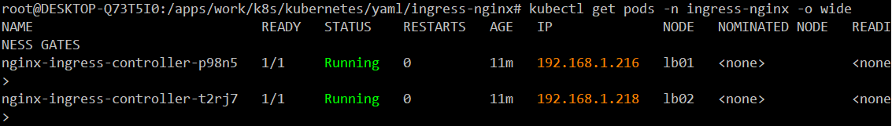

[toc]

## 21. ingress-nginx部署

### 21.1 部署前准备

环境准备

```
ingress-nginx将以DaemonSet方式部署在lb上，所以要先给lb节点打上标签
kubectl label node lb01 ingress-nginx=yes
kubectl label node lb02 ingress-nginx=yes
```

下载`ingress-nginx`的yaml文件

```bash
wget https://github.com/kubernetes/ingress-nginx/releases/download/nginx-0.25.0/ingress-nginx.yaml
```

注意：新版的可能不是上面的地址下载了，可用git将整个项目下载下来

```bash
git clone https://github.com/kubernetes/ingress-nginx.git
```

ingress-nginx官方说明： https://kubernetes.github.io/ingress-nginx/user-guide/nginx-configuration 

### 21.2 修改yaml文件

修改`ingress-nginx.yaml`
将`kind: Deployment`改为`kind: DaemonSet`，使用每个node上都有ingress-nginx的pod，否则你域名解析时到一个没有ingress-nginx的pod的node上时，将会无法访问

```yaml
apiVersion: apps/v1
#kind: Deployment
kind: DaemonSet
metadata:
  name: nginx-ingress-controller
  namespace: ingress-nginx
  labels:
    app.kubernetes.io/name: ingress-nginx
    app.kubernetes.io/part-of: ingress-nginx
spec:
  # Deployment下才需要使用replicas，DaemonSet不需要此参数
  #replicas: 1
```

然后就是修改镜像地址

```yaml
          # 这个原始镜像地址，下不动，得坐个好点的飞机，250M左右
          #image: quay.io/kubernetes-ingress-controller/nginx-ingress-controller:0.25.0
          # 这个是dockerhub上搜来的
          image: scolib/nginx-ingress-controller:0.25.0
          imagePullPolicy: IfNotPresent
```

指定部署到lb node上，由到lb node打了污点，所以还需要设置污点容忍

```yaml
    spec:
      # 由于前面对lb设置了污点，这里必须设置容忍，否则无法调度，
      tolerations:
      # 这里的key和value必须和打污点时一致
      - key: "node-role.kubernetes.io/ingress"
        operator: Equal
        effect: NoSchedule
      serviceAccountName: nginx-ingress-serviceaccount
      hostNetwork: true
      nodeSelector:
        ingress-nginx: "yes"
      containers:
      ...
```

完整yaml文件内容如下：

```yaml
apiVersion: v1
kind: Namespace
metadata:
  name: ingress-nginx
  labels:
    app.kubernetes.io/name: ingress-nginx
    app.kubernetes.io/part-of: ingress-nginx

---

kind: ConfigMap
apiVersion: v1
metadata:
  name: nginx-configuration
  namespace: ingress-nginx
  labels:
    app.kubernetes.io/name: ingress-nginx
    app.kubernetes.io/part-of: ingress-nginx

---
kind: ConfigMap
apiVersion: v1
metadata:
  name: tcp-services
  namespace: ingress-nginx
  labels:
    app.kubernetes.io/name: ingress-nginx
    app.kubernetes.io/part-of: ingress-nginx

---
kind: ConfigMap
apiVersion: v1
metadata:
  name: udp-services
  namespace: ingress-nginx
  labels:
    app.kubernetes.io/name: ingress-nginx
    app.kubernetes.io/part-of: ingress-nginx

---
apiVersion: v1
kind: ServiceAccount
metadata:
  name: nginx-ingress-serviceaccount
  namespace: ingress-nginx
  labels:
    app.kubernetes.io/name: ingress-nginx
    app.kubernetes.io/part-of: ingress-nginx

---
apiVersion: rbac.authorization.k8s.io/v1beta1
kind: ClusterRole
metadata:
  name: nginx-ingress-clusterrole
  labels:
    app.kubernetes.io/name: ingress-nginx
    app.kubernetes.io/part-of: ingress-nginx
rules:
  - apiGroups:
      - ""
    resources:
      - configmaps
      - endpoints
      - nodes
      - pods
      - secrets
    verbs:
      - list
      - watch
  - apiGroups:
      - ""
    resources:
      - nodes
    verbs:
      - get
  - apiGroups:
      - ""
    resources:
      - services
    verbs:
      - get
      - list
      - watch
  - apiGroups:
      - ""
    resources:
      - events
    verbs:
      - create
      - patch
  - apiGroups:
      - "extensions"
      - "networking.k8s.io"
    resources:
      - ingresses
    verbs:
      - get
      - list
      - watch
  - apiGroups:
      - "extensions"
      - "networking.k8s.io"
    resources:
      - ingresses/status
    verbs:
      - update

---
apiVersion: rbac.authorization.k8s.io/v1beta1
kind: Role
metadata:
  name: nginx-ingress-role
  namespace: ingress-nginx
  labels:
    app.kubernetes.io/name: ingress-nginx
    app.kubernetes.io/part-of: ingress-nginx
rules:
  - apiGroups:
      - ""
    resources:
      - configmaps
      - pods
      - secrets
      - namespaces
    verbs:
      - get
  - apiGroups:
      - ""
    resources:
      - configmaps
    resourceNames:
      # Defaults to "<election-id>-<ingress-class>"
      # Here: "<ingress-controller-leader>-<nginx>"
      # This has to be adapted if you change either parameter
      # when launching the nginx-ingress-controller.
      - "ingress-controller-leader-nginx"
    verbs:
      - get
      - update
  - apiGroups:
      - ""
    resources:
      - configmaps
    verbs:
      - create
  - apiGroups:
      - ""
    resources:
      - endpoints
    verbs:
      - get

---
apiVersion: rbac.authorization.k8s.io/v1beta1
kind: RoleBinding
metadata:
  name: nginx-ingress-role-nisa-binding
  namespace: ingress-nginx
  labels:
    app.kubernetes.io/name: ingress-nginx
    app.kubernetes.io/part-of: ingress-nginx
roleRef:
  apiGroup: rbac.authorization.k8s.io
  kind: Role
  name: nginx-ingress-role
subjects:
  - kind: ServiceAccount
    name: nginx-ingress-serviceaccount
    namespace: ingress-nginx

---
apiVersion: rbac.authorization.k8s.io/v1beta1
kind: ClusterRoleBinding
metadata:
  name: nginx-ingress-clusterrole-nisa-binding
  labels:
    app.kubernetes.io/name: ingress-nginx
    app.kubernetes.io/part-of: ingress-nginx
roleRef:
  apiGroup: rbac.authorization.k8s.io
  kind: ClusterRole
  name: nginx-ingress-clusterrole
subjects:
  - kind: ServiceAccount
    name: nginx-ingress-serviceaccount
    namespace: ingress-nginx

---

apiVersion: apps/v1
#kind: Deployment
kind: DaemonSet
metadata:
  name: nginx-ingress-controller
  namespace: ingress-nginx
  labels:
    app.kubernetes.io/name: ingress-nginx
    app.kubernetes.io/part-of: ingress-nginx
spec:
  # Deployment下才需要使用replicas，DaemonSet不需要此参数
  #replicas: 1
  selector:
    matchLabels:
      app.kubernetes.io/name: ingress-nginx
      app.kubernetes.io/part-of: ingress-nginx
  template:
    metadata:
      labels:
        app.kubernetes.io/name: ingress-nginx
        app.kubernetes.io/part-of: ingress-nginx
      annotations:
        prometheus.io/port: "10254"
        prometheus.io/scrape: "true"
    spec:
      # 由于前面对lb设置了污点，这里必须设置容忍，否则无法调度，
      tolerations:
      # 这里的key和value必须和打污点时一致
      - key: "node-role.kubernetes.io/ingress"
        operator: Equal
        effect: NoSchedule
      serviceAccountName: nginx-ingress-serviceaccount
      hostNetwork: true
      nodeSelector:
        ingress-nginx: "yes"
      containers:
        - name: nginx-ingress-controller
          # 这个原始镜像地址，下不动，得坐个好点的飞机，250M左右
          #image: quay.io/kubernetes-ingress-controller/nginx-ingress-controller:0.25.0
          # 这个是dockerhub上搜来的
          #image: scolib/nginx-ingress-controller:0.25.0
          # 这是自己harbor仓库的
          image: harbor.dukanghub.com/k8s/nginx-ingress-controller:0.25.0
          imagePullPolicy: IfNotPresent
          args:
            - /nginx-ingress-controller
            - --configmap=$(POD_NAMESPACE)/nginx-configuration
            - --tcp-services-configmap=$(POD_NAMESPACE)/tcp-services
            - --udp-services-configmap=$(POD_NAMESPACE)/udp-services
            - --publish-service=$(POD_NAMESPACE)/ingress-nginx
            - --annotations-prefix=nginx.ingress.kubernetes.io
          securityContext:
            allowPrivilegeEscalation: true
            capabilities:
              drop:
                - ALL
              add:
                - NET_BIND_SERVICE
            # www-data -> 33
            runAsUser: 33
          env:
            - name: POD_NAME
              valueFrom:
                fieldRef:
                  fieldPath: metadata.name
            - name: POD_NAMESPACE
              valueFrom:
                fieldRef:
                  fieldPath: metadata.namespace
          ports:
            - name: http
              containerPort: 80
            - name: https
              containerPort: 443
          livenessProbe:
            failureThreshold: 3
            httpGet:
              path: /healthz
              port: 10254
              scheme: HTTP
            initialDelaySeconds: 10
            periodSeconds: 10
            successThreshold: 1
            timeoutSeconds: 10
          readinessProbe:
            failureThreshold: 3
            httpGet:
              path: /healthz
              port: 10254
              scheme: HTTP
            periodSeconds: 10
            successThreshold: 1
            timeoutSeconds: 10

---

```

### 21.3 部署`ingress-nginx`

```bash
kubectl apply -f ingress-nginx.yaml
# 一些教程会说在后面指定名称空间，其作用是指明一些未定义空间属性的资源所处的名称空间，如Service，若未指定，则会在kubectl使用的配置中定义的上下文空间中创建service
```

### 21.4 部署状态查看

`ingress-nginx`默认在`ingress-nginx`名称空间中

```bash
kubectl get pods -n ingress-nginx -o wide
```



从图中可以看到，每台lv节点上都运行了一个ingress-nginx

### 21.5 `ingress-nginx`使用

#### 21.5.1 部署`http`域名访问，拿`nginx`测试

先做个`deployment`和`service`

```yaml
apiVersion: extensions/v1beta1
kind: Deployment
metadata:
  labels:
    app: nginx-test
  name: nginx-test
  namespace: default
spec:
  replicas: 2
  selector:
    matchLabels:
      app: nginx-test
  strategy:
    rollingUpdate:
      maxSurge: 25%
      maxUnavailable: 25%
    type: RollingUpdate
  template:
    metadata:
      labels:
        app: nginx-test
    spec:
      containers:
      - image: harbor.dukanghub.com/lnmp/nginx:1.14.0-alpine
        imagePullPolicy: IfNotPresent
        name: nginx-test
        volumeMounts:
        - name: timezone
          mountPath: /etc/localtime
          readOnly: True
      volumes:
      - name: timezone
        hostPath:
          path: /etc/localtime
      restartPolicy: Always

---
apiVersion: v1
kind: Service
metadata:
 name: nginx-test
spec:
 ports:
 - port: 80
   targetPort: 80
 selector:
   app: nginx-test
```

注意：如果前面执行了`kubectl apply -f allow-lxcfs-tz-env.yaml -n default`，那这里无须再挂载时区

再做个`ingress-nginx`配置，

```yaml
apiVersion: extensions/v1beta1
kind: Ingress
metadata:
  name: "ingress-nginx-test.dukanghub.com"
  namespace: default
  annotations:
    #nginx.ingress.kubernetes.io/rewrite-target: /
    nginx.ingress.kubernetes.io/ingress.class: nginx
spec:
  rules:
  - host: nginx.test.dukanghub.com
    http:
      paths:
      - path: /
        backend:
          serviceName: "nginx-test"
          servicePort: 80
```

进入ingress-nginx-controller pod中，在nginx.conf里可看到多了如下配置：

```conf
        ## start server nginx.test.dukanghub.com
        server {
                server_name nginx.test.dukanghub.com ;

                listen 80;

                set $proxy_upstream_name "-";
                set $pass_access_scheme $scheme;
                set $pass_server_port $server_port;
                set $best_http_host $http_host;
                set $pass_port $pass_server_port;

                location / {

                        set $namespace      "default";
                        set $ingress_name   "ingress-nginx-test";
                        set $service_name   "nginx-test";
                        set $service_port   "80";
                        set $location_path  "/";

                        rewrite_by_lua_block {
                                lua_ingress.rewrite({
                                        force_ssl_redirect = false,
                                        use_port_in_redirects = false,
                                })
                                balancer.rewrite()
                                plugins.run()
                        }

                        header_filter_by_lua_block {

                                plugins.run()
                        }
                        body_filter_by_lua_block {

                        }

                        log_by_lua_block {

                                balancer.log()

                                monitor.call()

                                plugins.run()
                        }

                        port_in_redirect off;

                        set $balancer_ewma_score -1;
                        set $proxy_upstream_name    "default-nginx-test-80";
                        set $proxy_host             $proxy_upstream_name;

                        set $proxy_alternative_upstream_name "";

                        client_max_body_size                    1m;

                        proxy_set_header Host                   $best_http_host;

                        # Pass the extracted client certificate to the backend

                        # Allow websocket connections
                        proxy_set_header                        Upgrade           $http_upgrade;

                        proxy_set_header                        Connection        $connection_upgrade;

                        proxy_set_header X-Request-ID           $req_id;
                        proxy_set_header X-Real-IP              $the_real_ip;

                        proxy_set_header X-Forwarded-For        $the_real_ip;

                        proxy_set_header X-Forwarded-Host       $best_http_host;
                        proxy_set_header X-Forwarded-Port       $pass_port;
                        proxy_set_header X-Forwarded-Proto      $pass_access_scheme;

                        proxy_set_header X-Original-URI         $request_uri;

                        proxy_set_header X-Scheme               $pass_access_scheme;

                        # Pass the original X-Forwarded-For
                        proxy_set_header X-Original-Forwarded-For $http_x_forwarded_for;

                        # mitigate HTTPoxy Vulnerability
                        # https://www.nginx.com/blog/mitigating-the-httpoxy-vulnerability-with-nginx/
                        proxy_set_header Proxy                  "";

                        # Custom headers to proxied server

                        proxy_connect_timeout                   5s;
                        proxy_send_timeout                      60s;
                        proxy_read_timeout                      60s;

                        proxy_buffering                         off;
                        proxy_buffer_size                       4k;
                        proxy_buffers                           4 4k;
                        proxy_request_buffering                 on;

                        proxy_http_version                      1.1;

                        proxy_cookie_domain                     off;
                        proxy_cookie_path                       off;

                        # In case of errors try the next upstream server before returning an error
                        proxy_next_upstream                     error timeout;
                        proxy_next_upstream_timeout             0;
                        proxy_next_upstream_tries               3;

                        proxy_pass http://upstream_balancer;

                        proxy_redirect                          off;

                }

        }
        ## end server nginx.test.dukanghub.com
```

**注意：**ingress-nginx的一些参数配置全放在一个叫`nginx-configuration`的`configMap`里，常用参数如下：

```yaml
apiVersion: v1
kind: ConfigMap
metadata:
  labels:
    app.kubernetes.io/name: ingress-nginx
    app.kubernetes.io/part-of: ingress-nginx
  name: nginx-configuration
  namespace: ingress-nginx
data:
  enable-underscores-in-headers: "true"
  compute-full-forwarded-for: "true"
  forwarded-for-header: X-Forwarded-For
  use-forwarded-headers: "true"
```

修改此cm，ingress-nginx控制器的配置会自动更新。

#### 21.5.2 部署`https`域名访问，拿dashboard测试

`dashboard`之前已部署好，这里只添加`ingress-nginx`配置即可

`cat https.dashboard.dukanghub.com.yaml`

```yaml
apiVersion: extensions/v1beta1
kind: Ingress
metadata:
  name: "ingress-https-dashboard.dukanghub.com"
  namespace: kube-system
  annotations:
    nginx.ingress.kubernetes.io/ssl-redirect: "true"
    nginx.ingress.kubernetes.io/rewrite-target: /
    #nginx.ingress.kubernetes.io/secure-backends: "true" 该注释在0.18.0中被弃用，并在0.20.0发布后被删除，使用下面
    nginx.ingress.kubernetes.io/backend-protocol: "HTTPS"
    #nginx.ingress.kubernetes.io/ingress.class: nginx
    #nginx.ingress.kubernetes.io/ssl-passthrough: "true"
spec:
  tls:
  - hosts:
    - dashboard.dukanghub.com
    secretName: kubernetes-dashboard-certs-tls
  rules:
  - host: dashboard.dukanghub.com
    http:
      paths:
      - path:
        backend:
          serviceName: kubernetes-dashboard
          servicePort: 443
```

为上面的域名申请公签证书，这里省略

创建`ssl`证书secret

```bash
kubectl create secret tls kubernetes-dashboard-certs-tls --cert=dashboard.crt --key=dashboard.key -n kube-system
# 注意cert和key后面接的是文件名，对应的两个key名是tls.crt,tls.key,类型是tls.这两个值必须和你部署dashboard时容器args指定的一致，若未指定，dashboard容器使用的key名是dashboard.crt和dashboard.key，且使用的证书secret名叫kubernetes-dashboard-certs，Opaque类型，若要无缝对接，不改yaml文件下，需生成这么一个secret
```

### 21.6 使用前端waf反向代理ingress

```
Q1: waf是什么？

A1: 其实就是使用带waf功能的nginx，这里使用openresty

Q2: 为什么要使用waf反向代理ingress?

A2: 证书统一放置于waf，集群里应用统一使用http访问

Q3: 多层代理，对性能是否有影响

A3: 有影响是肯定的，但影响不大，cdn也是经过层层代理。
```

`nginx`配置示例，反代前面例子中的`nginx-test`

`upstream`配置

```conf
...
http {
...
    upstream k8s-lb {
        server 192.168.1.216;
        server 192.168.1.218
    }
}
```


虚拟主机配置

```conf
server {
    listen 443 ssl;
    server_name nginx-test.dukanghub.com;
    index index.html index.php index.htm;
    access_log /usr/local/openresty/nginx/logs/https.nginx-test.dukanghub.com_access.log  main;
    error_log /usr/local/openresty/nginx/logs/https.nginx-test.dukanghub.com_error.log  warn;

    #ssl配置
    ssl_certificate /usr/local/openresty/nginx/ssl_certificate/nginx-test.dukanghub.com.cer;
    ssl_certificate_key /usr/local/openresty/nginx/ssl_certificate/nginx-test.dukanghub.com.key;
    ssl_prefer_server_ciphers   on;
    #ssl_session_cache builtin:1000 shared:SSL:10m;
    ssl_session_timeout 10m;
    ssl_protocols TLSv1 TLSv1.1 TLSv1.2;
    ssl_ciphers "ECDHE-RSA-AES128-GCM-SHA256:ECDHE-ECDSA-AES128-GCM-SHA256:ECDHE-RSA-AES256-GCM-SHA384:ECDHE-ECDSA-AES256-GCM-SHA384:ECDHE-RSA-AES128-SHA256:ECDHE-ECDSA-AES128-SHA256:ECD
HE-RSA-AES128-SHA:ECDHE-ECDSA-AES128-SHA:ECDHE-RSA-AES256-SHA384:ECDHE-ECDSA-AES256-SHA384:ECDHE-RSA-AES256-SHA:ECDHE-ECDSA-AES256-SHA:AES128-GCM-SHA256:AES256-GCM-SHA384:AES128-SHA256:A
ES256-SHA256:AES128-SHA:AES256-SHA:AES:CAMELLIA:DES-CBC3-SHA:!aNULL:!eNULL:!EXPORT:!DES:!RC4:!MD5:!PSK:!aECDH:!EDH-DSS-DES-CBC3-SHA:!EDH-RSA-DES-CBC3-SHA:!KRB5-DES-CBC3-SHA";
    #add_header Strict-Transport-Security "max-age=63072000; includeSubdomains; preload";
    location / {
        proxy_set_header Host $host;
        proxy_set_header X-Real-IP $remote_addr;
        proxy_set_header REMOTE-HOST $remote_addr;
        proxy_set_header X-Forwarded-For $proxy_add_x_forwarded_for;
        proxy_pass http://k8s-lb;
    }
    location ~ /\.ht {
                deny  all;
    }
}
```

这里需要注意的是，经过多层代理后，虽然把真实IP传给后面的服务器了，但容器获得的`client ip`是`k8s-lb`的`IP`。如果要在容器前端日志显示真实的客户端IP，需要修改容器的nginx配置：

`cat nginx.conf`

```conf
...
http {
    ...
    # 设置值映射，如果$http_x_forwarded_for为空，则$clientRealIP=$remote_addr
    map $http_x_forwarded_for $clientRealIP {
        ""  $remote_addr;
        ~^(?P<firstAddr>[0-9\.]+),?.*$ $firstAddr;
    }
    # 是否记录日志开关，方便过滤指定URL或IP。1为记录
    map $request_uri $loggable {
        default 1;
    }
    # 对websocket进行反向代理时，可设置以下map
    map $http_upgrade $connection_upgrade {
        default upgrade;
        '' close;
    }
    map $http_x_forwarded_proto $pass_access_scheme {
        default $http_x_forwarded_proto;
        '' $scheme;
    }
    log_format main escape=json '$clientRealIp - $remote_user [$time_local] $http_host "$request" '
                                '$status $body_bytes_sent "$http_referer" '
                                '"$http_user_agent" "$http_x_forwarded_for" $remote_addr '
                                '$ups_add: $upstream_addr ups_resp_time: $upstream_reponse_time '
                                'request_time: $request_time ups_status: $upstream_status request_body: $request_body '
                                'upstream_response_length [$proxy_upstream_name]';
                                
   # 上面的日志格式，重点是开头的$clientRealIp，其他格式可自由变换
}
```

还需在ingress-nginx的configMap`nginx-configuration`增加如下字段，才能最终获取到真实的IP

```yaml
apiVersion: v1
kind: ConfigMap
metadata:
  labels:
    app.kubernetes.io/name: ingress-nginx
    app.kubernetes.io/part-of: ingress-nginx
  name: nginx-configuration
  namespace: ingress-nginx
data:
  enable-underscores-in-headers: "true"
  compute-full-forwarded-for: "true"
  forwarded-for-header: X-Forwarded-For
  use-forwarded-headers: "true"
```

**data后三个key-value**

