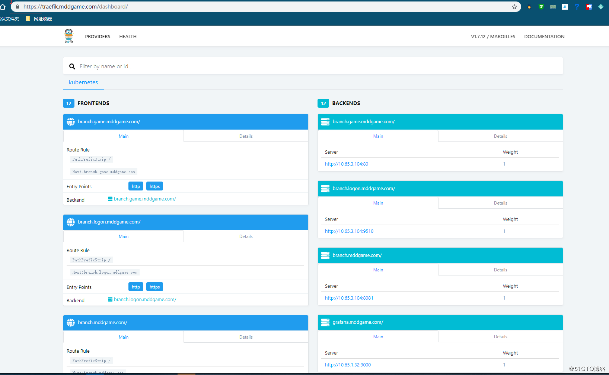
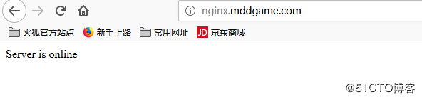
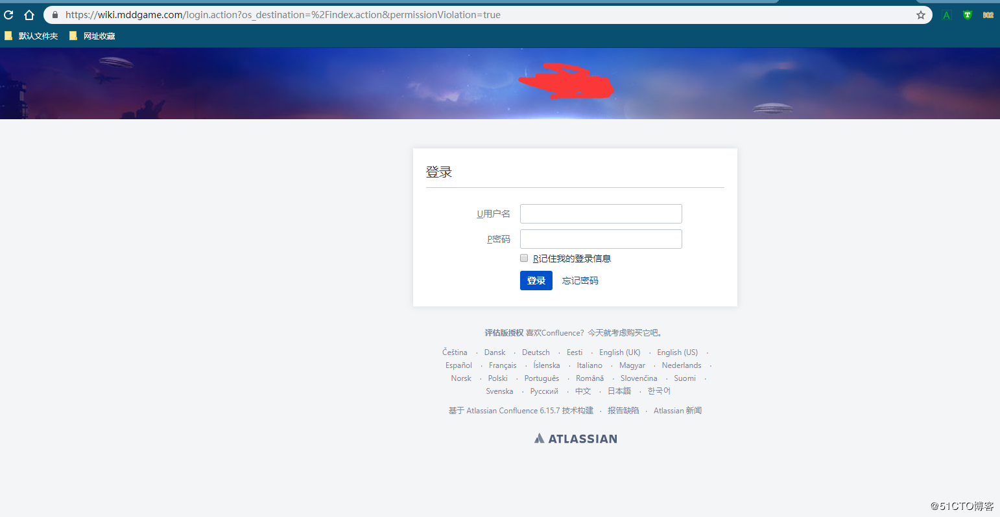

# 环境

## . kubernetes 1.14.3

## . traefik V1.7.12

## .IP 192.168.30.35

## .kubectl label nodes ingress  ingress=yes

# https证书申请

推荐使用acme.sh 申请免费证书，具体方法不做详细介绍
使用自签证书

```
openssl req -x509 -nodes -days 3650 -newkey rsa:2048 -keyout tls.key -out tls.crt -subj "/CN=*.dukanghub.com"
```

# traefik配置

添加traefik.toml文件：

```
1、http,https 同时对外提供服务
defaultEntryPoints = ["http","https"]
[entryPoints]
  [entryPoints.http]
  address = ":80"
    entryPoint = "https"
  [entryPoints.https]
  address = ":443"
    [entryPoints.https.tls]
      [[entryPoints.https.tls.certificates]]
      certFile = "/certs/tls.crt"
      keyFile = "/certs/tls.key"

2、http 强制跳转https
defaultEntryPoints = ["http","https"]
[kubernetes]
[entryPoints]
  [entryPoints.http]
  address = ":80"
    [entryPoints.http.redirect]
      entryPoint = "https"
  [entryPoints.https]
  address = ":443"
    [entryPoints.https.tls]
      [[entryPoints.https.tls.certificates]]
      CertFile = "/certs/tls.crt"
      KeyFile = "/certs/tls.key"
```

其中tls.crt和tls.key就是证书文件，注意证书文件名必须为固定。挂载到容器内后就会读到该文件。

如果有多个域名都需要使用证书时，应创建不同的证书secret，在给域名创建`Ingress`资源时，使用不同的secret名即可。

注意：上面的证书路径是挂载到容器后的路径，在修改容器yaml文件里一定要挂载到指定目录里

```
创建证书secret 方便挂在
kubectl -n kube-system create secret generic dukanghub-tls-cert --from-file=tls.key --from-file=tls.crt
注意：由于secret是不能跨命名空间的，如果应用是部署在default命名空间或者其它命名空间，那还需要在default命名空间创建一个该secret，修改上面最后面的-n kube-system为其它命名空间的名字即可。
创建configmap
kubectl create configmap traefik-conf --from-file=traefik.toml -n kube-system
```

# traefik部署配置

#### 1、traefik-rbac.yaml

```
---
kind: ClusterRole
apiVersion: rbac.authorization.k8s.io/v1beta1
metadata:
  name: traefik
  namespace: kube-system
rules:
  - apiGroups:
      - ""
    resources:
      - services
      - endpoints
      - secrets
    verbs:
      - get
      - list
      - watch
  - apiGroups:
      - extensions
    resources:
      - ingresses
    verbs:
      - get
      - list
      - watch
  - apiGroups:
    - extensions
    resources:
    - ingresses/status
    verbs:
    - update
---
kind: ClusterRoleBinding
apiVersion: rbac.authorization.k8s.io/v1beta1
metadata:
  name: traefik
roleRef:
  apiGroup: rbac.authorization.k8s.io
  kind: ClusterRole
  name: traefik
subjects:
- kind: ServiceAccount
  name: traefik
  namespace: kube-system
```

#### 2 创建 traefik 用户

```
vim traefik-serviceaccount.yaml
---
apiVersion: v1
kind: ServiceAccount
metadata:
  name: traefik
  namespace: kube-system
```

#### 3、deployment 方式部署yaml

```
vim traefik-deployment-https.yaml
---
kind: Deployment
apiVersion: extensions/v1beta1
metadata:
  name: traefik
  namespace: kube-system
  labels:
    k8s-app: traefik
spec:
  replicas: 1
  selector:
    matchLabels:
      k8s-app: traefik
  template:
    metadata:
      labels:
        k8s-app: traefik
        name: traefik
    spec:
      serviceAccountName: traefik
      terminationGracePeriodSeconds: 60
      volumes:
      - name: ssl
        secret:
          secretName: dukanghub-tls-cert
      - name: config
        configMap:
          name: traefik-conf
          defaultMode: 0644
          items:
          - key: traefik.toml
            path: traefik.toml 
      hostNetwork: true       # 如果不使用hostNetwork 配置hostPort 443端口映射到宿主机会出现访问不了k8s api 10.64.0.1:443 端口 
      dnsPolicy: ClusterFirstWithHostNet      
      containers:
      - image: traefik
        name: traefik
        imagePullPolicy: IfNotPresent
        volumeMounts:
        - mountPath: /certs         
          name: "ssl"
        - mountPath: /etc/traefik.toml
          subPath: traefik.toml
          name: "config"
        ports:
        - name: http
          containerPort: 80
          hostPort: 80
        - name: https
          containerPort: 443
          hostPort: 443
        - name: admin
          containerPort: 8080
        args:
        - --api
        - --web
        - --api.dashboard
        - --logLevel=INFO
        - --web.metrics
        - --metrics.prometheus
        - --web.metrics.prometheus
        - --kubernetes
        - --traefiklog
        - --traefiklog.format=json
        - --accesslog
        - --accesslog.format=json
        - --accessLog.fields.headers.defaultMode=redact
        - --insecureskipverify=true
        - --configFile=/etc/traefik.toml       
      nodeSelector:
        ingress-nginx: "yes"  # 部署到ingress-nginx节点
      tolerations:
      - effect: NoSchedule
        key: node-role.kubernetes.io/ingress
        operator: Equal
```

#### 4、daemonset 方式部署

```
vim traefik-daemonset-https.yaml
---
kind: DaemonSet
apiVersion: apps/v1
metadata:
  name: traefik
  namespace: kube-system
  labels:
    k8s-app: traefik
spec:
  selector:
    matchLabels:
      k8s-app: traefik
  template:
    metadata:
      labels:
        k8s-app: traefik
        name: traefik
    spec:
      serviceAccountName: traefik
      terminationGracePeriodSeconds: 60
      volumes:
      - name: ssl
        secret:
          secretName: dukanghub-tls-cert
      hostNetwork: true
      dnsPolicy: ClusterFirstWithHostNet      
      containers:
      - image: traefik:v1.7.18
        name: traefik
        imagePullPolicy: Always
        volumeMounts:
        - mountPath: /certs         
          name: "ssl"
        ports:
        - name: http
          containerPort: 80
          hostPort: 80
        - name: https
          containerPort: 443
          hostPort: 443
        - name: admin
          containerPort: 8080
        securityContext:
          capabilities:
            drop:
            - ALL
            add:
            - NET_BIND_SERVICE
        args:
        - --api
        - --web
        - --api.dashboard
        - --logLevel=INFO
        - --web.metrics
        - --metrics.prometheus
        - --web.metrics.prometheus
        - --kubernetes
        - --traefiklog
        - --traefiklog.format=json
        - --accesslog
        - --accesslog.format=json
        - --accessLog.fields.headers.defaultMode=redact
        - --insecureskipverify=true
        - --defaultentrypoints=http,https
        - --entrypoints=Name:https Address::443 TLS
        - --entrypoints=Name:http Address::80      
      nodeSelector:
        ingress-nginx: "yes"
      tolerations:
      - effect: NoSchedule
        key: node-role.kubernetes.io/ingress
        operator: Equal
  updateStrategy:
    type: RollingUpdate
    rollingUpdate:
      maxUnavailable: 1
      
```

#### 5、创建traefik Service

```
vim traefik-service.yaml
kind: Service
apiVersion: v1
metadata:
  labels:
    k8s-app: traefik
  name: traefik
  namespace: kube-system
spec:
  selector:
    k8s-app: traefik
  clusterIP: None
  ports:
    - protocol: TCP
      port: 80
      name: http
    - protocol: TCP
      port: 443
      name: https
    - protocol: TCP
      port: 8080
      name: admin
```

#### 6、创建traefik ServiceMonitor

```
vim traefik-serviceMonitor.yaml
apiVersion: monitoring.coreos.com/v1
kind: ServiceMonitor
metadata:
  labels:
    k8s-app: traefik
  name: traefik
  namespace: monitoring
spec:
  endpoints:
  - honorLabels: true
    interval: 15s
    port: admin
  jobLabel: k8s-app
  namespaceSelector:
    matchNames:
    - kube-system
  selector:
    matchLabels:
      k8s-app: traefik
```

### 7、创建 traefik dashboard Ingress

```
vim traefik-dashboard.yaml
apiVersion: extensions/v1beta1
kind: Ingress
metadata:
  name: traefik-dashboard
  namespace: kube-system
  annotations:
    kubernetes.io/ingress.class: traefik
    traefik.ingress.kubernetes.io/frontend-entry-points: http,https
spec:
  rules:
  - host: traefik.dukanghub.com
    http:
      paths:
        - backend:
            serviceName: traefik
            servicePort: 8080
  tls:
   - secretName: dukanghub-tls-cert
```

# 执行yaml 创建traefik 服务

```
kubectl apply -f .
```

# 验证traefik 服务

```
kubectl get all -n kube-system | grep traefik
root@Qist:/mnt/e/work/k8s-game# kubectl get all -n kube-system | grep traefik

pod/traefik-2d5k8                          1/1     Running   0          16h

service/traefik                ClusterIP   None            <none>        80/TCP,443/TCP,8080/TCP   16h

daemonset.apps/traefik       1         1         1       1            1           ingress=yes     16h
写hosts
192.168.1.217 traefik.dukanghub.com
访问traefik.mddgame.com
```

http 访问

https 访问


### 创建测试

```
vi nginx.yaml
---
apiVersion: apps/v1
kind: Deployment
metadata:
  name: nginx
spec:
  replicas: 2
  selector:
    matchLabels:
      k8s-app: nginx
  template:
    metadata:
      labels:
        k8s-app: nginx
    spec:
      containers:
        - name: nginx
          image: harbor.dukanghub.com/library/nginx
          imagePullPolicy: IfNotPresent
          ports:
            - containerPort: 80
              name: web
              protocol: TCP
            - containerPort: 8080
              name: vts
              protocol: TCP
          readinessProbe:
            failureThreshold: 10
            httpGet:
              path: /healthz
              port: vts
              scheme: HTTP
            initialDelaySeconds: 3
            periodSeconds: 5
            successThreshold: 1
            timeoutSeconds: 3
          resources:
            requests:
              cpu: 200m
              memory: 200Mi
        - name: nginx-vts-exporter
          image: harbor.dukanghub.com/library/nginx-vts-exporter
          imagePullPolicy: IfNotPresent
          args:
          - "-nginx.scrape_uri=http://localhost:8080/format/json"
          ports:
            - containerPort: 9913
              name: http-metrics
              protocol: TCP
          resources:
            requests:
              memory: 30Mi
              cpu: 102m
            limits:
              memory: 50Mi
              cpu: 250m
---
kind: Service
apiVersion: v1
metadata:
  labels:
    k8s-app: nginx
  name: nginx
  annotations:
    kubernetes.io/ingress.class: traefik
    traefik.ingress.kubernetes.io/affinity: "true" # 后端基于Cookie会话
    traefik.ingress.kubernetes.io/load-balancer-method: drr   #修改负载方式
spec:
  sessionAffinity: ClientIP
  sessionAffinityConfig:
    clientIP:
      timeoutSeconds: 10800
  selector:
    k8s-app: nginx
  ports:
    - protocol: TCP
      port: 80
      name: web
    - protocol: TCP
      port: 8080
      name: vts
    - protocol: TCP
      port: 9913
      name: http-metrics
  type: ClusterIP
---
apiVersion: extensions/v1beta1
kind: Ingress
metadata:
  name: nginx
  annotations:
    kubernetes.io/ingress.class: traefik
    traefik.frontend.rule.type: PathPrefixStrip
    traefik.ingress.kubernetes.io/frontend-entry-points: http,https
spec:
  rules:
  - host: nginx.dukanghub.com
    http:
      paths:
        - path: /
          backend:
            serviceName: nginx
            servicePort: 80
  tls:
   - secretName: dukanghub-tls-cert
---
apiVersion: monitoring.coreos.com/v1
kind: ServiceMonitor
metadata:
  labels:
    k8s-app: nginx
  name: nginx
spec:
  endpoints:
  - honorLabels: true
    interval: 15s
    port: http-metrics
  jobLabel: k8s-app
  selector:
    matchLabels:
      k8s-app: nginx

创建nginx 服务
kubectl apply -f .
hosts 写入
192.168.1.217 nginx.dukanghub.com 
```


正常打开

## 外部业务使用traefik 对外提供服务

```
以Confluence 为例
vi wiki.yaml
apiVersion: v1
kind: Service
metadata:
  labels:
    k8s-app: wiki
  name: wiki
  namespace: default
  annotations:
    kubernetes.io/ingress.class: traefik
    traefik.ingress.kubernetes.io/affinity: "true" #增加会话粘性
    traefik.ingress.kubernetes.io/load-balancer-method: drr
spec:
  clusterIP: None
  ports:
  - name: http
    port: 8080
    protocol: TCP
    targetPort: 8080
  sessionAffinity: None
  type: ClusterIP
---
apiVersion: v1
kind: Endpoints
metadata:
  labels:
    k8s-app: wiki
  name: wiki
  namespace: default
subsets:
- addresses:
  - ip: 192.168.30.11 # 多个ip 可以直接在下一行添加 -ip:192.168.30.22 
  ports:
  - name: http
    port: 8080
    protocol: TCP
---
apiVersion: extensions/v1beta1
kind: Ingress
metadata:
  name: wiki
  namespace: default
  annotations:
    kubernetes.io/ingress.class: traefik
    traefik.frontend.rule.type: PathPrefixStrip
    traefik.ingress.kubernetes.io/frontend-entry-points: http,https
    traefik.ingress.kubernetes.io/redirect-entry-point: https # 强制调整到https
spec:
  rules:
  - host: wiki.mddgame.com
    http:
      paths:
        - path: /
          backend:
            serviceName: wiki
            servicePort: 8080
  tls:
   - secretName: mddgame-tls-cert
```

绑定hosts
192.168.30.35 wiki.mddgame.com
验证是否能打开

能够正常打开