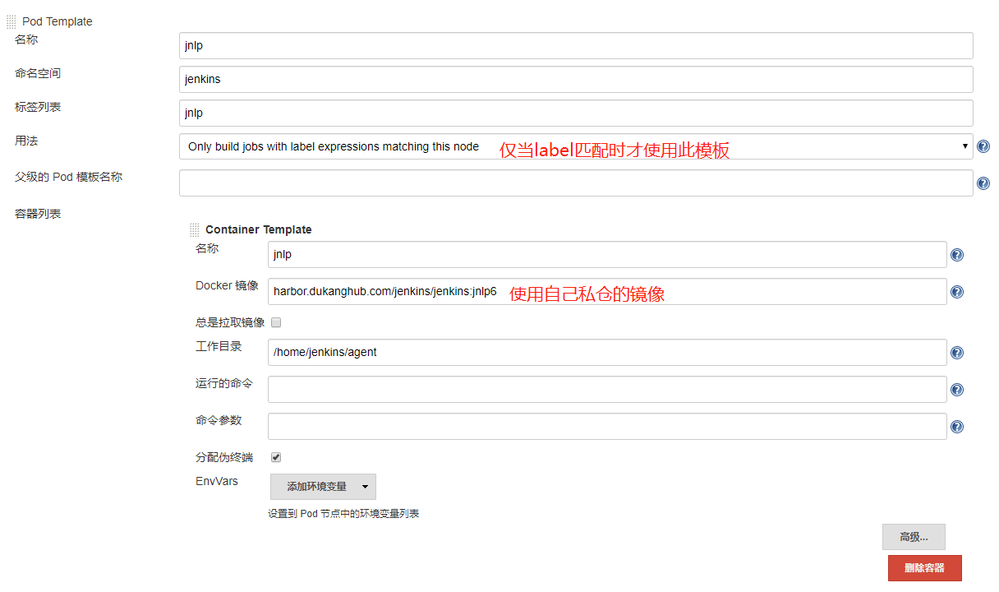
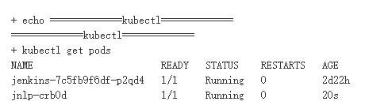

[toc]

# 为什么需要在k8s中使用jenkins

传统的 Jenkins Slave 一主多从方式会存在一些痛点，比如：

- 主 Master 发生单点故障时，整个流程都不可用了
- 每个 Slave 的配置环境不一样，来完成不同语言的编译打包等操作，但是这些差异化的配置导致管理起来非常不方便，维护起来也是比较费劲
- 资源分配不均衡，有的 Slave 要运行的 job 出现排队等待，而有的 Slave 处于空闲状态
- 资源有浪费，每台 Slave 可能是物理机或者虚拟机，当 Slave 处于空闲状态时，也不会完全释放掉资源。

正因为上面的这些种种痛点，我们渴望一种更高效更可靠的方式来完成这个 CI/CD 流程，而 Docker 虚拟化容器技术能很好的解决这个痛点，又特别是在 Kubernetes 集群环境下面能够更好来解决上面的问题，下图是基于 Kubernetes 搭建 Jenkins 集群的简单示意图：


从图上可以看到 Jenkins Master 和 Jenkins Slave 以 Pod 形式运行在 Kubernetes 集群的 Node 上，Master 运行在其中一个节点，并且将其配置数据存储到一个 Volume 上去，Slave 运行在各个节点上，并且它不是一直处于运行状态，它会按照需求动态的创建并自动删除。

这种方式的工作流程大致为：当 Jenkins Master 接受到 Build 请求时，会根据配置的 Label 动态创建一个运行在 Pod 中的 Jenkins Slave 并注册到 Master 上，当运行完 Job 后，这个 Slave 会被注销并且这个 Pod 也会自动删除，恢复到最初状态。

那么我们使用这种方式带来了哪些好处呢？

- **服务高可用**，当 Jenkins Master 出现故障时，Kubernetes 会自动创建一个新的 Jenkins Master 容器，并且将 Volume 分配给新创建的容器，保证数据不丢失，从而达到集群服务高可用。
- **动态伸缩**，合理使用资源，每次运行 Job 时，会自动创建一个 Jenkins Slave，Job 完成后，Slave 自动注销并删除容器，资源自动释放，而且 Kubernetes 会根据每个资源的使用情况，动态分配 Slave 到空闲的节点上创建，降低出现因某节点资源利用率高，还排队等待在该节点的情况。
- **扩展性好**，当 Kubernetes 集群的资源严重不足而导致 Job 排队等待时，可以很容易的添加一个 Kubernetes Node 到集群中，从而实现扩展。

是不是以前我们面临的种种问题在 Kubernetes 集群环境下面是不是都没有了啊？看上去非常完美。

# 配置jenkins

## 1. 安装kubernetes plugin

点击 Manage Jenkins -> Manage Plugins -> Available -> Kubernetes plugin 勾选安装即可。 

## 2. 新增一个K8S集群

点击 Manage Jenkins —> Configure System —> (拖到最下方)Add a new cloud —> 选择 Kubernetes，然后填写 Kubernetes 和 Jenkins 配置信息。 


**注意：**

- kubernetes地址，可写`kubernetes.default`，也可写完整，`kubernetes.default.svc.dukang.local`

- kubernetes命名空间，是指`jenkins`所在的命名空间，根据自己的情况修改，然后点击**Test Connection**，如果出现 Connection test successful 的提示信息证明 Jenkins 已经可以和 Kubernetes 系统正常通信了。

  > 另外需要注意，如果这里 Test Connection 失败的话，很有可能是权限问题，这里就需要把我们创建的 jenkins 的 serviceAccount 对应的 secret 添加到这里的 Credentials 里面。

## 3. 配置 Pod Template

其实就是配置 Jenkins Slave 运行的 Pod 模板，命名空间我们同样是用`jenkins`，Labels 这里也非常重要，对于后面执行 Job 的时候需要用到该值，然后我们这里使用的是 cnych/jenkins:jnlp 这个镜像，这个镜像是在官方的 jnlp 镜像基础上定制的，加入了 kubectl 等一些实用的工具。 

`Pod Templates`-->`添加Pod模板`




**注意：**

- 默认有一个pod label，键是jenkins，值是slave。我们自己定义的是另一个Pod模板，label为jnlp，再写pipeline脚本时，node里可放这个值，它就会自动使用此模板创建slave
- 挂载`/var/run/docker.sock`，是将此jenkins-slave-pod运行所在的node上的`/var/run/docker.sock`挂载到此`slave pod`里的`/var/run/docker.sock`，共享宿主机的docker，这看起来就像是`Docker-in-Docker`，但它不是，因为它在使用docker里用的全是宿主机的docker，缓存也会在外面，镜像也会在外面。这一点可以在打包后，slave-pod终止后，去看下它之前运行的node上有无你刚刚在slave打包的那个镜像。所以这叫`Docker-out-Docker`，真实的`Docker-in-Docker`是在`Docker`中运行一个完整的`Docker`，无需依赖于外面的Docker，但是这需要里面的Docker有root权限。这似乎又不安全。目前似乎有另一种解决方案，可以不需要root权限，在docker里完成打包上传等等一系列操作，但是项目名字我忘了，好尴尬。
- 挂载`/root/.kube`，这个我觉得是不必要的。
- Pod Retention设置为Never，即这个slave-pod完成任务后，不保留
- ServiceAccount写你jenkins的，最好是ClusterRole级别的，否则只能发布到jenkins空间了。

# 创建一个pipeline测试一下动态slave

1. 先来个简单的例子，不拉代码，只测试动态slave能否生成

   

   

   然后就可以在控制台输出看到如下信息

   

   点了构建后，运行以下命令，观察 Kubernetes 集群中 Pod 的变化

   ```bash
   kubectl get pods -n jenkins -w
   ```

   可以看到`jnlp-crb0d`这个Pod从创建到最后没有。

2. 上面的例子，我们是通过在控制台选择pod，接下来我们使用pipeline来选择pod

   

   ```groovy
   node('jnlp') {
       stage('Prepare') {
           echo "1.Prepare Stage"
           git url: "https://github.com/cnych/jenkins-demo.git"
           script {
               build_tag = sh(returnStdout: true, script: 'git rev-parse --short HEAD').trim()
               echo "build_tag ========== $build_tag"
           }
       }
       stage('Test') {
         echo "2.Test Stage"
       }
       stage('Build') {
           echo "3.Build Docker Image Stage"
           sh "docker build -t registry.cn-hangzhou.aliyuncs.com/k8s_xzb/jenkins-demo:${build_tag} ."
       }
       stage('Push') {
           echo "4.Push Docker Image Stage"
           withCredentials([usernamePassword(credentialsId: 'test_xzb', passwordVariable: 'dockerHubPassword', usernameVariable: 'dockerHubUser')]) {
               echo "${dockerHubUser} ${dockerHubPassword}"
               sh "docker login -u ${dockerHubUser} -p ${dockerHubPassword} registry.cn-hangzhou.aliyuncs.com"
               sh "docker push registry.cn-hangzhou.aliyuncs.com/k8s_xzb/jenkins-demo:${build_tag}"
             	// 提交镜像后，删除镜像，否则宿主机有镜像残留
               sh "docker rmi registry.cn-hangzhou.aliyuncs.com/k8s_xzb/jenkins-demo:${build_tag}"
           }
       }
       stage('Deploy') {
           echo "5. Deploy Stage"
           sh "sed -i 's/<BUILD_TAG>/${build_tag}/' k8s.yaml"
           sh "sed -i 's/<BRANCH_NAME>/${env.BRANCH_NAME}/' k8s.yaml"
           sh "sed -i 's#cnych/jenkins-demo#registry.cn-hangzhou.aliyuncs.com/k8s_xzb/jenkins-demo#' k8s.yaml"
           //sh "sed -i 's#default#jenkins#' k8s.yaml"
           sh "kubectl apply -f k8s.yaml --record"
       }
   }
   ```

   可以使用自己的项目地址和镜像仓库，如果没有，可自行注册一个gitee和一个阿里云仓库，都是国内的，速度杠杠的。

   提交镜像到镜像仓库时，为了不让别人看到我们的密码，要创建一个`Username and Password`凭据。对于这种凭据的调用方法，其实无需使用`withCredentials`，使用`credentials`即可，用法如下：

   ```groovy
   // 声明
   		DOCKER_HUB_CREDS = credentials('dockerHub')
   // 调用
   		sh "docker login ${DOCKER_HUB_CREDS_USR} ${DOCKER_HUB_CREDS_PSW}"
   ```

