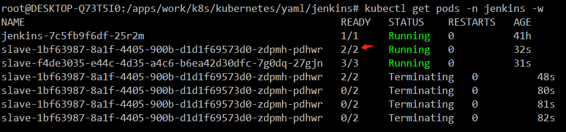
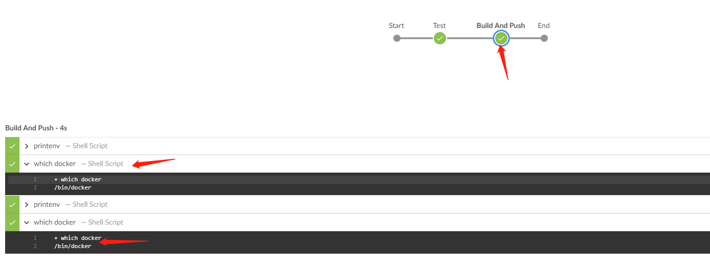
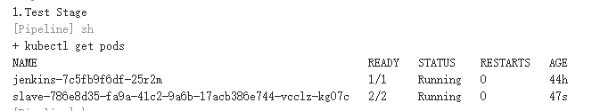
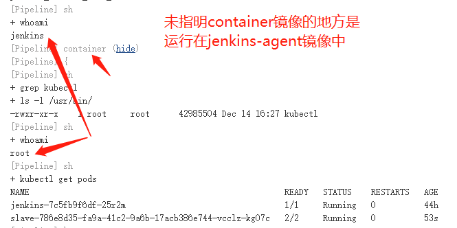
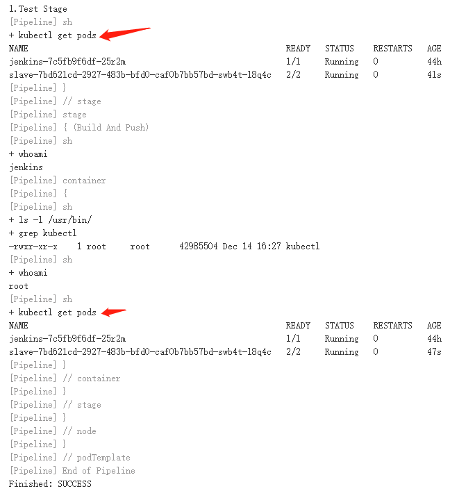

[toc]

# 应用场景

前面我们演示了在jenkins-ui里定义Pod模板，并在Job那里定义pipeline脚本。但是这不够灵活，如果我们希望Jenkinsfile与源码一起做版本管理，同时与Jenkins尽可能解藕，那就需要一切在Jenkinsfile里定义。

# 使用实例

```groovy
def label = "slave-${UUID.randomUUID().toString()}"
podTemplate(label: label, serviceAccount: 'jenkins', namespace: 'jenkins', containers: [
  containerTemplate(name: 'docker', image: 'docker', command: 'cat', ttyEnabled: true),
  containerTemplate(name: 'kubectl', image: 'cnych/kubectl', command: 'cat', ttyEnabled: true)
], volumes: [
  hostPathVolume(mountPath: '/home/jenkins/.kube', hostPath: '/root/.kube'),
  hostPathVolume(mountPath: '/var/run/docker.sock', hostPath: '/var/run/docker.sock')
]) {
    node(label) {
        def myRepo = checkout scm
        def gitCommit = myRepo.GIT_COMMIT
        def gitBranch = myRepo.GIT_BRANCH
        def gitVer = sh(script: "git rev-parse --short HEAD", returnStdout: true).trim()
        def dockerRegistryUrl = "harbor.dukanghub.com"
        def projectName = "test"

        stage('Test') {
          echo "1.Test Stage"
        }
        stage('Build And Push') {
            withCredentials([usernamePassword(credentialsId: 'harbor_test01', passwordVariable: 'harborPassword', usernameVariable: 'harborUser')]) {
                container('docker') {
                    echo "2.Build And Push Docker Image Stage"
                    image_name = "${dockerRegistryUrl}/${projectName}/jenkins-demo:${gitVer}"
                    echo "${image_name}"
                    sh """
                        docker login ${dockerRegistryUrl} -u ${harborUser} -p ${harborPassword}
                        docker build -t ${image_name} .
                        docker push ${image_name}
                        docker rmi ${image_name}
                    """
                }
            }
        }
        stage('Deploy') {
            container('kubectl') {
                echo "部署前查看default空间Pod列表"
                sh "kubectl get pods -n default"
                if (env.BRANCH_NAME == 'master') {
                    input "确认要部署线上环境吗？"
                }
                sh "sed -i 's#<IMAGE_NAME>#${image_name}#' k8s.yaml"
                sh "sed -i 's#<BRANCH_NAME>#${env.BRANCH_NAME}#' k8s.yaml"
                sh "cat k8s.yaml"
                sh "kubectl apply -f k8s.yaml --record"
                echo "部署后查看default空间Pod列表"
                sh "kubectl get pods -n default"
            }
        }
    }
}
```

上面的例子我们使用了一个动态的label,自定义的镜像，上面虽然只定义了两个镜像，但实际这个pod里会跑三个镜像，另一个就是jenkins-slave。

# 优化pipeline的一些写法

1. 这里的docker容器是否有必要存在，多一个镜像，总是很烦，本来pod运行的地方，肯定是有docker的，直接把宿主机的docker二进制文件挂载进来不就行了吗？--> 验证失败，有待进一步验证

2. kubectl似乎也可以这么做？-->验证成功，可以直接使用挂载方式挂载kubectl，无需kubectl镜像

3. 挂载.kube目录是否有必要？-->验证成功，没有必要

4. 用户名和密码凭据是否有必要使用`withCredentials`函数，用更简单，官方推荐的不是更好？

5. sh中双引号是否会泄露用户名和密码

为了测试上面的问题，我们先在目录的git上建立一个分支dev

```bash
git checkout -b dev
```

修改Jenkinsfile，先测试第一个问题，

去除docker镜像，

增加一个hostPathVolume，将宿主机的docker二进制文件挂载到容器/bin下，这个目录基本所有linux都有

修改stage2，将container改成`kubectl`

手动将镜像标签增加`dev`

```groovy
def label = "slave-${UUID.randomUUID().toString()}"
podTemplate(label: label, serviceAccount: 'jenkins', namespace: 'jenkins', containers: [
  containerTemplate(name: 'kubectl', image: 'cnych/kubectl', command: 'cat', ttyEnabled: true)
], volumes: [
  hostPathVolume(mountPath: '/home/jenkins/.kube', hostPath: '/root/.kube'),
  hostPathVolume(mountPath: '/var/run/docker.sock', hostPath: '/var/run/docker.sock'),
  hostPathVolume(mountPath: '/bin/docker', hostPath: '/usr/bin/docker')
]) {
    node(label) {
        def myRepo = checkout scm
        def gitCommit = myRepo.GIT_COMMIT
        def gitBranch = myRepo.GIT_BRANCH
        def gitVer = sh(script: "git rev-parse --short HEAD", returnStdout: true).trim()
        def dockerRegistryUrl = "harbor.dukanghub.com"
        def projectName = "test"

        stage('Test') {
          echo "1.Test Stage"
        }
        stage('Build And Push') {
            withCredentials([usernamePassword(credentialsId: 'harbor_test01', passwordVariable: 'harborPassword', usernameVariable: 'harborUser')]) {
                container('kubectl') {
                    echo "2.Build And Push Docker Image Stage"
                    image_name = "${dockerRegistryUrl}/${projectName}/jenkins-demo:dev-${gitVer}"
                    echo "${image_name}"
                    sh """
                        docker login ${dockerRegistryUrl} -u ${harborUser} -p ${harborPassword}
                        docker build -t ${image_name} .
                        docker push ${image_name}
                        docker rmi ${image_name}
                    """
                }
            }
        }
        stage('Deploy') {
            container('kubectl') {
                echo "部署前查看default空间Pod列表"
                sh "kubectl get pods -n default"
                if (env.BRANCH_NAME == 'master') {
                    input "确认要部署线上环境吗？"
                }
                sh "sed -i 's#<IMAGE_NAME>#${image_name}#' k8s.yaml"
                sh "sed -i 's#<BRANCH_NAME>#${env.BRANCH_NAME}#' k8s.yaml"
                sh "cat k8s.yaml"
                sh "kubectl apply -f k8s.yaml --record"
                echo "部署后查看default空间Pod列表"
                sh "kubectl get pods -n default"
            }
        }
    }
}
```

修改后，提交代码

```bash
# 提交到本地仓库
git commit -a -m "删除docker镜像"
# 提交到远程仓库
git push origin dev
```

补充点git命令的使用说明：

- git commit -am "str" 等于 git add . 和 git commit -m，但又有细微区别，就是只能提交**已经追踪过且修改了的文件**
- git add . 命令的作用就是将文件添加到本地的暂存区，
- git commit -m "str" 命令是将暂存区的代码提交到本地仓库
- git push是将本地代码提交到远程仓库

此时，远程git仓库上多了一个dev分支。内容也与master不一样

```bash
$ git branch -r
  origin/HEAD -> origin/master
  origin/dev
  origin/master
```

接下来，我们立即构建这个Job，两个分支都构建了，dev分支的pod只有两个镜像



这另一个镜像是`jenkins/jnlp-slave:3.35-5-alpine`

很不幸的是，报错了，报错如下:

```bash
+ docker login harbor.dukanghub.com -u **** -p ****

/home/jenkins/agent/workspace/multi-pipeline-demo_dev@tmp/durable-8fdfe75b/script.sh: line 1: docker: not found

script returned exit code 127
```

`docker: not found`？我们前面挂载的docker挂载到哪个容器去了呢？之前我的想法是所有容器都会挂载，我们在stage1里运行`which docker`，在stage2里也运行这个命令，同时使用绝对路径，移除其他所有代码

修改地方如下：

```groovy
stage('Test') {
  echo "1.Test Stage"
  // 输出所有环境变量看看
  sh "printenv"
  sh "which docker"
}
stage('Build And Push') {
  sh "which docker"
  sh "printenv"
  container('kubectl') {
    sh "which docker"
    sh "printenv"
  }
}
```

第一阶段输出如下：

```bash
+ which docker
/bin/docker
```

第二阶段两个调试位置也都输出了`docker`的位置



说明，我们在Jenkinsfile-Pod模板中定义的挂载会挂载到每个容器里。现在，既然知道有这个文件，那就需要测试一下，是权限的问题，还是文件路径的文件，修改Jenkinsfile如下

```groovy
stage('Test') {
  echo "1.Test Stage"
  // 输出所有环境变量看看
  sh "printenv"
  sh "which docker"
  sh "ls -l /var/run/"
  sh "/bin/docker info"
}
stage('Build And Push') {
  sh "printenv"
  sh "which docker"
  
  container('kubectl') {
    sh "printenv"
    sh "which docker"
    sh "ls -l /var/run/"
    sh "/bin/docker info"
  }
}
```

执行结果第一阶段就报错，报`找不到docker`

那我们将挂载路径改成和宿主机一样看看

```bash
hostPathVolume(mountPath: '/usr/bin/docker', hostPath: '/usr/bin/docker')
sh "/usr/bin/docker info"
```

依旧报错，明明有docker，却报错，难不成是权限问题？我们使用`kubectl`镜像看看，并增加`whoami`命令查看当前镜像使用的用户，第一个stage输出的是`jenkins`,第二个镜像输出的是`root`。且`docker`文件是真实存在的，至此，第一个测试论证失败。

**测试第2个问题** - 能否将kubectl挂载到镜像里不需要`kubectl`镜像

```groovy
def label = "slave-${UUID.randomUUID().toString()}"
podTemplate(label: label, serviceAccount: 'jenkins', namespace: 'jenkins', containers: [
  containerTemplate(name: 'docker', image: 'docker', command: 'cat', ttyEnabled: true)
], volumes: [
  hostPathVolume(mountPath: '/home/jenkins/.kube', hostPath: '/root/.kube'),
  hostPathVolume(mountPath: '/var/run/docker.sock', hostPath: '/var/run/docker.sock'),
  hostPathVolume(mountPath: '/usr/bin/kubectl', hostPath: '/apps/kubernetes/bin/kubectl')
]) {
    node(label) {
        def myRepo = checkout scm
        def gitCommit = myRepo.GIT_COMMIT
        def gitBranch = myRepo.GIT_BRANCH
        def gitVer = sh(script: "git rev-parse --short HEAD", returnStdout: true).trim()
        def dockerRegistryUrl = "harbor.dukanghub.com"
        def projectName = "test"

        stage('Test') {
          echo "1.Test Stage"
          sh "printenv"
          sh "which docker"
          sh "ls -l /var/run/"
          sh "ls -l /usr/bin/|grep kubectl"
          sh "whoami"
        }
        stage('Build And Push') {
            sh "printenv"
            sh "which docker"
            sh "whoami"
            container('docker') {
                sh "printenv"
                sh "which docker"
                sh "ls -l /var/run/"
                sh "ls -l /usr/bin/|grep kubectl"
                sh "whoami"
                sh "docker info"
            }
        }
    }
}
```

先测试docker的功能是否正常，第一步执行到`which docker`时报错，从这说明，如果你sh返回的代码非0，pipeline也会失败。我们修复这个问题重新提交代码。

pipeline执行成功，docker容器的docker可以正常使用(/usr/local/bin/docker)，每个容器里都有kubectl文件，接下来验证每个容器里的kubectl能否正常使用

```groovy
sh "kubectl get pods"
```

看下控制台输出，首先看下控制台输出的pod模板，加深下理解，有助于我们在声明式pipeline中定义pod模板

```yaml
apiVersion: "v1"
kind: "Pod"
metadata:
  annotations:
    buildUrl: "http://jenkins.jenkins:8080/job/jenkins-demo-dev-pipeline/8/"
  labels:
    jenkins: "slave"
    jenkins/slave-786e8d35-fa9a-41c2-9a6b-17acb386e744: "true"
  name: "slave-786e8d35-fa9a-41c2-9a6b-17acb386e744-vcclz-kg07c"
spec:
  containers:
  - command:
    - "cat"
    image: "docker"
    imagePullPolicy: "IfNotPresent"
    name: "docker"
    resources:
      limits: {}
      requests: {}
    securityContext:
      privileged: false
    tty: true
    volumeMounts:
    - mountPath: "/home/jenkins/.kube"
      name: "volume-0"
      readOnly: false
    - mountPath: "/usr/bin/kubectl"
      name: "volume-2"
      readOnly: false
    - mountPath: "/var/run/docker.sock"
      name: "volume-1"
      readOnly: false
    - mountPath: "/home/jenkins/agent"
      name: "workspace-volume"
      readOnly: false
  - env:
    - name: "JENKINS_SECRET"
      value: "********"
    - name: "JENKINS_AGENT_NAME"
      value: "slave-786e8d35-fa9a-41c2-9a6b-17acb386e744-vcclz-kg07c"
    - name: "JENKINS_NAME"
      value: "slave-786e8d35-fa9a-41c2-9a6b-17acb386e744-vcclz-kg07c"
    - name: "JENKINS_AGENT_WORKDIR"
      value: "/home/jenkins/agent"
    - name: "JENKINS_URL"
      value: "http://jenkins.jenkins:8080/"
    image: "jenkins/jnlp-slave:3.35-5-alpine"
    name: "jnlp"
    volumeMounts:
    - mountPath: "/home/jenkins/.kube"
      name: "volume-0"
      readOnly: false
    - mountPath: "/usr/bin/kubectl"
      name: "volume-2"
      readOnly: false
    - mountPath: "/var/run/docker.sock"
      name: "volume-1"
      readOnly: false
    - mountPath: "/home/jenkins/agent"
      name: "workspace-volume"
      readOnly: false
  nodeSelector:
    beta.kubernetes.io/os: "linux"
  restartPolicy: "Never"
  securityContext: {}
  serviceAccount: "jenkins"
  volumes:
  - hostPath:
      path: "/root/.kube"
    name: "volume-0"
  - hostPath:
      path: "/apps/kubernetes/bin/kubectl"
    name: "volume-2"
  - hostPath:
      path: "/var/run/docker.sock"
    name: "volume-1"
  - emptyDir:
      medium: ""
    name: "workspace-volume"
```

我们发现，两个stage都可以运行kubectl命令，同时我们发现，未指明container的地方都是运行在默认的jenkins-agent镜像中，我们在Jenkins文件中只定义了一个docker镜像，但是我们从pod中可以看到有两个镜像，另一个是`jenkins/jnlp-slave:3.35-5-alpine`





也就是说，**第二个问题，验证成功**，无需`kubectl`镜像

**验证第3个问题：**挂载.kube目录是否有必要？

移除Jenkinsfile关于此项的挂载

```groovy
hostPathVolume(mountPath: '/home/jenkins/.kube', hostPath: '/root/.kube'),
```

其实从上一个问题的测试中，两个容器里都可以运行kubectl命令，而第二个镜像，docker镜像，是没有jenkins用户的，但其依旧可以使用kubectl命令，要么不需要这个目录，会自动生成，要么挂载时，当挂载目录不存在，它依旧会创建这个目录/home/jenkins。不过我们还是测试一下，

jenkins控制台输出pod模板文件如下:

```yaml
apiVersion: "v1"
kind: "Pod"
metadata:
  annotations:
    buildUrl: "http://jenkins.jenkins:8080/job/jenkins-demo-dev-pipeline/9/"
  labels:
    jenkins: "slave"
    jenkins/slave-7bd621cd-2927-483b-bfd0-caf0b7bb57bd: "true"
  name: "slave-7bd621cd-2927-483b-bfd0-caf0b7bb57bd-swb4t-l8q4c"
spec:
  containers:
  - command:
    - "cat"
    image: "docker"
    imagePullPolicy: "IfNotPresent"
    name: "docker"
    resources:
      limits: {}
      requests: {}
    securityContext:
      privileged: false
    tty: true
    volumeMounts:
    - mountPath: "/usr/bin/kubectl"
      name: "volume-1"
      readOnly: false
    - mountPath: "/var/run/docker.sock"
      name: "volume-0"
      readOnly: false
    - mountPath: "/home/jenkins/agent"
      name: "workspace-volume"
      readOnly: false
  - env:
    - name: "JENKINS_SECRET"
      value: "********"
    - name: "JENKINS_AGENT_NAME"
      value: "slave-7bd621cd-2927-483b-bfd0-caf0b7bb57bd-swb4t-l8q4c"
    - name: "JENKINS_NAME"
      value: "slave-7bd621cd-2927-483b-bfd0-caf0b7bb57bd-swb4t-l8q4c"
    - name: "JENKINS_AGENT_WORKDIR"
      value: "/home/jenkins/agent"
    - name: "JENKINS_URL"
      value: "http://jenkins.jenkins:8080/"
    image: "jenkins/jnlp-slave:3.35-5-alpine"
    name: "jnlp"
    volumeMounts:
    - mountPath: "/usr/bin/kubectl"
      name: "volume-1"
      readOnly: false
    - mountPath: "/var/run/docker.sock"
      name: "volume-0"
      readOnly: false
    - mountPath: "/home/jenkins/agent"
      name: "workspace-volume"
      readOnly: false
  nodeSelector:
    beta.kubernetes.io/os: "linux"
  restartPolicy: "Never"
  securityContext: {}
  serviceAccount: "jenkins"
  volumes:
  - hostPath:
      path: "/var/run/docker.sock"
    name: "volume-0"
  - hostPath:
      path: "/apps/kubernetes/bin/kubectl"
    name: "volume-1"
  - emptyDir:
      medium: ""
    name: "workspace-volume"
```

从上面可以看出，并没有挂载`/root/.kube`，而下图可以看出，`kubectl`依旧可以使用



所以，第3个问题验证成功，无需挂载`/root/.kube`

**验证第4个问题：**用户名和密码凭据是否可以使用官方推荐的函数`credentials`

```groovy
def label = "slave-${UUID.randomUUID().toString()}"
podTemplate(label: label, serviceAccount: 'jenkins', namespace: 'jenkins', containers: [
  containerTemplate(name: 'docker', image: 'docker', command: 'cat', ttyEnabled: true)
], volumes: [
  hostPathVolume(mountPath: '/var/run/docker.sock', hostPath: '/var/run/docker.sock'),
  hostPathVolume(mountPath: '/usr/bin/kubectl', hostPath: '/apps/kubernetes/bin/kubectl')
]) {
    node(label) {
        def myRepo = checkout scm
        def gitBranch = myRepo.GIT_BRANCH
        def gitVer = sh(script: "git rev-parse --short HEAD", returnStdout: true).trim()
        def dockerRegistryUrl = "harbor.dukanghub.com"
        def projectName = "test"
      // 这里我们验证一下，不使用def能否定义变量且在下面各步骤使用
        HARBOR_CREDS = credentials('harbor_test01')
        stage('Test') {
          echo "1.Test Stage"
          //这里我们测试密码是否会在控制台明文输出
          echo "${HARBOR_CREDS_USR} ${HARBOR_CREDS_PSW}"
        }
        stage('Build And Push') {
            container('docker') {
                sh "kubectl get pods"
                sh "docker login ${dockerRegistryUrl} -u ${HARBOR_CREDS_USR} -p ${HARBOR_CREDS_PSW}"
            }
        }
    }
}
```

测试结果失败，报错如下

```
groovy.lang.MissingPropertyException: No such property: HARBOR_CREDS_USR for class: groovy.lang.Binding
	at groovy.lang.Binding.getVariable(Binding.java:63)
	at org.jenkinsci.plugins.scriptsecurity.sandbox.groovy.SandboxInterceptor.onGetProperty(SandboxInterceptor.java:270)
...
Finished: FAILURE
```

提示这个类没有`HARBOR_CREDS_USR`，我们打开jenkins官方文档看看是不是我们变量名写错了，或是需要使用def定义，又或是`credentials`这个函数不能用于脚本式，只能用于声明式pipeline。

先看官方文档

This directive supports a special helper method `credentials()` which can be used to access pre-defined Credentials by their identifier in the Jenkins environment.

| Required   | No                                                         |
| ---------- | ---------------------------------------------------------- |
| Parameters | *None*                                                     |
| Allowed    | Inside the `pipeline` block, or within `stage` directives. |

**Supported Credentials Type**

- Secret Text

  the environment variable specified will be set to the Secret Text content

- Secret File

  the environment variable specified will be set to the location of the File file that is temporarily created

- Username and password

  the environment variable specified will be set to `username:password` and two additional environment variables will be automatically defined: `MYVARNAME_USR` and `MYVARNAME_PSW` respectively.

- SSH with Private Key

  the environment variable specified will be set to the location of the SSH key file that is temporarily created and two additional environment variables may be automatically defined: `MYVARNAME_USR` and `MYVARNAME_PSW` (holding the passphrase).

|      | Unsupported credentials type causes the pipeline to fail with the message: `org.jenkinsci.plugins.credentialsbinding.impl.CredentialNotFoundException: No suitable binding handler could be found for type .` |
| ---- | ------------------------------------------------------------ |
|      |                                                              |

**Examples**

Jenkinsfile (Declarative Pipeline)

```groovy
pipeline {
    agent any
    environment { 
        CC = 'clang'
    }
    stages {
        stage('Example') {
            environment { 
                AN_ACCESS_KEY = credentials('my-prefined-secret-text') 
            }
            steps {
                sh 'printenv'
            }
        }
    }
}
```

|      | An `environment` directive used in the top-level `pipeline` block will apply to all steps within the Pipeline. |
| ---- | ------------------------------------------------------------ |
|      | An `environment` directive defined within a `stage` will only apply the given environment variables to steps within the `stage`. |
|      | The `environment` block has a helper method `credentials()` defined which can be used to access pre-defined Credentials by their identifier in the Jenkins environment. |

从上面的文档来看，变量名没写错，那就测试使用下定义前加上def，看看结果。结果依然报之前的错。我们再把这个写到stage里面看看。结果依然报错不变。如下设置查看

```groovy
environment { 
  HARBOR_CREDS = credentials('harbor_test01')
}
```

结果依旧失败。由此推测，这个可能只适用于声明式pipeline中。我们将Jenkinsfile改成声明式pipeline，如下：

```groovy
pipeline {
  agent {
    label 'jnlp'
  }
  environment { 
    HARBOR_CREDS = credentials('harbor_test01')
    }
  stages {
    stage('test-credentials') {
        steps {
            echo "${HARBOR_CREDS_USR} ${HARBOR_CREDS_PSW}"
        }
      
    }
  }
}
```

从下面的输出可以看出，可以正常使用，

```
Masking supported pattern matches of $HARBOR_CREDS or $HARBOR_CREDS_USR or $HARBOR_CREDS_PSW
[Pipeline] {
[Pipeline] stage
[Pipeline] { (test-credentials)
[Pipeline] echo
**** ****
[Pipeline] }
[Pipeline] // stage
[Pipeline] }
[Pipeline] // withCredentials
[Pipeline] }
[Pipeline] // withEnv
[Pipeline] }
[Pipeline] // node
[Pipeline] End of Pipeline
Finished: SUCCESS
```

由此，我们可以看出，在声明式pipeline中，用户名和密码凭据可以使用官方推荐的函数`credentials`，但在脚本式pipeline中不可以使用此函数。

接下来测试第5个问题**sh中双引号是否会泄露用户名和密码**

从上面的例子中，echo并不会泄露，显示的是星号。在sh中呢，修改如下

```groovy
pipeline {
  agent {
    label 'jnlp'
  }
  environment { 
    HARBOR_CREDS = credentials('harbor_test01')
  }
  stages {
    stage('test-credentials') {
        steps {
            sh "echo ${HARBOR_CREDS_USR} ${HARBOR_CREDS_PSW}"
        }
      
    }
  }
}
```

输出如下：

```
Masking supported pattern matches of $HARBOR_CREDS or $HARBOR_CREDS_USR or $HARBOR_CREDS_PSW
[Pipeline] {
[Pipeline] stage
[Pipeline] { (test-credentials)
[Pipeline] sh
+ echo **** ****
**** ****
[Pipeline] }
[Pipeline] // stage
[Pipeline] }
[Pipeline] // withCredentials
[Pipeline] }
[Pipeline] // withEnv
[Pipeline] }
[Pipeline] // node
[Pipeline] End of Pipeline
Finished: SUCCESS
```

说明在sh中使用双引号也不会泄露用户名和密码。

## 在声明式pipeline中定义一个Pod模板

```groovy
pipeline {
  agent {
    kubernetes {
        label "jenkins-slave"
        yaml """
apiVersion: "v1"
kind: "Pod"
metadata:
  labels:
    jenkins: "slave"
  name: jenkins-slave
spec:
  nodeSelector:
    beta.kubernetes.io/os: "linux"
  restartPolicy: "Never"
  securityContext: {}
  serviceAccount: "jenkins"
  volumes:
  - name: "volume-0"
    hostPath:
      path: "/var/run/docker.sock"
  - name: "volume-1"
    hostPath:
      path: "/apps/kubernetes/bin/kubectl"
  - name: "workspace-volume"
    emptyDir:
      medium: ""
  containers:
  - name: "jnlp"
    image: "jenkins/jnlp-slave:3.35-5-alpine"
    imagePullPolicy: "IfNotPresent"
    volumeMounts:
    - mountPath: "/usr/bin/kubectl"
      name: "volume-1"
      readOnly: false
    - mountPath: "/home/jenkins/agent"
      name: "workspace-volume"
      readOnly: false
  - name: "docker"
    image: "docker"
    imagePullPolicy: "IfNotPresent"
    securityContext:
      privileged: false
    tty: true
    volumeMounts:
    - mountPath: "/var/run/docker.sock"
      name: "volume-0"
      readOnly: false
    - mountPath: "/home/jenkins/agent"
      name: "workspace-volume"
      readOnly: false
"""
    }
  }
  stages {
    stage('test-containers') {
        steps {
            container('jnlp') {
                sh """
                    whoami
                    ls -l /usr/bin|grep kubectl
                    kubectl get pods
                """
            }
            container('docker') {
                sh """
                    whoami
                    ls -l /usr/local/bin |grep docker
                    docker info
                """
            }
        }
      
    }
  }
}
```

**注意：**在上面的模板中，生成的pod名字是以kubernetes模块内的label开头+随机字符串来命名slavePod的名字的，而非yaml里定义的label或name，但metadata里的labels那个键值对不能省，否则不会创建jnlp这个容器。restartPolicy: "Never"也不能省，否则会不断重启。serviceAccount: "jenkins"这个也不能省，否则会没有权限执行kubectl，还有`workspace-volume`p 这个卷，即使你不在docker容器里挂载，jenkins会自动给你补齐这个挂载。在steps中，如果未指明`container`，则命令运行在jnlp中。所以，接下来，我们要测试以下几点：

1. jnlp这个镜像不定义可不可以？-->经测试，不定义也是可以的。

2. 将kubectl挂载到docker镜像，看看能否使用，不定义`workspace`这个挂载，看看docker容器里是否有`/home/jenkins/agent`这个目录。-->经测试，不定义也是可以的。

   

最后，我们的pipeline精简为如下：

```groovy
pipeline {
  agent {
    kubernetes {
        label "jenkins-slave"
        yaml """
apiVersion: "v1"
kind: "Pod"
metadata:
  labels:
    jenkins: "slave"
  name: jenkins-slave
spec:
  nodeSelector:
    beta.kubernetes.io/os: "linux"
  restartPolicy: "Never"
  serviceAccount: "jenkins"
  volumes:
  - name: "volume-0"
    hostPath:
      path: "/var/run/docker.sock"
  - name: "volume-1"
    hostPath:
      path: "/apps/kubernetes/bin/kubectl"
  containers:
  - name: "docker"
    image: "docker"
    imagePullPolicy: "IfNotPresent"
    securityContext:
      privileged: false
    volumeMounts:
    - mountPath: "/var/run/docker.sock"
      name: "volume-0"
      readOnly: false
    - mountPath: "/usr/bin/kubectl"
      name: "volume-1"
      readOnly: false
"""
    }
  }

  stages {
    stage('test-pod-template') {
        steps {
            sh """
                whoami
            """
            container('docker') {
                sh """
                    whoami
                    ls -l /usr/local/bin |grep docker
                    docker info
                    kubectl get pods
                    ls -l /home/jenkins/agent/workspace/
                """
            }
        }
      
    }
  }
}
```

- `whoami`是用来测试当前命令是运行在哪个容器里，jnlp的用户是jenkins，docker容器的用户是root。第1个`whoami`所对应的sh未指明在哪个container里。第2个whoami指明了运行在container里，通过下面的几个命令进一步验证这个命令是运行在哪个容器里
- `ls -l /usr/local/bin |grep docker`和`docker info`是用来确认当前容器是不是docker，因为jnlp容器是没有docker的，而docker镜像的docker文件是在`/usr/local/bin`下，同时我们只将`/var/run/docker.sock`挂载到`docker`容器中，所以`docker info`会输出宿主机的`docker info`信息。
- `kubectl get pods`可以用来确认容器能否与k8s集群相连，有无权限，slavePod有没起来
- `ls -l /home/jenkins/agent/workspace/`用来确认在我们未并使用`checkout scm`和挂载`workspace-volume`到`docker`容器的情况下，docker容器里有没有代码

通过上面的对比，我们可以发现声明式pipeline与脚本式pipeline的一些区别。

- 脚本式pipeline和jenkinui里定义的pod模板，volume会挂载到模板里的每一个容器，而声明式pipeline可以选择性的挂载。
- 脚本式pipeline可通过在jenkinsui书写，无需放入源码版本管理，这对开发来说是无感的。不用改一下Jenkinsfile就需要提交一下代码，有这类需求的场景来说，这是一个优点。而声明式pipeline必须放在源码仓库。
- 声明式的官方说明文档多一些，而且Blue Ocean创建的也是声明式pipeline，相对脚本式，它有些结构更鲜明的函数。