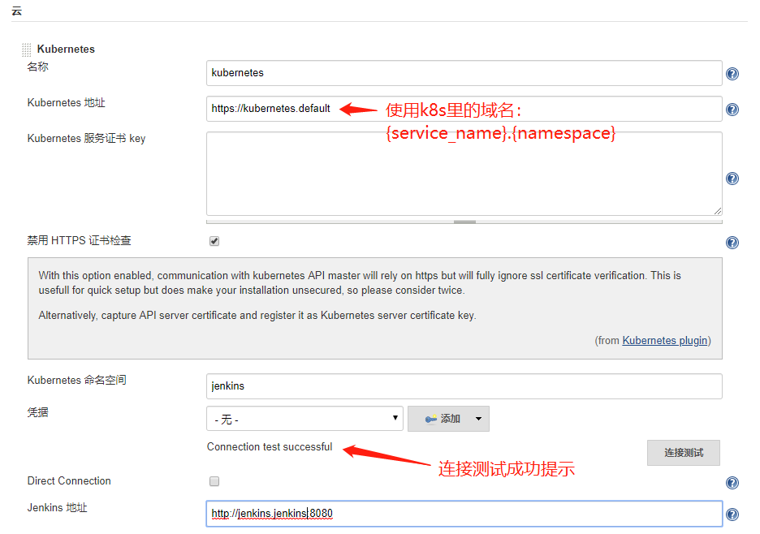
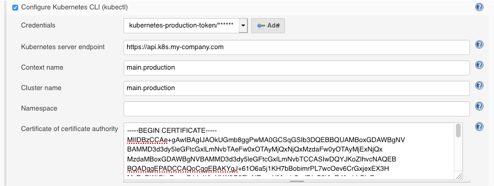

[toc]

# jenkins实用插件

- **插件的名字有可能会变**

- **下载插件前，设置科学上网代理或更换插件更新地址**

## 1. `Locale` 插件控制 Jenkins 页面国际化

默认 Jenkins 页面显示语言为英文，对于日常使用语言非英文的用户来说，就显得有点操作不便，该插件提供用户配置 Jenkins 页面国际化语言，例如中文、法语、泰文等等。首先我们需要去 “Manage Jenkins” —> “Manage Plugins” —> “Available” 中选择 “Locale” 插件，点击 “Install without restart”，安装完不需要重启。


安装完毕后，可以从 “Manage Jenkins” —> “Configure System” —> “Locale” 下 “Default Language” 输入框输入对应的语言英文缩写码，例如这里我想要简体中文，那么就需要填写` zh_CN`，并勾选 “Ignore browser preference and force this language to all users” 复选框，来强制所有用户使用该配置。

  

点击 “Save”，再次查看页面，页面大部分都已经显示为对应的中文简体了，包括各个 Job 配置页面部分也显示为中文简体了，这下很直观了。

但是，我装完这个插件跟没装差不多，所以这个插件装不装还待定。

## 2. `Build Name and Description Setter` 插件支持自定义 Build 名称和描述

Build Name Setter 和 Description Setter 插件可以支持修改每次构建的 Name 名称和 Description 描述信息，默认 Jenkins 每次构建名称为 #ID + 构建时间（ID 自增），且无描述信息。这样的弊端就是当某次构建出现了错误或者要排查某次构建信息，除了按构建时间区间挨个去点开日志，别无他法，而该插件可以很好的解决该问题。使用该插件，我们可以为每次构建设置自定义名称和描述信息，名称支持从文件中读取和 macro 模板，描述信息还支持 RegEx 表达式来从构建日志中提取信息。首先我们需要去 “系统管理” —> “管理插件” —> “可选插件” 中选择 “Build Name Setter” 和 “Description Setter” 插件，安装完不需要重启。

接下来我们创建一个简单的示例 Job 来使用一下这两个插件。新建名称为 “wy_tt” 的 Job，接收两个参数 version 和 branch，然后配置 Build Name 为 # ${BUILD_NUMBER}-${branch}，Build Description 为 构建版本：${version}。

  

 执行几次构建，每次修改传递的参数，此时去 Job 左侧构建历史里面，就可以看到每次构建的一些重要的辅助信息，这样将大大方便我们排查问题了。当然，我们还可以更高级的使用该插件，比如从文件中读取参数，使用表达式从构建日志中匹配 Key 值，这样功能将更加强大了。 

  

## 3. `Managed Script` 插件管理脚本文件

 该插件是为了在管理文件时创建 Script 脚本文件，然后在 Job 中配置直接使用，方便脚本的统一管理和维护。首先我们需要去 “系统管理” —> “管理插件” —> “可选插件” 中选择 “Managed script” 插件，安装重启即可 。

  

安装完毕后，可以从 “系统管理” —> “Managed files” —> “Add a new Config” 选择 “Managed script file” 类型，创建一个新的 shell 脚本文件，然后输入我们要执行的脚本代码。这里我创建了两个脚本，分别为 before-build-step-shell 和 after-build-step-shell，意思很明确了，前者在构建前执行的一些操作，后者在构建后执行的一些操作。

  

  

注意: 这里的脚本可以使用一些 Jenkins 系统的环境变量参数、参数化构建时传递的参数以及系统命令哦。

创建完毕后，我们在 Job 中构建处选择 “Execute managed script” 就可以使用这些脚本了。

  

## 4. `PostBuildScript` 插件根据 Build 状态执行脚本
推荐安装 `PostBuildScript` 插件，该插件可以在构建后操作中，根据构建结果状态，执行对应的脚本操作，很实用的一个插件。同上安装该插件，重启 Jenkins 完毕插件生效后，Job 中构建后操作处选择 “Execute Scripts” ，然后在 “Add build step” 中选择 “Execute shell” 等选项（当然也可以配合上一个插件，那么这里就选择 “Execute managed script”），下边选择一个 build 状态条件值，如果选择 SUCCESS 状态，那么该脚本只有在 Build 成功时才会执行，其他状态依次类推，状态可以多选哦，多选代表多种状态都能下触发。

  

## 5. `Jenkins2.0 Pipeline` 插件执行持续集成发布流程
Jenkins 2.0 的精髓是 Pipeline as Code，是帮助 Jenkins 实现 CI 到 CD 转变的重要角色。Pipeline是一套运行于 Jenkins 上的工作流框架，将原本独立运行于单个或者多个节点的任务连接起来，实现单个任务难以完成的复杂发布流程。Pipeline 中任何发布流程都可以表述为一段 Groovy 脚本，并且 Jenkins 支持从代码库直接读取脚本。使用 Pipeline 执行持续集成发布流程好处是显而易见的，它可以把以前需要多个节点上多个 Job 使用一段脚本来替代，而且脚本语言功能强大，可以很好的完成一些复杂的流程操作，推荐大家尝试使用。这里就不多说了，详细可以参考之前文章 初试``Jenkins2.0 Pipeline`持续集成。

## 6. `Kubernetes Plugin` 插件动态创建 Jenkins Slave
我们知道传统的 Jenkins Slave 一主多从方式会存在一些痛点，比如 Master 单点故障，Slave 配置环境差异，资源分配不均衡等导致可靠性和可维护性比较差，而使用 `Kubernetes Plugin `插件可以动态的创建和删除 Jenkins Slave 节点，使用它可以很好的保证服务高可用，动态伸缩合理使用资源，以及良好的扩展性。使用该插件后，它的工作流程大致为：当 Jenkins Master 接受到 Build 请求时，会根据配置的 Label 动态创建一个运行在 Docker Container 中的 Jenkins Slave 并注册到 Master 上，当运行完 Job 后，这个 Slave 会被注销并且 Docker Container 也会自动删除，恢复到最初状态。

 管理员账户登录 Jenkins Master 页面，点击 “系统管理” —> “管理插件” —> “可选插件” —> “Kubernetes plugin” 勾选安装即可。 

  

 安装完毕后，点击 “系统管理” —> “系统设置” —> “新增一个云” —> 选择 “Kubernetes”，然后填写 Kubernetes 和 Jenkins 配置信息。 

 

说明一下：

- Name 处默认为 `kubernetes`，也可以修改为其他名称，如果这里修改了，下边在执行 `Job` 时指定 `podTemplate()` 参数 `cloud `为其对应名称，否则会找不到，cloud 默认值取：`kubernetes`
- `Kubernetes URL` 处我填写了`https://kubernetes.default`  这里我填写了 `Kubernetes Service` 对应的 `DNS` 记录，通过该`DNS`  记录可以解析成该 `Service `的 `Cluster IP`，注意：也可以填写`` https://kubernetes.default.svc.cluster.local` 完整 DNS 记录，因为它要符合 `<svc_name>.<namespace_name>.svc.cluster.local `的命名方式，或者直接填写外部` Kubernetes` 的地址 `https://<ClusterIP>:<Ports>`。
- `Jenkins URL` 处我填写了` http://jenkins.jenkins:8080`，跟上边类似，也是使用`` Jenkins Service` 对应的 `DNS` 记录，不过要指定为 `8080` 端口，因为我们设置暴漏 8080 端口。同时也可以用 `http://<ClusterIP>:<Node_Port>` 方式。
  配置完毕，可以点击 `Test Connection` 按钮测试是否能够连接的到 `Kubernetes`，如果显示 `Connection test successful `则表示连接成功，配置没有问题。


## 7. `Kubernetes Cli Plugin`

插件github地址： https://github.com/jenkinsci/kubernetes-cli-plugin 

该插件可直接在Jenkins中使用`Kubernetes`命令进行操作，但得有权限。

该插件为`Jenkins Pipeline`提供`withKbeConfig()`功能。如下所示：

```groovy
node {
  stage('List pods') {
    withKubeConfig([credentialsId: '<credential-id>',
                    caCertificate: '<ca-certificate>',
                    serverUrl: '<api-server-address>',
                    contextName: '<context-name>',
                    clusterName: '<cluster-name>',
                    namespace: '<namespace>'
                    ]) {
      sh 'kubectl get pods'
    }
  }
}
```

| Name            | Mandatory | Description                                                  |
| --------------- | --------- | ------------------------------------------------------------ |
| `credentialsId` | yes       | The Jenkins ID of the plain KubeConfig file.                 |
| `serverUrl`     | no        | URL of the API server's. This will create a new `cluster` block and modify the current Context to use it. |
| `caCertificate` | no        | Cluster Certificate Authority used to validate the API server's certificate if a `serverUrl`was provided. The validation is skipped if the parameter is not provided. |
| `clusterName`   | no        | Modifies the Cluster of the current Context. Also used for the generated `cluster`block if a `serverUrl` was provided. |
| `namespace`     | no        | Modifies the Namespace of the current Context.               |
| `contextName`   | no        | Switch the current Context to this name. The Context must already exist in the KubeConfig file. |

### Using the plugin from the web interface

1. Within the Jenkins dashboard, select a Job and then select "Configure"
2. Scroll down and click the "Add build step" dropdown
3. Select "Configure Kubernetes CLI (kubectl)"
4. In the "Credential" dropdown, select the credentials to authenticate on the cluster or the kubeconfig stored in Jenkins.



## 8.  `Kubernetes Continuous Deploy Plugin`

 `kubernetes`部署插件，可根据需要使用 

## 9. 构建触发器相关说明

### 触发器插件

- Gitlab Hook ----官方说不安全，不推荐使用

- Build Authorization Token Root

- Gitee

  该插件通过伪造Gitee CI服务器将Gitee集成到Jenkins。当提交代码或打开/更新请求请求时，此插件允许Gitee触发Jenkins中的构建。它还可以将构建状态发送回Gitee。

- GitLab

  该插件允许GitLab触发Jenkins构建并在GitLab UI中显示其结果。

### 触发器说明

以下大多数触发器都不能用于multipipeline中

- Generic Webhook Trigger Plugin

  

- Poll SCM(轮询SCM)

  隔一段时间比较一次源代码如果发生变更，那么就build。否则，不进行build，每次轮询都需要Jenkins扫描整个工作区并使用服务器进行验证；

- 触发远程构建

  设置一个token，然后将显示的链接写到git仓库，当有提交时，触发这个链接。它就会自动触发这个构建。

- build after other projects are built (其他工程构建后触发 )

  当本job依赖的job被build时，执行本job ，一般也用不太多

- build periodically-定时构建(不推荐)

  隔一段时间build一次，不管版本库代码是否发生变化，通常不会采用此种方式。

- Gitee webhook

  依赖插件：Gitee

  需要在 Gitee webhook 中填写 URL: https://jenkins.dukanghub.com/gitee-project/pipeline-demo

  