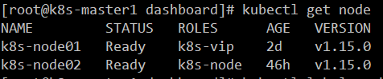
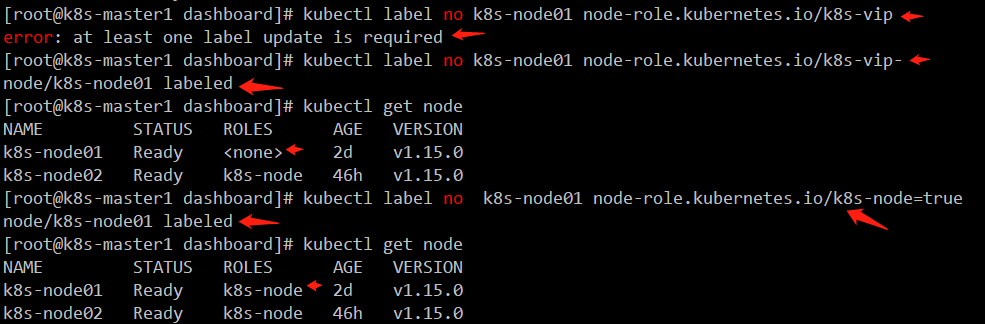
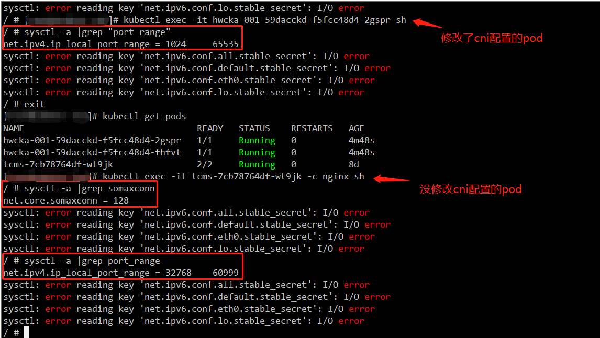
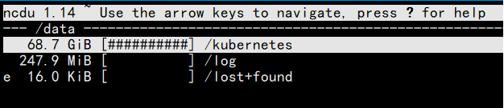

<font size=4>

[toc]
# k8s使用问题收集
## 1. 如何启用`ipvs`
node节点操作
- 启用ipvs模块
```bash
# 查看ipvs内核模块是否加载
lsmod |grep ip_vs
# 如果为空，一般默认都没加载，则需加载一下，加EOF间的内容写到这个文件中
cat >/etc/sysconfig/modules/ipvs.modules <<EOF
#!/bin/bash
ipvs_mods_dir="/usr/lib/modules/$(uname -r)/kernel/net/netfilter/ipvs"
for i in $(ls $ipvs_mods_dir|grep -o "^[^.]*");do
  /sbin/modinfo -F filename $i &> /dev/null
  if [ $? -eq 0 ];then
    /sbin/modprobe $i
  fi
done
EOF
chmod u+x /etc/sysconfig/modules/ipvs.modules
bash /etc/sysconfig/modules/ipvs.modules
```
- `kube-proxy`增加以下参数
```conf
# 这个cluster-cidr根据自己需要改，主要是后面两参数
--cluster-cidr='10.254.0.0/16' \
--proxy-mode=ipvs \
--masquerade-all=true \
```
然后重启`kube-proxy`
- 怎样确认`ipvs`是否生效
方法一：下载ipvsadm查看
```bash
# 
yum -y install ipvsadm
ipvsadm -Ln
```
输出大致如下：
```bash
IP Virtual Server version 1.2.1 (size=4096)
Prot LocalAddress:Port Scheduler Flags
  -> RemoteAddress:Port           Forward Weight ActiveConn InActConn
TCP  192.168.1.223:32546 rr
  -> 10.254.69.2:8443             Masq    1      0          0         
TCP  10.254.0.1:443 rr
  -> 192.168.1.221:6443           Masq    1      1          0         
TCP  10.254.69.0:32546 rr
  -> 10.254.69.2:8443             Masq    1      0          0         
TCP  10.254.69.1:32546 rr
  -> 10.254.69.2:8443             Masq    1      0          0         
TCP  10.254.150.141:443 rr
  -> 10.254.69.2:8443             Masq    1      0          0         
TCP  127.0.0.1:32546 rr
  -> 10.254.69.2:8443             Masq    1      0          0         
```
从上面可以看到默认的`ipvs`负载策略是`rr`轮询，可在`kube-proxy`配置`ipvs`负载策略及其他参数。具体可使用`kube-proxy --help`查看
## 2. 如何将单`master`集群扩展为双(多)`master`集群
### master节点(apiserver)环境如下
角色 | 旧IP | 新IP | 组件
---|---|---|---
apiserver| 192.168.1.221|192.168.1.221,192.168.1.222|kube-apiserver  kube-controller-manager  kube-scheduler
apiserver-vip ||192.168.1.211,192.168.1.212
### 重新制作apiserver的证书
以下操作在`旧master`上操作
```bash
export K8S_APISERVER_VIP=" \
    \"192.168.1.221\", \
    \"192.168.1.222\", \
    \"192.168.1.211\", \
    \"192.168.1.212\", \
" && \
export K8S_APISERVER_SERVICE_CLUSTER_IP="10.254.0.1" && \
export K8S_APISERVER_HOSTNAME="api.k8s.dukanghub.com" && \
export K8S_CLUSTER_DOMAIN_SHORTNAME="cluster" && \
export K8S_CLUSTER_DOMAIN_FULLNAME="cluster.local" && \
cat << EOF | tee k8s_apiserver.json
{
  "CN": "kubernetes",
  "hosts": [
    "127.0.0.1",
    ${K8S_APISERVER_VIP}
    "${K8S_APISERVER_SERVICE_CLUSTER_IP}", 
    "${K8S_APISERVER_HOSTNAME}",
    "kubernetes",
    "kubernetes.default",
    "kubernetes.default.svc",
    "kubernetes.default.svc.${K8S_CLUSTER_DOMAIN_SHORTNAME}",
    "kubernetes.default.svc.${K8S_CLUSTER_DOMAIN_FULLNAME}"    
  ],
  "key": {
    "algo": "rsa",
    "size": 2048
  },
  "names": [
    {
      "C": "CN",
      "ST": "GuangDong",
      "L": "GuangZhou",
      "O": "k8s",
      "OU": "System"
    }
  ]
}
EOF
# K8S_APISERVER_HOSTNAME设置为真实的域名，通过解析到两个VIP上，可在高可用的基础上达到流量分摊
# 生成Kubernetes API Server 证书和私钥
cfssl gencert \
-ca=/opt/kubernetes/ssl/ca.pem \
-ca-key=/opt/kubernetes/ssl/ca-key.pem \
-config=/opt/kubernetes/ssl/ca-config.json \
-profile=kubernetes \
k8s_apiserver.json | \
cfssljson -bare k8s_server
```
### 分发`apisever`证书到另一个`master`节点
```bash
scp -r k8s_server*.pem root@192.168.1.222:/opt/kubernetes/ssl/
```
### 修改`旧apiserver`(IP: `192.168.1.221`)配置文件，使用新的`server`证书
```conf
## KUBE_APISERVER_OPTS 修改以下配置使用新的证书，并使用新的端口5443，6443端口留给VIP用
    --secure-port=5443
    --tls-cert-file=/opt/kubernetes/ssl/k8s_server.pem 
    --tls-private-key-file=/opt/kubernetes/ssl/k8s_server-key.pem
    --kubelet-client-certificate=/opt/kubernetes/ssl/k8s_server.pem  
    --kubelet-client-key=/apps/kubernetes/ssl/k8s/k8s_server-key.pem 
```
### 同理，修改`kube-controller-manager`和`kube-scheduler`配置，启用新的`server`证书
### 新的`master`节点配置参照上面的的旧节点配置
### 安装`haproxy`及`keepalived`
```bash
yum install -y haproxy keepalived
```
修改 haproxy 配置
```bash
vim /etc/haproxy/haproxy.cfg
frontend kube-apiserver-https
  mode tcp
  bind :6443
  default_backend kube-apiserver-backend
backend kube-apiserver-backend
  mode tcp
  server 192.168.1.221-api 192.168.1.221:5443 check
  server 192.168.1.222-api 192.168.1.222:5443 check
```
启动haproxy
```bash
systemctl start haproxy
```
配置另一个master的haproxy配置，同上一样
修改keepalived配置文件
`master01`(`192.168.1.221`)做主节点，配置如下
```bash
cat /etc/keepalived/keepalived.conf
! Configuration File for keepalived

global_defs {
 router_id LVS_DEVEL
}

vrrp_script check_haproxy {
  script "killall -0 haproxy"
  interval 3
  weight -2
  fall 10
  rise 2
}

vrrp_instance VI_1 {
  state MASTER
  interface br0
  virtual_router_id 51
  priority 250
  advert_int 2
  authentication {
    auth_type PASS
    auth_pass  99ce6e3381dc326633737ddaf5d904d2
  }
  virtual_ipaddress {
    192.168.1.211/24
  }
  track_script {
    check_haproxy
  }
}
```
`master02`(`192.168.1.222`)配置如下
```bash
cat /etc/keepalived/keepalived.conf
 ! Configuration File for keepalived

global_defs {
 router_id LVS_DEVEL
}

vrrp_script check_haproxy {
  script "killall -0 haproxy"
  interval 3
  weight -2
  fall 10
  rise 2
}

vrrp_instance VI_1 {
  state BACKUP
  interface br0
  virtual_router_id 51
  priority 249
  advert_int 2
  authentication {
    auth_type PASS
    auth_pass 99ce6e3381dc326633737ddaf5d904d2
  }
  virtual_ipaddress {
    192.168.30.254/24
  }
  track_script {
    check_haproxy
  }
}
```
启动两台的`keepalived`
```bash
systemctl start keepalived
```
在旧master节点`ip a`查看VIP是否在本机
测试VIP(https://192.168.1.211:6443)是否能访问
### 修改node节点配置
修改`bootstrap.kubeconfig`、`kubelet.kubeconfig`两个文件连接地址
本地~/.kube/config 文件连接地址(kubectl使用的配置文件)
可以使用vim 修改
```
server: https://192.168.1.211:6443
```
修改完后重启`kubelet`
## 3. Docker配置`/etc/docker/daemon.json`
```bash
# 设置国内镜像仓库及企业私仓
{
  "registry-mirrors": ["https://docker.mirrors.ustc.edu.cn", "https://harbor.dukanghub.com"],
  "insecure-registries": ["harbor.dukanghub.com"]
}
# OverlayFS是一个新一代的联合文件系统，类似于AUFS，但速度更快，实现更简单。Docker为OverlayFS提供了两个存储驱动程序:旧版的overlay，新版的overlay2(更稳定)。

# 先决条件:

# overlay2: Linux内核版本4.0或更高版本，或使用内核版本3.10.0-514+的RHEL或CentOS。
# overlay: 主机Linux内核版本3.18+
# 支持的磁盘文件系统
# ext4(仅限RHEL 7.1)
# xfs(RHEL7.2及更高版本)，需要启用d_type=true。
{
  "storage-driver": "overlay2",
  "storage-opts": ["overlay2.override_kernel_check=true"]
}
# 容器在运行时会产生大量日志文件，很容易占满磁盘空间。通过配置日志驱动来限制文件大小与文件的数量。 >限制单个日志文件为50M,最多产生3个日志文件
{
"log-driver": "json-file",
"log-opts": {
    "max-size": "50m",
    "max-file": "3"
    }
}
```
## 4. 已注册的node但打错了role，怎么修改
如下图，node打成了k8s-vip了，想改回k8s-node

操作方法：
先去掉这个标签
```bash
# 注意末尾的那个'-'是必须的，否则会报错error: at least one label update is required
kubectl label no k8s-node01 node-role.kubernetes.io/k8s-vip-
```
再重新打上新的标签
```bash
kubectl label no  k8s-node01 node-role.kubernetes.io/k8s-node=true
```
整个操作过程截图如下


## 5. 怎么移除node

以移除k8s-node02为例

先封锁要移除的node，驱除此node上的pod

```bash
kubectl drain k8s-node02 --delete-local-data --force --ingore-daemonsets
```

接着删除这个node

```bash
kubectl delete node k8s-node02
```

## 6.  用了kube-router后，容器无法连接外网

node可以上网，但是容器却无法上网，一直找不到答案，只好改用kube-proxy+flanneld试下。改完后发现还是无法上网，于是停止所有组件，只保留docker，还是无法上网。准备排查。

通过tcpdump在宿主机抓包，发现包已经到达本机，而容器的包我们发现也出去了，但只能回到宿主机，于是我们先开启iptables日志(因为docker会自动生成iptables规则)

查看所有iptables规则

```bash
# iptables-save
# Generated by iptables-save v1.4.21 on Thu Nov 21 09:27:59 2019
*filter
:INPUT ACCEPT [9425:1623910]
:FORWARD ACCEPT [0:0]
:OUTPUT ACCEPT [1320:202250]
:DOCKER - [0:0]
:DOCKER-ISOLATION-STAGE-1 - [0:0]
:DOCKER-ISOLATION-STAGE-2 - [0:0]
:DOCKER-USER - [0:0]
-A FORWARD -j DOCKER-USER
-A FORWARD -j DOCKER-ISOLATION-STAGE-1
-A FORWARD -o docker0 -m conntrack --ctstate RELATED,ESTABLISHED -j ACCEPT
-A FORWARD -o docker0 -j DOCKER
-A FORWARD -i docker0 ! -o docker0 -j ACCEPT
-A FORWARD -i docker0 -o docker0 -j ACCEPT
-A DOCKER-ISOLATION-STAGE-1 -i docker0 ! -o docker0 -j DOCKER-ISOLATION-STAGE-2
-A DOCKER-ISOLATION-STAGE-1 -j RETURN
-A DOCKER-ISOLATION-STAGE-2 -o docker0 -j DROP
-A DOCKER-ISOLATION-STAGE-2 -j RETURN
-A DOCKER-USER -j RETURN
COMMIT
# Completed on Thu Nov 21 09:27:59 2019
# Generated by iptables-save v1.4.21 on Thu Nov 21 09:27:59 2019
*nat
:PREROUTING ACCEPT [2001:362292]
:INPUT ACCEPT [1919:355324]
:OUTPUT ACCEPT [280:21209]
:POSTROUTING ACCEPT [280:21209]
:DOCKER - [0:0]
-A PREROUTING -m addrtype --dst-type LOCAL -j DOCKER
-A OUTPUT ! -d 127.0.0.0/8 -m addrtype --dst-type LOCAL -j DOCKER
-A POSTROUTING -s 172.17.0.0/16 ! -o docker0 -j MASQUERADE
-A DOCKER -i docker0 -j RETURN
COMMIT
# Completed on Thu Nov 21 09:27:59 2019
```

似乎没什么特别的，先部署出去的包日志

```bash
iptables -t nat -I DOCKER -p icmp -j LOG --log-level 6 --log-prefix "## this is ping ##"
# 若要指定icmp类型，可加参数--icmp-type 8之类的，8代表echo
iptables -t nat -I PREROUTING -p icmp -j LOG --log-level 6 --log-prefix "## this is ping ##"
iptables -t nat -I INPUT -p icmp -j LOG --log-level 6 --log-prefix "## this is ping ##"
iptables -t nat -I OUTPUT -p icmp -j LOG --log-level 6 --log-prefix "## this is ping ##"
iptables -I INPUT -p icmp -j LOG --log-level 6 --log-prefix "## this is ping ##"
iptables -I DOCKER-USER -p icmp -j LOG --log-level 6 --log-prefix "## this is ping ##"
iptables -I INPUT -i ens33 -p icmp -j LOG --log-prefix "## this is ping ##" --log-level 6
iptables -I OUTPUT -p icmp -j LOG --log-prefix "## this is ping ##" --log-level 6
```

运行日志ping下外部IP，系统日志大约如下

```bash
# tail -f /var/log/messages|grep "## this is ping ##"
Nov 21 10:12:04 k8s-node1 kernel: ## this is ping ##IN=docker0 OUT= PHYSIN=veth1cdf52d MAC=02:42:27:6f:e0:3f:02:42:ac:11:00:02:08:00 SRC=172.17.0.2 DST=172.18.6.61 LEN=84 TOS=0x00 PREC=0x00 TTL=64 ID=3719 DF PROTO=ICMP TYPE=8 CODE=0 ID=2560 SEQ=0 
Nov 21 10:12:04 k8s-node1 kernel: ## this is ping ##IN=docker0 OUT=ens33 PHYSIN=veth1cdf52d MAC=02:42:27:6f:e0:3f:02:42:ac:11:00:02:08:00 SRC=172.17.0.2 DST=172.18.6.61 LEN=84 TOS=0x00 PREC=0x00 TTL=63 ID=3719 DF PROTO=ICMP TYPE=8 CODE=0 ID=2560 SEQ=0 
Nov 21 10:12:04 k8s-node1 kernel: ## this is ping ##IN= OUT=ens33 SRC=192.168.1.224 DST=172.18.6.61 LEN=112 TOS=0x00 PREC=0xC0 TTL=64 ID=4976 PROTO=ICMP TYPE=11 CODE=0 [SRC=172.18.6.61 DST=172.17.0.2 LEN=84 TOS=0x00 PREC=0x00 TTL=1 ID=46531 PROTO=ICMP TYPE=0 CODE=0 ID=2560 SEQ=0 ] 
```

然而，并未发现什么有用的信息。


## 7. 运行中的集群怎样改网络方案

将`kube-router`改成`kube-proxy+flannel`

先依次停止node,lb,ingress上的docker,kubelet,kube-router

```bash
cd /apps/work/k8s
ansible -i host node,lb -m service -a 'name=docker state=stopped'
ansible -i host node,lb -m service -a 'name=kubelet state=stopped'
ansible -i host node,lb -m service -a 'name=kube-router state=stopped'
ansible -i host node,lb -m shell -a 'systemctl disable kube-router'
```

再依次清空原来的网络规则

```bash
ansible -i host node,lb -m shell -a '/apps/kube-router/bin/kube-router --cleanup-config'
```

再看下iptables规则是否清空了

```bash
iptables-save
```

如果规则清理报错，清理不干净，就如下操作，

```bash
iptables-save > iptables.bak
# 然后手动把规则全部删除，末尾COMMIT两行保留
iptables-restore < iptables.bak
# 重新从文件载入规则后，再iptables-save看下规则全没了吧
```

删除`kube-router`生成的网卡

```bash
ip link del dev kube-bridge
ip link del dev dummy0
```

创建flannel证书配置(k8s-operator上操作)

```bash
cat << EOF | tee /apps/work/k8s/cfssl/k8s/flannel.json
{
  "CN": "flannel",
  "hosts": [""], 
  "key": {
    "algo": "rsa",
    "size": 2048
  },
  "names": [
    {
      "C": "CN",
      "ST": "GuangDong",
      "L": "GuangZhou",
      "O": "system:masters",
      "OU": "Kubernetes-manual"
    }
  ]
}
EOF
```

生成flannel证书和秘钥

```bash
cfssl gencert \
        -ca=/apps/work/k8s/cfssl/pki/k8s/k8s-ca.pem \
        -ca-key=/apps/work/k8s/cfssl/pki/k8s/k8s-ca-key.pem \
        -config=/apps/work/k8s/cfssl/ca-config.json \
        -profile=kubernetes \
         /apps/work/k8s/cfssl/k8s/flannel.json | \
         cfssljson -bare /apps/work/k8s/cfssl/pki/k8s/flannel
```

创建kube-proxy证书配置

```bash
cat << EOF | tee /apps/work/k8s/cfssl/k8s/kube-proxy.json
{
  "CN": "system:kube-proxy",
  "hosts": [""], 
  "key": {
    "algo": "rsa",
    "size": 2048
  },
  "names": [
    {
      "C": "CN",
      "ST": "GuangDong",
      "L": "GuangZhou",
      "O": "system:masters",
      "OU": "Kubernetes-manual"
    }
  ]
}
EOF
```

生成kube-proxy证书和秘钥

```bash
cfssl gencert \
        -ca=/apps/work/k8s/cfssl/pki/k8s/k8s-ca.pem \
        -ca-key=/apps/work/k8s/cfssl/pki/k8s/k8s-ca-key.pem \
        -config=/apps/work/k8s/cfssl/ca-config.json \
        -profile=kubernetes \
         /apps/work/k8s/cfssl/k8s/kube-proxy.json | \
         cfssljson -bare /apps/work/k8s/cfssl/pki/k8s/kube-proxy
```

创建flannel kubeconfig

```bash
cd /apps/work/k8s
mkdir -p flannel/{bin,conf,ssl}
cd flannel/conf
export KUBE_APISERVER="https://api.k8s.dukanghub.com:6443"
# 设置集群参数
kubectl config set-cluster kubernetes \
    --certificate-authority=/apps/work/k8s/cfssl/pki/k8s/k8s-ca.pem \
    --embed-certs=true \
    --server=${KUBE_APISERVER} \
    --kubeconfig=kubeconfig.conf
# 设置客户端认证参数
kubectl config set-credentials flannel \
    --client-certificate=/apps/work/k8s/cfssl/pki/k8s/flannel.pem \
    --client-key=/apps/work/k8s/cfssl/pki/k8s/flannel-key.pem \
    --embed-certs=true \
    --kubeconfig=kubeconfig.conf
# 设置上下文参数
kubectl config set-context default \
    --cluster=kubernetes \
    --user=flannel \
    --kubeconfig=kubeconfig.conf
# 设置默认上下文
kubectl config use-context default --kubeconfig=kubeconfig.conf
```

将flannel证书复制到其目录下

```bash
cp /apps/work/k8s/cfssl/pki/k8s/flannel* /apps/work/k8s/flannel/ssl/
```

创建kube-proxy kubeconfig

```bash
cd /apps/work/k8s
mkdir -p kube-proxy/{bin,conf,ssl}
cd kube-proxy/conf
export KUBE_APISERVER="https://api.k8s.dukanghub.com:6443"
# 设置集群参数
kubectl config set-cluster kubernetes \
    --certificate-authority=/apps/work/k8s/cfssl/pki/k8s/k8s-ca.pem \
    --embed-certs=true \
    --server=${KUBE_APISERVER} \
    --kubeconfig=kube-proxy.kubeconfig 
# 设置客户端认证参数
kubectl config set-credentials system:kube-proxy \
    --client-certificate=/apps/work/k8s/cfssl/pki/k8s/kube-proxy.pem \
    --client-key=/apps/work/k8s/cfssl/pki/k8s/kube-proxy-key.pem \
    --embed-certs=true \
    --kubeconfig=kube-proxy.kubeconfig 
# 设置上下文参数
kubectl config set-context default \
    --cluster=kubernetes \
    --user=system:kube-proxy \
    --kubeconfig=kube-proxy.kubeconfig 
# 设置默认上下文
kubectl config use-context default --kubeconfig=kube-proxy.kubeconfig 
```

将kube-proxy的证书复制到kube-proxy目录下

```bash
cp /apps/work/k8s/cfssl/pki/k8s/kube-proxy* /apps/work/k8s/kube-proxy/ssl/
```


创建kube-proxy配置文件

`vim kube-proxy`

```conf
KUBE_PROXY_OPTS="--logtostderr=false \
--v=2 \
--feature-gates=SupportIPVSProxyMode=true \
--masquerade-all=true \
--proxy-mode=ipvs \
--ipvs-min-sync-period=5s \
--ipvs-sync-period=5s \
--ipvs-scheduler=rr \
--cluster-cidr=10.48.0.0/12 \
--log-dir=/apps/kubernetes/log \
--kubeconfig=/apps/kubernetes/conf/kube-proxy.kubeconfig"
```

<font color="red">注意：</font>`--cluster-cidr`指的是pod的IP范围，需要跟你前面指定的podIp范围一致。

创建kube-proxy启动脚本

`vim kube-proxy.service`

```service
[Unit]
Description=Kubernetes Proxy
After=network.target

[Service]
LimitNOFILE=1024000
LimitNPROC=1024000
LimitCORE=infinity
LimitMEMLOCK=infinity
EnvironmentFile=-/apps/kubernetes/conf/kube-proxy
ExecStart=/apps/kubernetes/bin/kube-proxy $KUBE_PROXY_OPTS
Restart=on-failure
RestartSec=5
[Install]
WantedBy=multi-user.target
```

分发kube-proxy文件并启动

```bash
cd /apps/work/k8s
ansible node,lb -m copy -a "src=kube-proxy/conf/kube-proxy dest=/apps/kubernetes/conf/kube-proxy"
ansible node,lb -m copy -a "src=kube-proxy/conf/kube-proxy.kubeconfig dest=/apps/kubernetes/conf/kube-proxy.kubeconfig"
ansible node,lb -m copy -a "src=kube-proxy/conf/kube-proxy.service dest=/usr/lib/systemd/system/kube-proxy.service"
ansible node,lb -m shell -a 'systemctl daemon-reload'
ansible node,lb -m service -a 'name=kube-proxy state=started enabled=yes'
```

部署flannel到pod中

创建flannel configmap kubeconfig

```bash
cd /apps/work/k8s/flannel/conf
kubectl create cm "kube-proxy" --from-file=kubeconfig.conf -n kube-system
```

创建flannel的yaml文件

`vim kube-flannel.yaml`

```yaml
---
kind: ClusterRole
apiVersion: rbac.authorization.k8s.io/v1beta1
metadata:
  name: flannel
rules:
  - apiGroups:
      - ""
    resources:
      - pods
    verbs:
      - get
  - apiGroups:
      - ""
    resources:
      - nodes
    verbs:
      - list
      - watch
  - apiGroups:
      - ""
    resources:
      - nodes/status
    verbs:
      - patch
---
kind: ClusterRoleBinding
apiVersion: rbac.authorization.k8s.io/v1beta1
metadata:
  name: flannel
roleRef:
  apiGroup: rbac.authorization.k8s.io
  kind: ClusterRole
  name: flannel
subjects:
- kind: ServiceAccount
  name: flannel
  namespace: kube-system
---
apiVersion: v1
kind: ServiceAccount
metadata:
  name: flannel
  namespace: kube-system
---
kind: ConfigMap
apiVersion: v1
metadata:
  name: kube-flannel-cfg
  namespace: kube-system
  labels:
    tier: node
    app: flannel
data:
  cni-conf.json: |
     {
     "name":"cni0",
     "cniVersion":"0.3.1",
     "plugins":[
       {
         "type":"flannel",
         "delegate":{
          "hairpinMode": true,
           "isDefaultGateway":true
         }
       },
       {
         "type":"portmap",
         "capabilities":{
           "portMappings":true
         }
       }
     ]
     }
  net-conf.json: |
    {
      "Network": "10.48.0.0/12",
      "Backend": {
        "Type": "vxlan"
      }
    }
---
apiVersion: apps/v1
kind: DaemonSet
metadata:
  name: kube-flannel-ds-amd64
  namespace: kube-system
  labels:
    tier: node
    app: flannel
spec:
  selector:
    matchLabels:
      app: flannel
  template:
    metadata:
      labels:
        tier: node
        app: flannel
    spec:
      hostNetwork: true
      nodeSelector:
        beta.kubernetes.io/arch: amd64
      tolerations:
      - operator: Exists
        effect: NoSchedule
      serviceAccountName: flannel
      initContainers:
      - name: install-cni
        image: quay.io/coreos/flannel:v0.11.0-amd64
        command:
        - cp
        args:
        - -f
        - /etc/kube-flannel/cni-conf.json
        - /etc/cni/net.d/10-flannel.conflist
        volumeMounts:
        - name: cni
          mountPath: /etc/cni/net.d
        - name: flannel-cfg
          mountPath: /etc/kube-flannel/
      containers:
      - name: kube-flannel
        image: quay.io/coreos/flannel:v0.11.0-amd64
        command:
        - /opt/bin/flanneld
        args:
        - --ip-masq
        - --kube-subnet-mgr
        - --healthz-port=10244
        - --kubeconfig-file=/var/lib/flannel/kubeconfig
        livenessProbe:
          httpGet:
            path: /healthz
            port: 10244
          initialDelaySeconds: 10
          periodSeconds: 3
        resources:
          requests:
            cpu: "100m"
            memory: "50Mi"
          limits:
            cpu: "100m"
            memory: "50Mi"
        securityContext:
          privileged: true
        env:
        - name: POD_NAME
          valueFrom:
            fieldRef:
              fieldPath: metadata.name
        - name: POD_NAMESPACE
          valueFrom:
            fieldRef:
              fieldPath: metadata.namespace
        volumeMounts:
        - name: run
          mountPath: /run
        - name: flannel-cfg
          mountPath: /etc/kube-flannel/
        - name: kubeconfig
          mountPath: /var/lib/flannel
          readOnly: true
      volumes:
        - name: run
          hostPath:
            path: /run
        - name: cni
          hostPath:
            path: /etc/cni/net.d
        - name: flannel-cfg
          configMap:
            name: kube-flannel-cfg
        - name: kubeconfig
          configMap:
            name: kube-proxy
            items:
            - key: kubeconfig.conf
              path: kubeconfig
  updateStrategy:
    rollingUpdate:
      maxUnavailable: 1
    type: RollingUpdate
```

**注意：**`kube-flannel-cfg`这个`configMap`里的`cni-conf.json`可以设置pod的内核参数，这样就不用在yaml文件里写一堆了。此内核配置要求内核大于4.15

```json
  {
     "name":"cni0",
     "cniVersion":"0.3.1",
     "plugins":[
       {
         "type":"flannel",
         "delegate":{
           "forceAddress":false,
           "hairpinMode": true,
           "isDefaultGateway":true
         }
       },
       {
         "type":"portmap",
         "capabilities":{
           "portMappings":true
         }
       },
     {
       "name": "mytuning",
       "type": "tuning",
       "sysctl": {
               "net.core.somaxconn": "65535",
               "net.ipv4.ip_local_port_range": "1024 65535",
               "net.ipv4.tcp_keepalive_time": "600",
               "net.ipv4.tcp_keepalive_probes": "10",
               "net.ipv4.tcp_keepalive_intvl": "30",
               "net.ipv4.tcp_rmem": "1024000 8738000 1677721600",
               "net.ipv4.tcp_wmem": "1024000 8738000 1677721600",
               "net.ipv4.udp_rmem_min": "167772160",
               "net.ipv4.udp_wmem_min": "167772160"
       }  
     }
     ]
     }

```

以下是效果对比图：



如果是flannel已经启动，则需要重启flannel的pod才会使用新配置。

创建flannel资源

```bash
kubectl apply -f kube-flannel.yaml -n kube-system
```

<font color="red">报错如下：</font>

```bash
The DaemonSet "kube-flannel-ds-amd64" is invalid: spec.template.spec.containers[0].securityContext.privileged: Forbidden: disallowed by cluster policy
```

<font color="red">解决方法:  </font>在`kube-apiserver参数`加上` --allow-privileged=true  `，请注意，客户端kubelet自1.15版本后没这个参数，但kube-apiserver有这个参数

查看flannel状态

```bash
root@DESKTOP-Q73T5I0:~# kubectl get pods -A -o wide|grep flannel
kube-system      kube-flannel-ds-amd64-b2mrs               1/1     Running            0          4m19s   192.168.1.218   lb02        <none>           <none>
kube-system      kube-flannel-ds-amd64-n4ts6               1/1     Running            0          4m19s   192.168.1.216   lb01        <none>           <none>
kube-system      kube-flannel-ds-amd64-rxbk8               0/1     Init:0/1           0          4m19s   192.168.1.224   k8s-node1   <none>           <none>
kube-system      kube-flannel-ds-amd64-snv79               1/1     Running            0          4m19s   192.168.1.225   k8s-node2   <none>           <none>
```

还有个还在下镜像

## 8. 如何删除一直处于Terminating状态的namespace

```bash
# kubectl get ns
NAME              STATUS        AGE
clusterstorage    Active        15d
default           Active        28d
ingress-nginx     Terminating   11d
kube-node-lease   Active        28d
kube-public       Active        28d
kube-system       Active        28d
monitoring        Active        14d
# 尝试删除看看
# kubectl delete ns ingress-nginx --grace-period=0
Error from server (Conflict): Operation cannot be fulfilled on namespaces "ingress-nginx": The system is ensuring all content is removed from this namespace.  Upon completion, this namespace will automatically be purged by the system.
```

操作方法：

- 先将资源导出到文件

  ```bash
  kubectl get namespace ingress-nginx -o json >tmp.json  
  ```

  `cat tmp.json |jq .`

  ```json
  {
    "apiVersion": "v1",
    "kind": "Namespace",
    "metadata": {
      "annotations": {
        "kubectl.kubernetes.io/last-applied-configuration": "{\"apiVersion\":\"v1\",\"kind\":\"Namespace\",\"metadata\":{\"annotations\":{},\"labels\":{\"app.kubernetes.io/name\":\"ingress-nginx\",\"app.kubernetes.io/part-of\":\"ingress-nginx\"},\"name\":\"ingress-nginx\"}}\n"
      },
      "creationTimestamp": "2019-11-08T09:50:19Z",
      "deletionTimestamp": "2019-11-20T09:00:22Z",
      "labels": {
        "app.kubernetes.io/name": "ingress-nginx",
        "app.kubernetes.io/part-of": "ingress-nginx"
      },
      "name": "ingress-nginx",
      "resourceVersion": "3719373",
      "selfLink": "/api/v1/namespaces/ingress-nginx",
      "uid": "5ce9050d-734e-4bc5-b6f1-8f09c0d42b56"
    },
    "spec": {
        "finalizers": [
            "kubernetes"
        ]
    },
    "status": {
      "phase": "Terminating"
    }
  }
  ```

- 再修改文件

  删除spec里的内容，保存，最终内容如下

  ```json
  {
    "apiVersion": "v1",
    "kind": "Namespace",
    "metadata": {
      "annotations": {
        "kubectl.kubernetes.io/last-applied-configuration": "{\"apiVersion\":\"v1\",\"kind\":\"Namespace\",\"metadata\":{\"annotations\":{},\"labels\":{\"app.kubernetes.io/name\":\"ingress-nginx\",\"app.kubernetes.io/part-of\":\"ingress-nginx\"},\"name\":\"ingress-nginx\"}}\n"
      },
      "creationTimestamp": "2019-11-08T09:50:19Z",
      "deletionTimestamp": "2019-11-20T09:00:22Z",
      "labels": {
        "app.kubernetes.io/name": "ingress-nginx",
        "app.kubernetes.io/part-of": "ingress-nginx"
      },
      "name": "ingress-nginx",
      "resourceVersion": "3719373",
      "selfLink": "/api/v1/namespaces/ingress-nginx",
      "uid": "5ce9050d-734e-4bc5-b6f1-8f09c0d42b56"
    },
    "spec": {},
    "status": {
      "phase": "Terminating"
    }
  }
  ```

  

- 新开一个窗口，运行代理

  ```bash
  kubectl proxy --port=8888
  # 不要退出，不要终止
  ```

- 使用curl提交修改过的文件

  ```bash
  curl -k -H "Content-Type: application/json" -X PUT --data-binary @tmp.json http://127.0.0.1:8888/api/v1/namespaces/ingress-nginx/finalize
  {
    "kind": "Namespace",
    "apiVersion": "v1",
    "metadata": {
      "name": "ingress-nginx",
      "selfLink": "/api/v1/namespaces/ingress-nginx/finalize",
      "uid": "5ce9050d-734e-4bc5-b6f1-8f09c0d42b56",
      "resourceVersion": "3719373",
      "creationTimestamp": "2019-11-08T09:50:19Z",
      "deletionTimestamp": "2019-11-20T09:00:22Z",
      "labels": {
        "app.kubernetes.io/name": "ingress-nginx",
        "app.kubernetes.io/part-of": "ingress-nginx"
      },
      "annotations": {
        "kubectl.kubernetes.io/last-applied-configuration": "{\"apiVersion\":\"v1\",\"kind\":\"Namespace\",\"metadata\":{\"annotations\":{},\"labels\":{\"app.kubernetes.io/name\":\"ingress-nginx\",\"app.kubernetes.io/part-of\":\"ingress-nginx\"},\"name\":\"ingress-nginx\"}}\n"
      }
    },
    "spec": {
      
    },
    "status": {
      "phase": "Terminating"
    }
  }
  ```

- 查看namespace

  ```bash
  # kubectl get ns
  NAME              STATUS   AGE
  clusterstorage    Active   15d
  default           Active   28d
  kube-node-lease   Active   28d
  kube-public       Active   28d
  kube-system       Active   28d
  monitoring        Active   14d
  ```


## 9. 卸载flannel网络

 在工作中，由于不同的需求，需要更换CNI插件； 

 建议：在生产场景中，建议提前规划好k8s的网络，如果中途更换网络插件，产生的影响会比较大； 

 卸载flannel网络步骤： 

- 第一步，在控制节点删除Pod方式部署的flannel

  ```bash
  kubectl delete -f kube-flannel.yaml
  ```

- 第二步，在node节点清理flannel网络留下的文件

  ```bash
  ifconfig cni0 down
  ip link delete cni0
  ifconfig flannel.1 down
  ip link delete flannel.1
  rm -rf /var/lib/cni
  rm -f /etc/cni/net.d/*
  ```

- 第三步，清理残留的proxy规则

## 10. node节点磁盘满了

 分析:k8s node节点磁盘满了， 一般是由于某个容器写入日志导致的，所以只需要找出对应的节点即可。 

### 10.1 安装软件包`ncdu`，防止硬链接导致的影响

```bash
yum -y install ncdu
```

### 10.2 查看磁盘空间最大的具体目录

```bash
ncdu /data
```



 通过这样一层一层找，最后发现导致磁盘空间满的目录为 ` /data/kubernetes/docker/overlay2/ba9d61214d6c065274161d7f0171e91001d209adce8f377b9bf698e18ec74713 `

 注:这个目录在容器的inpsect里面有写，可以通过for循环来查找。 

### 10.3 通过for循环定位容器id

```bash
container_path="/data/kubernetes/docker/overlay2/ba9d61214d6c065274161d7f0171e91001d209adce8f377b9bf698e18ec74713"
for i in `docker ps |grep -v "CONTAINER ID" |awk '{print $1}'`;\
do \
  echo $i && docker inspect $i |grep "$container_path";done
```

 找到了容器的id，就基本知道是哪个容器导致的了，后面就好解决了。 