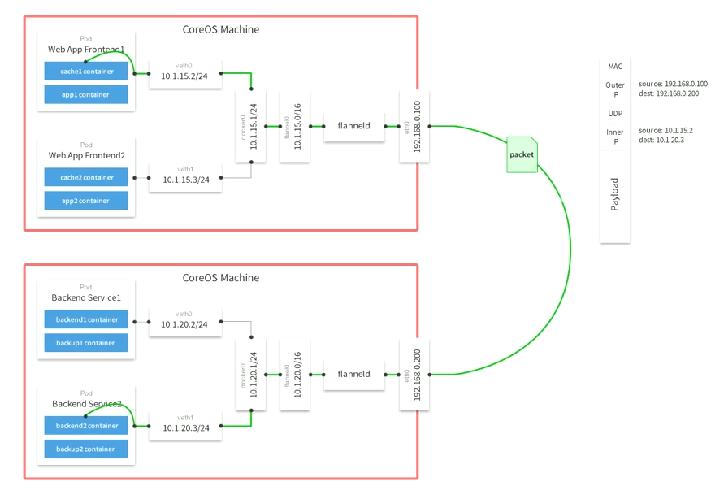
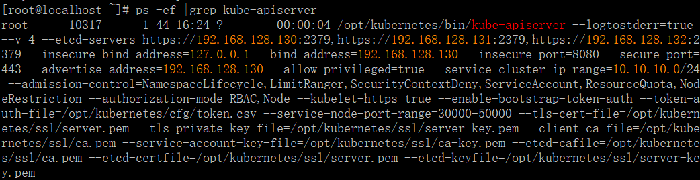
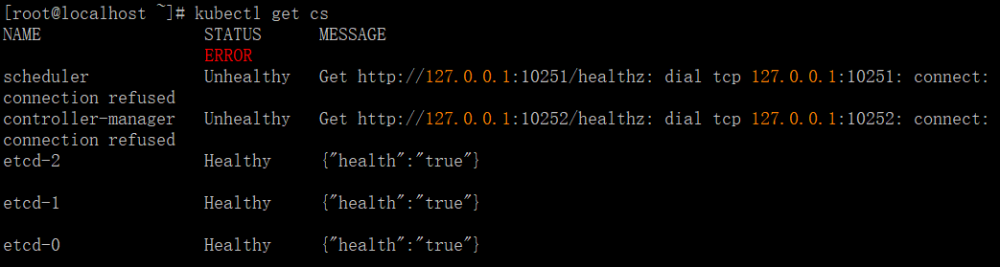
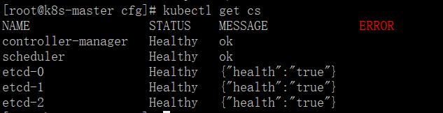
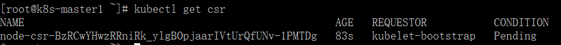
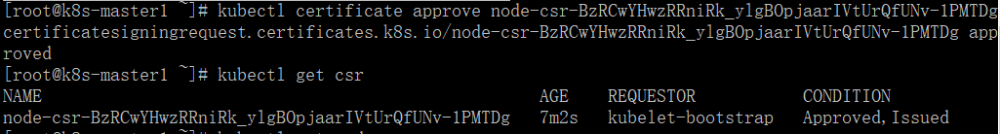

<font size=4>
[toc]
# k8s集群使用
## 1. 环境说明
软件|版本|备注
---|---|---
centos|7.6.1810
kubernetes| 1.15.0
Docker| 18.09.6
Etcd| 3.3.13
-----
角色|IP|组件|推荐配置|备注
---|---|---|---|---
master|192.168.128.130|kube-apiserver、kube-controller-manager、kube-scheduler、etcd|4核4G
node1|192.168.128.131|kubelet、kube-proxy、docker、flannel、etcd|4核4G
node2|192.168.128.132|kubelet、kube-proxy、docker、flannel、etcd|4核4G
------------------------------
## 2. 准备工作
1. 在`master`上装个`ansible`，方便一会统一配置两台`node`
```bash
yum install ansible -y
```
2. 在`master`生成秘钥对，并将公钥拷到`node`节点，配置免密登录，方便操作。
```bash
ssh-keygen
# 全部回车，创建无密码的秘钥对
ssh-copy-id root@192.168.128.131
ssh-copy-id root@192.168.128.132
```
3. `ansible`设置`k8snodes`分组
```bash
mv /etc/ansible/hosts /etc/ansible/hosts.default
cat >> /etc/ansible/hosts <<EOF
[k8snodes]
192.168.128.131
192.168.128.132
EOF
```
测试一下
```bash
ansible k8snodes -m shell -a "hostname -I" 
```
注意，`ansible`分组名不支持`-`，虽然也能用，但是会发出报警信息，很不爽
4. 创建`k8s`统一目录`/opt/kubernetes/{bin,logs,ssl,cfg}`
```bash
ansible k8snodes -m shell -a "mkdir -p /opt/kubernetes/{bin,logs,ssl,cfg}"
```
5. 设置环境变量
```bash
echo -e "export PATH=/opt/kubernetes/bin:\$PATH" >> /etc/profile
source /etc/profile
ansible k8snodes -m shell -a "echo -e "export PATH=/opt/kubernetes/bin:\$PATH" >> /etc/profile"
ansible k8snodes -m shell -a "\source /etc/profile"
```
6. 所有机器关闭`swap`分区
```bash
# 立即禁用swap分区，但重启后会失效
swapoff -a
# 通过文件修改，开机不挂载swap分区，需要重启生效，但生效后会一直生效
sed -i '/swap/s/^/#/g' /etc/fstab
ansible k8snodes -m shell -a "swapoff -a"
```
7. 所有机器关闭`selinux`和`firewalld`
```bash
systemctl stop firewalld
systemctl disable firewalld
setenforce 0
sed -i "s/SELINUX=enforcing/SELINUX=disabled/g" /etc/selinux/config
cat > /tmp/stopfire.sh <<EOF
systemctl stop firewalld
systemctl disable firewalld
setenforce 0
sed -i "s/SELINUX=enforcing/SELINUX=disabled/g" /etc/selinux/config
EOF
# script模块可以在远程执行本机脚本，相当于copy+shell
ansible k8snodes -m script -a '/tmp/stopfire.sh'
```
8. 所有机器内核参数优化
```bash
cat > /tmp/systeminit.sh <<EOF
cp /etc/security/limits.conf /etc/security/limits.conf.\$(date +%F)
echo "# /etc/security/limits.conf
* soft nofile 65535
* hard nofile 65535
*        soft            nproc      655350
*        hard            nproc      655350
*        soft            nofile      655350
*        hard            nofile      655350
*        soft            sigpending  128484
*        hard            sigpending  128484
*        soft            stack    128484
*        hard            stack    128484
" >/etc/security/limits.conf
cp /etc/sysctl.conf /etc/sysctl.conf.\$(date +%F)
echo "net.ipv6.conf.all.disable_ipv6 = 1
net.ipv6.conf.default.disable_ipv6 = 1
net.ipv6.conf.lo.disable_ipv6 = 1
vm.swappiness = 0
net.ipv4.neigh.default.gc_stale_time=120
net.ipv4.conf.all.rp_filter=0
net.ipv4.conf.default.rp_filter=0
net.ipv4.conf.default.arp_announce = 2
net.ipv4.conf.lo.arp_announce=2
net.ipv4.conf.all.arp_announce=2
net.ipv4.tcp_max_tw_buckets = 10000
net.ipv4.tcp_syncookies = 1
net.ipv4.tcp_max_syn_backlog = 16384
net.ipv4.tcp_max_orphans=16384
net.ipv4.tcp_tw_recycle = 1
net.ipv4.tcp_tw_reuse = 1
net.ipv4.ip_forward = 1
net.ipv4.tcp_fin_timeout = 20
net.ipv4.tcp_keepalive_time = 600
net.ipv4.ip_local_port_range= 10250 65535
net.ipv4.route.gc_timeout = 100
net.ipv4.tcp_syn_retries = 1
net.ipv4.tcp_synack_retries = 1
net.core.somaxconn = 16384
net.core.netdev_max_backlog=16384" > /etc/sysctl.conf
echo "net.bridge.bridge-nf-call-ip6tables = 1" >> /etc/sysctl.d/k8s.conf 
echo "net.bridge.bridge-nf-call-iptables = 1" >> /etc/sysctl.d/k8s.conf
sysctl --system
ldconfig
EOF
sh -x /tmp/systeminit.sh
# 使用ansiblle远程执行这个本地脚本，无需拷贝到远程主机
ansible k8snodes -m script -a "/tmp/systeminit.sh"
```
## 2. 安装Docker
将以下内容写成脚本，通过`ansible`执行到两个`node`节点
```bash
yum install yum-utils device-mapper-persistent-data lvm2 -y
yum-config-manager --add-repo https://download.docker.com/linux/centos/docker-ce.repo
yum install docker-ce -y
cat > /etc/docker/daemon.json <<EOF
{
    "registry-mirrors": ["https://docker.mirrors.ustc.edu.cn"]
}
EOF
systemctl start docker
systemctl enable docker
```
或者直接用`ansible`如下操作
```bash
ansible k8snodes -m yum -a 'name=yum-utils'
ansible k8snodes -m yum -a 'name=device-mapper-persistent-data'
ansible k8snodes -m yum -a 'name=lvm2'
ansible k8snodes -m shell -a 'yum-config-manager --add-repo https://download.docker.com/linux/centos/docker-ce.repo'
ansible k8snodes -m yum -a 'name=docker-ce'
cat > /tmp/daemon.json <<EOF
{
    "registry-mirrors": ["https://docker.mirrors.ustc.edu.cn"]
}
EOF
ansible k8snodes -m copy -a 'src=/tmp/daemon.json dest=/etc/docker/ backup=yes force=yes'
ansible k8snodes -m service -a "name=docker state=started enabled=yes"

```
## 3. 自签TLS证书
组件 | 使用的证书 | 备注
---|---|---
etcd | ca.pem,server.pem,server-key.pem
kube-apiserver | ca.pem,server.pem,server-key.pem
kubelet|ca.pem,ca-key.pem
kube-proxy|ca.pem,kube-proxy.pem,kube-proxy-key.pem
kubectl|ca.pem,admin.pem,admin-key.pem
----------
安装证书生成工具cfssl:
```bash
wget https://pkg.cfssl.org/R1.2/cfssl_linux-amd64
wget https://pkg.cfssl.org/R1.2/cfssljson_linux-amd64
wget https://pkg.cfssl.org/R1.2/cfssl-certinfo_linux-amd64
chmod +x cfssl_linux-amd64 cfssljson_linux-amd64 cfssl-certinfo_linux-amd64
mv cfssl_linux-amd64 /usr/local/bin/cfssl
mv cfssljson_linux-amd64 /usr/local/bin/cfssljson
mv cfssl-certinfo_linux-amd64 /usr/local/bin/cfssl-certinfo
mkdir ~/ssl
```
生成证书脚本`cat certificate.sh`
```bash
#配置证书生成策略，让CA软件知道颁发什么样的证书
cat > ca-config.json <<EOF
{
  "signing": {
    "default": {
      "expiry": "87600h"
    },
    "profiles": {
      "kubernetes": {
         "expiry": "87600h",
         "usages": [
            "signing",
            "key encipherment",
            "server auth",
            "client auth" 
         ]
      } 
    }
  }
}
EOF
# signing, 表示该证书可用于签名其它证书；生成的 ca.pem 证书中 CA=TRUE
# default默认策略，指定了证书的有效期是一年(8760h)
# profiles策略，指明证书用途为kubernetes
# key encipherment，密钥加密
# server auth：表示 client 可以用该 CA 对 server 提供的证书进行验证
# client auth：表示 server 可以用该 CA 对 client 提供的证书进行验证

cat > ca-csr.json <<EOF
{
  "CN": "kubernetes",
  "key": {
      "algo": "rsa",
      "size": 2048
  },
  "names": [
      {
          "C": "CN",
          "L": "GuangZhou",
          "ST": "GuangZhou",
          "O": "k8s",
          "OU": "System"
      }
  ]
}
EOF
#------------------------------------
# ca-csr.json是CA证书申请准备的内容
# CN: Common Name，浏览器使用该字段验证网站是否合法（一般写的是域名），kube-apiserver 从证书中提取该字段作为请求的用户名 (User Name)，非常重要。
# C: Country， 国家
# L: Locality，地区，城市
# O: Organization Name，组织名称，公司名称，kube-apiserver 从证书中提取该字段作为请求用户所属的组 (Group)；
# OU: Organization Unit Name，组织单位名称，公司部门
# ST: State，州，省

# 生成ca证书,(如下命令会生成三个文件：ca.pem, ca-key.pem, ca.csr)
cfssl gencert -initca ca-csr.json | cfssljson -bare ca -
# 注意：CSR并不是证书。而是向权威证书颁发机构获得签名证书的申请。
# cfssljson，从cfssl和multirootca程序获取JSON输出，并将证书，密钥，CSR和bundle写入磁盘
# bundle: 创建包含客户端证书的证书包

# 根据自己需求修改下面的IP
cat > server-csr.json <<EOF
{
    "CN": "kubernetes",
    "hosts": [
        "127.0.0.1",
        "192.168.128.130",
        "192.168.128.131",
        "192.168.128.132",
        "10.10.10.1",
        "kubernetes",
        "kubernetes.default",
        "kubernetes.default.svc",
        "kubernetes.default.svc.cluster",
        "kubernetes.default.svc.cluster.local"
    ],
    "key": {
        "algo": "rsa",
        "size": 2048
    },
    "names": [
        {
            "C": "CN",
            "L": "GuangZhou",
            "ST": "GuangZhou",
            "O": "k8s",
            "OU": "System"
        }
    ]
}
EOF
# 注意这上面的几个hosts
# cluster.local是默认的集群域名，svc是固定用法，default是名称空间
# 10.10.10.1是kubernetes集群的clusterIP
# 其他几个IP是node及master的IP
cfssl gencert -ca=ca.pem -ca-key=ca-key.pem -config=ca-config.json -profile=kubernetes server-csr.json | cfssljson -bare server
# gencert: 生成新的key(密钥)和签名证书
# -ca：指明ca的证书
# -ca-key：指明ca的私钥文件
# -config：指明请求证书的json文件
# -profile：与-config中的profile对应，是指根据config中的profile段来生成证书的相关信息


#----------------------------------

cat > admin-csr.json <<EOF
{
    "CN": "admin",
    "hosts": [],
    "key": {
        "algo": "rsa",
        "size": 2048
    },
    "names": [
      {
         "C": "CN",
         "L": "GuangZhou",
         "ST": "GuangZhou",
         "O": "system.masters",
         "OU": "System"
      }
    ]
}
EOF

cfssl gencert -ca=ca.pem -ca-key=ca-key.pem -config=ca-config.json -profile=kubernetes admin-csr.json | cfssljson -bare admin

#---------------------------------

cat > kube-proxy-csr.json <<EOF
{
    "CN": "system:kube-proxy",
    "hosts": [],
    "key": {
       "algo": "rsa",
       "size": 2048
    },
    "names": [
      {
         "C": "CN",
         "L": "GuangZhou",
         "ST": "GuangZhou",
         "O": "k8s",
         "OU": "System"
      }
    ]
}
EOF

cfssl gencert -ca=ca.pem -ca-key=ca-key.pem -config=ca-config.json -profile=kubernetes kube-proxy-csr.json | cfssljson -bare kube-proxy
```
执行脚本，生成所需要的证书
```bash
cd ~/ssl
sh certificate.sh
# 将生成的证书拷到`/opt/kubernetes/ssl/`
mv *.pem /opt/kubernetes/ssl/
ansible k8snodes -m copy -a 'src=/opt/kubernetes/ssl dest=/opt/kubernetes force=yes'
```
## 4. 部署ETCD集群
重点：一定要先部etcd集群，因为k8s的都有组件都是跟kube-apiserver通信，而kube-apiserver又把所有信息存到etcd集群中。
1. etcd二进制包下载地址
```bash
https://github.com/coreos/etcd/releases
ETCD_VER=v3.3.13
DOWNLOAD_URL="https://github.com/etcd-io/etcd/releases/download"
curl -L ${DOWNLOAD_URL}/${ETCD_VER}/etcd-${ETCD_VER}-linux-amd64.tar.gz -o /tmp/etcd-${ETCD_VER}-linux-amd64.tar.gz
tar -xf /tmp/etcd-${ETCD_VER}-linux-amd64.tar.gz -C /tmp/ && rm -f /tmp/etcd-${ETCD_VER}-linux-amd64.tar.gz
mv /tmp/etcd* /opt/kubernetes/bin/
chmod +x /opt/kubernetes/bin/*
```
2. 为etcd生成单独的证书
这样做的目的是区别于k8s集群所使用的证书。
配置`etcd`ca配置，用于签发证书使用
```bash
cd /opt/kubernetes/ssl/
mkdir etcd
# 生成ca证书的相关配置文件ca-config.json，里面设置一些用途与默认属性，定义默认过期时间是10年，signing表示签名使用，default里设置的内容表示ca给别人签发证书时配置的默认属性
cat << EOF | tee ca-config.json
{
  "signing": {
    "default": {
      "expiry": "87600h"
    },
    "profiles": {
      "etcd": {
         "expiry": "87600h",
         "usages": [
            "signing",
            "key encipherment",
            "server auth",
            "client auth"
        ]
      }
    }
  }
}
EOF

# 生成请求生成ca证书的请求文件ca.csr的相关配置文件ca-csr.json
cat << EOF | tee ca-csr.json
{
    "CN": "etcd CA",
    "key": {
        "algo": "rsa",
        "size": 2048
    },
    "names": [
        {
            "C": "CN",
            "L": "Guangzhou",
            "ST": "Guangzhou"
        }
    ]
}
EOF
```
先申请etcd的CA证书
```bash
# cfssl的具体用法可以使用cfssl --help查看
cfssl gencert -initca ca-csr.json |cfssljson -bare ca
# 使用cfssljson是将前面命令输出的json证书信息保存到文件中，文件以ca开头命令

# ls查看，多了三个文件
ca.csr  ca-csr.json  ca-key.pem  ca.pem
# ca.csr是cfssl根据ca-csr.json生成的请求证书文件，ca-key.pem也是cfssl根据ca-csr.json生成的秘钥文件，而后cfssl又带着这个请求文件去请求生成ca.pem
```
有了CA证书后，就可以签发其他证书了，再创建一个server证书给etcd通信使用
```bash
cat << EOF | tee server-csr.json
{
    "CN": "etcd",
    "hosts": [
      "192.168.128.230",
      "192.168.128.231",
      "192.168.1.232"
    ],
    "key": {
        "algo": "rsa",
        "size": 2048
    },
    "names": [
        {
            "C": "CN",
            "L": "Guangzhou",
            "ST": "Guangzhou"
        }
    ]
}
EOF
# 注意这里的hosts必须包含所有etcd节点的IP，生产环境推荐5台以上etcd节点，官方建议最少3台
# 签发server证书时就需要前面生成的ca-config.json文件了。
cfssl gencert -ca=ca.pem -ca-key=ca-key.pem -config=ca-config.json -profile=etcd server-csr.json |cfssljson -bare server
# profile表明此证书用途，上面的命令一样生成三个文件
server.csr  server-key.pem  server.pem
# 命令用法：带[]表示是可选的,后面的CSRJSON_FILE表示拿定义好的哪个csrjson文件去请求
# cfssl gencert -ca cert -ca-key key [-config config] [-profile profile] [-hostname hostname] CSRJSON_FILE
```
注意：CA证书一定要保管好，否则别人可以拿这个CA证书请求签发证书
2. 配置etcd集群
```bash
mkdir -p /data/etcd/
cat > /opt/kubernetes/cfg/etcd <<EOF
#[Member]
ETCD_NAME="etcd01"
ETCD_DATA_DIR="/data/etcd/k8s/"
ETCD_LISTEN_PEER_URLS="https://192.168.128.130:2380"
ETCD_LISTEN_CLIENT_URLS="https://192.168.128.130:2379"

#[Clustering]
ETCD_INITIAL_ADVERTISE_PEER_URLS="https://192.168.128.130:2380"
ETCD_ADVERTISE_CLIENT_URLS="https://192.168.128.130:2379"
ETCD_INITIAL_CLUSTER="etcd01=https://192.168.128.130:2380,etcd02=https://192.168.128.131:2380,etcd03=https://192.168.128.132:2380"
ETCD_INITIAL_CLUSTER_TOKEN="k8s-etcd-cluster"
ETCD_INITIAL_CLUSTER_STATE="new"
EOF
```
注意：三台机都要配置，每台机的配置里的`ETCD_NAME`和URLS换成本机的
思考：
  1. 为什么设置了`ETCD_LISTEN_CLIENT_URLS`，还要设置`ETCD_ADVERTISE_CLIENT_URLS`？
  答：`ETCD_LISTEN_CLIENT_URLS`是设置本机`etcd`用来和客户机通信的监听地址，一台机可能存在多个IP，可以选择性的设置，那也就解释了为什么要设置`ETCD_ADVERTISE_CLIENT_URLS`(客户端广播地址)，因为虽然我监听了那么多地址，但是我可以选择性的广播哪些地址出去给集群其他成员的客户端使用。
  2. `ETCD_INITIAL_CLUSTER_TOKEN`的作用是当有各个etcd集群时，防止串了。
```bash
ansible k8snodes -m copy -a 'src=/opt/kubernetes/cfg/etcd dest=/opt/kubernetes/cfg/ backup=yes force=yes'
ansible k8snodes -m copy -a 'src=/opt/kubernetes/bin dest=/opt/kubernetes force=yes'
ansible k8snodes -m shell -a 'chmod +x /opt/kubernetes/bin/*'
# 使用ansible将etcd配置里的地址改一下
```
3. 配置`etcd.service`启动脚本
```systemd
[Unit]
Description=Etcd Server
After=network.target network-online.target
Wants=network-online.target

[Service]
Type=notify
EnvironmentFile=/opt/kubernetes/cfg/etcd
ExecStart=/opt/kubernetes/bin/etcd \
--name=${ETCD_NAME} \
--data-dir=${ETCD_DATA_DIR} \
--listen-peer-urls=${ETCD_LISTEN_PEER_URLS} \
--listen-client-urls=${ETCD_LISTEN_CLIENT_URLS},http://127.0.0.1:2379 \
--advertise-client-urls=${ETCD_ADVERTISE_CLIENT_URLS} \
--initial-advertise-peer-urls=${ETCD_INITIAL_ADVERTISE_PEER_URLS} \
--initial-cluster=${ETCD_INITIAL_CLUSTER} \
--initial-cluster-token=${ETCD_INITIAL_CLUSTER_TOKEN} \
--initial-cluster-state=${ETCD_INITIAL_CLUSTER_STATE} \
--cert-file=/opt/kubernetes/ssl/etcd/server.pem \
--key-file=/opt/kubernetes/ssl/etcd/server-key.pem \
--peer-cert-file=/opt/kubernetes/ssl/etcd/server.pem \
--peer-key-file=/opt/kubernetes/ssl/etcd/server-key.pem \
--trusted-ca-file=/opt/kubernetes/ssl/etcd/ca.pem \
--peer-trusted-ca-file=/opt/kubernetes/ssl/etcd/ca.pem
Restart=on-failure
LimitNOFILE=65536

[Install]
WantedBy=multi-user.target
```
etcd参数说明
```bash
--name=string #为当前etcd节点起一易读的名
--data-dir=/path/to/ #为当前etcd节点设置数据目录
--snapshot-count='number' # 多少次提交触发一次快照到硬盘，默认是100000
--heartbeat-interval='number' #心跳检测间隔，单位是ms，默认是100ms
--election-timeout='number' # 选举超时时间，单位是ms，默认是1000ms即1秒
--max-snapshots='number' #最大快照数
--max-txn-ops='number' #一次事务中允许的最大操作数，默认是128
--max-request-bytes='number' #客户端允许的最大请求字节数，默认是1572864bytes
--listen-peer-urls=string #设置etcd集群间成员通信的地址列表
--listen-client-urls=string #设置接收etcd客户端请求的地址列表，apiserver就是与此地址通信，
--advertise-client-urls #前面设置了客户端请求使用的地址列表，但我可以选择性的广播出去一些接口，就可以用这个选项指定
--initial-advertise-peer-urls #这个地址就是listen-peer-urls
--initial-cluster #这是集群所有节点的地址，即endpoints
--initial-cluster-token #用于集群成员通信的口令
--initial-cluster-state #当前集群的状态
--cert-file #客户端通信要使用的证书，apiserver就要用此证书与etcd通信
--key-file #客户端证书秘钥
--trusted-ca-file #客户端通信信任的CA证书
--peer-cert-file #集群成员通信证书，2380端口通信用的就是这个证书
--peer-key-file #集群成员通信证书秘钥
--peer-trusted-ca-file #集群成员通信信任的CA证书

#其他参数请自行使用etcd --help查询
```
将启动脚本放到`/usr/lib/systemd/system/`下，再拷到node节点
```bash
cp etcd.service /usr/lib/systemd/system/
ansible k8snodes -m copy -a 'src=/usr/lib/systemd/system/etcd.service dest=/usr/lib/systemd/system/ force=yes'
```
4. 启动`etcd`
```bash
systemctl enable etcd
systemctl start etcd
# 如果启动失败，可使用以下命令查看
journalctl -u etcd
# 或查看/var/log/messages
tail -f /var/log/messages
```
3. etcd集群状态查看
```bash
cd /opt/kubernetes/ssl
/opt/kubernetes/bin/etcdctl \
--ca-file=ca.pem --cert-files=server.pem --key-file=server-key.pem \
--endpoints="https://192.168.128.130:2379,https://192.168.128.131:2379,https://192.168.128.132:2379" \
cluster-health
```
## 5. 部署Flannel网络
flannel网络通信示意图

1. 写入分配的子网段到etcd，供flanneld使用
```bash
cd /opt/kubernetes/ssl/etcd
/opt/kubernetes/bin/etcdctl \
--ca-file=ca.pem --cert-files=server.pem --key-file=server-key.pem \
--endpoints="https://192.168.128.130:2379,https://192.168.128.131:2379,https://192.168.128.132:2379" \
set /coreos.com/network/config '{"Network": "172.17.0.0/16", "Backend": {"Type": "vxlan"}}'
# 这里设置的`/coreos.com/network/config`不是路径，而是存储到etcd中的键名，后面的则是键值。
# "Network": "172.17.0.0/16"，这个是为所有的节点分配一个统一的网段，给集群通信封包解包用。
```
2. 下载flannel二进制包
```bash
https://github.com/coreos/flannel/releases/download/
```
3. 配置flannel
```bash
cat /opt/kubernetes/cfg/flanneld
FLANNEL_OPTIONS="--etcd-endpoints=https://192.168.128.130:2379,https://192.168.128.131:2379,https://192.168.128.132:2379 -etcd-cafile=/opt/kubernetes/ssl/ca.pem -etcd-certfile=/opt/kubernetes/ssl/server.pem -etcd-keyfile=/opt/kubernetes/ssl/server-key.pem"
````
4. systemd管理flannel
```systemd
[Unit]
Description=Flanneld overlay address etcd agent
After=network-online.target network.target
Before=docker.service

[Service]
Type=notify
EnvironmentFile=/opt/kubernetes/cfg/flanneld
ExecStart=/opt/kubernetes/bin/flanneld --ip-masq $FLANNEL_OPTIONS
# 启动后执行下面的命令
ExecStartPost=/opt/kubernetes/bin/mk-docker-opts.sh -k DOCKER_NETWORK_OPTIONS -d /run/flannel/subnet.env
Restart=on-failure

[Install]
WantedBy=multi-user.target
```
5. 修改docker配置，配置docker启动指定子网段
```systemd
[Unit]
Description=Docker Application Container Engine
Documentation=https://docs.docker.com
After=network-online.target firewalld.service
Wants=network-online.target

[Service]
Type=notify
# 环境配置文件加-表示配置文件不存在时不报错
EnvironmentFile=/run/flannel/subnet.env
ExecStart=/usr/bin/dockerd $DOCKER_NETWORK_OPTIONS
ExecReload=/bin/kill -s HUP $MAINPID
LimitNOFILE=infinity
LimitNPROC=infinity
LimitCORE=infinity
TimeoutStartSec=0
Delegate=yes
KillMode=process
Restart=on-failure
StartLimitBurst=3
StartLimitInterval=60s

[Install]
WantedBy=multi-user.target
```
6. 启动
```bash
# 因为修改了docker的启动脚本，需要重读一下
systemctl daemon-reload
ansible k8snodes -m shell -a "systemctl daemon-reload"
# 先启动flanneld，再重新启动docker
systemctl start flanneld
ansible k8snodes -m service -a "name=flanneld state=started enabled=yes"
systemctl restart docker
ansible k8snodes -m service -a "name=docker state=started"
```
## 6. 创建Node节点kubeconfig文件
`kubeconfig.sh`脚本内容如下，在`master`上执行：
```bash
export KUBE_HOME=/opt/kubernetes
export SSL_PATH=${KUBE_HOME}/ssl
# 创建 TLS Bootstrapping Token
export BOOTSTRAP_TOKEN=$(head -c 16 /dev/urandom | od -An -t x |tr -d ' ')
cat > token.csv <<EOF
${BOOTSTRAP_TOKEN},kubelet-bootstrap,10001,"system:kubelet-bootstrap"
EOF
#---------------
# 创建kubelet bootstrapping kubeconfig
export KUBE_APISERVER="https://192.168.128.130:6443"

# 设置集群参数
kubectl config set-cluster kubernetes \
--certificate-authority=${SSL_PATH}/ca.pem \
--embed-certs=true \
--server=${KUBE_APISERVER} \
--kubeconfig=bootstrap.kubeconfig
# 参数--kubeconfig是一个路径，执行上面的命令会在当前目录生成一个叫bootstrap.kubeconfig的文件，后面设置的参数只要这个名字相同，都会追加到这个文件里
# 参数--embed-certs=true是将证书内容导入到这个配置里

# 设置客户端认证参数
kubectl config set-credentials kubelet-bootstrap \
--token=${BOOTSTRAP_TOKEN} \
--kubeconfig=bootstrap.kubeconfig

# 设置默认上下文参数
kubectl config set-context default \
--cluster=kubernetes \
--user=kubelet-bootstrap \
--kubeconfig=bootstrap.kubeconfig

# 设置当前上下文为上面设置的上下文名，`default`只是一个名字而已，跟上面的对应即可
kubectl config use-context default \
--kubeconfig=bootstrap.kubeconfig

#------------------------------------------

# 创建kube-proxy kubeconfig文件
kubectl config set-cluster kubernetes \
--certificate-authority=${SSL_PATH}/ca.pem \
--embed-certs=true \
--server=${KUBE_APISERVER} \
--kubeconfig=kube-proxy.kubeconfig

# 设置kube-proxy认证参数
kubectl config set-credentials kube-proxy \
--client-certificate=${SSL_PATH}/kube-proxy.pem \
--client-key=${SSL_PATH}/kube-proxy-key.pem \
--embed-certs=true \
--kubeconfig=kube-proxy.kubeconfig

# 
kubectl config set-context default \
--cluster=kubernetes \
--user=kube-proxy \
--kubeconfig=kube-proxy.kubeconfig

kubectl config use-context default \
--kubeconfig=kube-proxy.kubeconfig

```
1. 创建TLS Bootstrapping Token
2. 创建kubelet kubeconfig
3. 创建kube-proxy kubeconfig
4. 将创建好的这几个文件拷到node节点
```bash
# 下面这句会执行失败，不支持通配符
ansible k8snodes -m copy -a "src=/opt/kubernetes/cfg/*kubeconfig dest=/opt/kubernetes/cfg/ owner=root group=root mode=0644"
# 坑爹的ansible copy模块不支持通配符，只好改用scp
scp /opt/kubernetes/cfg/*kubeconfig root@192.168.128.131:/opt/kubernetes/cfg/
scp /opt/kubernetes/cfg/*kubeconfig root@192.168.128.132:/opt/kubernetes/cfg/
```
## 7. 获取K8S二进制包
需要梯子，下载server那个包就可以了，里面啥都有
## 8. 运行Master组件
`kube-apiserver`部署脚本内容如下：
```bash
#!/bin/bash
MASTER_ADDRESS=${1:-"192.168.128.130"}
# 上面这句话的意思是，如果脚本没有传入参数$1，则MASTER_ADDRESS=192.168.128.130，反之MASTER_ADDRESS=$1
ETCD_SERVERS=${2:-"http://127.0.0.1:2379"}
# 上面这句话的意思是，如果脚本没有传入参数$2，则ETCD_SERVERS=http://127.0.0.1:2379，反之ETCD_SERVERS=$2
export KUBE_HOME=/opt/kubernetes
export SSL_PATH=${KUBE_HOME}/ssl
cat > ${KUBE_HOME}/cfg/kube-apiserver <<EOF
KUBE_APISERVER_OPTS="--logtostderr=true \\
--v=4 \\
--etcd-servers=${ETCD_SERVERS} \\
--insecure-bind-address=127.0.0.1 \\
--bind-address=${MASTER_ADDRESS} \\
--insecure-port=8080 \\
--secure-port=6443 \\
--advertise-address=${MASTER_ADDRESS} \\
--allow-privileged=true \\
--service-cluster-ip-range=10.10.10.0/24 \\
--admission-control=NamespaceLifecycle,LimitRanger,SecurityContextDeny,ServiceAccount,ResourceQuota,NodeRestriction \\
--authorization-mode=RBAC,Node \\
--kubelet-https=true \\
--enable-bootstrap-token-auth \\
--token-auth-file=${KUBE_HOME}/cfg/token.csv \\
--service-node-port-range=30000-50000 \\
--tls-cert-file=${SSL_PATH}/server.pem \\
--tls-private-key-file=${SSL_PATH}/server-key.pem \\
--client-ca-file=${SSL_PATH}/ca.pem \\
--service-account-key-file=${SSL_PATH}/ca-key.pem \\
--etcd-cafile=${SSL_PATH}/ca.pem \\
--etcd-certfile=${SSL_PATH}/server.pem \\
--etcd-keyfile=${SSL_PATH}/server-key.pem"
EOF

cat > /usr/lib/systemd/system/kube-apiserver.service <<EOF
[Unit]
Description=Kubernetes API Server
Documentation=https://github.com/kubernetes/kubernetes

[Service]
EnvironmentFile=${KUBE_HOME}/cfg/kube-apiserver
ExecStart=${KUBE_HOME}/bin/kube-apiserver \$KUBE_APISERVER_OPTS
Restart=on-failure

[Install]
WantedBy=multi-user.target
EOF
systemctl daemon-reload
systemctl enable kube-apiserver
systemctl restart kube-apiserver
```
执行这个脚本
```bash
sh -x kube-apiserver.sh 192.168.128.130 "https://192.168.128.130:2379,https://192.168.128.131:2379,https://192.168.128.132:2379"
```
通过进程看下有没启动成功

`kubectl get cs`

`controller-manager.sh`脚本内容如下：
```bash
export KUBE_HOME=/opt/kubernetes
cd ${KUBE_HOME}/cfg
# 生成kube_controller_manager.kubeconfig
kubectl config set-cluster kubernetes \
--certificate-authority=/opt/kubernetes/ssl/ca.pem \
--embed-certs=true \
--server=http://127.0.0.1:8080 \
--kubeconfig=kube_controller_manager.kubeconfig
#--server=http://127.0.0.1:8080  为每台kube-apiserver IP加端口不使用vip ip 连接，如果不是本机的apiserver，请使用https地址https://192.168.128.130:6443

kubectl config set-credentials system:kube-controller-manager \
--client-certificate=/opt/kubernetes/ssl/server.pem \
--embed-certs=true \
--client-key=/opt/kubernetes/ssl/server-key.pem \
--kubeconfig=kube_controller_manager.kubeconfig

kubectl config set-context kubernetes \
--cluster=kubernetes \
--user=system:kube-controller-manager \
--kubeconfig=kube_controller_manager.kubeconfig

kubectl config use-context kubernetes \
--kubeconfig=kube_controller_manager.kubeconfig

MASTER_ADDRESS=${1:-"127.0.0.1"}
cat > ${KUBE_HOME}/cfg/kube-controller-manager <<EOF
KUBE_CONTROLLER_MANAGER_OPTS="--logtostderr=true \\
--leader-elect=true \\
--address=127.0.0.1 \\
--service-cluster-ip-range=10.10.10.0/24 \\
--cluster-name=kubernetes \\
--kubeconfig=/opt/kubernetes/cfg/kube_controller_manager.kubeconfig \\
--authentication-kubeconfig=/opt/kubernetes/cfg/kube_controller_manager.kubeconfig \\
--authorization-kubeconfig=/opt/kubernetes/cfg/kube_controller_manager.kubeconfig \\
--use-service-account-credentials=true \\
--client-ca-file=/opt/kubernetes/ssl/ca.pem \\
--requestheader-client-ca-file=/opt/kubernetes/ssl/ca.pem \\
--cluster-signing-cert-file=/opt/kubernetes/ssl/ca.pem \\
--cluster-signing-key-file=/opt/kubernetes/ssl/ca-key.pem  \\
--root-ca-file=/opt/kubernetes/ssl/ca.pem \\
--service-account-private-key-file=/opt/kubernetes/ssl/ca-key.pem \\
--v=4"
EOF

cat > /usr/lib/systemd/system/kube-controller-manager.service <<EOF
[Unit]
Description=Kubernetes Controller Manager
Documentation=https://github.com/kubernetes/kubernetes

[Service]
EnvironmentFile=${KUBE_HOME}/cfg/kube-controller-manager
ExecStart=${KUBE_HOME}/bin/kube-controller-manager \$KUBE_CONTROLLER_MANAGER_OPTS
Restart=on-failure

[Install]
WantedBy=multi-user.target
EOF
systemctl daemon-reload
systemctl enable kube-controller-manager
systemctl start kube-controller-manager
```
`kube-scheduler.sh`脚本内容如下
```bash
#!/bin/bash
export KUBE_HOME=/opt/kubernetes
# 生成kube-scheduler.kubeconfig
cd ${KUBE_HOME}/cfg
kubectl config set-cluster kubernetes \
--certificate-authority=${KUBE_HOME}/ssl/ca.pem \
--embed-certs=true \
--server=http://127.0.0.1:8080 \
--kubeconfig=kube-scheduler.kubeconfig
#--server=http://127.0.0.1:8080  为每台kube-apiserver IP加端口不使用vip ip 连接，如果不是本机的apiserver，请使用https地址

kubectl config set-credentials system:kube-scheduler \
--client-certificate=${KUBE_HOME}/ssl/ca.pem \
--embed-certs=true \
--client-key=${KUBE_HOME}/ssl/ca-key.pem \
--kubeconfig=kube-scheduler.kubeconfig

kubectl config set-context kubernetes \
--cluster=kubernetes \
--user=system:kube-scheduler \
--kubeconfig=kube-scheduler.kubeconfig

kubectl config use-context kubernetes \
--kubeconfig=kube-scheduler.kubeconfig

cat >${KUBE_HOME}/cfg/kube-scheduler <<EOF
KUBE_SCHEDULER_OPTS="--logtostderr=false \\
--address=127.0.0.1 \\
--leader-elect=true \\
--kubeconfig=${KUBE_HOME}/cfg/kube-scheduler.kubeconfig \\
--authentication-kubeconfig=${KUBE_HOME}/cfg/kube-scheduler.kubeconfig \\
--authorization-kubeconfig=${KUBE_HOME}/cfg/kube-scheduler.kubeconfig \\
--alsologtostderr=true \\
--kube-api-qps=100 \\
--kube-api-burst=100 \\
--log-dir=${KUBE_HOME}/logs \\
--v=2"
EOF
# --address不能是服务器ip如果写服务器的ip kubectl get cs 就会报错
# --logtostderr默认就是true，设置为false方便启用后面的参数输出日志到文件
# 日志级别，4是Debug级别，2是重要日志级别，类似warn
cat > /usr/lib/systemd/system/kube-scheduler.service <<EOF
[Unit]
Description=Kubernetes Scheduler
Documentation=https://github.com/kubernetes/kubernetes

[Service]
LimitNOFILE=1024000
LimitNPROC=1024000
LimitCORE=infinity
LimitMEMLOCK=infinity
EnvironmentFile=-${KUBE_HOME}/cfg/kube-scheduler
ExecStart=${KUBE_HOME}/bin/kube-scheduler \$KUBE_SCHEDULER_OPTS
Restart=on-failure
RestartSec=5

[Install]
WantedBy=multi-user.target
EOF
systemctl daemon-reload
systemctl enable kube-scheduler
systemctl start kube-scheduler
systemctl status kube-scheduler
kubectl get cs
```
正常的`master`节点状态应该如下图：

## 9. 运行Node组件
将`kubelet`和`kube-proxy`放到node节点的`bin`目录下
```bash
ansible k8snodes -m copy -a "src=${KUBE_HOME}/bin/kubelet dest=${KUBE_HOME}/bin/ mode=0755"
# 发现执行速度太慢了，不知道是文件太大还是什么
ansible k8snodes -m copy -a "src=${KUBE_HOME}/bin/kube-proxy dest=${KUBE_HOME}/bin/ mode=0755"
```
`kubelet`部署脚本
```bash
#!/bin/bash
NODE_ADDRESS=${1:-"192.168.128.131"}
DNS_SERVER_IP=${2:-"10.10.10.2"}
export KUBE_HOME=/opt/kubernetes
export KUBE_BIN=${KUBE_HOME}/bin
export KUBE_CONF=${KUBE_HOME}/cfg
export SSL_PATH=${KUBE_HOME}/ssl
cat >${KUBE_CONF}/kubelet <<EOF
KUBELET_OPTS="--logtostderr=false \\
--v=2 \\
--alsologtostderr=true \\
--log-dir='${KUBE_HOME}/logs' \\
--hostname-override='${NODE_ADDRESS}' \\
--kubeconfig='${KUBE_CONF}/kubelet.kubeconfig' \\
--bootstrap-kubeconfig='${KUBE_CONF}/bootstrap.kubeconfig' \\
--client-ca-file='${SSL_PATH}/ca.pem' \\
--cert-dir='${SSL_PATH}' \\
--cluster-dns='${DNS_SERVER_IP}' \\
--cluster-domain='cluster.local' \\
--fail-swap-on=false \\
--pod-infra-container-image='registry.cn-hangzhou.aliyuncs.com/google-containers/pause-amd64:3.0'"
EOF
# 注意上面那些参数文本型的一定要用单引号引起来，否则有可能启动不成功或者无法与apiserver连接
cat > /usr/lib/systemd/system/kubelet.service <<EOF
[Unit]
Description=Kubernetes kubelet
After=docker.service
Requires=docker.service

[Service]
EnvironmentFile=${KUBE_CONF}/kubelet
ExecStart=${KUBE_BIN}/kubelet \$KUBELET_OPTS
Restart=on-failure
LimitNOFILE=1024000
LimitNPROC=1024000
LimitCORE=infinity
LimitMEMLOCK=infinity

[Install]
WantedBy=multi-user.target
EOF
systemctl daemon-reload
systemctl enable kubelet
systemctl start kubelet
systemctl status kubelet
```
注意`kubelet`的`kubeconfig`只需指定路径即可，会自动生成。
执行脚本时注意第一个参数一定要是当前节点的IP
```bash
sh -x kubelet.sh 192.168.128.131 10.10.10.2
sh -x kubelet.sh 192.168.128.132 10.10.10.2
```
启动`kubelet`发现启动失败，查找原因
```bash
tail -f /var/log/messages
# 再另开一个SSH，启动kubelet
systemctl start kubelet
# 也可以用以下命令查找启动失败的原因
journalctl -u kubelet |less
```
`kubelet`启动成功后，在master节点可以看到自签证书请求

同意这个自签证书请求，在master节点操作
```bash
kubectl certificate approve node-csr-BzRCwYHwzRRniRk_ylgBOpjaarIVtUrQfUNv-1PMTDg
# 注意两台node后面的节点名字不一样
```

同意自签证书请求后，node节点自动生成`kubelet.kubeconfig`，以及ssl目录下会自动生成客户端SSL证书
`kube-proxy`脚本
```bash
#!/bin/bash
NODE_ADDRESS=${1:-"192.168.128.131"}
export KUBE_HOME=/opt/kubernetes
cat > ${KUBE_HOME}/cfg/kube-proxy <<EOF
KUBE_PROXY_OPTS="--logtostderr=true \\
--v=4 \\
--hostname-override='${NODE_ADDRESS}' \\
--kubeconfig='${KUBE_HOME}/cfg/kube-proxy.kubeconfig'"
EOF
cat > /usr/lib/systemd/system/kube-proxy.service <<EOF
[Unit]
Description=Kubernetes kube-proxy
After=network.target

[Service]
EnvironmentFile=${KUBE_HOME}/cfg/kube-proxy
ExecStart=${KUBE_HOME}/bin/kube-proxy \$KUBE_PROXY_OPTS
Restart=on-failure

[Install]
WantedBy=multi-user.target
EOF
systemctl daemon-reload
systemctl enable kube-proxy
systemctl start kube-proxy
```

## 10. 查询集群状态
```bash
kubectl get pod,svc -o wide
```
## 11. 启动一个测试示例
```bash
kubectl run nginx --image=nginx --replicas=3
kubectl get pod
kubectl expose deployment nginx --port=88 --target-port=80 -type=NodePort
kubectl get svc nginx
```
## 12. 部署Web UI(Dashboard)
关键点：dashboard是通过pod启动，也就是说是通过pod与kube-apiserver进行交互，所以得使用serviceaccount账号，至于权限，可以自行定义一个role或clusterrole，而后将这个role或clusterrole绑定到此serviceaccount账号，然后在dashboard的deployment里引用这个serviceaccount。
步骤：
1. 下载`kubernetes-dashboard`的`yaml`文件
```bash
wget https://raw.githubusercontent.com/kubernetes/dashboard/v1.10.1/src/deploy/recommended/kubernetes-dashboard.yaml
```
2. 修改`kubernetes-dashboard.yaml`：
```yaml
# 修改container镜像地址，
mirrorgooglecontainers/kubernetes-dashboard-amd64:v1.10.1
# 增加service类型为nodePort
type: NodePort
# 默认使用的是token认证，保存在secret，名叫`kubernetes-dashboard-certs`，用户是serviceaccount类型，名叫kubernetes-dashboard,用rolebindinging绑定在一个role叫`kubernetes-dashboard-minimal`的角色上，这个角色的权限很小，是需要替换的。
# 我们使用kubectl get clusterrole看看有哪些权限较大的，我们就将这个serviceaccount绑到这上面去。我们绑定到cluster-admin这个角色上，所以修改绑定如下
apiVersion: rbac.authorization.k8s.io/v1
kind: RoleBinding
metadata:
  name: kubernetes-dashboard-minimal
  namespace: kube-system
roleRef:
  apiGroup: rbac.authorization.k8s.io
  kind: Role
  name: kubernetes-dashboard-minimal
subjects:
- kind: ServiceAccount
  name: kubernetes-dashboard
  namespace: kube-system
# 将以上信息修改为如下
apiVersion: rbac.authorization.k8s.io/v1
kind: ClusterRoleBinding
metadata:
  name: kubernetes-dashboard-admin
  namespace: kube-system
roleRef:
  apiGroup: rbac.authorization.k8s.io
  kind: ClusterRole
  name: cluster-admin
subjects:
- kind: ServiceAccount
  name: kubernetes-dashboard
  namespace: kube-system
```
3. 生成自签证书，并配置到`kubernetes-dashboard-certs`这个secret名里
```bash
cd /opt/kubernetes/ssl/
# 使用apiserver的CA生成证书
cat > dashboard-csr.json <<EOF
{
    "CN": "system:kubernetes-dashboard",
    "hosts": [],
    "key": {
        "algo": "rsa",
        "size": 2048
    },
    "names": [
        {
            "C": "CN",
            "L": "Guangzhou",
            "ST": "Guangzhou",
            "O": "k8s",
            "OU": "System"
        }
    ]
}
EOF
# 生成证书
cfssl gencert -ca=ca.pem -ca-key=ca-key.pem -config=ca-config.json -profile=kubernetes dashboard-csr.json |cfssljson -bare dashboard
# 将证书添加到secret里
kubectl create secret generic kubernetes-dashboard-certs --from-file=dashboard.pem --from-file=dashboard-key.pem -n kube-system
# 在yaml文件args下面增加证书两行
- --tls-key-file=dashboard-key.pem
- --tls-cert-file=dashboard.pem
```
3. 启动
```bash
kubectl apply -f kubernetes-dashboard.yaml
```
4. token登录
打开https://dashboard所在NodeIP:NodePort
token不是`kubernetes-dashboard-certs`，这里面放的是证书，每创建一个serviceaccount时，系统会自动为此serviceaccount创建一个此serviceaccount名开头后加随机字符的token，这个pod用的用户类型是serviceaccount，名叫'kubernetes-dashboard'，用以下命令获取token
```bash
kubectl get secret $(kubectl get secret -n kube-system|awk '/kubernetes-dashboard-token/{print $1}') -n kube-system -o jsonpath={.data.token}|base64 -d
# 注意，如果取出的token后面是两个==，则需要使用base64 -d解码后得到的才是可以用于web登录的token
```
5. 使用kubeconfig文件登录
```bash
cd /opt/kubernetes/ssl
KUBE_APISERVER="https://192.168.128.230:6443"
kubectl config set-cluster kubernetes \
--certificate-authority=ca.pem \
--embed-certs=true \
--server=${KUBE_APISERVER} \
--kubeconfig=dashboard.kubeconfig

kubectl config set-credentials kubernetes-dashboard \
--client-certificate=dashboard.pem \
--client-key=dashboard-key.pem \
--embed-certs=true \
--kubeconfig=dashboard.kubeconfig

kubectl config set-context default \
--cluster=kubernetes \
--user=kubernetes-dashboard \
--kubeconfig=dashboard.kubeconfig

kubectl config use-context default --kubeconfig=dashboard.kubeconfig

```
## 13. kubectl管理命令概要
<escape>
<table>
  <tr>
    <th>类型</th>
    <th>命令</th>
    <th>描述</th>
    <th>备注</th>
  </tr>
  <tr>
    <td rowspan="8">基础命令</td>
    <td>create</td>
    <td>通过文件名或标准输入创建资源</td>
    <td>什么叫资源？</td>
  <tr>
    <td>expose</td>
    <td>将一个资源公开为一个新的service</td>
    <td>什么叫service？</td>
  </tr>
  <tr>
    <td>run</td>
    <td>在集群中运行一个特定的镜像</td>
    <td></td>
  </tr>
  <tr>
    <td>set</td>
    <td>在对象上设置特定的功能</td>
    <td>对象指什么？</td>
  </tr>
  <tr>
    <td>get</td>
    <td>显示一个或多个资源</td>
    <td>什么叫资源？</td>
  </tr>
  <tr>
    <td>explain</td>
    <td>文档参考资料</td>
    <td></td>
  </tr>
  <tr>
    <td>edit</td>
    <td>使用默认的编辑器编辑一个资源</td>
    <td></td>
  </tr>
  <tr>
    <td>delete</td>
    <td>通过文件名、标准输入、资源名称或标签选择器来删除资源</td>
    <td></td>
  </tr>
  <tr>
    <td rowspan="4">部署命令</td>
    <td>rollout</td>
    <td>管理资源的发布</td>
    <td></td>
  </tr>
  <tr>
    <td>rolling-update</td>
    <td>对给定的复制控制器滚动更新</td>
    <td></td>
  </tr>

</table>
</escape>
## 14. kubectl管理集群
## 15. YAML配置文件管理资源
一级字段
字段名 | 描述 |备注
---|---|---
apiVersion|api版本，可使用kubectl get api-versions查看，由apiGroups/apiversion组成，核心apiGroups可只写版本号
kind|资源的类型，常用的有Service,service account,Pod,
metadata|元数据，必须字段是name,namespace,labels
spec|期望状态，用来描述自己对资源的期望
status|用户无法自行定义，用来存放资源的当前状态
```yaml

```
## 16. Pod基本管理
pod是k8s的最小单元，用来封装一个或多个容器，而pod有relicateset controller管理，但通常都是deploymentset controller管理relicateset controller，relicateset controller管理pod
1. 扩容
```bash
修改yaml文件里的replica数量
重新执行kubectl apply -f yaml文件
```
2. 缩容
```bash
修改yaml文件里的replica数量
重新执行kubectl apply -f yaml文件
```
3. 更改
```bash
修改yaml文件里的内容
重新执行kubectl apply -f yaml文件
或使用kubectl set image来更改容器镜像
```
4. 滚动更新
```bash
kubectl rollout deploy deploy-test 
```
5. 金丝雀发布
```bash
kubectl rollout ... && kubectl rollout pause
这样启动一个新pod后不会继续更新，待这个pod没问题后，可以使用以下命令继续更新
kubectl rollout resume
```
6. 回滚
```bash
kubectl rollout undo deploy deploy-test --reversion=要回滚到的replica版本号
```
## 17. Pod资源限制
## 18. Pod调度约束与重启策略
## 19. Pod健康检查
## 20. Service-代理模式与负载均衡
## 21. Service-服务发现与DNS
## 22. Service-应用对外暴露访问

## 23. 其他服务发现软件
Eureka Consul

## 24. kube服务发现软件更新历程
DNS --> kubeDNS(1.3版本) --> CoreDNS(1.11版本)