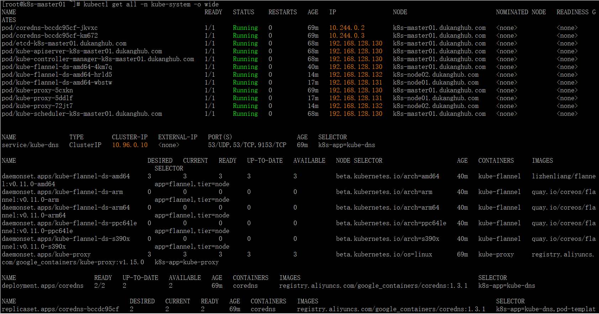

> #### 作者：DuKang
[toc]
<font size=4>
kubeadm是官方社区推出的一个用于快速部署kubernetes集群的工具。

这个工具能通过两条指令完成一个kubernetes集群的部署：

```
# 创建一个 Master 节点
$ kubeadm init

# 将一个 Node 节点加入到当前集群中
$ kubeadm join <Master节点的IP和端口 >
```
节点规划
节点名|主机名|IP|组件|备注
---|---|---|---|---
master01|k8s-master01.dukanghub.com|192.168.128.130|docker-ce kubeadm kubectl kubelet flannel
node01|k8s-node01.dukanghub.com|192.168.128.131|docker-ce kubeadm kubelet kubectl
node02|k8s-node01.dukanghub.com|192.168.128.132|docker-ce kubeadm kubelet kubectl
## 1. 安装要求

在开始之前，部署Kubernetes集群机器需要满足以下几个条件：
- 三台或三台以上机器，操作系统 CentOS7.x-86_x64
```bash
cat /etc/redhat-release
```
- 硬件配置：2GB或更多RAM，2个CPU或更多CPU，硬盘30GB或更多
```bash
free -m
df -h
grep "processor" /proc/cpuinfo |wc -l
```
- 集群中所有机器之间网络互通
- 每个节点的唯一主机名，MAC地址和product_uuid
您可以使用命令`ip link`或获取网络接口的MAC地址`ifconfig -a`
可以使用该命令检查`product_uuid` `sudo cat /sys/class/dmi/id/product_uuid`
- 可以访问外网，需要拉取镜像
- 禁止swap分区
```bash
swapoff -a
sed -i '/swap/s/^/#/g' /etc/fstab
```
- 检查所需要的端口是否可用或放行
控制节点(master)

协议|流量方向|端口范围|目标|用途|备注
---|---|---|---|---|---
TCP|入方向|6443*|Kubernetes API server|ALL
TCP|入方向|2379-2380|etcd server client API|kube-apiserver, etcd
TCP|入方向|10250|Kubelet API|Self, Control plane
TCP|入方向|10251|kube-scheduler|Self
TCP|入方向|10252|kube-controller-manager|Self
Node节点
协议|流量方向|端口范围|目标|用途|备注
---|---|---|---|---|---
TCP|入方向|10250|Kubelet API|Self, Control plane
TCP|入方向|30000-32767|NodePort Services**|ALL|端口没必要开那么多，又用不完，2000多个够用了
- 配置`sysctl.conf`,防止iptables被绕过而导致流量路由不正确的问题
```bash
cat <<EOF >  /etc/sysctl.d/k8s.conf
net.bridge.bridge-nf-call-ip6tables = 1
net.bridge.bridge-nf-call-iptables = 1
EOF
sysctl --system
# 确保br_netfilter在此步骤之前加载了模块。这可以通过运行以下命令来完成
lsmod | grep br_netfilter
# 如果没有加载，运行以下命令加载
modprobe br_netfilter
```
- 关闭selinux、防火墙之类的
```bash
setenforce 0
sed -i 's/^SELINUX=enforcing$/SELINUX=disabled/' /etc/selinux/config
# sed -i 's@^\(SELINUX=\).*@\1disabled@' /etc/selinux/config
systemctl stop firewalld
systemctl disable firewalld
```
- 添加`k8s`yum源和`docker-ce`yum源
```bash
cat <<EOF > /etc/yum.repos.d/kubernetes.repo
[kubernetes]
name=Kubernetes
baseurl=https://mirrors.aliyun.com/kubernetes/yum/repos/kubernetes-el7-x86_64
enabled=1
gpgcheck=1
repo_gpgcheck=1
gpgkey=https://mirrors.aliyun.com/kubernetes/yum/doc/yum-key.gpg https://mirrors.aliyun.com/kubernetes/yum/doc/rpm-package-key.gpg
EOF
wget -P /etc/yum.repos.d/ "https://mirrors.aliyun.com/docker-ce/linux/centos/docker-ce.repo"
```
- 启用ipvs内核模块
创建内核模块载入相关的脚本文件`/etc/sysconfig/modules/ipvs.modules`，设定自动载入的内核模块，文件内容如下：
```bash
#!/bin/bash
ipvs_mods_dir="/usr/lib/modules/$(uname -r)/kernel/net/netfilter/ipvs"
for i in $(ls $ipvs_mods_dir|grep -o "^[^.]*");do
  /sbin/modinfo -F filename $i &> /dev/null
  if [ $? -eq 0 ];then
    /sbin/modprobe $i
  fi
done
```
修改文件权限，并手动为当前系统加载内核模块：
```bash
chmod +x /etc/sysconfig/modules/ipvs.modules
bash /etc/sysconfig/modules/ipvs.modules
```
- 设置各节点时间同步，
```bash
# 使用centos7自带的chronyd服务，也可以自己安装ntpdate
systemctl start chronyd.service
systemctl enable chronyd.service
# 建议使用本地的时间服务器，修改节点的/etc/crhony.conf，将时间服务器指向相应的主机即可，配置格式如下：
server CHRONY-SERVER-NAME-OR-IP iburst
```
- 主机名称解析
```conf
192.168.128.130 k8s-master01.dukanghub.com master01
192.168.128.131 k8s-node01.dukanghub.com node01
192.168.128.132 k8s-node02.dukanghub.com node02
```
## 2. 准备环境
在各节点(包括master)执行
```bash
swapoff -a
sed -i '/swap/s/^/#/g' /etc/fstab
setenforce 0
sed -i 's/^SELINUX=enforcing$/SELINUX=disabled/' /etc/selinux/config
systemctl stop firewalld
systemctl disable firewalld
modprobe br_netfilter
cat <<EOF >  /etc/sysctl.d/k8s.conf
net.bridge.bridge-nf-call-ip6tables = 1
net.bridge.bridge-nf-call-iptables = 1
EOF
sysctl --system
# 添加docker-ce源
wget -P /etc/yum.repos.d/ "https://mirrors.aliyun.com/docker-ce/linux/centos/docker-ce.repo"
# 添加阿里云YUM软件源
cat <<EOF > /etc/yum.repos.d/kubernetes.repo
[kubernetes]
name=Kubernetes
baseurl=https://mirrors.aliyun.com/kubernetes/yum/repos/kubernetes-el7-x86_64
enabled=1
gpgcheck=1
repo_gpgcheck=1
gpgkey=https://mirrors.aliyun.com/kubernetes/yum/doc/yum-key.gpg https://mirrors.aliyun.com/kubernetes/yum/doc/rpm-package-key.gpg
EOF
cat <<EOF >/etc/sysconfig/modules/ipvs.modules
ipvs_mods_dir="/usr/lib/modules/$(uname -r)/kernel/net/netfilter/ipvs"
for i in \$(ls $ipvs_mods_dir|grep -o "^[^.]*");do
  /sbin/modinfo -F filename $i &> /dev/null
  if [ $? -eq 0 ];then
    /sbin/modprobe $i
  fi
done
EOF
chmod +x /etc/sysconfig/modules/ipvs.modules
bash /etc/sysconfig/modules/ipvs.modules
systemctl start chronyd.service
systemctl enable chronyd.service
cat <<EOF >> /etc/hosts
192.168.128.130 k8s-master01.dukanghub.com master01
192.168.128.131 k8s-node01.dukanghub.com node01
192.168.128.132 k8s-node02.dukanghub.com node02
EOF
```

## 3. 所有节点安装Docker/kubeadm/kubelet

Kubernetes默认CRI（容器运行时）为Docker，因此先安装Docker。

### 3.1 安装Docker
```
$ wget https://mirrors.aliyun.com/docker-ce/linux/centos/docker-ce.repo -O /etc/yum.repos.d/docker-ce.repo
$ yum -y install docker-ce
$ systemctl enable docker && systemctl start docker
$ docker --version
Docker version 18.09.7, build 2d0083d
# 设置docker国内镜像仓库
cat > /etc/docker/daemon.json <<EOF
{
    "registry-mirrors": ["https://docker.mirrors.ustc.edu.cn"]
}
EOF
```
注意：
1. 若要通过默认的`k8s.gcr.io`镜像仓库获取kubernetes系统组件的相关镜像，需要配置docker Unit File(`/usr/lib/systemd/system/docker.service`)中的`Environment`变量，为其定义科学上网的HTTP_PROXY，格式如下：
    `Environment="HTTPS_PROXY=PROTOCOL://HOST:PORT"`
    如`Environment="HTTPS_PROXY=http://www.ik8s.io:10070"`
    `Environment="NO_PROXY=192.168.128.0/24,127.0.0.0/8"`
2. docker自1.13版起会自动设置`iptables`的`FORWARD`默认策略为`DROP`,这可能会影响kubernetes集群依赖的报文转发功能，因此，需要在docker服务启动后，重新将`FORWARD`链的默认策略设置为`ACCEPT`,方法是修改`/usr/lib/systemd/system/docker.service`,在`ExecStart=/usr/bin/dockerd`一行之后新增一行如下内容：
    `ExecStartPost=/usr/sbin/iptables -P FORWARD ACCEPT`
修改完成后即可重新启动docker服务
    `systemctl daemon-reload`
    `systemctl restart docker`

### 3.2 安装kubeadm，kubelet和kubectl
安装最新版
```
yum install -y kubelet kubeadm kubectl
systemctl enable kubelet
```
如果需要指定版本号部署，如下格式执行：
```
$ yum install -y kubelet-1.15.0 kubeadm-1.15.0 kubectl-1.15.0
$ systemctl enable kubelet
```
## 4. 初始化Kubernetes Master

在`192.168.128.130`（Master）执行。
若末禁用swap设备，则需要编辑`kubelet`的配置文件`/etc/sysconfig/kubelet`，设置其忽略swap启用的状态错误，内容如下:
```
KUBELET_EXTRA_ARGS="--fail-swap-on=false"
```
(可选步骤)而后，在运行初始化命令之前先运行如下命令单独获取相关的镜像文件，而后再运行后面的`kubeadm init`命令，以便于观察到镜像文件的下载过程
```bash
kubeadm config images pull
```
<font color="red">如果前面没有在docker启动服务脚本里设置科学上网，又没有初始化集群，将会报错，大致如下：</font>

而后再进行master节点初始化。`kubeadm init`命令支持两种初始化方式，一是通过命令行选项传递关键的部署设定，另一个是基于`yaml`格式的专用配置文件，后一种允许用户自定义各个部署参数。下面分别给出了两种实现方式的配置步骤，建议读者采用第二种方式进行：

初始化方式一：
运行如下命令完成`master01`节点的初始化：
```bash
kubeadm init \
--kubernetes-version='v1.15.0' \
--pod-network-cidr='10.244.0.0/16' \
--service-cidr='10.96.0.0/12' \
--image-repository='registry.aliyuncs.com/google_containers' \
--ignore-preflight-errors=Swap
```

<font color="red">由于默认拉取镜像地址k8s.gcr.io国内无法访问，这里指定阿里云镜像仓库地址。</font>
<font color="red">为每个`string`类型的参数值使用单引号可减少一些不必要的麻烦。</font>
<font color="red">运行初始化命令时加在后面加参数`--dry-run`测试有无问题，没问题再去掉此参数执行初始化。</font>
命令中的各选项简单说明如下：
(1) `--kubernetes-version`选项的版本号是用于指定要部署的`kubernetes`程序版本，它需要与当前的`kubeadm`支持的版本保持一致；
(2) `--pod-network-cidr`选项用于指定各Pod分配使用的网络地址，它通常应该与要部署使用的网络插件(例如`flannel`、`calico`等)的默认设定保持一致，`10.244.0.0/16`是`flannel`默认使用的网络；
(3) `--service-cidr`用于指定为`Service`分配使用的网络地址，它由`kubernetes`管理，默认即为`10.96.0.0/12`；
(4) `--image-repository`用于指定镜像仓库地址；
(5) `--ignore-preflight-errors`仅应在末禁用Swap设备的状态下使用

注意保存最后那条命令，其他`node`节点加入集群时需要使用
```
kubeadm join 192.168.128.130:6443 --token 2xja90.se6n2m6h769gjeii \
    --discovery-token-ca-cert-hash sha256:e355bf6b27e58b5d8e85641442b07fc55df4a7af266b5f4a5ab724104e483119 
```
初始化后，要想使用`kubectl`命令，需要进行如下操作：
```bash
mkdir -p $HOME/.kube
sudo cp -i /etc/kubernetes/admin.conf $HOME/.kube/config
sudo chown $(id -u):$(id -g) $HOME/.kube/config
$ kubectl get nodes
```

目前有一个节点，但是处于`NotReady`状态下，需要部署`CNI`网络插件后才能`Ready`
先下载`flannel`的`yaml`文件，然后修改其中的镜像地址为`lizhenliang/flannel:v0.11.0-amd64`
```bash
wget "https://raw.githubusercontent.com/coreos/flannel/master/Documentation/kube-flannel.yml"
kubectl apply -f kube-flannel.yml
```

至此，master节点安装成功，接下来将node加入集群即可
初始化方式二：
  可通过以下命令输出默认配置：
```bash
kubeadm config print init-defaults
```
## 5. 安装Pod网络插件（CNI）
kubernetes的网络结构

先下载`flannel`的`yaml`文件，然后修改其中的镜像地址为`lizhenliang/flannel:v0.11.0-amd64`
```bash
wget "https://raw.githubusercontent.com/coreos/flannel/master/Documentation/kube-flannel.yml"
kubectl apply -f kube-flannel.yml
```
确保能够访问到quay.io这个registery。
如果下载失败，可以改成这个镜像地址：lizhenliang/flannel:v0.11.0-amd64

## 6. 加入Kubernetes Node

在192.168.128.131/132（Node）执行。

向集群添加新节点，执行在kubeadm init输出的kubeadm join命令：

```bash
kubeadm join 192.168.128.130:6443 --token 2xja90.se6n2m6h769gjeii \
    --discovery-token-ca-cert-hash sha256:e355bf6b27e58b5d8e85641442b07fc55df4a7af266b5f4a5ab724104e483119
```

在master节点可以看到新加入了一个node

如此继续在node2节点上操作一次，耐心等待2-3分钟，可看到全部节点已`Ready`

至此，集群搭建完毕，从上面可以发现，对于`kubeadm kubelet kubectl`我们没有预先启动任何一个，不过，搭建后，我们还是需要将`kubelet`设为开机启动`systemctl enbale kubelet`，在前面`node`加入集群时就有`Warning`提示需要`systemctl enable kubelet`
## 7. 测试kubernetes集群
先看一下集群搭建完后，在`kube-system`空间中有哪些`Pod`

从图中可以看到，集群中的一些组件都是运行在pod中的。
再看一下集群的所有资源

在Kubernetes集群中创建一个pod，验证是否正常运行：
```bash
# 使用一个基本alpine制作的nginx镜像，较小，容易拉取
kubectl create deployment nginx-dep --image=nginx:1.14-alpine
# service种类有四种，clusterip externalname loadbalancer nodeport
# 这里直接使用nodeport方式是因为此种方式创建时会自动创建clusterip，同时拥有一个node节点ip+随机端口，可在集群外访问
kubectl create service nodeport nginx-dep --tcp=80:80
kubectl get pod,svc
```
<font color="red">创建与deployment名字同名的service，将会自动关联此deployment下的Pod</font>
访问方式一：http://NodeIP:Port
访问方式二：http://ServiceIP
访问方式三：将本机的DNS修改为coreDNS的IP，然后使用域名`nginx-dep.default.svc.cluster.local`访问,域名前面的`nginx-dep`是`ServiceName`

刚才上面两条命令只能创建一个`Pod`，想要增加`Pod`数量，如下操作
```bash
kubectl scale deploy/nginx-dep --replicas=2 --record=true
# 思考一个问题，扩容为什么是deploy,而不是svc或pod，因为pod是按deployment的方式部署的
# 参数--record=true是为了记录扩容运行的命令，方便回滚
```

测试完，删除对应的资源，注意先删大资源，后删小资源
```bash
kubectl delete service nginx-dep
# 删除service会删除对应的service ip，但不会删除deployment
kubectl delete deploy nginx-dep
# 删除deploy会同时删除此deploy下的replicas\pod等所有资源。
```
## 8. `kubectl`常用命令使用
- 查看集群状态
```bash
kubectl get cs
```
- 列出集群资源
```bash
kubectl api-resources
```
- 一次管理多个资源的方法
```bash
kubectl delete namespace/test namespace/prod
# 以上namespace可简写为ns
```
- 按不同格式输出资源具体完整信息
```bash
# 获取default名称空间的长信息
kubectl get ns/default -o wide
# 按json格式输出default名称空间信息
kubectl get ns/default -o json
# 按yaml格式输出default名称空间信息
kubectl get ns/default -o yaml
```
- 输出资源的描述信息(一般是当前状态)
```bash
kubectl describe ns/default
```
- 
## 9. 部署 Dashboard

```
$ kubectl apply -f https://raw.githubusercontent.com/kubernetes/dashboard/v1.10.1/src/deploy/recommended/kubernetes-dashboard.yaml
```
dashboard相关说明文档`https://github.com/kubernetes/dashboard/wiki/Dashboard-arguments`
默认镜像国内无法访问，修改镜像地址为： lizhenliang/kubernetes-dashboard-amd64:v1.10.1

默认Dashboard只能集群内部访问，修改Service为NodePort类型，暴露到外部：

```
kind: Service
apiVersion: v1
metadata:
  labels:
    k8s-app: kubernetes-dashboard
  name: kubernetes-dashboard
  namespace: kube-system
spec:
  type: NodePort
  ports:
    - port: 443
      targetPort: 8443
      nodePort: 30001
  selector:
    k8s-app: kubernetes-dashboard
```
```
$ kubectl apply -f kubernetes-dashboard.yaml
```
访问地址：https://NodeIP:30001

创建service account并绑定默认cluster-admin管理员集群角色：

```bash
$ kubectl create serviceaccount dashboard-admin -n kube-system
$ kubectl create clusterrolebinding dashboard-admin --clusterrole=cluster-admin --serviceaccount=kube-system:dashboard-admin
$ kubectl describe secrets -n kube-system $(kubectl -n kube-system get secret | awk '/dashboard-admin/{print $1}')
# 获取访问token
kubectl get secret $(kubectl get secret -n kube-system|awk '/dashboard-admin-token/{print $1}') -n kube-system -o jsonpath={.data.token}|base64 -d
```
使用输出的token登录Dashboard。
但是你会发现使用google浏览器直接打不开网页，而在火狐浏览器却可以打开。
解决chrome等浏览器拒绝访问
```bash
# 进入master节点存放证书目录，使用kubeadm安装的默认就在以下目录
cd /etc/kubernetes/pki
mkdir dashboard
# 生成证书
(umask 077;openssl genrsa -out dashboard.key 2048)
openssl req -new -out dashboard.csr -key dashboard.key -subj '/CN=dashboard.dukanghub.com'
openssl x509 -req  -days 3650 -in dashboard.csr -signkey dashboard.key -out dashboard.crt 
# 上面的命令如需指定ca，则如下
openssl x509 -req -n dashboard.csr -CA ./ca.crt -CAkey ./ca.key -CAcreateserial -out dashboard.crt -days 3650
#删除原有的证书secret
kubectl delete secret kubernetes-dashboard-certs -n kube-system
#创建新的证书secret
kubectl create secret generic kubernetes-dashboard-certs --from-file=dashboard.key --from-file=dashboard.crt -n kube-system
#查看dashboard的pod
kubectl get pod -l k8s-app=kubernetes-dashboard -n kube-system
#重启pod，以便其使用新的证书
kubectl delete pod $(kubectl get pod -l k8s-app=kubernetes-dashboard -n kube-system|awk '/kubernetes-dashboard/{print $1}') -n kube-system
```
将`token`写到`kubeconfig`文件中，使用`kubeconfig`访问`dashboard`，

```bash
# 取出token 为ServiceAccount使用的Secret,用于登录dashboard使用
DASH_TOCKEN=$(kubectl get secret $(kubectl get secret -n kube-system|awk '/dashboard-admin-token/{print $1}') -n kube-system -o jsonpath={.data.token}|base64 -d)
# 设置集群信息
kubectl config set-cluster kubernetes --server=https://192.168.128.130:6443 --kubeconfig=dashboard-admin.conf
# 导入tocken，用于pod与apiserver通信时使用
kubectl config set-credentials dashboard-admin --token=$DASH_TOCKEN --kubeconfig=dashboard-admin.conf
# 设置上下文
kubectl config set-context dashboard-admin@kubernetes --cluster=kubernetes --user=dashboard-admin --kubeconfig=dashboard-admin.conf
# 使用上下文
kubectl config use-context dashboard-admin@kubernetes --kubeconfig=dashboard-admin.conf
```
但是上面的例子不能使用域名访问(手动绑定hosts，然后使用域名:30001这种方式不叫域名访问)，而且具有单机故障。接下来使用ingress-nginx解决这个问题
## 10. ingress-nginx的使用
下载`ingress-nginx`的yaml文件
```bash
wget https://github.com/kubernetes/ingress-nginx/releases/download/nginx-0.25.0/ingress-nginx.yaml
```
修改`ingress-nginx.yaml`
将`kind: Deployment`改为`kind: DaemonSet`，使用每个node上都有ingress-nginx的pod，否则你域名解析时到一个没有ingress-nginx的pod的node上时，将会无法访问
```yaml
apiVersion: apps/v1
#kind: Deployment
kind: DaemonSet
metadata:
  name: nginx-ingress-controller
  namespace: ingress-nginx
  labels:
    app.kubernetes.io/name: ingress-nginx
    app.kubernetes.io/part-of: ingress-nginx
spec:
  # Deployment下才需要使用replicas，DaemonSet不需要此参数
  #replicas: 1
```
然后就是修改镜像地址
```yaml
          # 这个原始镜像地址，下不动，得坐个好点的飞机，250M左右
          #image: quay.io/kubernetes-ingress-controller/nginx-ingress-controller:0.25.0
          # 这个是dockerhub上搜来的
          image: scolib/nginx-ingress-controller:0.25.0
          imagePullPolicy: IfNotPresent
```
完整yaml文件内容如下：
```yaml
apiVersion: v1
kind: Namespace
metadata:
  name: ingress-nginx
  labels:
    app.kubernetes.io/name: ingress-nginx
    app.kubernetes.io/part-of: ingress-nginx

---

kind: ConfigMap
apiVersion: v1
metadata:
  name: nginx-configuration
  namespace: ingress-nginx
  labels:
    app.kubernetes.io/name: ingress-nginx
    app.kubernetes.io/part-of: ingress-nginx

---
kind: ConfigMap
apiVersion: v1
metadata:
  name: tcp-services
  namespace: ingress-nginx
  labels:
    app.kubernetes.io/name: ingress-nginx
    app.kubernetes.io/part-of: ingress-nginx

---
kind: ConfigMap
apiVersion: v1
metadata:
  name: udp-services
  namespace: ingress-nginx
  labels:
    app.kubernetes.io/name: ingress-nginx
    app.kubernetes.io/part-of: ingress-nginx

---
apiVersion: v1
kind: ServiceAccount
metadata:
  name: nginx-ingress-serviceaccount
  namespace: ingress-nginx
  labels:
    app.kubernetes.io/name: ingress-nginx
    app.kubernetes.io/part-of: ingress-nginx

---
apiVersion: rbac.authorization.k8s.io/v1beta1
kind: ClusterRole
metadata:
  name: nginx-ingress-clusterrole
  labels:
    app.kubernetes.io/name: ingress-nginx
    app.kubernetes.io/part-of: ingress-nginx
rules:
  - apiGroups:
      - ""
    resources:
      - configmaps
      - endpoints
      - nodes
      - pods
      - secrets
    verbs:
      - list
      - watch
  - apiGroups:
      - ""
    resources:
      - nodes
    verbs:
      - get
  - apiGroups:
      - ""
    resources:
      - services
    verbs:
      - get
      - list
      - watch
  - apiGroups:
      - ""
    resources:
      - events
    verbs:
      - create
      - patch
  - apiGroups:
      - "extensions"
      - "networking.k8s.io"
    resources:
      - ingresses
    verbs:
      - get
      - list
      - watch
  - apiGroups:
      - "extensions"
      - "networking.k8s.io"
    resources:
      - ingresses/status
    verbs:
      - update

---
apiVersion: rbac.authorization.k8s.io/v1beta1
kind: Role
metadata:
  name: nginx-ingress-role
  namespace: ingress-nginx
  labels:
    app.kubernetes.io/name: ingress-nginx
    app.kubernetes.io/part-of: ingress-nginx
rules:
  - apiGroups:
      - ""
    resources:
      - configmaps
      - pods
      - secrets
      - namespaces
    verbs:
      - get
  - apiGroups:
      - ""
    resources:
      - configmaps
    resourceNames:
      # Defaults to "<election-id>-<ingress-class>"
      # Here: "<ingress-controller-leader>-<nginx>"
      # This has to be adapted if you change either parameter
      # when launching the nginx-ingress-controller.
      - "ingress-controller-leader-nginx"
    verbs:
      - get
      - update
  - apiGroups:
      - ""
    resources:
      - configmaps
    verbs:
      - create
  - apiGroups:
      - ""
    resources:
      - endpoints
    verbs:
      - get

---
apiVersion: rbac.authorization.k8s.io/v1beta1
kind: RoleBinding
metadata:
  name: nginx-ingress-role-nisa-binding
  namespace: ingress-nginx
  labels:
    app.kubernetes.io/name: ingress-nginx
    app.kubernetes.io/part-of: ingress-nginx
roleRef:
  apiGroup: rbac.authorization.k8s.io
  kind: Role
  name: nginx-ingress-role
subjects:
  - kind: ServiceAccount
    name: nginx-ingress-serviceaccount
    namespace: ingress-nginx

---
apiVersion: rbac.authorization.k8s.io/v1beta1
kind: ClusterRoleBinding
metadata:
  name: nginx-ingress-clusterrole-nisa-binding
  labels:
    app.kubernetes.io/name: ingress-nginx
    app.kubernetes.io/part-of: ingress-nginx
roleRef:
  apiGroup: rbac.authorization.k8s.io
  kind: ClusterRole
  name: nginx-ingress-clusterrole
subjects:
  - kind: ServiceAccount
    name: nginx-ingress-serviceaccount
    namespace: ingress-nginx

---

apiVersion: apps/v1
#kind: Deployment
kind: DaemonSet
metadata:
  name: nginx-ingress-controller
  namespace: ingress-nginx
  labels:
    app.kubernetes.io/name: ingress-nginx
    app.kubernetes.io/part-of: ingress-nginx
spec:
  # Deployment下才需要使用replicas，DaemonSet不需要此参数
  #replicas: 1
  selector:
    matchLabels:
      app.kubernetes.io/name: ingress-nginx
      app.kubernetes.io/part-of: ingress-nginx
  template:
    metadata:
      labels:
        app.kubernetes.io/name: ingress-nginx
        app.kubernetes.io/part-of: ingress-nginx
      annotations:
        prometheus.io/port: "10254"
        prometheus.io/scrape: "true"
    spec:
      serviceAccountName: nginx-ingress-serviceaccount
      hostNetwork: true
      containers:
        - name: nginx-ingress-controller
          # 这个原始镜像地址，下不动，得坐个好点的飞机，250M左右
          #image: quay.io/kubernetes-ingress-controller/nginx-ingress-controller:0.25.0
          # 这个是dockerhub上搜来的
          image: scolib/nginx-ingress-controller:0.25.0
          imagePullPolicy: IfNotPresent
          args:
            - /nginx-ingress-controller
            - --configmap=$(POD_NAMESPACE)/nginx-configuration
            - --tcp-services-configmap=$(POD_NAMESPACE)/tcp-services
            - --udp-services-configmap=$(POD_NAMESPACE)/udp-services
            - --publish-service=$(POD_NAMESPACE)/ingress-nginx
            - --annotations-prefix=nginx.ingress.kubernetes.io
          securityContext:
            allowPrivilegeEscalation: true
            capabilities:
              drop:
                - ALL
              add:
                - NET_BIND_SERVICE
            # www-data -> 33
            runAsUser: 33
          env:
            - name: POD_NAME
              valueFrom:
                fieldRef:
                  fieldPath: metadata.name
            - name: POD_NAMESPACE
              valueFrom:
                fieldRef:
                  fieldPath: metadata.namespace
          ports:
            - name: http
              containerPort: 80
            - name: https
              containerPort: 443
          livenessProbe:
            failureThreshold: 3
            httpGet:
              path: /healthz
              port: 10254
              scheme: HTTP
            initialDelaySeconds: 10
            periodSeconds: 10
            successThreshold: 1
            timeoutSeconds: 10
          readinessProbe:
            failureThreshold: 3
            httpGet:
              path: /healthz
              port: 10254
              scheme: HTTP
            periodSeconds: 10
            successThreshold: 1
            timeoutSeconds: 10

---

```
部署`ingress-nginx`
```bash
kubectl apply -f ingress-nginx.yaml
# 一些教程会说在后面指定名称空间，其实大可不必，因为yaml里已经定义其属于哪个名称空间
```
`ingress-nginx`默认在`ingress-nginx`名称空间中
```bash
kubectl get pods -n ingress-nginx -o wide
```

从图中可以看到，每台节点上都运行了一个ingress-nginx
配置`dashboard`使用公签证书
将公签证书导入`secret`中，方便dashboard的pod调用
```bash
kubectl create secret tls kubernetes-dashboard-certs --cert=dashboard.crt --key=dashboard.key -n kube-system
# 注意secret应与pod使用相同名称空间，
# 这里使用tls类型创建secret是因为ingress只认这个类型的证书
# 创建完后，在对应的dashboard yaml文件中的args添加以下两个选项
- --tls-key-file=tls.key
- --tls-cert-file=tls.crt
# 注意这里的tls.crt是tls类型secret中证书的键名，而使用generic类型创建的secret，其键名可指定，若未指定，将与文件名同名
# 至于- --auto-generate-certificates注释亦可，不注释亦可
```
对于`dashboard`的yaml文件，还应修改如下几项
```
1. 去除其deployment下的nodeName，增加replicas
2. 去除service下的nodePort
```
创建`dashboard`域名的ingress文件`https.dashboard.dukanghub.com.yaml`
```yaml
apiVersion: extensions/v1beta1
kind: Ingress
metadata:
  name: "ingress-https-dashboard.dukanghub.com"
  namespace: kube-system
  annotations:
    # 启用HTTP308永久重定向到HTTPS
    nginx.ingress.kubernetes.io/ssl-redirect: "true"
    nginx.ingress.kubernetes.io/rewrite-target: /
    #nginx.ingress.kubernetes.io/secure-backends: "true" 该注释在0.18.0中被弃用，并在0.20.0发布后被删除，使用下面
    nginx.ingress.kubernetes.io/backend-protocol: "HTTPS"
    #nginx.ingress.kubernetes.io/ingress.class: nginx
    #nginx.ingress.kubernetes.io/ssl-passthrough: "true"
    # 这些自定义标签可在https://kubernetes.github.io/ingress-nginx/user-guide/nginx-configuration/annotations/查看
spec:
  tls:
  - hosts:
    - dashboard.dukanghub.com
    secretName: kubernetes-dashboard-certs
  rules:
  - host: dashboard.dukanghub.com
    http:
      paths:
      - path:
        backend:
          serviceName: kubernetes-dashboard
          servicePort: 443
```
```bash
kubectl apply -f https.dashboard.dukanghub.com.yaml
# 注意此ingress应与pod同名称空间
```
两个node节点上都有了这个dashboard的pod了，就不用担心哪个node挂掉了，而访问也可直接用域名，无须关心dashboard跑到哪个node上了

使用域名访问dashboard效果如下

接下来就需要在域名解析处将dashboard所用域名解析多条A记录到nodeIP(如果这前面的LB的话无须这样做，只需解析到LB的IP即可)，阿里云上可设置轮询，但是当其中一台node挂掉后，无法从上面剔除。

## 11. 持久存储之PV与PVC
本次使用nfs搭建存储系统，先在三台机上安装`nfs-utils`
```bash
yum -y install nfs-utils
```
在`master01`执行以下命令，建立`nfs`服务端
```bash
# 只有服务端才需要启动这个nfs服务，
systemctl start nfs
systemctl enable nfs
mkdir -pv /data/mysql
mkdir -pv /data/www/{wwwroot,logs}
cat > /etc/exports <<EOF
/data/www/wwwroot 192.168.128.0/24(rw,no_root_squash)
/data/mysql       192.168.128.0/24(rw,no_root_squash)
EOF
# 查看共享
showmount -e
```
去`node`节点手动测试一下能不能挂载
```bash
# 必须确保此存储域名能被正确解析
mount -t nfs store-master01.dukanghub.com:/data/www/wwwroot /mnt
# 如果不能挂载，需要找出不能挂载的原因并解决
# 测试完了，手动卸载
umount /mnt
```
定义`PV`(在`master`操作)
```yaml
# 可使用kubectl explain pv获取此apiVersion
apiVersion: v1
kind: PersistentVolume
metadata:
  name: pv-wwwroot
  labels:
    name: pv-wwwroot
spec:
  nfs:
    path: /data/www/wwwroot
    server: store-master01.dukanghub.com
  accessModes: ["ReadWriteMany", "ReadWriteOnce"]
  capacity:
    # 测试使用，容量不要搞那么大，省的虚拟机空间不够
    storage: 1Gi

---
apiVersion: v1
kind: PersistentVolume
metadata:
  name: pv-mysql
  labels:
    name: pv-mysql
spec:
  nfs:
    path: /data/mysql
    server: store-master01.dukanghub.com
  accessModes: ["ReadWriteMany"]
  capacity:
    storage: 2Gi
```
定义`PVC`
```yaml
apiVersion: v1
kind: PersistentVolumeClaim
metadata:
  name: pvc-wwwroot
  labels:
    name: pvc-wwwroot
  namespace: default
spec:
  accessModes: ["ReadWriteMany"]
  resources:
    requests:
      storage: 1Gi
```
Pod中使用`pvc`
```yaml
apiVersion: v1
kind: Pod
metadata:
  name: pod-vol-pvc
  namespace: default
spec:
  containers:
  - name: nginx
    image: nginx:1.14-alpine
    volumeMounts:
    - name: html
      mountPath: "/var/www/html"
  volumes:
  - name: html
    persistentVolumeClaim:
      claimName: pvc-wwwroot
```
思考个问题，这个pvc如何缩容呢，目前没有发现怎么缩，只看到增。另外，一个pv只能分配给有且只有一个pvc，但是你删除不用的pvc后，在pv回收策略为`Retain`时，pv状态并不会变为可用`available`，而是成为`Released`，新创建的pvc也不会关联到此pv上，即使你新创建的pvc跟原来的pvc相同。目前有两种解决方法：一是通过kubectl edit pv进入pv里删除其spec.claimRef，二是通过kubectl delete pv来删除pv，然后再重新创建一个pv。此两种方法都可让pv重新变为可用状态。
## 12. 配置文件之configMap
configMap用来存放不敏感数据，secret用来存放敏感数据
使用场景：nginx配置可能要动态修改，通过设置configMap的方式，以volumes方式挂载到容器里，可以实现配置的动态加载,但是监听的端口仍然不变，如果增加了端口需要重载才可生效。
实现过程：
先定义一个nginx主配置文件
```nginxconf
#user www;
worker_processes auto;

worker_rlimit_nofile 65535;
events {
    use epoll;
    #multi_accept on;
    worker_connections  65535;
}
http {
    include       mime.types;
    default_type  application/octet-stream;
    charset       utf-8;
    # 自定义日志格式
    log_format  main  '[TIME:$time_iso8601] | [CDN:$remote_addr, USER:$http_x_forwarded_for] | [URL:$scheme://$host$request_uri] | [REFERER:$http_referer] | '
                      '[REQUEST:$remote_user "$request"] | '
                      '[STATUS:$status $body_bytes_sent] | [USER_AGENT:$http_user_agent] | [REQUEST_TIME:$request_time] | [UPSTREAM_TIME:$upstream_response_time]';

    sendfile        on;
    tcp_nopush      on;

    keepalive_timeout  65;
    # 关闭nginx版本显示
    server_tokens off;

    # fastcgi设置，跟后端php-fpm相关
    fastcgi_connect_timeout 300;
    fastcgi_send_timeout 300;
    fastcgi_read_timeout 300;
    fastcgi_buffer_size 64k;
    fastcgi_buffers 4 64k;
    fastcgi_busy_buffers_size 128k;
    fastcgi_temp_file_write_size 128k;
    fastcgi_intercept_errors on;

    gzip on;
    gunzip on;
    gzip_min_length   1k;
    gzip_buffers      4 16k;
    gzip_http_version 1.0;
    gzip_comp_level   6;
    gzip_vary         off;
    gzip_disable      "MSIE [1-6]\.";
    gzip_types  text/plain application/x-javascript text/javascript text/css application/xml application/json application/x-httpd-php application/vnd.ms-excel application/pdf image/jpeg image/gif image/png;

    include "/etc/nginx/sites-enabled/*.conf";

｝
```
先定义configMap
```bash
# 由于文件内容过多，暂时还是使用命令方式创建configmap
kubectl create configmap nginx-main-conf --from-file=nginx.conf=/data/configmap/nginx/nginx.conf
# 可使用下面方式生成yaml文件
kubectl create configmap nginx-main-conf --from-file=nginx.conf=/data/configmap/nginx/nginx.conf --dry-run -o yaml > nginx-main-conf-configmap.yaml
```
在Pod的yaml中使用configmap
有两种方式，一种是ENV方式，一种是卷挂载
ENV方式
```yaml
kind: Pod
...
spec:
  containers:
  - name: nginx
    image: nginx
    ports:
    - name: http
      containerPort: 80
    env:
      # 下面这个name是指容器里环境变量的名字
    - name: NGINX-CONF
      valueFrom:
        configMapRef:
          name: nginx-main-conf
          # 在一个configmap中可能存在多个键值对，指明key,表示引入这个configmap哪个key的值给容器ENV变量NGINX-CONF
          key: nginx.conf
          # 使用env方式引入，configmap不存在或其中的键不存在，会导致容器无法启动，除非指明以下参数
          optional: true
```
使用ENV方式引入无法同步更新
卷挂载方式可以同步更新，大约10秒左右
```yaml
kind: Pod
...
spec:
  containers:
  - name: nginx
    image: nginx
    ports:
    - name: http
      containerPort: 80
    volumeMounts:
      # 下面这个name是volume的名称，需要跟下面定义的volume名称一样
    - name: nginx-conf
      # 将上面这个nginx-conf的内容挂载到容器里的如下路径，他会将这个路径当作目录，如果不存在就去创建这个目录
      mountPath: /etc/nginx/nginx.conf
      # 重点：不增加下面这行会无法启动容器，说你将一个文件挂到一个目录上了,搞不懂为什么上面那句不能直接覆盖原nginx.conf，非得加下面这么一句才覆盖，而且下面的值不能乱写，得跟你volume的键名相同。但是如果上面的mountPath是一个目录，而卷对应的也是一个目录，那可以直接覆盖。
      subPath: nginx.conf
      readOnly: true
  volumes:
    # 下面这个name是定义这个volume叫什么名字
  - name: nginx-conf
    configMap:
      # 下面这个name是指之前创建的configmap的名字
      name: nginx-main-conf
      # 只挂载部分时可使用item
      items:
      # 这个key指的是configmap中的key名
      - key: nginx.conf
        # 这个path指的不以上面的key名作文件名映射到容器中，而是以下面的path名映射
        path: nginx.conf
```
然而，使用上面的挂载，文件的内容虽然更新至容器里了，但nginx使用的仍然是旧的配置。需要使用`nginx -s reload`使其重启才有效。而`nginx -s reload`在高并发下还是会丢流量的，再一个就是如果你的pod很多，这样手动操作不是很麻烦？这里可以使用同一个Pod加载sidecar来监听本地配置文件，实现热更新
注意：如果`volume`是文件，则`mountPath`必须是文件路径，且必须指定`subPath`，且`subPath`必须是`volume`里的文件名，我们看一下效果：
1. 指定`mountPath`是一个不存在的文件路径`/etc/nginx/nginx.config`，`subPath`为`nginx.conf`，效果如下

创建了一个新文件`nginx.config`，并且文件内容是`volume`里`nginx.conf`的内容
2. 指定`mountPath`是一个不存在的文件路径`/etc/nginx/nginx.config`，不写`subPath`
```yaml
volumeMounts:
- name: nginx-conf
  mountPath: /etc/nginx/nginx.config
```
我们发现，创建了一个叫`/etc/nginx/nginx.config`的目录

里面有一个文件`nginx.conf`，

3. 指定`mountPath`是一个不存在的文件路径`/etc/nginx/nginx.config`，`subPath`为`nginx.config`
创建了一个目录`nginx.config`，但是这个目录下没有`nginx.config`这个文件，目录是空的

4. 指定`mountPath`是一个存在的文件路径`/etc/nginx/nginx.conf`，不写`subPath`，pod直接无法启动了`CrashLoopBackOff`

看下失败的原因`kubectl describe pods nginx-test-5bf8cf94f9-ftxwt`

5. 指定`mountPath`是一个存在的文件路径`/etc/nginx/nginx.conf`,`subPath`为`nginx.config`，pod直接无法启动了`RunContainerError`。

6. 指定`mountPath`是一个存在的文件路径`/etc/nginx/nginx.conf`,`subPath`为`nginx.conf`，正常挂载
7. 指定`mountPath`是一个存在的文件路径`/etc/nginx/win-utf`,`subPath`为`nginx.conf`，成功挂载，`win-utf`的内容变成了`nginx.conf`的内容
8. 指定`mountPath`为一个存在的目录`/etc/nginx/`，不写`subPath`，Pod状态`CrashLoopBackOff`

9. 指定`mountPath`为一个存在的目录`/etc/nginx/`,`subPath`为`nginx.conf`，Pod状态`CrashLoopBackOff`
10. 指定`mountPath`为一个存在的目录`/etc/nginx/`,`subPath`为`nginx.config`，Pod状态`CrashLoopBackOff`
11. 指定`mountPath`为一个不存在的目录`/etc/nginx/site_enabled/`，不写`subPath`，Pod状态`Running`，进容器看下文件内容和目录变化。

不存在的目录被创建，并且里面放了`nginx.conf`
12. 指定`mountPath`为一个不存在的目录`/etc/nginx/site_enabled/`，`subPath`为`nginx.config`，Pod状态`Running`，进容器看下文件内容和目录变化。

目录被创建了，但是里面没有文件
13. 指定`mountPath`为一个不存在的目录`/etc/nginx/site_enabled/`，`subPath`为`nginx.conf`，Pod状态`Running`，进容器看下文件内容和目录变化。

创建了一个叫`site_enabled`的文件，文件内容是正常的


`subPath`对应的文件名在`volume`是有效的，则创建此文件，写入volume内容，则会按目录创建，将文件放至此目录中。
注意：写yaml文件不知道要不要加`-`时，使用`kubectl explain`时带`[]`的值名前名需要加`-`
在线修改configmap
```bash
kubectl edit cm nginx-main-conf
```
## 13. metrics-server使用
在1.11前是由heapster
下载yaml文件
```bash
mkdir metrics-server
cd metrics-server
for i in auth-delegator.yaml \
auth-reader.yaml \
metrics-apiservice.yaml \
metrics-server-deployment.yaml \
metrics-server-service.yaml \
resource-reader.yaml;\
do \
wget "https://raw.githubusercontent.com/kubernetes/kubernetes/master/cluster/addons/metrics-server/$i";\
done
```
修改`metrics-server-deployment.yaml`成如下样式:
```yaml
      containers:
      - name: metrics-server
        # 重点：镜像修改成国内可下载的
        image: mirrorgooglecontainers/metrics-server-amd64:v0.3.3
        # 镜像拉取策略，如果存在就不拉取
        imagePullPolicy: IfNotPresent
        command:
        - /metrics-server
        - --metric-resolution=30s
        # 重点：添加下面这一行
        - --kubelet-insecure-tls
        # These are needed for GKE, which doesn't support secure communication yet.
        # Remove these lines for non-GKE clusters, and when GKE supports token-based auth.
        # 重点：注释下面两行
        #- --kubelet-port=10255
        #- --deprecated-kubelet-completely-insecure=true
        - --kubelet-preferred-address-types=InternalIP,Hostname,InternalDNS,ExternalDNS,ExternalIP
        ports:
        - containerPort: 443
          name: https
          protocol: TCP
      - name: metrics-server-nanny
        # 重点：镜像改成国内可下载的
        image: mirrorgooglecontainers/addon-resizer:1.8.5
        imagePullPolicy: IfNotPresent
        resources:
          limits:
            cpu: 500m
            memory: 300Mi
          requests:
            cpu: 200m
            memory: 150Mi
        env:
          - name: MY_POD_NAME
            valueFrom:
              fieldRef:
                fieldPath: metadata.name
          - name: MY_POD_NAMESPACE
            valueFrom:
              fieldRef:
                fieldPath: metadata.namespace
        volumeMounts:
        - name: metrics-server-config-volume
          mountPath: /etc/config
        command:
          - /pod_nanny
          - --config-dir=/etc/config
          # 重点：将下面这些变量的值全改成固定值，否则pod可能会因第二个容器启动失败而无法就绪
          #- --cpu={{ base_metrics_server_cpu }}
          - --cpu=500m
          - --extra-cpu=0.5m
          #- --memory={{ base_metrics_server_memory }}
          - --memory=100Mi
          #- --extra-memory={{ metrics_server_memory_per_node }}Mi
          - --extra-memory=100Mi
          - --threshold=5
          - --deployment=metrics-server-v0.3.3
          - --container=metrics-server
          - --poll-period=300000
          - --estimator=exponential
          # Specifies the smallest cluster (defined in number of nodes)
          # resources will be scaled to.
          #- --minClusterSize={{ metrics_server_min_cluster_size }}
          - --minClusterSize=2
```
修改`resource-reader.yaml`,如下
```yaml
apiVersion: rbac.authorization.k8s.io/v1
kind: ClusterRole
metadata:
  name: system:metrics-server
  labels:
    kubernetes.io/cluster-service: "true"
    addonmanager.kubernetes.io/mode: Reconcile
rules:
- apiGroups:
  - ""
  resources:
  - pods
  - nodes
  # 重点：增加下面这一行
  - nodes/stats
  - namespaces
```
修改完后重新apply一下
```bash
kubectl apply -f .
```
最终效果如下：

## 14. 部署`prometheus`
去k8s的github上下载集群`cluster`第三方组件`addons`
集群组件地址：`https://github.com/kubernetes/kubernetes/tree/master/cluster/addons`
```bash
mkdir prometheus && cd prometheus
for file in alertmanager-configmap.yaml \
  alertmanager-deployment.yaml \
  alertmanager-pvc.yaml \
  alertmanager-service.yaml \
  kube-state-metrics-deployment.yaml \
  kube-state-metrics-rbac.yaml \
  kube-state-metrics-service.yaml \
  node-exporter-ds.yml \
  node-exporter-service.yaml \
  prometheus-configmap.yaml \
  prometheus-rbac.yaml \
  prometheus-service.yaml \
  prometheus-statefulset.yaml;\
  do \
    wget "https://raw.githubusercontent.com/kubernetes/kubernetes/master/cluster/addons/prometheus/$file";\
  done
```
修改`alertmanager-pvc.yaml`
```yaml
apiVersion: v1
kind: PersistentVolumeClaim
metadata:
  name: alertmanager
  namespace: kube-system
  labels:
    kubernetes.io/cluster-service: "true"
    addonmanager.kubernetes.io/mode: EnsureExists
spec:
  # 注释掉下面这一行
  #storageClassName: standard
  accessModes:
    - ReadWriteOnce
  resources:
    requests:
      # 将下面的容易改小一点
      storage: "2Gi"
```
创建一个pv，给这个pvc用
```bash
mkdir /data/alertmanager-data
echo "/data/alertmanager-data    192.168.128.0/24(rw,no_root_squash)"  >> /etc/exports
systemctl reload nfs
showmount -e |grep alertmanager-data
cat > pv-alertmanager-data.yaml <<EOF
apiVersion: v1
kind: PersistentVolume
metadata:
  name: pv-alertmanager-data
  labels:
    name: pv-alertmanager-data
spec:
  nfs:
    path: /data/alertmanager-data
    server: store-master01.dukanghub.com
  accessModes: ["ReadWriteMany", "ReadWriteOnce", "ReadOnlyMany"]
  capacity:
    storage: 2Gi
EOF
kubectl apply -f pv-alertmanager-data.yaml
kubectl apply -f alertmanager-pvc.yaml
```
修改`kube-state-metrics-deployment.yaml`
将其中的国外镜像地址换成国内可下载的
```yaml
image: mirrorgooglecontainers/kube-state-metrics:v1.3.0
imagePullPolicy: IfNotPresent
image: mirrorgooglecontainers/addon-resizer:1.8.5
imagePullPolicy: IfNotPresent
```
修改`prometheus-statefulset.yaml`
```yaml
  volumeClaimTemplates:
  - metadata:
      name: prometheus-data
    spec:
      # 注释下面这一行
      #storageClassName: standard
      accessModes:
        - ReadWriteOnce
      resources:
        requests:
          # 将下面这行的容量改小点，默认是16Gi
          storage: "2Gi"
```
创建`prometheus-statefulset`使用的`pv`
```bash
mkdir /data/grafana-data
echo "/data/grafana-data    192.168.128.0/24(rw,no_root_squash)"  >> /etc/exports
systemctl reload nfs
showmount -e |grep grafana-data
cat > pv-grafana-data.yaml <<EOF
apiVersion: v1
kind: PersistentVolume
metadata:
  name: pv-grafana-data
  labels:
    name: pv-grafana-data
spec:
  nfs:
    path: /data/grafana-data
    server: store-master01.dukanghub.com
  accessModes: ["ReadWriteMany", "ReadWriteOnce", "ReadOnlyMany"]
  capacity:
    storage: 2Gi
EOF
kubectl apply -f pv-grafana-data.yaml
```
创建所有资源
```bash
kubectl apply -f .
```
最终运行效果如下图，有5个pod

再看看service

我们只需要通过prometheus的web界面查看监控数据，创建一个ingress-nginx关联此service，用来提供集群外部访问
```yaml
apiVersion: extensions/v1beta1
kind: Ingress
metadata:
  name: "prometheus.dukanghub.com"
  namespace: kube-system
  annotations:
    kubernetes.io/ingress.class: "nginx"
spec:
  rules:
  - host: prometheus.dukanghub.com
    http:
      paths:
      - path:
        backend:
          serviceName: "prometheus"
          servicePort: 9090
```
```bash
kubectl apply -f prometheus.dukanghub.com.yaml
```
将域名`prometheus.dukanghub.com`解析到我们其中一台nodeIP(因我们的ingress-nginx控制器是以daemonset方式部署，每个node上都有，所以无需关心是哪台node)
网页效果如下

## 15. 容器时区与宿主时区同步
从上面的prometheus网站上我们可以看到存在时区问题，默认所有的镜像都是UTC时区，我们需要改成东八区
以后自定义镜像时可以直接这样操作，现在我们就用挂载的方式将宿主机的时间挂到容器里去。
每个带容器的yaml文件增加以下内容即可
```yaml
        volumeMounts:
        - name: timezone
          mountPath: /etc/localtime
          readOnly: True
      volumes:
      - name: timezone
        hostPath:
          path: /etc/localtime
```
## 16. 自动扩容(资源名称叫：hpa)
```bash
# 直接扩容deployment，每个deployment对应一个replicaset，而每个replicaset对应一个pod
kubectl autoscale deploy wordpress --min=2 --max=10 --cpu-percent=80 --record=true
# 最小2个pod副本，最大10个，CPU限制为80%
```

